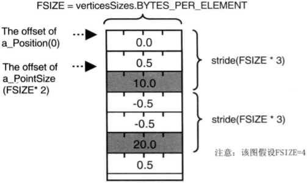

# WebGL颜色与纹理

[TOC]

通过缓冲区对象将顶点坐标传入着色器的步骤：

1. 创建缓冲区对象。
2. 将缓冲区对象绑定到target上。
3. 将顶点坐标数据写入缓冲区对象。
4. 将缓冲区对象分配给对应的attribute变量。
5. 激活attribute变量。

## 将顶点的非坐标数据传入顶点着色器

我们要把多个顶点相关数据通过缓冲区对象传入顶点着色器，只需要每种数据重复以上步骤即可。

我们可以创建两个缓冲区对象，一个用来存储顶点坐标数据，另一个用来存储顶点尺寸数据。

在都绑定了两个缓冲区对象以后，向其中写入数据，分配attribute变量并开启。

一旦上述初始化完成，WebGL系统准备就绪，当执行`gl.drawArrays()`时，存储在缓冲区对象中的数据将**按照其在缓冲区中的顺序依次传给对应的attribute变量**。

在顶点着色器中，我们将这两个attribute变量分别赋给`gl_Position`和`gl_PointSize`。

通过为顶点的每种数据建立一个缓冲区，然后分配给对应的attribute变量，可以向顶点着色器传递**多份逐顶点的数据信息**，比如**顶点尺寸、顶点颜色、顶点纹理坐标、点所在平面的法向量等**。

**例子**：多个attribute变量，实现不一样的节点大小

```js
var VSHADER_SOURCE = `
    attribute vec4 a_Position;
    attribute float a_PointSize;
    void main(){
        gl_Position = a_Position;
        gl_PointSize = a_PointSize;
    }
`
var FSHADER_SOURCE = `
    void main(){
        gl_FragColor = vec4(1.0, 0.0, 0.0, 1.0);
    }
`
function main(){
    var canvas = document.getElementById("example");
    if(!canvas){
        console.log("Fail to retrieve the <canvas> element");
        return;
    }

    var glContext = getWebGLContext(canvas);
    if(!glContext){
        console.log("Failed to get the rendering context for WebGL");
        return;
    }

    if (!initShaders(glContext, VSHADER_SOURCE, FSHADER_SOURCE)) {
        console.log("Failed to initialize shaders.");
        return;
    }

    var vertexCount = initVertexBuffers(glContext);
    if (vertexCount < 0){
        console.log("Failed to set the positions of the vertices.");
        return;
    }

    glContext.clearColor(0.0, 0.0, 0.0, 1.0);
    glContext.clear(glContext.COLOR_BUFFER_BIT);

    glContext.drawArrays(glContext.POINTS, 0, vertexCount);
}

function initVertexBuffers(glContext){
    var vertices = new Float32Array([
        0.0, 0.5,
        -0.5, -0.5,
        0.5, -0.5
    ]);
    var sizes = new Float32Array([
        10.0, 20.0, 30.0
    ]);

    var vertexCount = vertices.length / 2;
    //创建缓冲区对象
    var vertexBuffer = glContext.createBuffer();
    var sizeBuffer = glContext.createBuffer();

    if (!vertexBuffer){
        console.log("Failed to create the vertex buffer object.");
        return -1;
    }
    //绑定缓冲区对象
    glContext.bindBuffer(glContext.ARRAY_BUFFER, vertexBuffer);
    //向缓冲区写入节点数据
    glContext.bufferData(glContext.ARRAY_BUFFER, vertices, glContext.STATIC_DRAW);
    //获取attribute变量的存储位置
    var a_Position = glContext.getAttribLocation(glContext.program, "a_Position");
    if (a_Position < 0) {
        console.log("Failed to get the storage location of a_Position");
        return;
    }
    //将缓冲区分配给a_Position
    glContext.vertexAttribPointer(a_Position, 2,glContext.FLOAT,false,0,0);
    //激活缓冲区
    glContext.enableVertexAttribArray(a_Position);

    //将顶点尺寸写入缓冲区对象并开始
    glContext.bindBuffer(glContext.ARRAY_BUFFER, sizeBuffer);
    glContext.bufferData(glContext.ARRAY_BUFFER, sizes, glContext.STATIC_DRAW);
    var a_PointSize = glContext.getAttribLocation(glContext.program, "a_PointSize");
    if (a_PointSize < 0) {
        console.log("Failed to get the storage location of a_PointSize");
        return;
    }
    //将缓冲区分配给a_PointSize
    glContext.vertexAttribPointer(a_PointSize, 1, glContext.FLOAT, false, 0, 0);
    //激活缓冲区
    glContext.enableVertexAttribArray(a_PointSize);

    return vertexCount;
}
```

使用多个缓冲区对象向着色器传递多种数据，比较适合数据量不大的情况。

当程序中的负责三维图形具有成千上万个顶点时，维护所有的顶点数据时很困难的。

然而WebGL允许我们把顶点的坐标和尺寸数据打包到同一个缓冲区对象中，并通过某种机制分别访问缓冲区对象中不同种类的数据。比如，可以将顶点的坐标和尺寸数据按照如下方式**交错组织**。

```js
var verticeSizes = new Float32Array([
    //顶点坐标和顶点的尺寸
    0.0, 0.5, 10.0,//第1个点
    -0.5, -0.5, 20.0,//第2个点
    0.5, -0.5, 30.0//第3个点
]);
```

一旦我们将几种“逐顶点”的数据（坐标和尺寸）交叉存储在一个数组中，并将数组写入一个缓冲区对象。WebGL就需要有差别地从缓冲区中获取某种特定数据（坐标或尺寸），即使用`gl.vertexAttribPointer()`函数的第5个参数stride和第6个参数offset。

```js
gl.vertexAttribPointer(location, size, type, normalized, stride, offset)
//将绑定到gl.ARRAY_BUFFER的缓冲区对象分配给由location指定的attribute变量
/*
参数location: 指定待分配attribute变量的存储位置
参数size: 指定缓冲区中每个顶点的分量个数（1到4）
参数type: 指定数据格式（比如：gl.FLOAT）
参数normalize: 布尔类型，表明是否将非浮点型的数据归一化到[0,1]或[-1,1]区间。
参数stride: 指定相邻两个顶点间的距离(单位：字节)，默认为0
参数offset: 指定缓冲区对象中的偏移量(单位：字节)，即attribute变量从缓冲区中的何处开始存储。如果是从起始位置开始，该参数设为0
*/
```

**例子**

```js
var VSHADER_SOURCE = `
    attribute vec4 a_Position;
    attribute float a_PointSize;
    void main(){
        gl_Position = a_Position;
        gl_PointSize = a_PointSize;
    }
`
var FSHADER_SOURCE = `
    void main(){
        gl_FragColor = vec4(1.0, 0.0, 0.0, 1.0);
    }
`
function main(){
    var canvas = document.getElementById("example");
    if(!canvas){
        console.log("Fail to retrieve the <canvas> element");
        return;
    }

    var glContext = getWebGLContext(canvas);
    if(!glContext){
        console.log("Failed to get the rendering context for WebGL");
        return;
    }

    if (!initShaders(glContext, VSHADER_SOURCE, FSHADER_SOURCE)) {
        console.log("Failed to initialize shaders.");
        return;
    }

    var vertexCount = initVertexBuffers(glContext);
    if (vertexCount < 0){
        console.log("Failed to set the positions of the vertices.");
        return;
    }

    glContext.clearColor(0.0, 0.0, 0.0, 1.0);
    glContext.clear(glContext.COLOR_BUFFER_BIT);

    glContext.drawArrays(glContext.POINTS, 0, vertexCount);
}

function initVertexBuffers(glContext){
    var verticesSizes = new Float32Array([
        //顶点坐标和点的尺寸
        0.0, 0.5, 10.0,//第1个点
        -0.5, -0.5, 20.0,//第2个点
        0.5, -0.5, 30.0//第3个点
    ]);

    var vertexCount = verticesSizes.length / 3;
    //创建缓冲区对象
    var vertexSizeBuffer = glContext.createBuffer();

    if (!vertexSizeBuffer){
        console.log("Failed to create the vertexSizeBuffer object.");
        return -1;
    }
    //绑定缓冲区对象
    glContext.bindBuffer(glContext.ARRAY_BUFFER, vertexSizeBuffer);
    //向缓冲区写入节点数据
    glContext.bufferData(glContext.ARRAY_BUFFER, verticesSizes, glContext.STATIC_DRAW);

    var FSIZE = verticesSizes.BYTES_PER_ELEMENT;
    //获取attribute变量的存储位置
    var a_Position = glContext.getAttribLocation(glContext.program, "a_Position");
    if (a_Position < 0) {
        console.log("Failed to get the storage location of a_Position");
        return;
    }
    //将缓冲区分配给a_Position
    glContext.vertexAttribPointer(a_Position, 2, glContext.FLOAT, false, FSIZE * 3, 0);
    //激活缓冲区分配
    glContext.enableVertexAttribArray(a_Position);

    var a_PointSize = glContext.getAttribLocation(glContext.program, "a_PointSize");
    if (a_PointSize < 0) {
        console.log("Failed to get the storage location of a_PointSize");
        return;
    }
    //将缓冲区分配给a_PointSize
    glContext.vertexAttribPointer(a_PointSize, 1, glContext.FLOAT, false, FSIZE * 3, FSIZE * 2);
    //激活缓冲区分配
    glContext.enableVertexAttribArray(a_PointSize);

    return vertexCount;
}
```

在之前的例子中，缓冲区只含一种数据，即顶点的坐标，所以将参数stride设置为0即可。然而，在本例中，当缓冲区中有了多种数据，我们就需要考虑参数stride的值。



如上图，每个顶点有3个数据值（2个坐标数据和1个尺寸数据），因此stride应该设置为每项数据大小的三倍，即3 × FSIZE （Float32Array中每个元素所占的字节数）。

