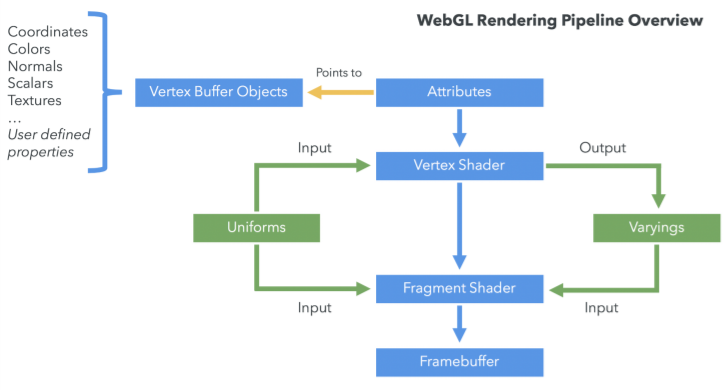

# WebGL渲染

WebGL渲染对象遵循“分而治之”的方法。复杂的多边形分解为基本元：三角形，线，点。

每个基本元由GPU并行处理，创建出最终场景。

## WebGL渲染管线

尽管WebGL通常被认为是一个全面的3D API，但实际上它只是一个光栅化引擎。它根据开发者提供的代码绘制点、线和三角形。让WebGL**做任何事情都需要用代码操作点、线和三角形**来完成需求。

WebGL在GPU上运行。因此需要提供可以在GPU上执行的代码并且是以**函数对**的形式。这两个函数被称为**顶点着色器**和**片元着色器**，它们都是用一种非常严格的类C/C++高级语言编写的，称为GLSL (GL着色器语言)。顶点着色器和片元着色器合在一起称为渲染程序。

**顶点着色器**的职责：计算顶点的属性。根据各个位置，这个着色器函数的输出用于光栅化基本元（点、线、三角形）。在光栅化的时候，将调用片元着色器。

**片元着色器**的职责：为正在绘制的基本元的每一个像素点计算颜色。

几乎所有的WebGL API的功能都是在设置顶点着色器、片元着色器并执行。

对每个要绘制的东西，你需要通过调用`gl.drawArrays()`或者`gl.drawElements()`函数，来实现在GPU上执行着色器函数。

下边是WebGL的简短的渲染管线流程图：

### 顶点缓冲对象（Vertex Buffer Objects ，VBOs）

顶点缓冲对象包含的数据用于描述要渲染的几何结构。

顶点坐标、顶点法向量、颜色、纹理坐标等，都被封装在顶点缓冲对象里。

### 索引缓冲对象 Index Buffer Objects (IBOs)

索引缓冲对象包含的数据用于描述：当渲染管线在绘制的基本元时，顶点间的关系。它包含顶点缓冲中每一个顶点的索引。
