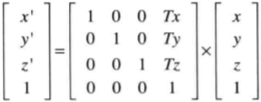

# WebGL绘制三角形


## 一次性传入多个顶点数据

WebGL提供**缓冲区对象**(buffer object)机制。它可以一次性向着色器传入多个顶点的节点数据。

缓冲区对象是WebGL系统中的一块内存区域，我们可以一次性向缓冲区对象**填充大量的顶点数据**，然后将这些数据保存在其中，**供顶点着色器使用**。

使用缓冲区对象向顶点着色器传入多个顶点数据的步骤（5个）：

1. 创建缓冲区对象（`gl.createBuffer()`）。
2. 绑定缓冲区对象（`gl.bindBuffer()`）。
3. 将数据写入缓冲区对象（`gl.bufferData()`）。
4. 将缓冲区对象分配给一个`attribute`变量（`gl.vertexAttribPointer()`）。
5. 开启`attribute`变量（`gl.enableVertexAttributeArray()`）。

### 创建缓冲区对象

`gl.createBuffer()`（无输入参数，无返回值）

`gl.deleteBuffer(buffer)`（输入待删除的buffer，无返回值）

### 绑定缓冲区

```js
gl.bindBuffer(target, buffer)
//允许使用buffer表示的缓冲区对象，并将其绑定到target表示的目标上
/*
参数target: 可以是以下其中一个：
	gl.ARRAY_BUFFER: 缓冲区对象中包含了顶点的数据
	gl.ELEMENT_ARRAY_BUFFER: 缓冲区对象中包含了顶点的索引值
参数buffer: 指定之前由gl.createBuffer()返回的带绑定的缓冲区对象。如果为null,禁用对target的绑定。
无返回值。
*/
```

### 向缓冲区对象写入数据

```js
gl.bufferData(target, data, usage)
//开辟存储空间，向绑定在target上的缓冲区对象中写入数据data
/*
参数target: gl.ARRAY_BUFFER或gl.ELEMENT_ARRAY_BUFFER。
参数data: 写入缓冲区对象的数据（类型化数组）
参数usage: 表示程序将如何使用存储在缓冲区对象中的数据。该参数将帮助WebGL优化操作，传错了也不会终止程序，仅仅降低了程序效率。
	gl.STATIC_DRAW: 只会向缓冲区对象中写入一次数据，但需要绘制很多次。
	gl.STREAM_DRAW: 只会向缓冲区对象中写入一次数据，然后绘制若干次。
	gl.DYNAMIC_DRAW: 会向缓冲区对象中多次写入数据，并绘制很多次。
无返回值。
*/
```

使用Float32Array对象（类型化数组）而非常见的Array对象是因为Array是一种通用的类型，既可以在里边存储数字也可以存储字符串，并没有对“大量元素都是同一种类型”这种情况进行优化。

#### 类型化数组

为了绘制三维图形，WebGL通常需要同时处理大量相同类型的数据，例如顶点的坐标和颜色数据。为了优化性能，WebGL为每种基本数据类型引入了一种特殊的数组（类型化数组）。浏览器事先知道数组种的数据类型，所以处理起来也更有效率。

**`Float32Array`**是其中一种类型化数组，通常用于**存储顶点的坐标**或**颜色数据**。

WebGL种很多操作都用到类型化数组，比如`gl.bufferData()`中的第2个参数data。

| 数组类型     | 每个元素所占字节数 | 描述                               |
| ------------ | ------------------ | ---------------------------------- |
| Int8Array    | 1                  | 8位整型数（signed char）           |
| UInt8Array   | 1                  | 8位无符号整型数（unsigned char）   |
| Int16Array   | 2                  | 16位整型数（signed short）         |
| UInt16Array  | 2                  | 16位无符号整型数（unsigned short） |
| Int32Array   | 4                  | 32位整型数（signed int）           |
| UInt32Array  | 4                  | 32位无符号整型数（unsigned int）   |
| Float32Array | 4                  | 单精度32位浮点数（float）          |
| Float64Array | 8                  | 双精度64位浮点数（double）         |

与JS的Array数组相似，类型化数组也有一系列方法和属性（包括一个常量属性）。

| 方法、属性、常量   | 描述                                            |
| ------------------ | ----------------------------------------------- |
| get(index)         | 获取第index个元素值                             |
| set(index, value)  | 设置第index个元素的值为value                    |
| set(array, offset) | 从第offset个元素开始，将数组array中的值填充进去 |
| length             | 数组的长度                                      |
| BYTES_PER_ELEMENT  | 数组中每个元素所占的字节数                      |

与普通的Array数组不同的是，类型化数组**不支持`push()`和`pop()`方法。**

与普通的Array数组一样，类型化数组可以通过`new`运算符调用构造函数并传入数据而被创造出来。

注意，**创建类型化数组的唯一方法**就是**使用`new`运算符**，不能使用`[]`运算符（这样创建的就是普通数组）。

```js
var vertices = new Float32Array([
    0.0, 0.5, -0.5, -0.5, 0.5, -0.5
]);
var vertices2 = new Float32Array(4);//指定数组元素个数
```

### 将缓冲区对象分配给attribute变量

使用`gl.vertexAttrib[1234]f`系列函数一次只能分配一个值（一个顶点数据）。

但现在是要将整个数组中的所有值（所有的顶点数据）一次性分配给一个attribute变量。

`gl.vertexAttribPointer()`可以解决这个问题，它可以将整个缓冲区对象（实际上是缓冲区对象的引用/指针）分配给attibute变量。

```js
gl.vertexAttribPointer(location, size, type, normalized, stride, offset)
//将绑定到gl.ARRAY_BUFFER的缓冲区对象分配到由location指定的attribute变量。

/*
参数location: 指定待分配attribute变量的存储位置
参数size: 指定缓冲区中每个顶点的分量个数（1~4）。若size比attribute变量需要的分量数小，缺失分量将按照与gl.vertexAttrib[1234]f()相同的规则不全。比如，如果size=1,则第2、3分量自动设为0，第4分量为1。
参数type: 用以下类型之一指定数据格式:
	gl.UNSIGNED_BYTE:  Uint8Array
	gl.SHORT: Int16Array
	gl.UNSIGNED_SHORT:  Uint16Array
	gl.INT:  Int32Array
	gl.UNSIGNED_INT:  Uint32Array
	gl.FLOAT:  Float32Array
参数normalize: 布尔类型，表明是否将非浮点型的数据归一化到[0,1]或[-1,1]区间
参数stride: 指定相邻的两个顶点之间的字节数，默认为0
参数offset: 指定缓冲区对象中的偏移量（单位：字节）。如果是从起始位置开始，offset设为0。

无返回值
*/
```

### 激活attribute变量

使用`gl.enableVertexAttribArray()`方法，使顶点着色器能够访问缓冲区内的数据。

注意，虽然函数的名称看起来表示该函数是用来处理顶点数组的，但实际上它**处理的对象是缓冲区**。这个命名时历史原因造成的（从OpenGL中继承）。

```js
gl.enableVertexAttribArray(location)
//开启location指定的attribute变量
/*
参数location: 指定attribute变量的存储位置。

无返回值。
*/
```

执行了这一函数后，缓冲区对象和attribute变量之间的连接就真正建立了。

可以使用`gl.diableVertexArray()`来关闭分配。

注意，**激活attribute变量后，你就不能再使用`gl.vertexAttribute[1234]f()`向它传数据了。除非你显式地关闭该attribute变量。**实际上，你无法也不应该同时用这两个函数。

### gl.drawArrays()的第2个和第3个参数

```js
gl.drawArrays(mode, first, count)
//执行顶点着色器，按照mode参数指定的方式绘制图形
/*
参数mode: 指定绘制的方式，可接受以下常量符号:
	gl.POINTS
	gl.LINES
	gl.LINES_STRIP
	gl.LINES_LOOP
	gl.TRIANGLES
	gl.TRIANGLE_STRIP
	gl.TRIANGLE_FAN
参数first: 指定从第几个顶点开始绘制（整数）
参数count: 指定绘制需要用到多少个顶点（整数）
*/
```

### 一次画三个点

**例子**（绘制3个点）

```js
var VSHADER_SOURCE = `
    attribute vec4 a_Position;
    void main(){
        gl_Position = a_Position;
        gl_PointSize = 10.0;
    }
`
var FSHADER_SOURCE = `
    void main(){
        gl_FragColor = vec4(1.0, 0.0, 0.0, 1.0);
    }
`
function main(){
    var canvas = document.getElementById("example");
    if(!canvas){
        console.log("Fail to retrieve the <canvas> element");
        return;
    }

    var glContext = getWebGLContext(canvas);
    if(!glContext){
        console.log("Failed to get the rendering context for WebGL");
        return;
    }

    if (!initShaders(glContext, VSHADER_SOURCE, FSHADER_SOURCE)) {
        console.log("Failed to initialize shaders.");
        return;
    }
	//设置顶点位置
    var vertexCount = initVertexBuffers(glContext);
    if (vertexCount < 0){
        console.log("Failed to set the positions of the vertices.");
        return;
    }

    glContext.clearColor(0.0, 0.0, 0.0, 1.0);
    glContext.clear(glContext.COLOR_BUFFER_BIT);

    glContext.drawArrays(glContext.POINTS, 0, vertexCount);
}

function initVertexBuffers(glContext){
    var vertices = new Float32Array([
        0.0, 0.5,
        -0.5, -0.5,
        0.5, -0.5
    ]);
    var vertexCount = vertices.length / 2;
    //创建缓冲区对象
    var vertexBuffer = glContext.createBuffer();
    if (!vertexBuffer){
        console.log("Failed to create the vertex buffer object.");
        return -1;
    }
    //绑定缓冲区对象
    glContext.bindBuffer(glContext.ARRAY_BUFFER, vertexBuffer);
    //向缓冲区写入节点数据
    glContext.bufferData(glContext.ARRAY_BUFFER, vertices, glContext.STATIC_DRAW);
    //获取attribute变量的存储位置
    var a_Position = glContext.getAttribLocation(glContext.program, "a_Position");
    if (a_Position < 0) {
        console.log("Failed to get the storage location of a_Position");
        return;
    }
    //将缓冲区分配给a_Position
    glContext.vertexAttribPointer(a_Position, 2,glContext.FLOAT,false,0,0);
    //激活缓冲区
    glContext.enableVertexAttribArray(a_Position);
    return vertexCount;
}
```

### 画三角形

**例子**（绘制1个三角形）：

把上边例子做如下两处改动：

1. 在顶点着色器中，删掉`gl_PointSize = 10.0`。这句话只有在绘制单个顶点的时候才起作用。
2. `glContext.drawArrays()`方法的第1个参数从`glContext.POINTS`改为`glContext.TRIANGLES`。

`glContext.drawArrays()`方法的第1个参数改为`glContext.TRIANGLES`相当于告诉WebGL，“从缓冲区中的第1个顶点开始，使顶点着色器执行3次”，用3个点绘制出一个三角形。

**7个WebGL可以绘制的基本图形：**

| 参数              | 描述                                                         |
| ----------------- | ------------------------------------------------------------ |
| gl.POINTS         | 一系列**点**，绘制在v0, v1, v2, ... 处。                     |
| gl.LINES          | 一系列**单独的线段**，绘制在(v0, v1), (v2, v3), ...处，如果点的个数是奇数，最后一个点将被忽略。 |
| gl.LINES_STRIP    | 一系列**连接的线段**，可以理解为折线，第1个点是起点，最后一个点是终点。 |
| gl.LINE_LOOP      | 一系列**连接的线段**，可以理解为首尾有连接的折线。           |
| gl.TRIANGLES      | 一系列**单独的三角形**，绘制在(v0, v1, v2), (v3, v4, v5), ...如果点的个数不是3的整数倍，最后剩下的1个或2个点将被忽略。 |
| gl.TRIANGLE_STRIP | 一系**列条带状的三角形**，前3个点构成了第1个三角形，从第2个点开始的3个点构成了第2个三角形，与前一个三角形共享1条边，以此类推。三角形会被绘制在(v0, v1, v2), (v2, v1, v3), (v2, v3, v4), ... |
| gl.TRIANGLE_FAN   | 一系列三角形组成的类似扇形的图形，前3个点构成了第1个三角形，接下来的1个点和前1个三角形的最后一条边组成接下来的1个三角形。这些三角形会被绘制在(v0, v1, v2), (v0, v2, v3), (v0, v3, v4) ... |


你可以使用上述7个最基本的图形绘制任何东西。

### 画矩形

**例子**（用三角带画矩形）

将上一个画三角星的例子做如下改动：

1. 缓冲区的节点数据改为：

   ```js
   function initVertexBuffers(glContext){
       var vertices = new Float32Array([
           -0.5, 0.5,
           -0.5, -0.5,
           0.5, 0.5,
           0.5, -0.5
       ]);
       ...
   }
   ```

2. `glContext.drawArrays()`方法的第1个参数从`glContext.TRIANGLES`改为`glContext.TRIANGLE_STRIP`。

**例子**（用三角扇画矩形）

将上一个用三角带画矩形的例子做如下改动：

1. 缓冲区的节点数据改为：

   ```js
   function initVertexBuffers(glContext){
       var vertices = new Float32Array([
           -0.5, 0.5,
           -0.5, -0.5,
           0.5, -0.5,
           0.5, 0.5
       ]);
       ...
   }
   ```

2. `glContext.drawArrays()`方法的第1个参数从`glContext.TRIANGLE_STRIP`改为`glContext.TRIANGLE_FAN`。

## 移动、旋转、缩放

### 平移

**例子**：平移三角形

```js
var VSHADER_SOURCE = `
    attribute vec4 a_Position;
    uniform vec4 u_Translation;
    void main(){
        gl_Position = a_Position + u_Translation;
    }
`
var FSHADER_SOURCE = `
    void main(){
        gl_FragColor = vec4(1.0, 0.0, 0.0, 1.0);
    }
`
function main(){
    var canvas = document.getElementById("example");
    if(!canvas){
        console.log("Fail to retrieve the <canvas> element");
        return;
    }

    var glContext = getWebGLContext(canvas);
    if(!glContext){
        console.log("Failed to get the rendering context for WebGL");
        return;
    }

    if (!initShaders(glContext, VSHADER_SOURCE, FSHADER_SOURCE)) {
        console.log("Failed to initialize shaders.");
        return;
    }
    //设置顶点位置
    var vertexCount = initVertexBuffers(glContext);
    if (vertexCount < 0){
        console.log("Failed to set the positions of the vertices.");
        return;
    }
    var translation = new Float32Array([0.5, 0.5, 0.0, 0.0]);
    var u_Translation = glContext.getUniformLocation(glContext.program ,"u_Translation");
    glContext.uniform4fv(u_Translation, translation);

    glContext.clearColor(0.0, 0.0, 0.0, 1.0);
    glContext.clear(glContext.COLOR_BUFFER_BIT);

    glContext.drawArrays(glContext.TRIANGLES, 0, vertexCount);
}

function initVertexBuffers(glContext){
    var vertices = new Float32Array([
        0.0, 0.5,
        -0.5, -0.5,
        0.5, -0.5,
    ]);
    var vertexCount = vertices.length / 2;
    //创建缓冲区对象
    var vertexBuffer = glContext.createBuffer();
    if (!vertexBuffer){
        console.log("Failed to create the vertex buffer object.");
        return -1;
    }
    //绑定缓冲区对象
    glContext.bindBuffer(glContext.ARRAY_BUFFER, vertexBuffer);
    //向缓冲区写入节点数据
    glContext.bufferData(glContext.ARRAY_BUFFER, vertices, glContext.STATIC_DRAW);
    //获取attribute变量的存储位置
    var a_Position = glContext.getAttribLocation(glContext.program, "a_Position");
    if (a_Position < 0) {
        console.log("Failed to get the storage location of a_Position");
        return;
    }
    //将缓冲区分配给a_Position
    glContext.vertexAttribPointer(a_Position, 2,glContext.FLOAT,false,0,0);
    //激活缓冲区
    glContext.enableVertexAttribArray(a_Position);
    return vertexCount;
}
```

**注意**：着色器中`a_Position + u_Translation`之后还是一个坐标值，而**gl_Position**是**齐次坐标**，**齐次坐标的最后一个分量是1**，那么它的**前3个分量可以表示一个点的三维坐标**，所以在写坐标偏移量的时候，最后一个分量填0.0。

### 旋转

为描述一个旋转，必须指明：

1. 旋转轴
2. 旋转方向
3. 旋转角度


**例子**：旋转三角形

```js
var VSHADER_SOURCE = `
    attribute vec4 a_Position;
    uniform float u_CosB, u_SinB;
    void main(){
        // x' = x * cos(beta) - y * sin(beta)
        // y' = x * sin(beta) + y * cos(beta)
        // z' = z
        gl_Position.x = a_Position.x * u_CosB - a_Position.y * u_SinB;
        gl_Position.y = a_Position.x * u_SinB + a_Position.y * u_CosB;
        gl_Position.z = a_Position.z;
        gl_Position.w = 1.0;
    }
`
var FSHADER_SOURCE = `
    void main(){
        gl_FragColor = vec4(1.0, 0.0, 0.0, 1.0);
    }
`
function main(){
    var canvas = document.getElementById("example");
    if(!canvas){
        console.log("Fail to retrieve the < canvas > element");
        return;
    }

    var glContext = getWebGLContext(canvas);
    if(!glContext){
        console.log("Failed to get the rendering context for WebGL");
        return;
    }

    if (!initShaders(glContext, VSHADER_SOURCE, FSHADER_SOURCE)) {
        console.log("Failed to initialize shaders.");
        return;
    }
    //设置顶点位置
    var vertexCount = initVertexBuffers(glContext);
    if (vertexCount < 0){
        console.log("Failed to set the positions of the vertices.");
        return;
    }
    var angle = 90;//旋转角度
    var rad = angle / 180 * Math.PI;//角度转弧度
    var cosB = Math.cos(rad);
    var sinB = Math.sin(rad);
    var u_CosB = glContext.getUniformLocation(glContext.program ,"u_CosB");
    var u_SinB = glContext.getUniformLocation(glContext.program ,"u_SinB");
    glContext.uniform1f(u_CosB, cosB);
    glContext.uniform1f(u_SinB, sinB);

    glContext.clearColor(0.0, 0.0, 0.0, 1.0);
    glContext.clear(glContext.COLOR_BUFFER_BIT);

    glContext.drawArrays(glContext.TRIANGLES, 0, vertexCount);
}

function initVertexBuffers(glContext){
    var vertices = new Float32Array([
        0.0, 0.5,
        -0.5, -0.5,
        0.5, -0.5,
    ]);
    var vertexCount = vertices.length / 2;
    //创建缓冲区对象
    var vertexBuffer = glContext.createBuffer();
    if (!vertexBuffer){
        console.log("Failed to create the vertex buffer object.");
        return -1;
    }
    //绑定缓冲区对象
    glContext.bindBuffer(glContext.ARRAY_BUFFER, vertexBuffer);
    //向缓冲区写入节点数据
    glContext.bufferData(glContext.ARRAY_BUFFER, vertices, glContext.STATIC_DRAW);
    //获取attribute变量的存储位置
    var a_Position = glContext.getAttribLocation(glContext.program, "a_Position");
    if (a_Position < 0) {
        console.log("Failed to get the storage location of a_Position");
        return;
    }
    //将缓冲区分配给a_Position
    glContext.vertexAttribPointer(a_Position, 2,glContext.FLOAT,false,0,0);
    //激活缓冲区
    glContext.enableVertexAttribArray(a_Position);
    return vertexCount;
}
```

### 变换矩阵

**旋转矩阵**：


**平移矩阵**：



**4×4的旋转矩阵**：


**例子**：利用旋转矩阵旋转三角形

```js
var VSHADER_SOURCE = `
    attribute vec4 a_Position;
    uniform mat4 u_xformMatrix;
    void main(){
        gl_Position = u_xformMatrix * a_Position;
    }
`
var FSHADER_SOURCE = `
    void main(){
        gl_FragColor = vec4(1.0, 0.0, 0.0, 1.0);
    }
`
function main(){
    var canvas = document.getElementById("example");
    if(!canvas){
        console.log("Fail to retrieve the < canvas > element");
        return;
    }

    var glContext = getWebGLContext(canvas);
    if(!glContext){
        console.log("Failed to get the rendering context for WebGL");
        return;
    }

    if (!initShaders(glContext, VSHADER_SOURCE, FSHADER_SOURCE)) {
        console.log("Failed to initialize shaders.");
        return;
    }
    //设置顶点位置
    var vertexCount = initVertexBuffers(glContext);
    if (vertexCount < 0){
        console.log("Failed to set the positions of the vertices.");
        return;
    }
    var angle = 90;//旋转角度
    var rad = angle / 180 * Math.PI;//角度转弧度
    var cosB = Math.cos(rad);
    var sinB = Math.sin(rad);
    var u_xformMatrix = glContext.getUniformLocation(glContext.program ,"u_xformMatrix");
    var xformMatrix = new Float32Array([
        cosB, sinB, 0, 0,
        -sinB, cosB, 0, 0,
        0, 0, 1, 0,
        0, 0, 0, 1
    ]);
    glContext.uniformMatrix4fv(u_xformMatrix, false, xformMatrix);

    glContext.clearColor(0.0, 0.0, 0.0, 1.0);
    glContext.clear(glContext.COLOR_BUFFER_BIT);

    glContext.drawArrays(glContext.TRIANGLES, 0, vertexCount);
}

function initVertexBuffers(glContext){
    var vertices = new Float32Array([
        0.0, 0.5,
        -0.5, -0.5,
        0.5, -0.5,
    ]);
    var vertexCount = vertices.length / 2;
    //创建缓冲区对象
    var vertexBuffer = glContext.createBuffer();
    if (!vertexBuffer){
        console.log("Failed to create the vertex buffer object.");
        return -1;
    }
    //绑定缓冲区对象
    glContext.bindBuffer(glContext.ARRAY_BUFFER, vertexBuffer);
    //向缓冲区写入节点数据
    glContext.bufferData(glContext.ARRAY_BUFFER, vertices, glContext.STATIC_DRAW);
    //获取attribute变量的存储位置
    var a_Position = glContext.getAttribLocation(glContext.program, "a_Position");
    if (a_Position < 0) {
        console.log("Failed to get the storage location of a_Position");
        return;
    }
    //将缓冲区分配给a_Position
    glContext.vertexAttribPointer(a_Position, 2,glContext.FLOAT,false,0,0);
    //激活缓冲区
    glContext.enableVertexAttribArray(a_Position);
    return vertexCount;
}
```

矩阵是二维的，其元素按照行和列进行排列，而数组是一维的，其元素只是排成一排。

有两种方式在数组中存储矩阵元素：按行主序、按列主序。

WebGL和OpenGL一样，矩阵元素**按列主序**存储在数组中。

使用`gl.uniformMatrix4fv()`函数可以将数组传给`u_xformMatrix`变量。函数名的最后一个字母是`v`，表示它可以向着色器传输多个数据值。

```js
gl.uniformMatrix4fv(location, transpose, array)
//将array表示的4x4矩阵分配给由location指定的uniform变量。
/*
参数location: uniform变量的存储位置。
参数Transpose: 是否矩阵转置，在WebGL中必须指定为‘false’。
参数array: 待传输的类型化数组，4x4矩阵按列主序存储在其中。

无返回值。
*/
```

**例子**：利用平移矩阵平移三角形

对上边的例子做如下改动：

1. 修改变换矩阵：

   ```js
   var Tx = 0.5, Ty = 0.5, Tz = 0.0;
   var xformMatrix = new Float32Array([
       1.0, 0.0, 0.0, 0.0,
       0.0, 1.0, 0.0, 0.0,
       0.0, 0.0, 1.0, 0.0,
       Tx, Ty, Tz, 1.0
   ]);
   ```

#### 缩放

缩放矩阵：


**例子**：利用缩放矩阵缩放三角形

对上边的例子做如下改动：

1. 修改变换矩阵：

   ```js
   var Sx = 1.0, Sy = 1.5, Sz = 1.0;
   var xformMatrix = new Float32Array([
       Sx, 0.0, 0.0, 0.0,
       0.0, Sy, 0.0, 0.0,
       0.0, 0.0, Sz, 0.0,
       0.0, 0.0, 0.0, 1.0
   ]);
   ```

注意，如果将Sx, Sy, Sz指定为0，缩放因子就是0.0，图形就会缩小到不可见。

如果希望保持图形的尺寸不变，应该将缩放因子全部设为1.0。
