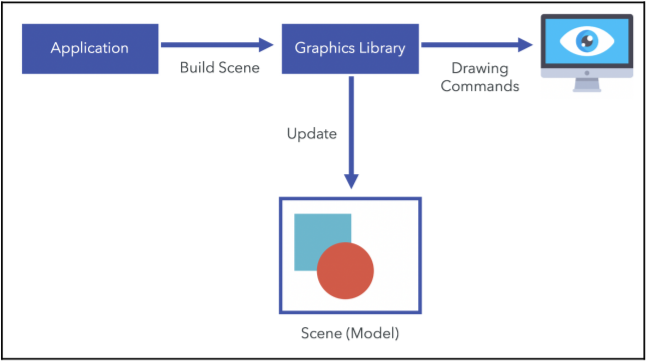
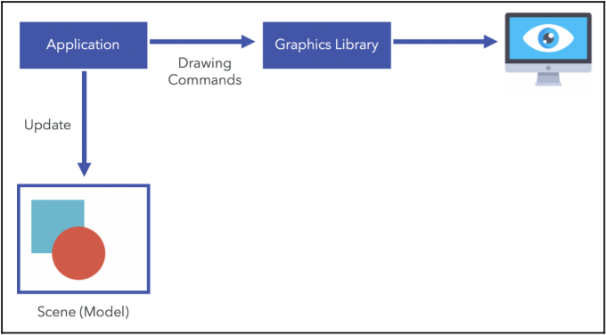

# 什么是WebGL

**WebGL**是一个**3D图形库**，它可以让现在的**网页浏览器**以**规范**和**高效**的方式**渲染3D场景**。

WebGL用在网页上绘制和渲染复杂三维图形，并允许用户交互。

> WebGL被设计出来的目的，就是在网页上创建三维的应用和用户体验。

- 传统的显示三维图形的方式：

  使用C/C++，加上专门的图形库比如OpenGL或Direct3D，开发独立应用程序。

- 有了WebGL：

  在HTML和JavaScript中添加额外的三维图形学代码即可在网页上显示。

[TOC]

# WebGL的优势

因为WebGL内嵌在浏览器中，因此有以下优势：

- 开发环境要求低：
  - 准备一个支持WebGL的浏览器用于运行程序；
  - 准备一个文本编辑器编辑代码；
  - 如果使用HTML+JavaScript，不需要编译器、链接器。
- 轻松发布：
  - 放Web服务器上；
  - 或者通过电子邮件发送HTML和JavaScript文件。
- 充分利用浏览器的功能
  - WebGL实际上属于网页的一部分；
  - 可以充分利用浏览器的功能比如：放置按钮、弹出对话框、绘制文本、播放声音和视频，服务器通信等。

# WebGL程序的结构

WebGL页面包含三种语言：HTML、JavaScript、GLSL SE(着色器语言)，其中GLSL SE以字符串的形式内嵌在JavaScript中。

## WebGL渲染

根据维基百科的定义，**渲染**是通过计算机程序为一个模型**生成一张图像的流程**。

因为渲染流程由计算机执行，所以可以有各种各样的方法来生成渲染图。

当我们讨论渲染时，主要从三个方面来区分渲染。

### 基于软件还是基于硬件的渲染？

**基于软件渲染**：所有渲染计算都在CPU上进行

**基于硬件渲染**：渲染计算有GPU参与

从技术角度看，基于硬件渲染更高效，因为这种方案有显卡作为专门的硬件来处理渲染的必要操作。

- 基于服务端还是基于客户端的渲染
- 基于服务端还是基于客户端的渲染
- 存储式（retained-mode）还是即时（immediate-mode）渲染

WebGL提供的是一种基于硬件、基于客户端的即时渲染方法。

### 基于服务端还是基于客户端的渲染？

基于服务端：远程渲染

基于客户端：本地渲染

WebGL基于客户端的渲染方法，对比其他技术（比如Java3D,Flash,Unity Web Player Plugin）有以下优势：

- JS编程：允许访问DOM的所有部分，方便和其他JS库比比如JQ、React、Angular整合。

- 自动内存管理：不像OpenGL手动分配和释放内存，WebGL遵循JS的变量作用域自动管理内存，极大简化程序，程序逻辑更易读。
- 普及性：智能手机和平板电脑默认安装了具有JS功能的Web浏览器。这意味着你可以在桌面和移动设备的巨大生态系统中利用WebGL。
- 性能：WebGL应用程序的性能与同等的独立应用程序相当(当然也有一些例外)，因为WebGL能够访问本机显卡。
- 无需编译：WebGL由JS编写，因此在浏览器上执行前无需编译代码。开发者可以实时查看修改代码后的效果。然而，当放入着色器程序时，还是少不了显卡中的编译。

### 存储模式渲染还是即时渲染？

存储模式渲染：

应用程序通过基本元素（比如形状、线条）构建一个场景，然后图形库将场景模型保存在内存里，要改变被渲染的东西，应用分发一条命令来更新场景，比如新增或删除一个形状，图形库将负责管理和反复绘制这个场景。

即时渲染：

应用程序直接管理渲染，因此内存中不会保存由场景模型，每绘制一帧，不论有什么变动，应用程序都会分发所有要用的绘制指令绘制整个场景。这种方案给予应用程序最大的控制能力和灵活变动能力。

