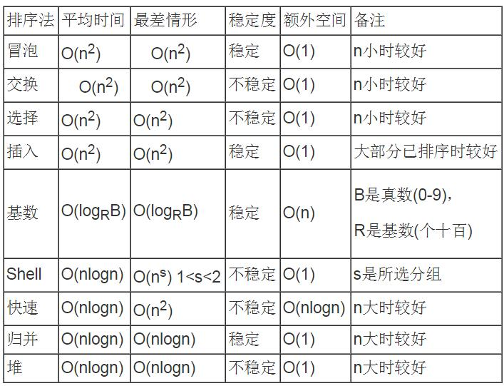

# 排序

排序的好坏直接影响程序的执行速度和辅助存储空间的占有量。

## 各种排序算法的优劣势

性能如下表：

## 结论

1. 简单而言，所有相等的数经过某种排序后，仍能保持它们在排序之前的相对次序，就称这种排序方法是稳定的，反之，非稳定。

   例如：一组数排序前是[a1,a2,a3,a4,a5]，其中a2=a4，经过某种排序后，结果为[a1,a2,a4,a3,a5]，则称这种排序是不稳定的，因为a2在排序前在a4前边，排序后它还在a4前边。假如结果是[a1,a4,a2,a3,a5]，则称这种排序不稳定。

   稳定的排序算法有：直接插入排序、冒泡排序、归并排序；

   不稳定的排序算法有：希尔排序、快速排序、简单选择排序、堆排序。

2. 时间复杂度为O(n^2)的排序算法有：直接插入排序、冒泡排序、快速排序、简单选择排序；

   时间复杂度为O(nlogn)的排序算法有：堆排序、归并排序。

3. 空间复杂度为O(1)的算法有单选择排序、直接选择排序、冒泡排序、希尔排序、堆排序；

   空间复杂度为O(n)的算法：归并排序；

   空间复杂度为O(logn)的算法：快速排序。

4. 虽然直接插入排序和冒泡排序的速度比较慢，但当初始序列整体或局部有序时，这两种算法会有较好的效率。

   当初始序列整体或局部有序时，快速排序算法的效率会下降。

   当排序序列较小且不要求稳定性时，直接选择排序效率较好。

   当排序序列较小且要求稳定性时，冒泡排序较好。

除了以上排序算法，还有位图排序、桶排序、基数排序等。

每种排序算法都有其最佳适用场合，例如，当待排序数据规模巨大，对内存大小又没有限制时，位图排序则是最高效的排序算法。

所以在选择排序算法时，一定要结合实际.