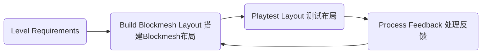

# 【GDC】Level Design Workshop：Blockmesh and Lighting Tips
2020-01-08

# Invisible Intuition：Blockmesh and Lighting Tips to Guide Players and Set the Mood

## What is "Blockmesh" ?

- Blockmesh = Greybox = Whitebox, etc.
- Greybox and Whitebox implt a single color - not ideal! 灰盒和白盒一般只有一种颜色，不够理想

## Level Design Pipeline

- Environment Type 环境需求
- Time of Day 当日时间
- Location in Story 故事地点
- Available Character Abilities 允许玩家使用的能力
- Enemy Type 敌人种类
- etc.
- Gameplay and Narrative Beats 游戏性以及叙事性的节拍

## Affordance 可见性

- Form implies function 形式暗示着功能

### Affordance ... in Games

- A way to communicate to the player what to play with or where to go. 一种告诉玩家玩什么或到哪去的方法
- Players learn the affordance rules via consistent color and shape and a trust contract is formed. 玩家通过相同的颜色和形状来学习可见性规则，同时信任该规则
- Ensure affordances work consistently game-wide. 确保可见性规则在游戏内保持一致
- Add to your blockmesh for playtests! 在游戏测试中添加到你的blockmesh中

## Denying Affordance 拒绝式可见性

- Communicates to the player where NOT to go. 告诉玩家不能去的地方
- “Uninvites” the player from going there. 不允许玩家去哪
- Contextualize why the player can't use it/go there! 根据情境告诉玩家为什么不能使用某物或去某地
- Add to your blockmesh for playtests! 在游戏测试中添加到你的blockmesh中

## Visual Language - Shape

- 绿色圆形代表安全
- 黄色矩形代表稳定、实用
- 红色三角形代表危险

## Landmarks (aka weenies) 地标

- Orients Players. 引导玩家
- Distant object seen from many vantage points in the level. 从关卡的许多视角都能看到
- A goal to work toward. 一个努力前往的目标

## Openings Attract 开放式吸引

- Caves, doors, archways拱门, etc.
- Often leads to a REFUGE SPACE, which psychologically feels safe. 通常导向一个心理上感到安全的避难所
- Mystery神秘感 - "What could be inside?!"

## Gates & Valves

- Gates stop progress until conditions are met. 在满足条件以前，门不会打开
- Valves prevent backtracking.
- Both reduce the possibility space and prevent aimless wandering瞎逛.
- Great for linear games, but can be sprinkled运用 into open worlds too!

## Leading Lines 引导线

- Lines that draw your eye to the intended point of interest.
- Roads, pipes, cables, etc.

## Pinching 挤压视线

- Angle shapes to funnel players to a specific spot.利用角度吸引玩家到特定地点
- Good for redirection. 适合重新引导
- Great for setting up a reveal. 非常适合设置展示
- Depends on your mobility mechanics! 根据你的移动机制

## Framing & Composition 框架以及构成

- Draws attention to point of interest by blocking other parts of the image, making it stand out.
- Google photography composition techniques - lots of good websites!
- Great when combined with Pinching!

## Breadcrumbs 面包屑

- Attract/lead the player, a piece at a time, to a goal.一点点引导玩家到目的地，可以是任何能博眼球的东西
- Can be almost anything that draws the eye:
  - Stuff that breaks up the negative space of floor/walls. 打破地板的东西
  - Pickups 可以捡起的东西
  - Enemies 敌人
  - Lit areas 明亮的区域
- Usually better to add after early playtests of blockmesh to see if they are even needed. 最好在早期的游戏测试之后，根据需要添加

## Textures 材质

- just point the way to go!
- Examples:
  - Arrows pointing the way.
  - Scrapes on the ground/walls. 地上或墙上的抓痕
  - Signs 标记
  - etc.

## Movement

- Use movement to grab the eye.
- Examples:
  - Big scripted moments. 大型脚本
  - Birds
  - Spark FX 火花特效
  - Enemies
  - Something flapping in the breeze 微风中漂浮的东西
- Directionality guides the eye to where you want players to go or what you want them to see.

## Light & God Ray 光照以及光线

- Players are attracted to the light.
- God rays draw attention and a line to the goal.
- Important in blockmesh phase阶段!

## Bonus Tips！——The Squint Test 眯眼测试

- Step 1: Squint眯 your eyes and look at the game.
- Step 2: Everything wil be blurry模糊, but what stands out?
- Step 3: Adjust your layout布局 and lighting光源 to highlight强调 what you want players to focus on.