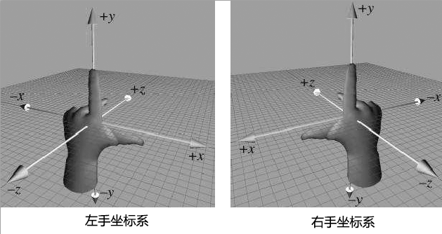
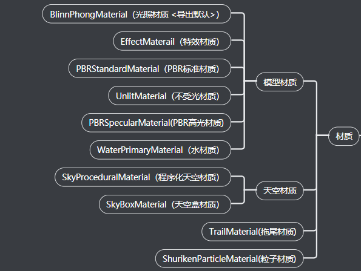
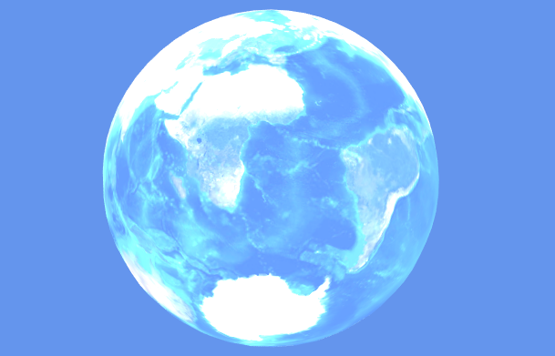
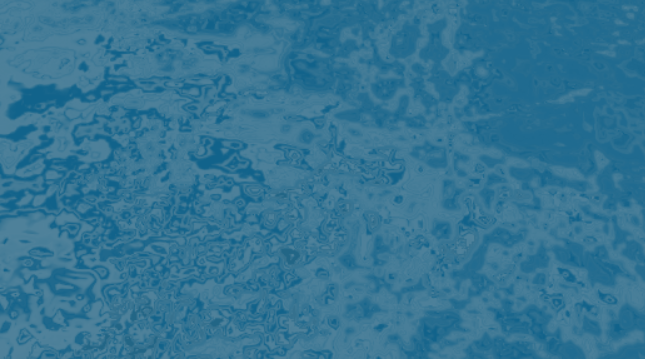
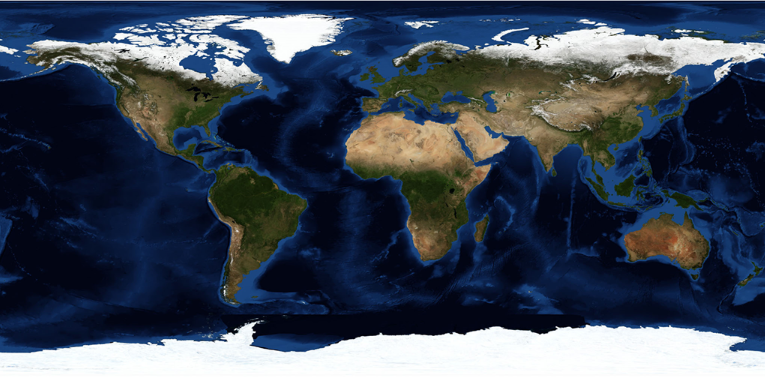
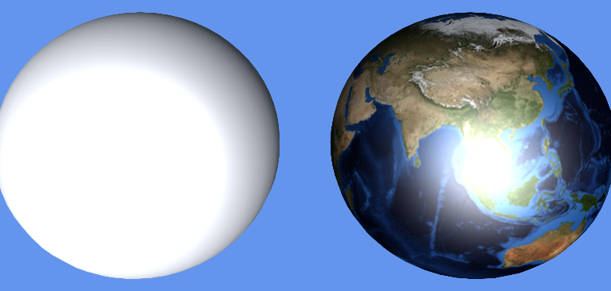
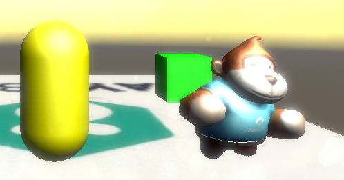
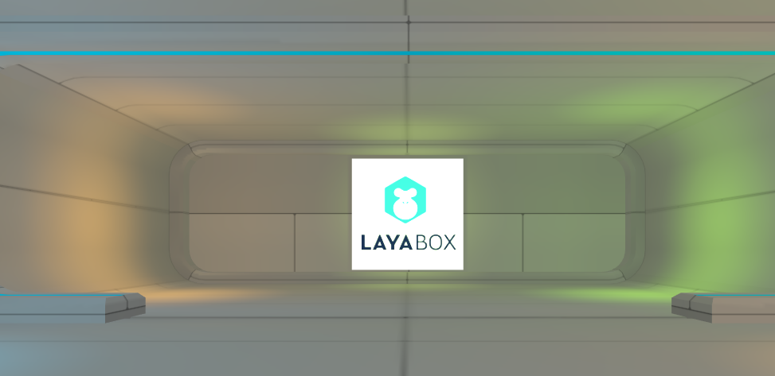
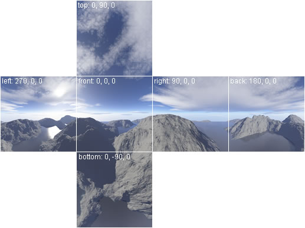

# 3D游戏开发基础概念

（摘自[Laya官网](https://layabox.com)）

一个简单的3D世界必须要有的元素：场景、摄像机、灯光、模型、材质

## 坐标系与坐标

坐标是3D空间世界的基础之一，干啥都离不开坐标，移动摄像机，定位，绘制图形等。

在使用LayaAir开发3D游戏时，我们需要了解两个坐标，一个是**位置坐标**， 另一个是**UV坐标**。

而了解这两种坐标之前，我们先介绍一下描述空间位置的**笛卡尔直角坐标系**。

笛卡尔直角坐标系是用经过相同原点的**xyz**三条互相垂直的坐标轴相交而构成。

坐标系的两个轴正方向一致的情况下，因第三轴正方向相反，所以将坐标系分为**左手坐标系**与**右手坐标系**。

这两种坐标系没有好或不好，都应用的都比较广泛，比如**Unity**等引擎采用的是**左手坐标系**，**LayaAir**等引擎采用的是**右手坐标系**。

两种3D坐标系之所以用左右手分别命名，是为了便于记忆，分别用左手和右手三根手指的朝向，来代表三个坐标轴的正方向，这三个手指分别是拇指、食指、中指。

无论是左手还是右手，我们要记住，**大拇指朝向**的方向是**x轴正方向**，**食指的朝向**是**y轴的正方向**，**中指的朝向**是**z轴的正方向**。

现在我们**面向屏幕**，准备好双手来摆造型。先将左右两个手的食指（y轴）指向天空方向（在房间的就指天花板），然后将中指（z轴）冲前（立正站立时眼睛平视的方向），此时两个手的中指应该都与食指保持90度垂直。然后，再伸出大拇指（x轴）与食指和中指都保持90度垂直。可以参照下图手势。

摆好后，我们会发现，在保持z轴和y轴正方向相同的情况下，x轴的正方向是相反的。这就是左手坐标系和右手坐标系的区别。

LayaAir引擎unity导出插件就是以x轴取反来自动适配LayaAir引擎。所以，直接在unity里编辑导出，然后在LayaAir引擎中使用，是不需要手动对坐标进行转换。如果开发者一定要在LayaAir引擎项目中手动来调坐标，那需要注意左手坐标系与右手坐标系在x轴正方向的差异。

引擎中也分为世界坐标系与局部坐标系：

**世界坐标系** 是3D场景的坐标，三轴方向永远不变。

**局部坐标系** 是以物体的原点为坐标原点的坐标系，初始方向与世界坐标系相同。局部坐标系会随着物体的旋转变化而改变（相对于世界坐标），但是对物体本身而言自身的局部坐标系并没有改变。

## 顶点

顶点可以理解为3D空间中的任意一个带xyz坐标的位置点，但顶点不仅包含了**坐标位置信息**，还有**UV**、**法线**、**颜色等**信息。

UV其实也是坐标， 完整的说应该是UVW（由于xyz已经被顶点坐标轴占用，所以另选三个字母表示）， 这三个轴U是屏幕水平方向，V是屏幕垂直方向，W的方向是垂直于显示器表面的，到目前为止，一般游戏开发是用不上的，所以我们通常就会简称为UV。

去掉了W，那UV坐标就是一个2D平面坐标，**UV坐标**可用于**模型纹理贴图**等。

UV坐标的贴图纹理**向右**和**向下**分别是**U**与**V**的坐标正方向。取值范围是**0~1**，不管纹理图片的像素是多少，3D美术制作软件导出的模型顶点数据都会对应贴图纹理的UV坐标，以保障渲染时的采样正确。

相对于UV坐标最终会对应贴图纹理上的像素点，顶点坐标则没有恒定的计量单位，最小的单位是点，无论是现实世界还是3D世界，点都是一个基础的抽象概念，他代表着一个单独的个体，可以无限大，也可以无限小。

所以，点可以是1个像素，也可以是1毫米、1纳米、1千米等任意单位的基础单元。最终顶点之间用什么计量单位，通常由3D美术结合游戏设计而设定，3D游戏美术用的比较多的单位是米。所以程序的设定要与美术设定的单位保持统一，否则就会造成视觉效果上的过大或过小，出现与设计不符的效果。

## 三角面、网格、模型

模型是3D游戏中可见物的基础，比如人物，房屋，树木，山川，河流等等，几乎绝大多数可见物体都是以模型为基础构成。

要进一步了解模型，我们先从三角形平面（简称三角面）开始，**三角面**是由三个顶点构成，是**显卡唯一能处理的基础多边形**。之所以把三角面视为**最基本的多边形**，其中一个重要原因是，**由三个点构成的三角面一定是在同一个平面上**，而四个或更多点构成的多边形在三维空间中，不一定会在同一个平面上。

而**网格（ Mesh）**则是由一个三角面或多个三角面拼接形成，是**构建模型形状的基础**。在LayaAir引擎中， 构成各种图形形状的三角面**顶点数据**以及三角**面的索引数据**集合就是网格，所以网格在游戏运行时是不可见的，下图是使用像素线精灵来表现模型的网格构成。

**模型**是由**网格（ Mesh）与材质（ Material）**组成。从构成三维图形形状而言，**模型的基础是网格，网格的基础是三角面。三角面越多，模型可表现的细节越丰富**。下图正是40000面和4000面及400面的模型细节表现差异。细节表现比较丰富的，通常被称为精模，细节表现相对较弱的，被称为简模。

到底使用精模还是简模，这需要研发技术结合整体效果和游戏硬件性能可承受的压力情况向美术提出需求，在这一点上，移动端H5及小游戏与手游APP标准可保持相等标准。

## 材质

材质就是材料的质感。例如，木头与金属、玻璃与毛发，从粗糙度、光泽度、反射、透明、颜色、纹理等等方面，不同的材料质感会明显不同。

根据这些物体的差异，我们可以将材质划分为很多种类，LayaAir引擎支持的材质分类为模型材质、天空材质、拖尾材质、粒子材质。（天空、拖尾、粒子尚未提及，我们先介绍模型材质。）

LayaAir引擎的模型材质还可以继续划分，分别为光照材质（BlinnPhongMaterial）、不受光材质（UnlitMaterial）、特效材质（EffectMaterail）、PBR标准材质（PBRStandardMaterial）、PBR高光材质（PBRSpecularMaterial）、水材质（WaterPrimaryMaterial）。

**BlinnPhong**材质是默认使用的**标准感光材质**

**UnlitMaterial**材质恰恰相反，并**不受光照影响，只显示原贴图的外观图像效果**。

**特效材质（EffectMaterail）** 是一种无需外部光照，通过混合模式让自身产生一种光效视觉效果的材质，常用于特殊效果的制作，所以称为特效材质。

**PBR材质**是一种基于物理渲染 (Physicallly Based Rendering) 的材质，通过模拟自然界的物理规律可以让3D模型的质感更为真实，接近或还原现实世界中的质感。

LayaAir引擎中，PBR材质主要分两类，分别是**PBR标准材质（PBRStandardMaterial）**和**PBR高光材质(PBRSpecularMaterial)** 。PBR标准材质是**金属流**的PBR材质表达，PBR高光材质是**高光流**的PBR材质表达。

**水材质（WaterPrimaryMaterial）**比较容易理解，是一种可以设置水面反射与波纹等具有水特性属性的材质。

## 纹理、贴图、面片

**纹理**是指物体表面的外观效果，表现为**2D位图**形式。下图为3D地球仪表面的纹理。

**贴图**简单通俗的理解，就是将**2D纹理贴到3D模型网格的过程**。

这个将3D顶点坐标与2D纹理的UV坐标映射对应的过程由引擎完成，开发者直接调用API，为材质设置对应的纹理即可。

下图左侧为仅添加材质，而没有设置贴图的效果。下图右侧是对材质添加了纹理的已贴图效果。

通过效果图我们可以看出，尽管网格与材质已经可以让模型在3D游戏场景中可见了，但不对材质贴图，没有纹理的情况下，我们看到的只是不同质感的纯色模型。有了纹理才有了真实丰富的外观。

很多时候，在文档或口述交流的时候，很多人会把用于贴图的纹理，也简称为贴图。所以我们应该能理解到贴图在某些应用场景下就是代指纹理。

之所以把面片放到纹理一起介绍，是因为对3D一知半解时，不少人会有一个误区，认为面片就是在3D空间中放了一个2D纹理位图。实际上，在三维空间中，哪怕只有一个三角形平面，也可以构成网格，可以设置材质，那这就是模型。所以**面片**，与其它多面体模型，本质上都是一样的。在下图中，我们在3D空间中看到的草地图片，其实是这个草地面片材质的贴图。

## 灯光、阴影、反射光

**网格**和**纹理**决定了物体的**形状**和**外观**，**光源**则可以**照明**、可以**产生阴影**、还可以**影响3D模型的颜色、亮度、氛围**等。

3D中的光源就是灯光，其它如**泛光**、**环境**光等都是**光效**，而非光源。**3D灯光**有三种， **平行光（DirectionLight）**，**点光（PointLight）**，**聚光（SpotLight）**，LayaAir引擎不仅支持这些光源的任意类型，还支持在同一场景下任意添加多个不同类型的光源。 

**平行光（DirectionLight）**是一种模拟大自然太阳光的灯光，光源来自无穷远的位置，来自光源的光线始终都是平行的且没有衰减。引擎中可设定光源方向，**用于给全场景照亮**。

**点光（PointLight）**是一种以光源点为中心，向四周呈发射状的光源，光源点位于3D空间中的某个位置。类似于现实中的蜡烛光、篝火、家用电灯等发光的方式，这种光拥有照射范围和衰减半径。光照范围之外的地方则处于无光的黑暗之中。

**聚光（SpotLight）**与点光类似，都属于位置光，也是位于3D空间的某个位置，也有照射范围和衰减半径，但是，与向四周发散的无方向点光不同，聚光则拥有光源方向，是一种呈锥形角度的光源，类似于现实中的手电洞、舞台聚光灯等光源效果。

**阴影**是灯光照射模型时产生的， 实时阴影随着灯光角度、灯光强度、模型位置等变化而变化。能产生更加强烈的立体感与真实感。

**反射光**，是指光源在照射到3D模型上，反射产生的光效。为了模拟自然反射现象，根据不同材质，引擎对反射光会使用不同的光照模型，比如，BlinnPhong材质中使用了漫反射和镜面反射模型。

引擎中的**漫反射**主要是**模拟材质表面粗糙不平的光学反射效果**，理想的漫反射材质表面是完全不光滑且没有光泽的，当光源照射到这种材质上，呈现出发散的反射效果。

引擎中的**镜面反射**用于**模拟光滑水平面的光学反射效果**，是一种有方向反射，其反射方向以反射平面的法线为中心与入射方向的夹角对等。理想的高光反射材质是表面完全光滑的，比如像镜子一样。镜面反射**常用于闪闪发光的视觉效果**，且**会产生高亮的点状光斑**，所以镜面反射有的时候**也叫镜面高光**，如果LayaAir文档材质篇中提到高光颜色或者高光贴图，我们要能理解，这是指针对镜面反射效果的高光颜色和高光贴图。

## 加色法光效 、环境光、泛光、光照贴图

这些光不属于照射光，只是看起来比较像是光的一些效果。

**加色法光效**可以让材质本身就会有发光的效果，这是一种通过加色法模拟出来的光感，并非是受光照产生，比如前文中介绍过的特效材质。这种的自发光效果不会对周围环境及其它模型产生影响，但会被背影色影响。

**环境光**类似于全局颜色滤镜。设置白色等亮色，即便没有光源，场景中也都能比较明亮。想表现阴天的感觉，也可以加入一些灰暗的环境光颜色。或者要表现夜视镜效果等等，都可以通过环境光来设置。

**泛光**在LayaAir引擎中属于后期效果。即便没有光源的照射，也可以产生一种类似光晕叠加的效果。

**光照贴图**是一种通过贴图的方式模拟游戏场景中的光影效果，也是游戏中为了节省性能而常用的一种伪光照视觉效果的制作方式。

## Shader（着色器）

Shader本质上是一段采用GLSL着色语言编写（着色语言好几种，基于WebGL只能用GLSL语言）在GPU上运行的程序 ， 用于告诉图形软件如何计算和输出图像。Shader主要分两类：顶点着色器和片段着色器（也叫片元着色器） 。

**顶点着色器**是用来**处理顶点数据**的程序，如顶点坐标、法线、颜色和纹理坐标。 它在每个顶点上调用，可将几何图形（例如：三角形）从一个位置转换为另一个位置， 例如，用于顶点变换、纹理坐标生成、 纹理坐标变换等等。

**片段着色器**用来**计算和填充每个像素的颜色**，所以也称为像素着色器。可用于插值的运算、 纹理存取、纹理应用 、 雾 、 色彩计算等。

## 天空

理论上一切可见的形状物体，都是模型。但依据开发的易用性，引擎会进一步对一些常用功能进行封装，比如天空、粒子系统、拖尾系统。

LayaAir模拟的3D天空，提供了两种现成的网格，一种是**立方体网格**，这种天空称为**天空盒( SkyBox)**。另一种是**球形网格( SkyDome )**，这种可称为**天空球**或球形天空，当然，开发者也可以自定义其它的天空网格。

**天空盒( SkyBox)**， 以**6张无缝连接的材质纹理贴图**形成，类似盒子拆开平铺。

**天空球( SkyDome )**则采用**1张纹理贴图**形成，该技术方案相较于天空盒，可以制作出完全相同的视觉效果，但天空球的顶点要多于天空盒，性能的消耗自然要大一些。**如果只有一张贴图纹理的可以采用天空球的技术方案，否则建议采用天空盒方案**。

另外，两种3D天空技术方案的使用差别也与材质有关，LayaAir引擎中自带了一个对应天空盒网格的天空盒材质（SkyBoxMaterial）、而天空球要么使用不需要贴图的程序化天空材质（SkyProceduralMaterial），要么就使用模型材质，因为天空不受光照影响，最好使用不受光材质。

## 粒子

粒子是**一组分散的微小物体集合**，通过让这些微小的物体**按某种算法运动起来**，从而实现诸如火焰、烟、爆炸、流水、等比较灵动的效果。**粒子系统并不是一种绘制形式，而是一种动画方法**，粒子系统的作用是**在粒子产生、运动、变化以及消失这个生命周期内去控制它们**。LayaAir引擎的粒子系统包括了粒子发射器、粒子动画器、和粒子渲染器等多个部分。

## 拖尾

顾名思义是拖在后面尾巴一样的效果，常用于带条状3D特效，比如，刀光拖尾，跑酷小球游戏的行动轨迹拖尾等。

## 3D物理系统、3D动画系统

3D物理系统是通过模拟真实物理属性的方式来计算重力、运动、旋转、碰撞反馈等，LayaAir引擎内置了bullet等3D物理引擎。

 LayaAir引擎中支持使用材质动画，刚体动画，摄像机动画，骨骼动画这几种动画类型。

其中，**材质动画**是以**改变材质的颜色与贴图方式**的动画。

**刚体动画**又称为变换动画，是指**不改变模型顶点、材质**的基础上，**只对模型进行旋转、缩放、位移**的动画，比如，脚底光环、刀光等。刚体动画也经常与材质动画结合使用。

**骨骼动画**也称为蒙皮动画，这种动画主要是以**改变模型顶点**的方式产生动画。

**摄像机动画**是指通过**改变摄像机位置**而产生的动画效果。

## 常用数学概念

### 向量

既有大小又有方向的量称之为向量（物理学叫矢量），向量也有维度，例如，2维、3维、4维。与向量对应的是数量（物理学叫标量），数量是只有大小没有方向的量。 有的文章把数量理解为1维向量，而我们通常所指的向量是2维或以上维度，不包括1维。

在LayaAir引擎中，针对2维、3维、4维向量的封装方法示例分别为： Vector2(1, 2) 、Vector3(1, 1, 3)、Vector4(1, 2, 3, 0.5) 。然而LayaAir引擎封装的Vector方法，不仅可以作为向量的使用，还可以用于顶点坐标位置，或者表达颜色的时候使用。比如原点坐标Vector3(0, 0, 0)，颜色值Vector3 (0.6, 0.6, 0.6) 、Vector4(0.9, 0.5, 0.1, 1)。

提到向量，再顺带理解一下分量，我们把一个向量分解成几个方向的向量之和，那这些分解的向量就叫做该向量的分量（也称为向量投影）。 例如，某个向量坐标u为（5，10），那分解的向量坐标w1（5，0）和w2（0，10）都是向量坐标u的分量。在引擎中，我们也可以把向量元素视为分量，比如 Vector3( 0.6, 0.6, 0.5) ，有3个分量，其中的0.5称为这个向量的第3个分量。

### 颜色

在各种颜色属性赋值上，三维向量中的值分别代表了R、G、B三种颜色，分别为红、绿、蓝。

还有些地方使用四维向量作为颜色参数，Vector4的w值代表的Alpha值。LayaAir 3D引擎中，三个颜色的**最大值为1**，是**按百分比的方式设置，整体值越大，颜色越亮，越小颜色越暗**，如果值超过1将会产生曝光效果。

### 矩阵

在线性代数中，矩阵是以行和列形式组织的矩形数字块。如果把向量定义为1维数组，那么矩阵就是2维数组。这里不要把2维理解为2D，是指来自数组的行与列形成2维。以数组的角度去理解，那向量是数量的数组，矩阵则是向量的数组。

矩阵是在显卡图形API中直接用于描述方位的形式，可立即进行向量的旋转。LayaAir引擎提供了3×3的旋转矩阵Matrix3x3() 和4×4的变换矩阵Matrix4x4()，变换矩阵可用于平移、旋转、缩放计算。

### 欧拉角、四元数（Quaternion）

欧拉角与四元数都是用于旋转计算的数学方法，刚刚介绍的矩阵明明也可以用于旋转计算，为什么要介绍这两种呢？相对而言，3×3旋转矩阵需要9个数，欧拉角只需3个数（3维向量），四元数只需要4个数（4维向量），明显轻量了很多。那是不是欧拉角最优，也不尽然。尽管**欧拉角内存占用小**，也更加易用，但欧拉角可能会导致万向节死锁。而**四元数则相对于矩阵内存占用小**，也不受万向节死锁的困扰，而且在**平滑插值方面只能是四元数才能完成**。

### 射线

射线是只有一个端点无限延长形成的直的线，在LayaAir引擎中的射线 Ray**是一个数据对象**，拥有**起点**与发射方向两个属性。常**用于基础的碰撞检测**，也可以用于**鼠标拾取**。

### 包围体（BoundBox）

包围体**用于可见检测计算**，基本思想是**体积稍大且结构简单的包围体来替代结构复杂的被包围体**，当进行检测的时候，达到提高检测效率的作用。比如，一旦检测到包围体被遮挡不可见，那无论包围体内是什么样的模型，那全部不可见。LayaAir引擎中提供了**盒状包围体（ 包围盒 ）**与**球状包围体（包围球）**。
