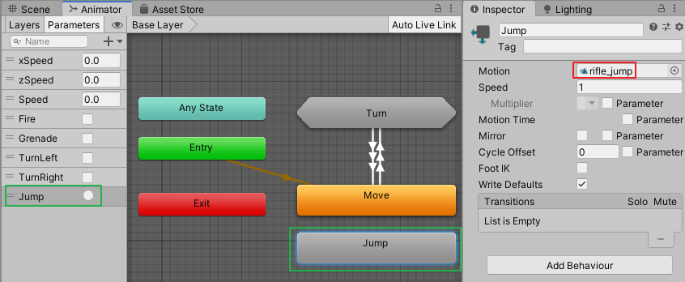
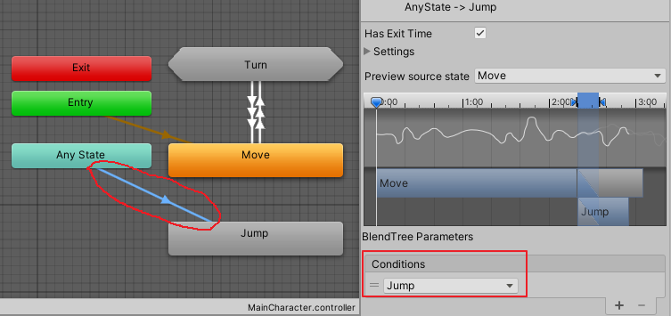
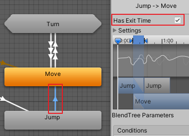

# 通过脚本改变角色控制器
date: 2020-06-16 22:23:44

**Unity 2018 Cookbook | Charpter 10 3D Animation | Transforming the Character Controller via scripts**

根动作是一种给角色赋予动画的手段。虽然实用且精准，但有时还是需要手动调整角色动作的一两个相位。如果你只有一个现成的动画，或者你想让角色的移动受到其他变量的影响。你将需要一个脚本来重载根动作。

本文中，我们将使用一个只在Y轴上运动的跳跃动画片段，使角色在跳跃的同事向前或向后移动，我们将学习如何使用脚本通过角色的速度来影响跳跃方向。

本文使用的资源链接：https://github.com/PacktPublishing/Unity-2018-Cookbook-Third-Edition/tree/master/Chapter10_3DAnimation/10_05_script_transform_control

完成后项目资源链接：https://github.com/dr-matt-smith/unity-cookbook-2018-ch10-05-script-control-transform

# 一、设置动画片段

新建一个3D项目导入Jumping.unitypackage和Swat@rifle_jump.fbx。。在项目窗口里打开场景mecanimPlayground。

选中Rig标签，改变AnimationType为Humanoid  and Avatar Definition toCreate From this Model . Confirm this byclicking on Apply .

点击Animations标签页，点击Clamp Range按钮调整时间线，勾选Loop Time和LoopPose选项。在Root Transform Rotation下勾选Bake Into Pose，设置Based Upon为Original。在Root Transform Position (Y)下方，保持Bake into Pose不勾选，设置Based Upon 为Original。在Root Transform Position (XZ) 下方保持Bake Into Pos不勾选，点击Apply应用设置。


# 二、设置动画状态

在项目窗口双击MainCharacter动画控制器并进入Animator窗口，在左上角选择Parameters选项页，点击加号新建 Trigger类型参数Jump，新建一个状态取名Jump。选中Jump状态，给它的Motion配置动画片段rifle_jump。



从Any State到Jump建立转变关系，勾选Has Exit Time，添加条件参数Jump。



从Jump到Move建立转变关系，勾选Has Exit Time。



# 三、编辑脚本

打开脚本文件BasicController.cs，添加变量声明

```c#
public float jumpHeight = 1f;
private float verticalSpeed = 0f;
private float xVelocity = 0f;
private float zVelocity = 0f;
```

在Update方法的" if(controller.isGrounded){ "的下一行添加如下代码：

```c#
if (Input.GetKey(KeyCode.Space))
{
    anim.SetTrigger("Jump");
    verticalSpeed = jumpHeight;
} 
```

在BasicController类的底部添加方法OnAnimatorMove：

```c#
private void OnAnimatorMove()
{
    Vector3 deltaPosition = anim.deltaPosition;
    if (controller.isGrounded)
    {
        xVelocity = controller.velocity.x;
        zVelocity = controller.velocity.z;
    }
    else
    {
        deltaPosition.x = xVelocity * Time.deltaTime;
        deltaPosition.z = zVelocity * Time.deltaTime;
        anim.SetBool("Jump", false);
    }
    deltaPosition.y = verticalSpeed;
    controller.Move(deltaPosition);
    verticalSpeed += Physics.gravity.y * Time.deltaTime;
    if((controller.collisionFlags & CollisionFlags.Below) != 0)
    {
        verticalSpeed = 0;
    }
}
```

保存脚本，播放游戏，我们可以通过空格键在角色走动的时候做跳跃动作。

BasicController.cs完整代码:

```c#
using UnityEngine;
using System.Collections;
/* ----------------------------------------
 * class to demonstrate how to control a 
 * character using Character Controller and the Mecanim system
 */ 
public class BasicController: MonoBehaviour {
	// Variable for the character's Animator component
	private Animator anim;
	// Variable for the character's Character Controller component
	private CharacterController controller;
	// float variable for dampening speed values
	public float transitionTime = .25f;
	// float variable for speed limit
	private float speedLimit = 1.0f;
	// boolean variable for moving diagonally, combining x and z speed
	public bool moveDiagonally = true;
	// boolean variable for directing the charater's direction with the mouse
	public bool mouseRotate = true;
	// boolean variable for directing the charater's direction with the keyboard
	public bool keyboardRotate = false;

    public float jumpHeight = 1f;
    private float verticalSpeed = 0f;
    private float xVelocity = 0f;
    private float zVelocity = 0f;

    /* ----------------------------------------
	 * At Start, get character's Animator and Character Controller components
	 */
	void Start () {
		// Assign character's Controller to 'controller' variable
		controller = GetComponent<CharacterController>();
		
		// Assign character's Animator to 'anim' variable
		anim = GetComponent<Animator>();
	}
	
	/* ----------------------------------------
	 * Whenever Directional controls are used, update variables from the Animator
	 */
	void Update () {

        // IF Character Controller is grounded...
        if (controller.isGrounded) {

            if (Input.GetKey(KeyCode.Space))
            {
                anim.SetTrigger("Jump");
                verticalSpeed = jumpHeight;
            }      

			// IF 'Q' key is being pressed, THEN...
			if(Input.GetKey(KeyCode.Q)){
				
				//... set 'TurnLeft' bool variable of the Animator as true
				anim.SetBool("TurnLeft", true);
				
				// ... and rotate character to its left
				transform.Rotate(Vector3.up * (Time.deltaTime * -45.0f), Space.World);
				
				// ELSE, if 'Q' key is NOT being pressed, THEN...
			}  else {
				
				//... set 'TurnLeft' bool variable of the Animator as false
				anim.SetBool("TurnLeft", false);	
			}
			
			// IF 'E' key is being pressed, THEN...
			if(Input.GetKey(KeyCode.E)){
				
				//... set 'TurnRight' bool variable of the Animator as true
				anim.SetBool("TurnRight", true);
				
				// ... and rotate character to its right
				transform.Rotate(Vector3.up * (Time.deltaTime * 45.0f), Space.World);
				
				// ELSE, if 'E' key is NOT being pressed, THEN...
			} else {
				//... set 'TurnRight' bool variable of the Animator as false
				anim.SetBool("TurnRight", false);	
			}
			
			
			
			if (Input.GetKey (KeyCode.RightShift) ||Input.GetKey (KeyCode.LeftShift))
				// IF Shift key is pressed, THEN set speed limit to 0.5, slowing down the character
				speedLimit = 0.5f;
			else 
				// ELSE, set speed limit to full speed (1.0)
				speedLimit = 1.0f;	
			
			// a float variable to get Horizontal Axis input (left/right)
			float h = Input.GetAxis("Horizontal");
			
			// a float variable to get Vertical Axis input (forward/backwards)
			float v = Input.GetAxis("Vertical");
			
			// float variable for horizontal speed and direction, obtained by multiplying Horizontal Axis by the speed limit
			float xSpeed = h * speedLimit;	
			
			// float variable for vertical speed and direction, obtained by multiplying Vertical Axis by the speed limit
			float zSpeed = v * speedLimit;	
			
			// float variable for absolute speed 
			float speed = Mathf.Sqrt(h*h+v*v);
			
			if(v!=0 && !moveDiagonally)
				// IF Vertical Axis input is different than 0 AND moveDiagonally boolean is set to false, THEN set horizontal speed as 0 
				xSpeed = 0;
			
			if(v!=0 && keyboardRotate)
				// IF Vertical Axis input is different than 0 AND keyboardRotate boolean is set to true, THEN rotate character according to Horizontal Axis input
				this.transform.Rotate(Vector3.up * h, Space.World);
			
			if(mouseRotate)
				// IF mouseRotate boolean is set to true, THEN rotate character according to Horizontal mouse movement
				this.transform.Rotate(Vector3.up * (Input.GetAxis("Mouse X")) * Mathf.Sign(v), Space.World);
			
			// Set zSpeed float as 'zSpeed' variable of the Animator, dampening it for the amount of time in 'transitionTime' 
			anim.SetFloat("zSpeed", zSpeed, transitionTime, Time.deltaTime);
			
			// Set xSpeed float as 'xSpeed' variable of the Animator, dampening it for the amount of time in 'transitionTime' 
			anim.SetFloat("xSpeed", xSpeed, transitionTime, Time.deltaTime);
			
			// Set speed float as 'Speed' variable of the Animator, dampening it for the amount of time in 'transitionTime' 
			anim.SetFloat("Speed", speed, transitionTime, Time.deltaTime);
		}
		
		if(Input.GetKeyDown(KeyCode.F)){
			// IF 'F' key is pressed, THEN set 'Grenade' variable of the Animator as true
			anim.SetBool("Grenade", true);
		} else {
			// ELSE, set 'Grenade' variable of the Animator as false
			anim.SetBool("Grenade", false);
		}
		if(Input.GetButtonDown("Fire1")){
			// IF the 'Fire' button is pressed, THEN set 'Fire' variable of the Animator as true
			anim.SetBool("Fire", true);
		}
		if(Input.GetButtonUp("Fire1")){
			// IF the 'Fire' button is released, THEN set 'Fire' variable of the Animator as false
			anim.SetBool("Fire", false);
		}
	}

    private void OnAnimatorMove()
    {
        Vector3 deltaPosition = anim.deltaPosition;
        if (controller.isGrounded)
        {
            xVelocity = controller.velocity.x;
            zVelocity = controller.velocity.z;
        }
        else
        {
            deltaPosition.x = xVelocity * Time.deltaTime;
            deltaPosition.z = zVelocity * Time.deltaTime;
            anim.SetBool("Jump", false);
        }
        deltaPosition.y = verticalSpeed;
        controller.Move(deltaPosition);
        verticalSpeed += Physics.gravity.y * Time.deltaTime;
        if((controller.collisionFlags & CollisionFlags.Below) != 0)
        {
            verticalSpeed = 0;
        }
    }
}
```

# 四、工作原理

注意到当这个功能脚本加入到MsLaser时，MsLaser的Animator组件|Apply Root Motion参数变为Handled by Script（由脚本管理）。

OnAnimatorMove()方法中的指令重写了动画动作，其中controller.Move(deltaPosition)通过deltaPosition 3D 向量基本上替换了跳跃的方向。deltaPosition 3D 向量由角色跳前瞬时速度和变量jumpHeight与重力的随时间变化的计算结果（Y轴）。

通过语句“ SetTrigger("Jump") ”在Animator控制器里触发转变条件Jump为true，实现从Any State到Jump的状态转变。

Trigger类型参数与Bool类型参数类似，不同在于Trigger类型参数在被触发为true后，自动变回false。不需要再写代码将触发器设为false。

Trigger类型参数适用于事件发生后返回原来的状态。Jump状态到Move状态不需要条件，因此Jump动画播放完返回Move状态。