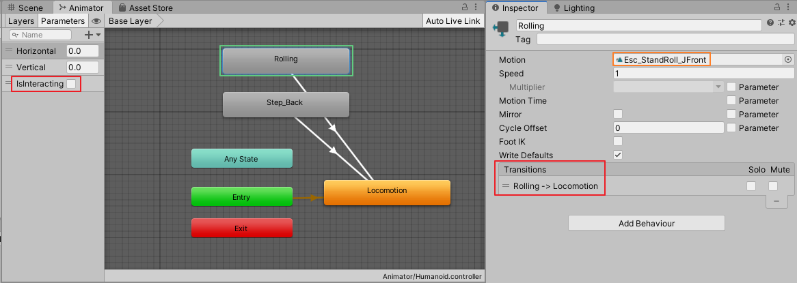
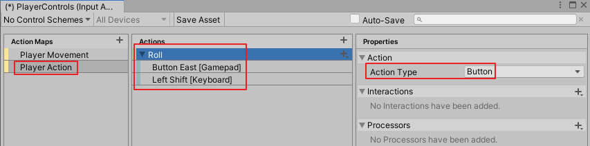
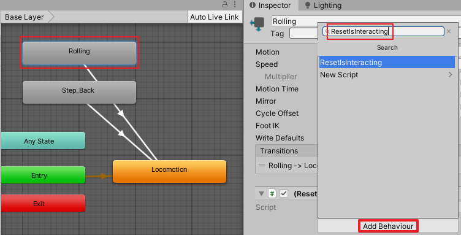
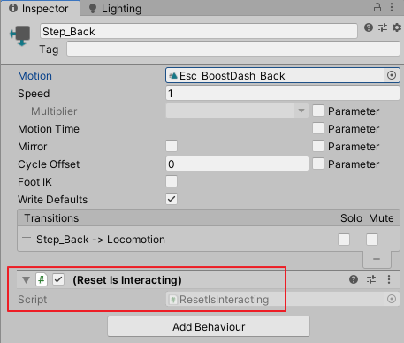
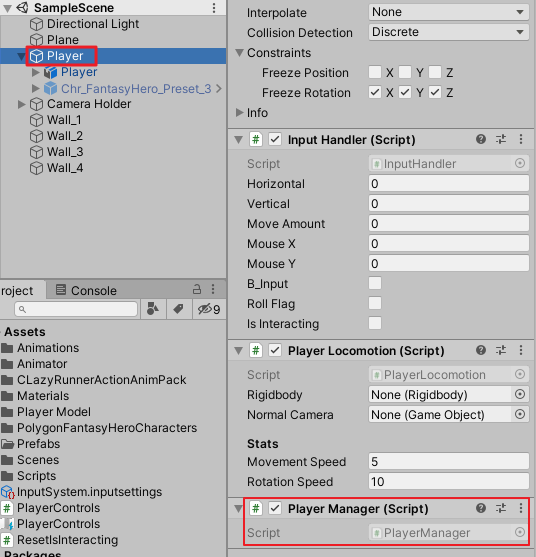
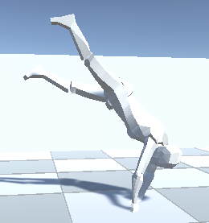
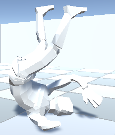
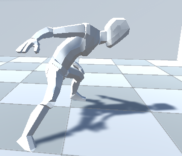

# DarkSoulsDemo_part_4_角色翻滚与后撤闪避
date: 2020-06-20 14:48:38

本篇根据视频：https://www.youtube.com/watch?v=RVWh-YAQElQ

资源链接：https://assetstore.unity.com/packages/3d/animations/runner-action-animation-pack-153906

本篇中只用到Runner Action Animation Pack中的两个动画片段：

CLazy@Esc_StandRoll_JFront_Root、CLazy@Esc_BoostDash_Back_Root

## 一、添加动画状态

导入动画资源后，打开Humanoid动画控制器，进到Base Layer层，直接从项目窗口拖拽动画片段CLazy@Esc_StandRoll_JFront和CLazy@Esc_BoostDash_Back到Animator窗口中直接生成两个动画状态，分别重命名为Rolling、Step_Back。

建立两个转变关系：

Rolling => Locomotion

Step_Back => Locomotion

添加Bool类型参数IsInteracting



## 二、编辑脚本

打开PlayerLocomotion.cs，将下边的代码块封装成一个HandleMovement方法：

```c#
moveDirection = cameraObject.forward * inputHandler.vertical;
moveDirection += cameraObject.right * inputHandler.horizontal;
moveDirection.Normalize();
moveDirection.y = 0;

float speed = movementSpeed;
moveDirection *= speed;

Vector3 projectedVelocity = Vector3.ProjectOnPlane(moveDirection, normalVector);
rigidbody.velocity = projectedVelocity;

animatorHandler.UpdateAnimatorValues(inputHandler.moveAmount, 0);

if (animatorHandler.canRotate)
{
    HandleRotation(delta);
}
```

改完以后：

```c#
public void Update()
{
    float delta = Time.deltaTime;
    inputHandler.TickInput(delta);
    HandleMovement(delta);
}
...
private void HandleRotation(float delta)...
        
public void HandleMovement(float delta)
{
    moveDirection = cameraObject.forward * inputHandler.vertical;
    moveDirection += cameraObject.right * inputHandler.horizontal;
    moveDirection.Normalize();
    moveDirection.y = 0;

    float speed = movementSpeed;
    moveDirection *= speed;

    Vector3 projectedVelocity = Vector3.ProjectOnPlane(moveDirection, normalVector);
    rigidbody.velocity = projectedVelocity;

    animatorHandler.UpdateAnimatorValues(inputHandler.moveAmount, 0);

    if (animatorHandler.canRotate)
    {
        HandleRotation(delta);
    }
}
```

打开AnimatorHandler.cs，添加方法PlayerTargetAnimation

```c#
public void PlayerTargetAnimation(string targetAnim, bool isInteracting)
{
    anim.applyRootMotion = isInteracting;
    anim.SetBool("IsInteracting", true);
    anim.CrossFade(targetAnim, 0.2f);
}
```

## 三、绑定按键

回到Unity编辑器，打开PlayerControls，添加Action Map，命名为Player Action。添加Action，取名Roll，Action Type为Button，添加绑定Button East [Gamepad]、Left Shift [Keyboard]。



打开InputHandler.cs，添加声明bool类型变量b_Input、rollFlag，编写方法HandleRollInput：

```c#
public bool b_Input;
public bool rollFlag;
...
private void HandleRollInput(float delta)
{
    if (b_Input)
    {
        rollFlag = true;
    }
}
```

## 四、脚本管理翻滚和后撤步动画

打开PlayerLocomotion.cs，添加方法HandleRollingAndSprinting

```c#
public void HandleRollingAndSprinting(float delta)
{
    if (animatorHandler.anim.GetBool("IsInteracting"))
        return;
    if (inputHandler.rollFlag)
    {
        moveDirection = cameraObject.forward * inputHandler.vertical;
        moveDirection += cameraObject.right * inputHandler.horizontal;
        if(inputHandler.moveAmount > 0)
        {
            animatorHandler.PlayerTargetAnimation("Rolling", true);
            moveDirection.y = 0;
            Quaternion rollRotation = Quaternion.LookRotation(moveDirection);
            myTransform.rotation = rollRotation;
        }
        else
        {
            animatorHandler.PlayerTargetAnimation("Step_Back", true);
        }
    }
}
```

回到InputHandler.cs，调用HandleRollInput，在HandleRollInpu里t补充对b_Input赋值。

```c#
public void TickInput(float delta)
{
    MoveInput(delta);
    HandleRollInput(delta);
}
...
private void HandleRollInput(float delta)
{
    b_Input = inputActions.PlayerAction.Roll.phase == UnityEngine.InputSystem.InputActionPhase.Started;
    if (b_Input)
    {
        rollFlag = true;
    }
}
```

切到PlayerLocomotion.cs，在Update方法里调用HandleRollingAndSprinting方法：

```c#
public void Update()
{
    float delta = Time.deltaTime;

    inputHandler.TickInput(delta);
    HandleMovement(delta);
    HandleRollingAndSprinting(delta);

}
```

这时候播放游戏，角色随可以翻滚，但突然四处乱飘，接下来解决这个问题。

## 五、管理互动权限

首先在InputHandler.cs里声明bool类型公共变量isInteracting。

新建脚本PlayerManager.cs，编写代码：

```c#
using System.Collections;
using System.Collections.Generic;
using UnityEngine;
namespace MJ
{
    public class PlayerManager : MonoBehaviour
    {
        InputHandler inputHandler;
        Animator anim;

        void Start()
        {
            inputHandler = GetComponent<InputHandler>();
            anim = GetComponentInChildren<Animator>();
        }

        void Update()
        {
            inputHandler.isInteracting = anim.GetBool("IsInteracting");
            inputHandler.rollFlag = false;
        }
    }
}
```

回到Animator窗口，选中Rolling窗台，在Inspector点击Add Behaviour，命名ResetIsInteracting，创建并添加脚本。



ResetIsInteracting.cs编写如下：

```c#
using System.Collections;
using System.Collections.Generic;
using UnityEngine;

public class ResetIsInteracting : StateMachineBehaviour
{

    // OnStateExit is called when a transition ends and the state machine finishes evaluating this state
    override public void OnStateExit(Animator animator, AnimatorStateInfo stateInfo, int layerIndex)
    {
        animator.SetBool("IsInteracting", false);
    }
}
```

对Step_Back也应用上该脚本



在AnimatorHandler.cs里声明变量inputHandler和playerLocomotion，在Initialize方法里获取，添加OnAnimatorMove方法。

```c#
public InputHandler inputHandler;
public PlayerLocomotion playerLocomotion;
...

public void Initialize()
{
    anim = GetComponent<Animator>();
    inputHandler = GetComponentInParent<InputHandler>();
    playerLocomotion = GetComponentInParent<PlayerLocomotion>();
...
}
...
private void OnAnimatorMove()
{
    if (inputHandler.isInteracting == false)
        return;

    float delta = Time.deltaTime;
    playerLocomotion.rigidbody.drag = 0;
    Vector3 deltaPosition = anim.deltaPosition;
    deltaPosition.y = 0;
    Vector3 velocity = deltaPosition / delta;
    playerLocomotion.rigidbody.velocity = velocity;
} 
```

给Player添加PlayerLocomotion脚本



好，现在播放游戏，可以在按方向键的同时按键盘左Shift键实现角色翻滚，单按Shift键原地后撤步闪避了。翻滚姿势截图有点丑，将就看吧。







## 六、脚本汇总

### InputHandler.cs

```c#
using System.Collections;
using System.Collections.Generic;
using UnityEngine;

namespace MJ { 
    public class InputHandler : MonoBehaviour
    {
        public float horizontal;
        public float vertical;
        public float moveAmount;
        public float mouseX;
        public float mouseY;

        public bool b_Input;

        public bool rollFlag;
        public bool isInteracting;

        PlayerControls inputActions;
        CameraHandler cameraHandler;

        Vector2 movementInput;
        Vector2 cameraInput;

        private void Awake()
        {
            cameraHandler = CameraHandler.singleton;
        }

        private void FixedUpdate()
        {
            float delta = Time.fixedDeltaTime;

            if(cameraHandler != null)
            {
                cameraHandler.FollowTarget(delta);
                cameraHandler.HandleCameraRotation(delta, mouseX, mouseY);
            }
        }


        public void OnEnable()
        {
            if(inputActions == null)
            {
                inputActions = new PlayerControls();
                inputActions.PlayerMovement.Movement.performed += inputActions => movementInput = inputActions.ReadValue<Vector2>();
                inputActions.PlayerMovement.Camera.performed += i => cameraInput = i.ReadValue<Vector2>();
            }

            inputActions.Enable();
        }

        private void OnDisable()
        {
            inputActions.Disable();
        }

        public void TickInput(float delta)
        {
            MoveInput(delta);
            HandleRollInput(delta);
        }

        private void MoveInput(float delta)
        {
            horizontal = movementInput.x;
            vertical = movementInput.y;
            moveAmount = Mathf.Clamp01(Mathf.Abs(horizontal) + Mathf.Abs(vertical));
            mouseX = cameraInput.x;
            mouseY = cameraInput.y;
        }

        private void HandleRollInput(float delta)
        {
            b_Input = inputActions.PlayerAction.Roll.phase == UnityEngine.InputSystem.InputActionPhase.Started;
            if (b_Input)
            {
                rollFlag = true;
            }
        }
    }
}
```

### PlayerLocomotion.cs

```c#
using System.Collections;
using System.Collections.Generic;
using UnityEngine;

namespace MJ { 

    public class PlayerLocomotion : MonoBehaviour
    {
        Transform cameraObject;
        InputHandler inputHandler;
        Vector3 moveDirection;

        [HideInInspector]
        public Transform myTransform;
        [HideInInspector]
        public AnimatorHandler animatorHandler;

        public new Rigidbody rigidbody;
        public GameObject normalCamera;

        [Header("Stats")]
        [SerializeField]
        float movementSpeed = 5;
        [SerializeField]
        float rotationSpeed = 10;

        // Start is called before the first frame update
        void Start()
        {
            rigidbody = GetComponent<Rigidbody>();
            inputHandler = GetComponent<InputHandler>();
            animatorHandler = GetComponentInChildren<AnimatorHandler>();
            cameraObject = Camera.main.transform;
            myTransform = transform;
            animatorHandler.Initialize();
        }
        public void Update()
        {
            float delta = Time.deltaTime;

            inputHandler.TickInput(delta);
            HandleMovement(delta);
            HandleRollingAndSprinting(delta);
           
        }

        #region Movement
        Vector3 normalVector;
        Vector3 targetPostion;

        private void HandleRotation(float delta)
        {
            Vector3 targetDir = Vector3.zero;
            float moveOverride = inputHandler.moveAmount;

            targetDir = cameraObject.forward * inputHandler.vertical;
            targetDir += cameraObject.right * inputHandler.horizontal;

            targetDir.Normalize();
            targetDir.y = 0;

            if(targetDir == Vector3.zero)
            {
                targetDir = myTransform.forward;
            }
            float rs = rotationSpeed;
            Quaternion tr = Quaternion.LookRotation(targetDir);
            Quaternion targetRotation = Quaternion.Slerp(myTransform.rotation, tr, rs * delta);

            myTransform.rotation = targetRotation;
        }

        public void HandleMovement(float delta)
        {
            moveDirection = cameraObject.forward * inputHandler.vertical;
            moveDirection += cameraObject.right * inputHandler.horizontal;
            moveDirection.Normalize();
            moveDirection.y = 0;

            float speed = movementSpeed;
            moveDirection *= speed;

            Vector3 projectedVelocity = Vector3.ProjectOnPlane(moveDirection, normalVector);
            rigidbody.velocity = projectedVelocity;

            animatorHandler.UpdateAnimatorValues(inputHandler.moveAmount, 0);

            if (animatorHandler.canRotate)
            {
                HandleRotation(delta);
            }
        }
        
        public void HandleRollingAndSprinting(float delta)
        {
            if (animatorHandler.anim.GetBool("IsInteracting"))
                return;
            if (inputHandler.rollFlag)
            {
                moveDirection = cameraObject.forward * inputHandler.vertical;
                moveDirection += cameraObject.right * inputHandler.horizontal;
                if(inputHandler.moveAmount > 0)
                {
                    animatorHandler.PlayerTargetAnimation("Rolling", true);
                    moveDirection.y = 0;
                    Quaternion rollRotation = Quaternion.LookRotation(moveDirection);
                    myTransform.rotation = rollRotation;
                }
                else
                {
                    animatorHandler.PlayerTargetAnimation("Step_Back", true);
                }
            }
        }
        #endregion
    }
}
```

### AnimatorHandler.cs

```c#
using System.Collections;
using System.Collections.Generic;
using UnityEngine;

namespace MJ { 
    public class AnimatorHandler : MonoBehaviour
    {
        public Animator anim;
        public InputHandler inputHandler;
        public PlayerLocomotion playerLocomotion;
        int vertical;
        int horizontal;
        public bool canRotate;

        public void Initialize()
        {
            anim = GetComponent<Animator>();
            inputHandler = GetComponentInParent<InputHandler>();
            playerLocomotion = GetComponentInParent<PlayerLocomotion>();
            vertical = Animator.StringToHash("Vertical");
            horizontal = Animator.StringToHash("Horizontal");
        }
        public void UpdateAnimatorValues(float verticalMovement, float horizontalMovement)
        {
            #region Vertical
            float v = 0;

            if(verticalMovement > 0 && verticalMovement < 0.55f)
            {
                v = 0.5f;
            }else if(verticalMovement > 0.55f)
            {
                v = 1;
            }else if(verticalMovement < 0 && verticalMovement > -0.55f)
            {
                v = -0.5f;
            }else if(verticalMovement < -0.55f)
            {
                v = -1;
            }
            else
            {
                v = 0;
            }
            #endregion

            #region Horizontal
            float h = 0;

            if(horizontalMovement > 0 && horizontalMovement < 0.55f)
            {
                h = 0.5f;
            }else if(horizontalMovement > 0.55f)
            {
                h = 1;
            }else if(horizontalMovement < 0 && horizontalMovement > -0.55f)
            {
                h = -0.5f;
            }else if(verticalMovement < -0.55f)
            {
                h = -1;
            }
            else
            {
                h = 0;
            }
            #endregion

            anim.SetFloat(vertical, v, 0.1f, Time.deltaTime);
            anim.SetFloat(horizontal, h, 0.1f, Time.deltaTime);

        }

        public void PlayerTargetAnimation(string targetAnim, bool isInteracting)
        {
            anim.applyRootMotion = isInteracting;
            anim.SetBool("IsInteracting", true);
            anim.CrossFade(targetAnim, 0.2f);
        }

        public void CanRotate()
        {
            canRotate = true;
        }
        public void StopRotate()
        {
            canRotate = false;
        }

        private void OnAnimatorMove()
        {
            if (inputHandler.isInteracting == false)
                return;

            float delta = Time.deltaTime;
            playerLocomotion.rigidbody.drag = 0;
            Vector3 deltaPosition = anim.deltaPosition;
            deltaPosition.y = 0;
            Vector3 velocity = deltaPosition / delta;
            playerLocomotion.rigidbody.velocity = velocity;
        }
    }
}
```

### PlayerManager.cs

```c#
using System.Collections;
using System.Collections.Generic;
using UnityEngine;
namespace MJ
{
    public class PlayerManager : MonoBehaviour
    {
        InputHandler inputHandler;
        Animator anim;

        void Start()
        {
            inputHandler = GetComponent<InputHandler>();
            anim = GetComponentInChildren<Animator>();
        }

        void Update()
        {
            inputHandler.isInteracting = anim.GetBool("IsInteracting");
            inputHandler.rollFlag = false;
        }
    }
}
```

### ResetIsInteracting.cs

```c#
using System.Collections;
using System.Collections.Generic;
using UnityEngine;

public class ResetIsInteracting : StateMachineBehaviour
{

    // OnStateExit is called when a transition ends and the state machine finishes evaluating this state
    override public void OnStateExit(Animator animator, AnimatorStateInfo stateInfo, int layerIndex)
    {
        animator.SetBool("IsInteracting", false);
    }
}

```

