# DarkSoulsDemo（九）轻攻击与重攻击
date: 2020-06-23 11:19:28

本文出自：[Create DARK SOULS in Unity ► EP. 9 LIGHT & HEAVY ATTACKS](https://www.youtube.com/watch?v=cOGep0Vlayk&t=103s)

用到的动画资源：[Dynamic Sword Animset](https://assetstore.unity.com/packages/3d/animations/dynamic-sword-animset-44329) 中的R_Attack_05、R_Attack_06。

## 一、添加动画层

打开Hunmanoid动画控制器，新建一个动画层，取名Override，将其Weight设置为1。在Override层新建一个Empty状态，将Base Layer里的Step_Back、Rolling、Land、Falling状态复制到Override层里并将前三个状态都指向Empty。

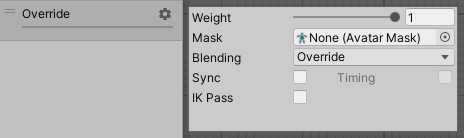

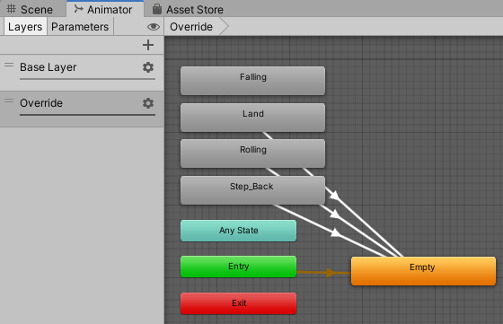

## 二、重写重置IsInteracting方法

打开ResetIsInteracting.cs，修改类名并修改文件名为ResetAnimatorBool.cs。

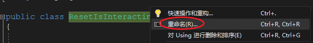

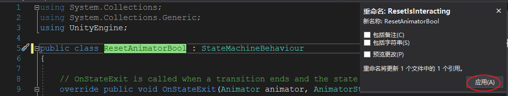

将Override层里的Step_Back、Rolling、Land状态的Behaviour删掉

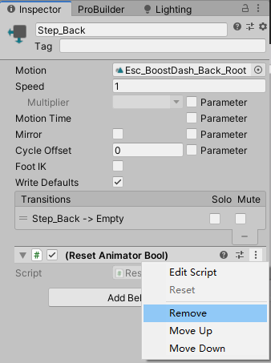

修改ResetAnimatorBool.cs

```c#
using System.Collections;
using System.Collections.Generic;
using UnityEngine;

public class ResetAnimatorBool : StateMachineBehaviour
{
    public string targetBool;
    public bool status;

    public override void OnStateEnter(Animator animator, AnimatorStateInfo stateInfo, int layerIndex)
    {
        animator.SetBool(targetBool, status);
    }
}
```

给Empty状态添加Behaviour，并在target Bool里填上IsInteracting，并保持Parameters标签页里的IsInteracting没有勾选

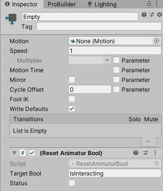

## 三、攻击脚本

打开WeaponItem.cs，添加以下变量声明

```c#
[Header("One Handed  Attack Animations")]
public string OH_Light_Attack_1;
public string OH_Heavy_Attack_1;
```

新建一个脚本PlayerAttacker.cs，将其挂到Player上

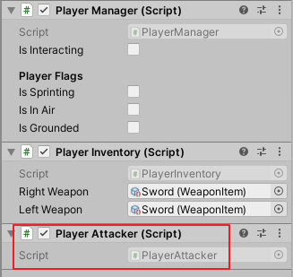

编写PlayerAttacker.cs如下：

```c#
using System.Collections;
using System.Collections.Generic;
using UnityEngine;
namespace MJ
{
    public class PlayerAttacker : MonoBehaviour
    {
        AnimatorHandler animatorHandler;

        private void Awake()
        {
            animatorHandler = GetComponentInChildren<AnimatorHandler>();
        }

        public void HandleLightAttack(WeaponItem weapon)
        {
            animatorHandler.PlayerTargetAnimation(weapon.OH_Light_Attack_1, true);
        }

        public void HandleHeavyAttack(WeaponItem weapon)
        {
            animatorHandler.PlayerTargetAnimation(weapon.OH_Heavy_Attack_1, true);
        }
    }
}
```

打开PlayerControls，给Player Action新建Action，起名为RB，设置Action Type为Button。

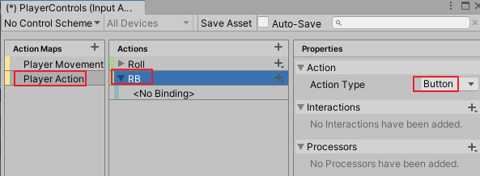

添加键位绑定，给RB绑定键盘E键和Right Shoulder [Gamepad]。新建一个Action，取名RT，添加键位绑定键盘R键和Right Trigger [Gamepad]，关闭PlayerControls点击Save。

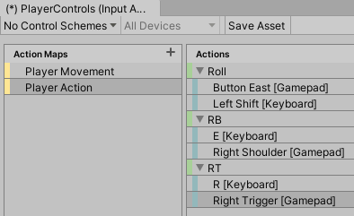

打开InputHandler.cs，在类的最底下添加方法HandleAttackInput，在TickInput方法里调用并在开头补上变量声明：

```c#
public bool rb_Input;
public bool rt_Input;

PlayerAttacker playerAttacker;
PlayerInventory playerInventory;

private void Awake()
{
    playerAttacker = GetComponent<PlayerAttacker>();
    playerInventory = GetComponent<PlayerInventory>();
}

public void TickInput(float delta)
{
    ...
    HandleAttackInput(delta);
}

private void HandleAttackInput(float delta)
{
    inputActions.PlayerAction.RB.performed += inputActions => rb_Input = true;
    inputActions.PlayerAction.RT.performed += inputActions => rt_Input = true; 
    
    if (rb_Input)
    {
        playerAttacker.HandleLightAttack(playerInventory.rightWeapon);
    }

    if (rt_Input)
    {
        playerAttacker.HandleHeavyAttack(playerInventory.rightWeapon);
    }
}
```

在PlayerManager.cs里的LateUpdate方法调用输入

```c#
private void LateUpdate()
{
    ...
    inputHandler.rb_Input = false;
    inputHandler.rt_Input = false;
```

## 四、添加动画

将动画片段R_Attack_05、R_Attack_06拖入Animator窗口网格区域，分别重命名为Light_Attack、Heavy_Attack，然后都添加转换关系转向Empty状态。

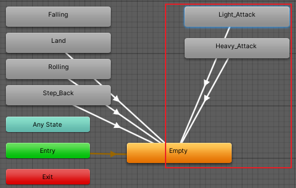

在项目窗口Assets/Data/Iitems/Weapons下选中Sword，在Inspector里给OH_light_Attack填上light_Attack，给OH_Heavy_Attack填上Heavy_Attack。

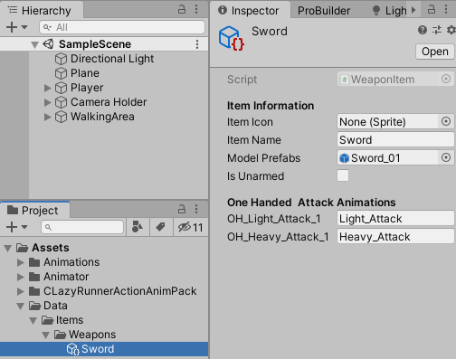

播放游戏，按键盘E/手柄RB触发角色轻攻击，按键盘R/手柄RT触发角色重攻击。

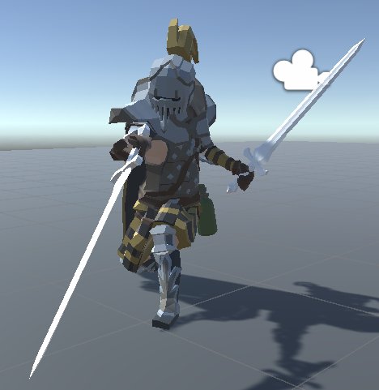

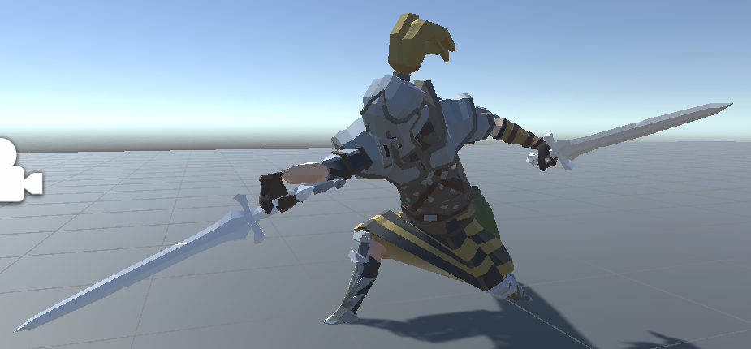

## 五、脚本汇总

### ResetAnimatorBool.cs

```c#
using System.Collections;
using System.Collections.Generic;
using UnityEngine;

public class ResetAnimatorBool : StateMachineBehaviour
{
    public string targetBool;
    public bool status;

    public override void OnStateEnter(Animator animator, AnimatorStateInfo stateInfo, int layerIndex)
    {
        animator.SetBool(targetBool, status);
    }
}

```

### WeaponItem.cs

```c#
using System.Collections;
using System.Collections.Generic;
using UnityEngine;
namespace MJ
{
    [CreateAssetMenu(menuName = "Item/Weapon Item")]
    public class WeaponItem : Item
    {
        public GameObject modelPrefabs;
        public bool isUnarmed;

        [Header("One Handed  Attack Animations")]
        public string OH_Light_Attack_1;
        public string OH_Heavy_Attack_1;
    }
}
```

### PlayerAttacker.cs

```c#
using System.Collections;
using System.Collections.Generic;
using UnityEngine;
namespace MJ
{
    public class PlayerAttacker : MonoBehaviour
    {
        AnimatorHandler animatorHandler;

        private void Awake()
        {
            animatorHandler = GetComponentInChildren<AnimatorHandler>();
        }

        public void HandleLightAttack(WeaponItem weapon)
        {
            animatorHandler.PlayerTargetAnimation(weapon.OH_Light_Attack_1, true);
        }

        public void HandleHeavyAttack(WeaponItem weapon)
        {
            animatorHandler.PlayerTargetAnimation(weapon.OH_Heavy_Attack_1, true);
        }
    }
}
```

### InputHandler.cs

```c#
using System.Collections;
using System.Collections.Generic;
using UnityEngine;

namespace MJ { 
    public class InputHandler : MonoBehaviour
    {
        public float horizontal;
        public float vertical;
        public float moveAmount;
        public float mouseX;
        public float mouseY;

        public bool b_Input;
        public bool rb_Input;
        public bool rt_Input;

        public bool rollFlag;
        public bool sprintFlag;
        public float rollInputTimer;

        PlayerControls inputActions;
        PlayerAttacker playerAttacker;
        PlayerInventory playerInventory;

        Vector2 movementInput;
        Vector2 cameraInput;

        private void Awake()
        {
            playerAttacker = GetComponent<PlayerAttacker>();
            playerInventory = GetComponent<PlayerInventory>();
        }

        public void OnEnable()
        {
            if(inputActions == null)
            {
                inputActions = new PlayerControls();
                inputActions.PlayerMovement.Movement.performed += inputActions => movementInput = inputActions.ReadValue<Vector2>();
                inputActions.PlayerMovement.Camera.performed += i => cameraInput = i.ReadValue<Vector2>();
            }

            inputActions.Enable();
        }

        private void OnDisable()
        {
            inputActions.Disable();
        }

        public void TickInput(float delta)
        {
            MoveInput(delta);
            HandleRollInput(delta);
            HandleAttackInput(delta);
        }

        private void MoveInput(float delta)
        {
            horizontal = movementInput.x;
            vertical = movementInput.y;
            moveAmount = Mathf.Clamp01(Mathf.Abs(horizontal) + Mathf.Abs(vertical));
            mouseX = cameraInput.x;
            mouseY = cameraInput.y;
        }

        private void HandleRollInput(float delta)
        {
            b_Input = inputActions.PlayerAction.Roll.phase == UnityEngine.InputSystem.InputActionPhase.Started;
            if (b_Input)
            {
                rollInputTimer += delta;
                sprintFlag = true;
            }
            else
            {
                if(rollInputTimer > 0 && rollInputTimer < 0.5f)
                {
                    sprintFlag = false;
                    rollFlag = true;
                }

                rollInputTimer = 0;
            }
        }

        private void HandleAttackInput(float delta)
        {
            inputActions.PlayerAction.RB.performed += inputActions => rb_Input = true;
            inputActions.PlayerAction.RT.performed += inputActions => rt_Input = true;

            if (rb_Input)
            {
                playerAttacker.HandleLightAttack(playerInventory.rightWeapon);
            }

            if (rt_Input)
            {
                playerAttacker.HandleHeavyAttack(playerInventory.rightWeapon);
            }
        }
    }
}
```

### PlayerManager.cs

```c#
using System.Collections;
using System.Collections.Generic;
using UnityEngine;
namespace MJ
{
    public class PlayerManager : MonoBehaviour
    {
        InputHandler inputHandler;
        Animator anim;
        CameraHandler cameraHandler;
        PlayerLocomotion playerLocomotion;

        public bool isInteracting;

        [Header("Player Flags")]
        public bool isSprinting;
        public bool isInAir;
        public bool isGrounded;

        private void Awake()
        {
            cameraHandler = CameraHandler.singleton;
        }

        void Start()
        {
            inputHandler = GetComponent<InputHandler>();
            anim = GetComponentInChildren<Animator>();
            playerLocomotion = GetComponent<PlayerLocomotion>();
        }

        void Update()
        {
            float delta = Time.deltaTime;
            isInteracting = anim.GetBool("IsInteracting");

            inputHandler.TickInput(delta);
            playerLocomotion.HandleMovement(delta);
            playerLocomotion.HandleRollingAndSprinting(delta);
            playerLocomotion.HandleFalling(delta, playerLocomotion.moveDirection);
        }

        private void FixedUpdate()
        {
            float delta = Time.fixedDeltaTime;

            if (cameraHandler != null)
            {
                cameraHandler.FollowTarget(delta);
                cameraHandler.HandleCameraRotation(delta, inputHandler.mouseX, inputHandler.mouseY);
            }
        }

        private void LateUpdate()
        {
            inputHandler.rollFlag = false;
            inputHandler.sprintFlag = false;
            inputHandler.rb_Input = false;
            inputHandler.rt_Input = false;

            if (isInAir)
            {
                playerLocomotion.inAirTimer = playerLocomotion.inAirTimer + Time.deltaTime;
            }
        }
    }
}
```

