# Unity简易关卡设计
date: 2020-02-13 15:35:25

Unity版本：Unity 2018.4.13c1

# 一、安装ProBuilder和ProGrids

开始之前，新建一个场景命名为“Main”，在Assets文件夹下新建一个Prefabs文件夹用于存放预制体。

可以回到之前的SampleScene，将之前创建的Player,NPC逐一拖拽到Prefabs文件夹中。

回到场景Main，开始安装ProBuilder,ProGrids。

首先通过Unity编辑器的菜单栏上的Window，找到并点击打开Package Manager。

切换到All packages，找到ProBuilder，选中点击右侧页面中的Install。

我在Unity 2018.4.13c1 Perconal版本中没有找到ProGrid，需要在进入项目文件夹，在Packages文件夹中找到manifest.json文件，用Notepad++或写字板打开，在dependencies的花括号内添加"com.unity.progrids": "3.0.3-preview.4"，注意末尾添加英文逗号，保存修改后，回到Unity编辑器会立刻自动安装ProGrids。

以上工具安装完成后，All packages切换到In packages，会找到已安装的工具。

关闭Package Manager，在Unity编辑器菜单栏的Tools，点击ProGrids>ProGrids Window打开ProGrids工具窗口，点击ProBuilder>ProBuilder Window打开ProBuilder工具面板，将其拖拽到和Inspector窗口并列。

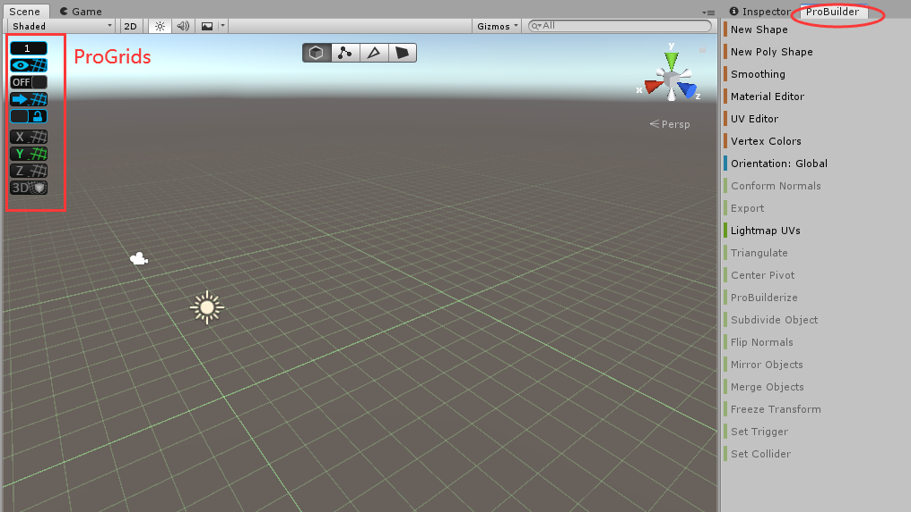

# 二、搭建关卡原型

点击New Shape右边的加号，Shape Selector选择Cube点击Build，如果不点击加号，会直接创建Cube。

将Cube位置设置为（0，0，0）。通过ProBuilder我们有4种选中方式来选中Cube。

面选中模式下，我们选中Cube的一个侧面，拖拽与选中面垂直的坐标方向，将Cube拓长12个单位长度。

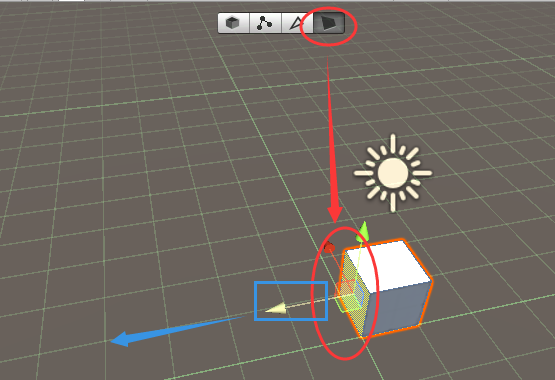

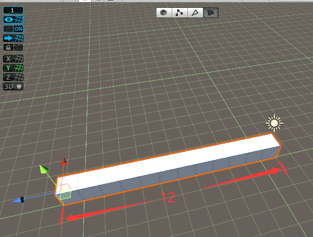

然后用相同的方法，将Cube拓宽到8个单位长度。

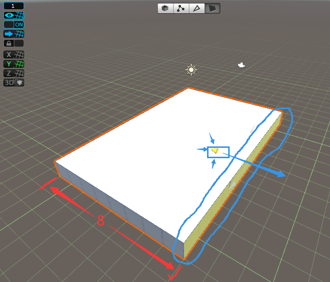

切换到边选中模式，如图选中最中间的线，然后点击ProBuilder面板的Connect Edges。用同样的方法，将Cube划分为四等份。

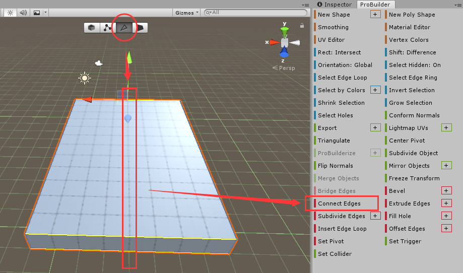

然后在面选中模式下，我们通过Ctrl快捷键连续选中划分成四等份的侧面中间两份，按住Shift键拖拽拓长10个单位长度。

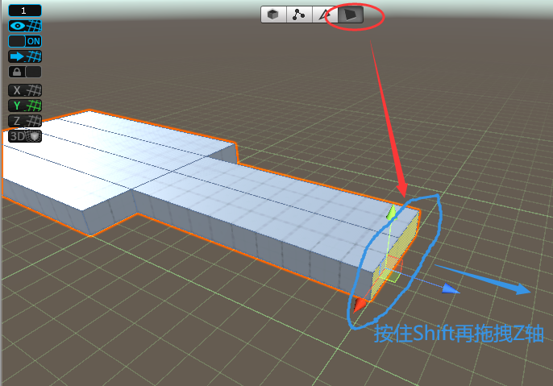

再次按住Shift继续拓长2个单位长度，再拓长10个长度。可以看到，停顿的地方会有分界线。

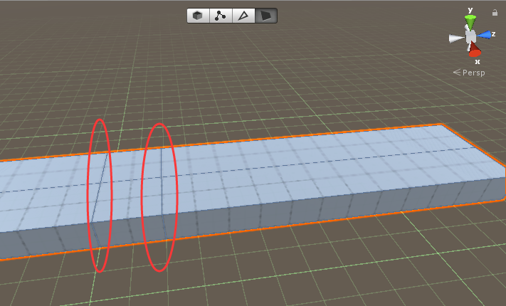

然后同时选中尾段（10个单位长度）的两侧，（此时如果坐标轴不在两个面的正中间就点击图中圈起来的Center按钮使坐标系处于正中间，）然后按【R】键切换到比例调节坐标系，使两侧拓宽2个单位长度。

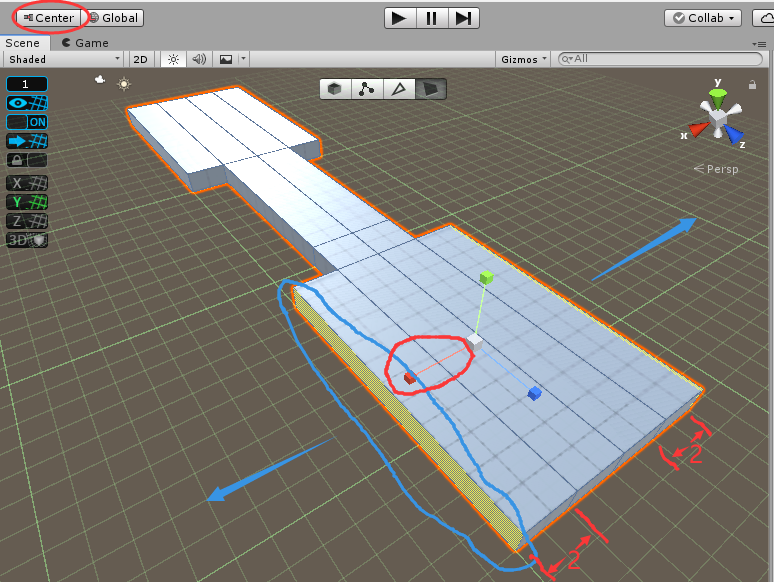

放置阶梯：

最终完成关卡原型如下：

# 三、配置环境资产

1. 导入文件

在Assets文件夹下新建文件夹Materials、Models、Textures，Models下新建文件夹Environment。

将Unity Fundamentals Source Assets\Level Assets\FBX下的所有文件导入到Assets\Models\Environment中。

将Unity Fundamentals Source Assets\Level Assets\Materials下的所有文件导入到Assets\Materials中。

将Unity Fundamentals Source Assets\Level Assets\Textures下的所有文件导入到Assets\Textures中。

以上文件由美术工作人员制作好。

2. 调整材质

进入Materials,选中Banner，Shader选择Standard(Specular setup)，要批量改变Shader，则同时选中，然后再再Inspector面板里改Shader。此处我们把剩下的材质球全部选中把Shader设置为Standard(Specular setup)。

接下来选中Barriers，锁定Inspector面板，进入Texture文件夹，把Barriers 01 Diff.tga拖拽到Inspector面板下的Main Maps>Albedo，Albedo指反射率贴图，主要体现模型的纹理和颜色。通常适合放入含有单词Albedo或BaseColor（少数情况Diff或Diffuse）的tga文件。

把Barriers 01 Spec.tga拖拽到Albedo下方的Specular，把Barriers 01 Norm.tga拖拽到Specular下方的Normal Map，把Barriers 01 occlusion.tga拖拽到Occlusion，把detail normal.png拖拽到Secondary Maps>Normal Map。

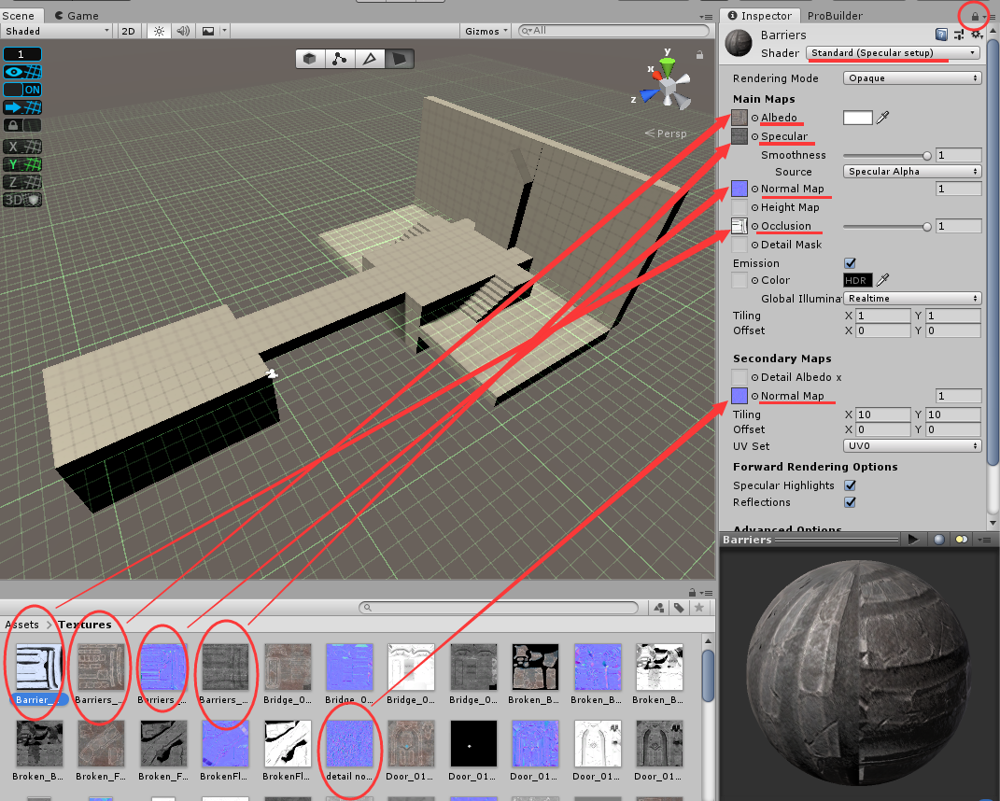

同理把，把剩下的Bridge、Broken_Bridge、Door、Floor_01、Floor_04、Lantern、Pillar、Stairs、Statue、Wall_01、Wall_02、Wall_03、WoodenPlank全都配置好。其中Door的Emission>Color需要放入Door 01 emiss.tga。

配置Banner有些不同，即将Flag 01 Diffuse.tga放到Albedo，Flag 01 normals.tga放到Normal Map，Flag 01 occulsion.tga放到Occlusion。

3. 配置材质到模型

进入Models/Environment,选中Barrier 01.FB。在Inspector面板中点击Materials，勾选Import Materials，在Remapped Materials>Standard_20 点击最右侧的圆圈按钮打开材质选择窗口，选择Barriers，点击Apply。

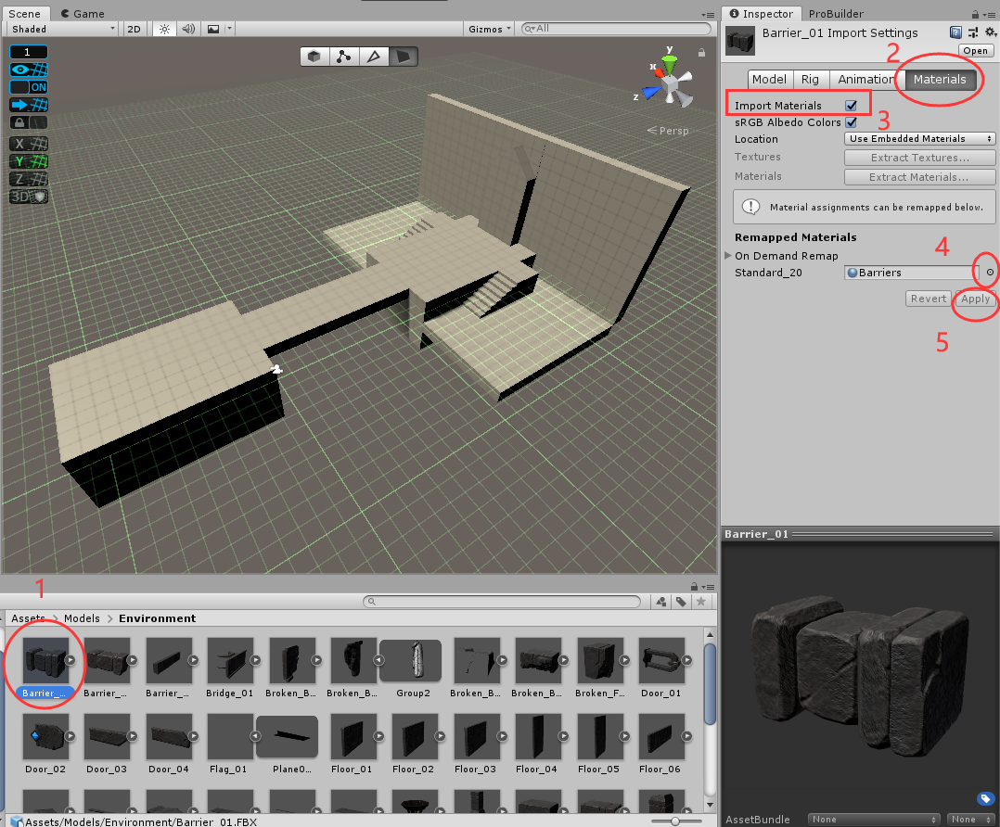

同理，把Barrie_02、Barrier_03、Bridge_01、Broken_Bridge_01、Broken_Bridge_02、Broken_Bridge_03、Broken_Bridge_04、Broken_Floor_01、Door_01、Door_02、Door_03、Door_04、Flag_01（用Banner）、Floor_01（用Floor_01）、Floor_02（用Floor_01）、Floor_03（用Floor_01）、Floor_04（用Floor_04）、Floor_05（用Floor_04）、Floor_06（用Floor_04）、Lantern、Pillar_01、Pillar_02、Pillar_03、Pillar_04、Stairs_01、Statue_01、Wall_01、Wall_02、Wall_03、Wooden_Plank_01、Wooden_Plank_02都配置好。

# 五、创建环境预制体

# 六、照明

菜单栏的Window > Rendering > Lighting Settings，打开Lighting窗口，拖拽并dock到Inspector窗口旁边。

修改Lighting窗口下的Skybox Material，将默认改成BlackSky，使环境全黑。

选中Directional Light，在其Inspector窗口 > Light > Color，将颜色自定义成淡蓝偏灰的颜色色（冷色）。

在场景中创建四个Point Light并把它们放置到关卡中四个Lantern上，把它们的颜色都设置成浅橙色（暖色）,调高Intensity，这里设置成3。Range（光照范围）设置为6。根据需要设置Shadow Type，这里设置为No Shadows。

**烘焙照明**，选中Environment，勾选其Inspector面板的Static，（如果询问是否改变子项，选择确认）。

来到Lighting窗口，确保Realtime Global Illumi勾选，Baked Global Illumi勾选，然后点击下方Generate Lighting按钮或者勾选Auto Generate。

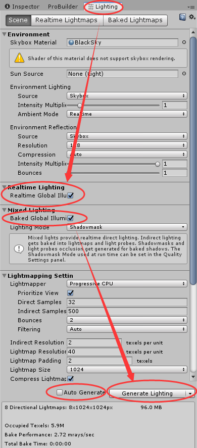

等待一段时间直到烘培完成（烘培时间取决于计算机硬件性能）。减小Lightmapping Settiing > Lightmap Size的大小可以稍微加快烘培速度（此处我设置为256）。

烘焙好照明后，我们给关卡添加Reflection Probe（Hierarchy窗口 > Create > Light > Reflection Probe）。

调节大小至包围（捕获）地形如图：

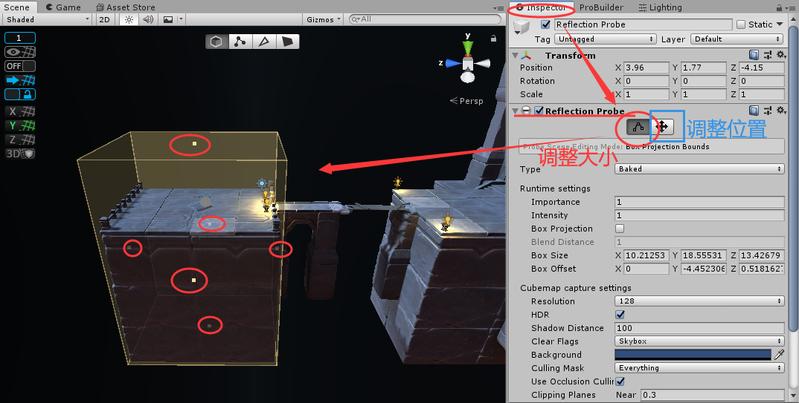

通过快捷键Ctrl+D快速复制粘贴一份，然后拖动包围旁边的桥（Reflection Probe之间重叠也没关系）

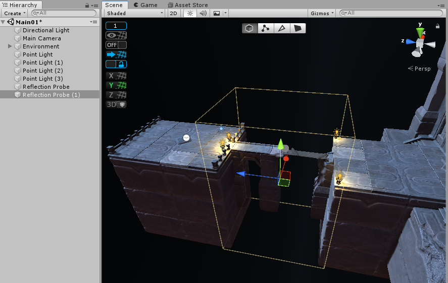

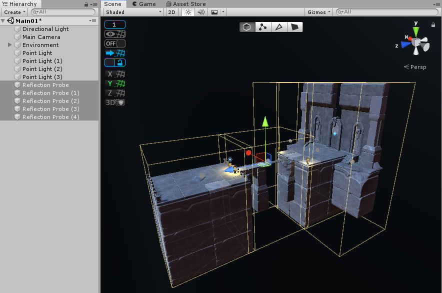

然后再Lighting窗口 > Other Setting > Generate Light下三角 > Bake Reflection Probes。烘焙Reflection Probes完成后地形的部分阴影会稍微变淡。

# 七、粒子系统

创建粒子系统：Hierarchy > Create > Effects > Particle System

详细调节：

Inspector > Particle System > Particle System

Duration: 1.50

Looping: ✔

Prewarm: ✔

Start Lifetime 点击右边小三角 > Random Between Two Constants

Start Lifetime: 10, 15 

Start Speed: 0.1, 0.5（Random Between Two Constants）

Start Size: 20, 30（Random Between Two Constants）

Start Rotation: 0, 360（Random Between Two Constants）

Start Color: 深蓝色

 Max Particles: 100

点击Particle System可最小化，这时可以看到Emission, Shape等其他可调节项目。

Emssion:✔

Rate over Time: 30

Rate over Distance: 0

Shape:✔

Shape: Box

Emit from: Volume

Scale: X=125, Y=75, Z=10 设置好后调整粒子系统再场景中的位置使其笼罩整个地形

Color over Lifetime:✔

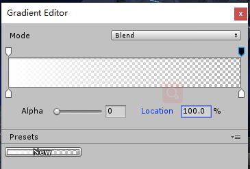

Color: Alpha=0, Location 100.0%

如果没有显示Alpha则，拖动一下第一排标尺。

Size over Lifetime:✔

Size：先将起点拖动到0.800，然后起点旁边的白点稍微往上拉一点。

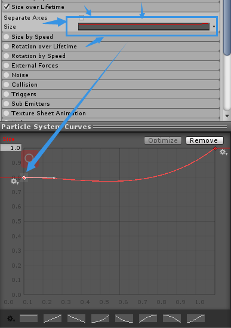

点击曲线的另一端（红点），这时旁边出现一个白点，向上拉动，使红色曲线接近直线。

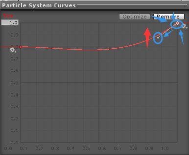

Rotation over Lifetime: ✔

Angular Veclocity: -5, 5 (Random Between Two Constants)

Render: ✔

Normal Direction: 0.7

Assets/Materials下新建一个材质，取名GlobalFag，其Shader改成Legacy/Shaders/Particle/Additive(Soft)。

再Assets/Texture下导入Unity Fundamentals Source Assets\Level Assets\VFX下的ParticleCloudWhite.png，然后给GlobalFag的Texture选择ParticleCloudWhite。

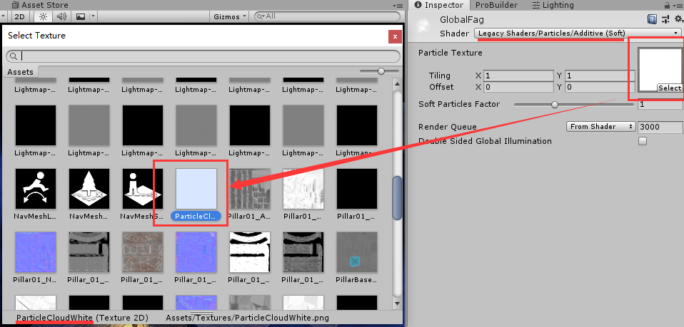

回到Particle System，Renderer > Material选择GlobalFag。

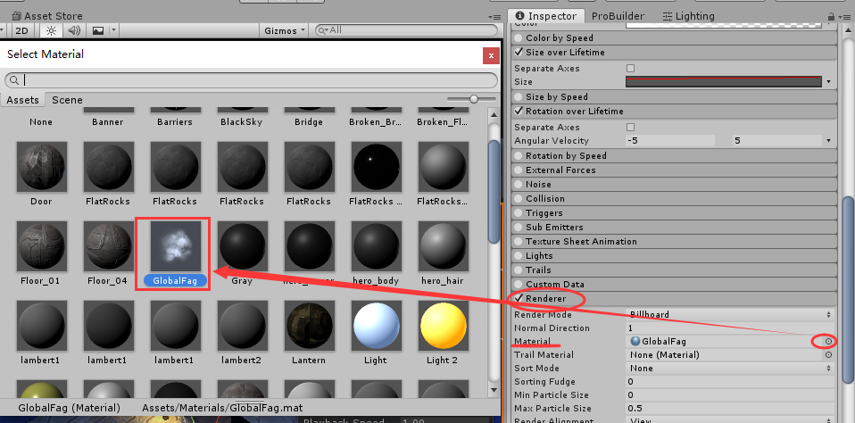

然后回到Lighting窗口点击Generate Lighting

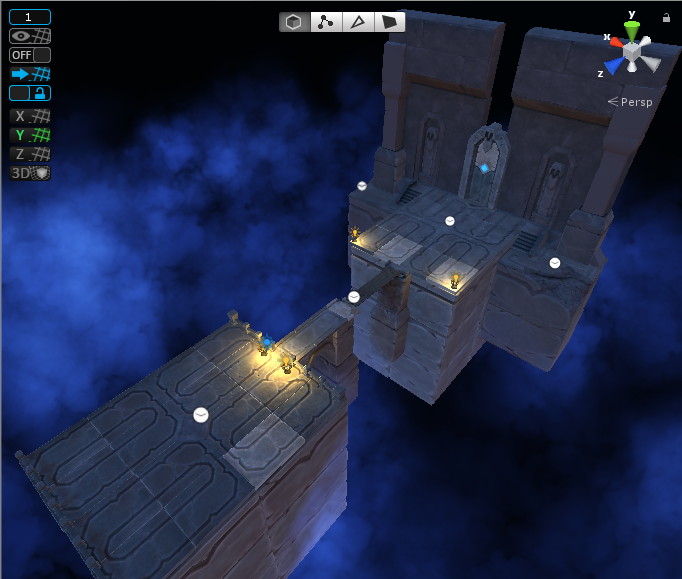

# 八、创造光条纹

Hierarchy > Create > Effects > Line

Line > Inspector > Line Render > Cast Shadows改为Off。

再Assets/Material下新建材质，命名为Streak。

Streak > Inspector > Shader改为Legacy Shaders/Particles/Additive

Particle Texture选择Default-Particle

Line > Inspector > Line Renderer > Positions > Index 1 Z=25, 拖拽Width到10

修改颜色成由黑过渡到蓝

Line Renderer > Materials > Element 0改成Streak

给Line添加Light组件，并且将Light > Type改成Spot

Light > Range设置为20，Color设置为浅蓝色，Intensity设置为接近接近20（这里设置为18.23），Cookie选择ParticleCloudWhite，Shadow Type设置为Hard Shadows

点击Cookie旁边的ParticleCloudWhite，再Assets/Textures找到ParticleCloudWhite，将其Advanced > Wrap Mode改为Clamp

调整角度，使光照射再门上：

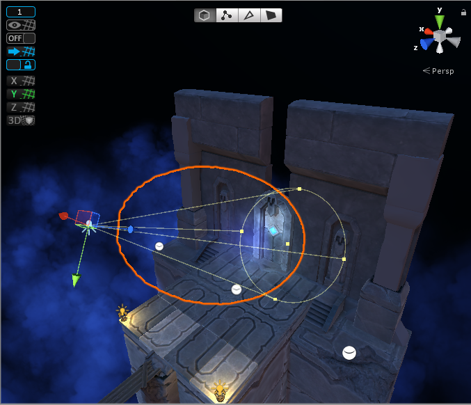

给Line改名为Moonlight，保存到Assets/Prefabs/VFX下（拖拽过去）。我们还可以给场景其他地方添加Moonlight:

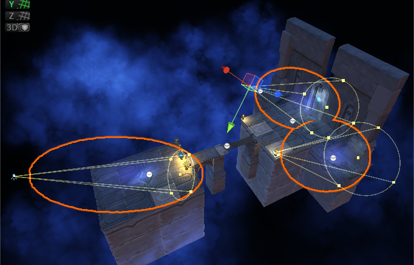

# 九、创建环境音乐

在场景中新建一个空Game Object，取名AudioManager，为其添加组件Audio Source。

在Assets文件夹下新建一个Audio文件夹，向里边导入Unity Fundamentals Source Assets\Audio下的两个音频文件：ForestNight Amb Lp.wav、Torch Lp.wav

选中AudioManager，将ForestNight Amb Lp.wav添加到Audio Source组件 > AudioClip，勾选Loop，稍微降低Volume（音量）。

播放游戏，可以听到环境音乐。

# 十、后期处理

打开Unity菜单栏Window > Package Manager，安装Post Processing插件。

在Hierarchy窗口新建一个空Game Object，命名为PostProcessing，为其添加组件Post Process Volume(Script)，勾选其属性Is Global（这个属性可以影响游戏整个画面），点击Profile旁边的New创建新的Profile。

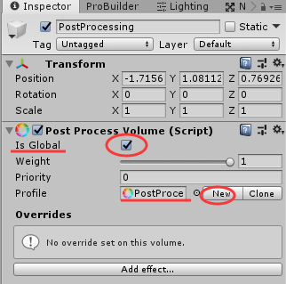

给Main Camera添加组件Post Processing Layer(Script)，属性Anti-aliasing > Mode设置为Fast Approximate Anti-aliasing(FXAA)。Main Camera的Layer设置为PostProcessing。

选中PostProcessing，Layer设置为PostProcessing，在其Post Processing Volume(Script)组件下点击Add effect > Unity > Vignette。展开Vignette，点击All勾选下方全部属性。从Game窗口观察游戏场景，当我们调解Vignette > Intensity时，可以产生让我们的目光聚集在画面中央的效果。

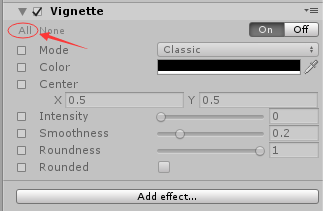

点击Add effect按钮添加Unity > Bloom，勾选其下方所有属性，观察Game画面适当调解Intensity。

点击Add effect按钮添加Unity > Chromatic Aberration，勾选其下方所有属性，观察Game画面适当调解Intensity。

点击Add effect按钮添加Unity > Color Grading，勾选其下方所有属性，观察Game画面适当调解Trackball以改变画面色调。

我们还可以添加Unity > Grain，继续调解画面，这些后期处理可以改善游戏画面，但也会消耗计算机性能，移动端或低配PC不建议过多调节。
