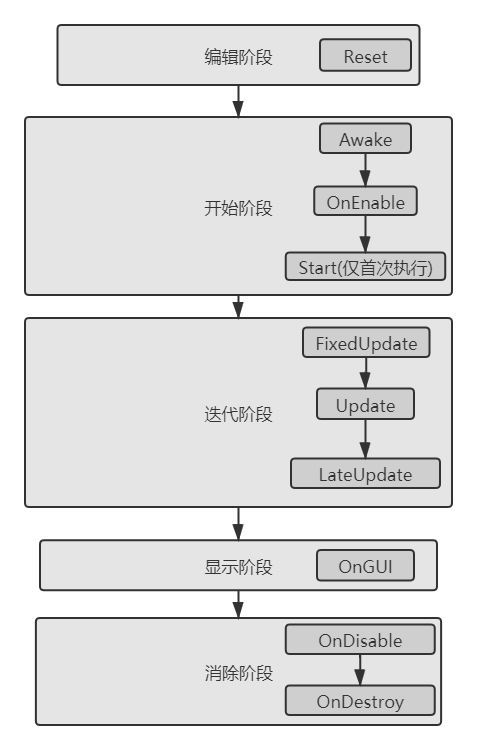

# Unity脚本生命周期
date: 2020-08-24 08:06:14

Unity中定义了十个重要的事件函数，按照执行的先后次序依次为以下内容：

<!--more-->

1. Reset：重置函数。编辑脚本期间当脚本赋值给游戏对象时触发，仅执行一次。
2. Awake：唤醒函数，最先执行的事件函数，用于优先级最高的事件处理，仅执行一次。
3. OnEnable：启用函数，当脚本启用的时候触发，随着脚本的不断启用与禁用可以执行多次。
4. Start：开始函数，一般用于给脚本字段赋初始值使用，仅执行一次。
5. FixedUpdate：固定更新函数，以默认0.02s的时钟频率执行，常用于物理学模拟中处理刚体的移动等，每秒执行多次。
6. Update：更新函数，执行的频率不固定。与计算机当前性能消耗成反比，常用于逻辑计算，每秒执行多次。
7. LateUpdate：后更新函数，在其余两个更新函数之后运行，常用于摄像机的控制情形中，每秒执行多次。
8. OnGUI：图形绘制函数，绘制系统UI界面，每秒执行多次。
9. OnDisable：脚本禁用函数，当脚本禁用的时候触发。随着脚本的不断启用于禁用可以执行多次。
10. OnDestroy：销毁函数，本脚本所属游戏对象销毁的时候执行脚本，仅执行一次。

