# Unity动画系统
date: 2020-04-24 21:47:19

创建一个项目AnimationDemo，导入资源包Assets.unitypackage和Mking.unitypackage，进入Assets/Fantasy Forest Environment Free Sample/Scenes下的demoScene_free场景，将Hierarchy里的LowPoly_Cyc(1)、LowPoly_Cyc(2)、LowPoly_Cyc(3)删掉，保存场景。在LowPoly_Cyc的Inspector视窗里单击Animator|Avatar：modelAvatar，然后选中modelAvatar对应的model。

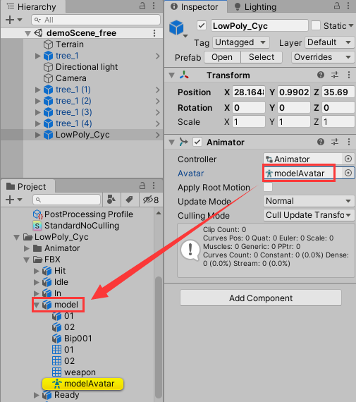

model里还没有添加上动画，我们再看看model下方的Ready。


点击Inspector下方的播放小按钮，可以预览动画剪辑Ready，我们也可以添加动画剪辑，点击加号新增一个Take 001，然后设置起始时间和结束时间即可。


接下来我们右键Hierarchy下的LowPoly_Cyc，点击Unpack Prefab取消预制体，再将LowPoly_Cyc的Animator组件移除掉。下边将从零讲解Unity动画的添加与设置

# 一、动画的播放控制

我们在Assets文件夹下新建一个Animator文件夹，在其中创建一个Animator Controller(动画控制器)，重命名为enemyAnimator，双击打开。然后将Assets/LowPoly_Cyc/FBX/Ready下的动画剪辑Ready拖拽到Animator视窗。同理，将动画剪辑Run、skill1、skill2、skill3、Stun也拖拽进来。


在Animtor窗口里，选中AnyState右键选择Make Transition（创建过渡），再点击添加进来的动画剪辑，进行连接。

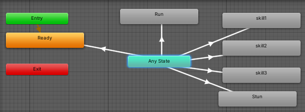

接着我们在右边的Parameters视窗设置过渡条件。

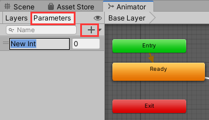

过渡条件有Float、Int、Bool、Trigger。我们先添加一个Int类型过渡条件，命名为id。选中AnyState到Run之间的过渡条件箭头，在其Inspector|Conditions修改条件为“id Equals 1”。


同理，将AnyState到skill1、skill2、skill3、Stun的条件分别设置为"id Equals 0、2、3、4、5"。

将Settings|Can Transition To（可以过渡到自己）取消勾选

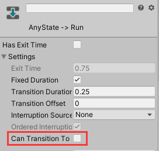

给LowPoly_Cyc添加一个Animator（动画器）组件，将Assets/LowPoly_Cyc/FBX/model下的modelAvatar添加到Animator|Avatar

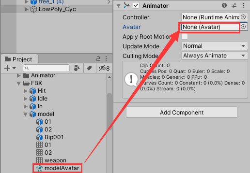

将Assets/Animator/enemyAnimator拖拽到Animator|Controller

然后创建一个脚本文件AnimatorMgr.cs

```c#
using System.Collections;
using System.Collections.Generic;
using UnityEngine;

public class AnimatorMgr : MonoBehaviour
{
    Animator anim;
    // Start is called before the first frame update
    void Start()
    {
        anim = transform.GetComponent<Animator>();
    }
    // Update is called once per frame
    void Update()
    {
        if (Input.GetKeyDown(KeyCode.Alpha0))
        {
            anim.SetInteger("id", 0);
        }
        else if (Input.GetKeyDown(KeyCode.Alpha1))
        {
            anim.SetInteger("id", 1);
        }
        else if (Input.GetKeyDown(KeyCode.Alpha2))
        {
            anim.SetInteger("id", 2);
        }
        else if (Input.GetKeyDown(KeyCode.Alpha3))
        {
            anim.SetInteger("id", 3);
        }
        else if (Input.GetKeyDown(KeyCode.Alpha4))
        {
            anim.SetInteger("id", 4);
        }
        else if (Input.GetKeyDown(KeyCode.Alpha5))
        {
            anim.SetInteger("id", 5);
        }
    }
}
```

将AnimatorMgr.cs作为组件添加到LowPoly_Cyc。

播放游戏，角色先进入Ready动画状态，然后按1进入Run状态，按2进入skill1状态，按3进入skill2状态，按4进入skill3状态，按5进入Stun状态。

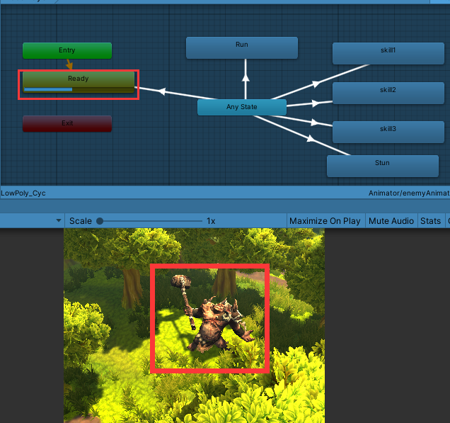

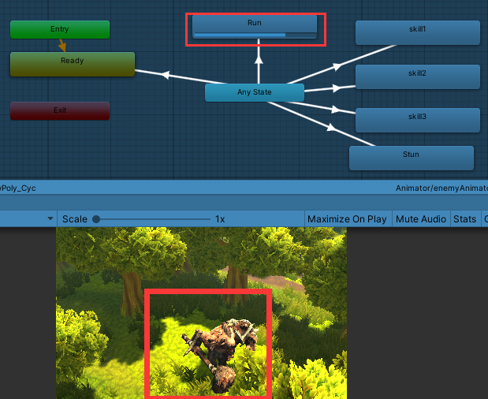

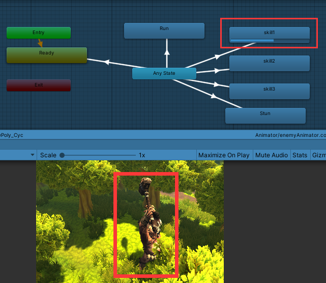

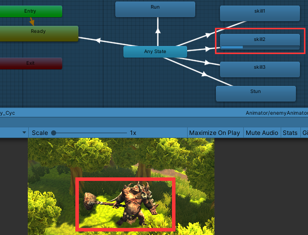

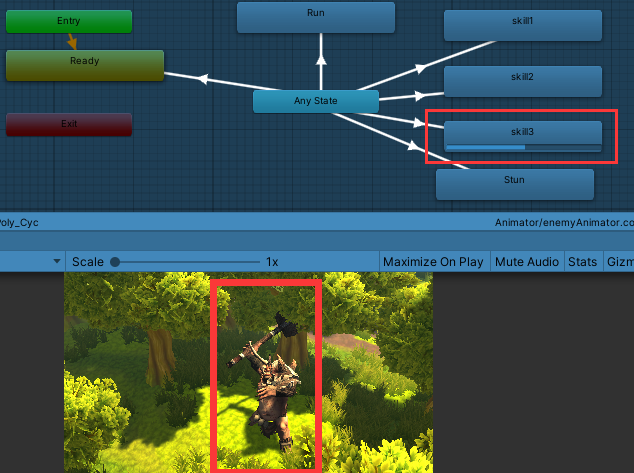


要想动画循环播放，双击Animator窗口中要循环的动画状态（例如Ready），在项目窗口对应的文件会被选中，在Inspector视窗勾选Loop Time（循环时间），点击Apply即可。


# 二、人形动画

- 动画的复用

在Assets/asobi_chan_b/Assets/Meshes下有一个人型模型asobi_chan_b，在它下边只有两个动画Take001和Take002。

我们将asobi_chan_b拖拽进场景中，在Inspector取消勾选Animator|Apply Root Motion，因为根运动（Root Motion）用于动画控制，它可以使角色在场景中随着动画跑动。

然后选中Assets/Animator下的enemyAnimator，按Ctrl+D拷贝一份，重命名为PlayerAnimator，拖拽添加到场景中的asobi_chan_b的Animator|Controller。

双击打开PlayerAnimator，在Animator窗口中选中Ready，将Assets/asobi_chan_b/Assets/Meshs/asobi_chan_b/Take 001拖拽到Motion，将Take 002拖拽到Run的Motion。


在Assets/Mking/mAnimation下还有一个人形动画模型@MK_attackWhirl，我们可以将它的攻击动画复用到asobi_chan_b上。于是选中PlayerAnimtor中的skill1状态，将Assets/Mking/mAnimation/@MK_attackWhirl/MK_attackWhirl拖拽到Motion。同样地，将MK_blockAttack拖拽到skill2的Motion，将MK_stabJumpFward拖拽到skill3的Motion，将MK_hitFfront拖拽到Stun的Motion，


复制LowPoly_Cyc的脚本组件，添加到asobi_chan_b中


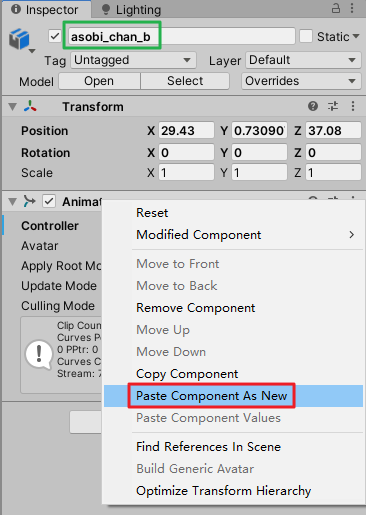

选中项目窗口里的asobi_chan_b，在Animation选项卡下，选中Take 002，然后勾选下方的Loop Time。

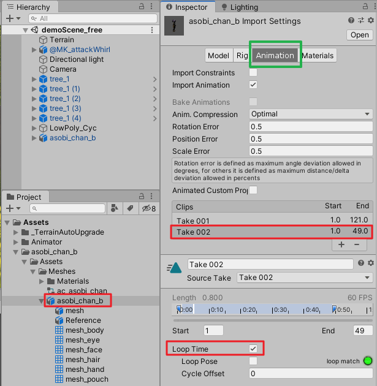

保存后播放游戏，角色开始处于闲置状态，当按下1时，开始跑动。

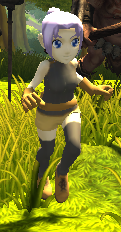

当按下2时，开始执行attackWhirl。

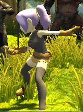

当按下3时，开始执行blockAttack。


当按下4时，开始执行stabJumpFward。


当按下5时，开始执行hitFfront。

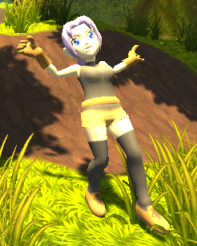

# 三、动画遮罩

- 屏蔽某个部位的运动

在项目窗口右键新建|Avatar Mask，重名名为EnemyAvatar，拷贝一份后再重命名为PlayerAvatar。

选中EnemyAvatar，将Assets/LowPoly_Cyc/FBX/model/modelAvatar拖拽到EnemyAvatar的Transform|Use skeleton from，点击Import skeleton。

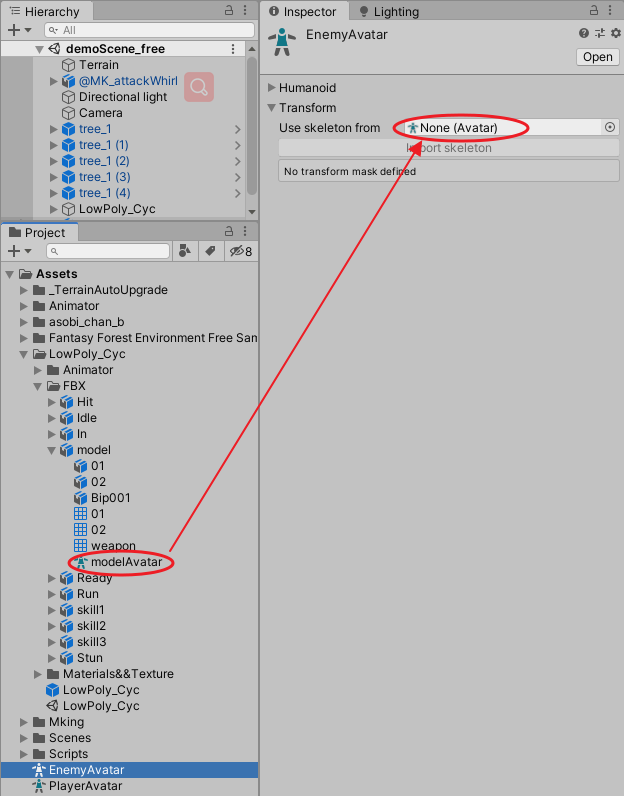

打开EnemyAnimator，点击Base Layer右边的小齿轮，点击Mask，选择EnemyAvatar。

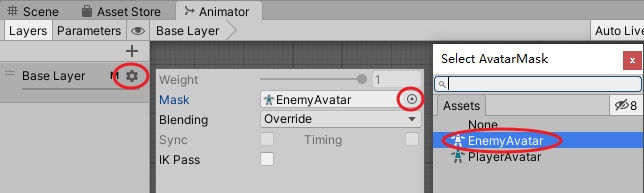

回到EnemyAvatar的Inspector窗口，取消勾选角色的下半身节点，播放游戏，角色无论做哪些动画都是下半身僵直的。

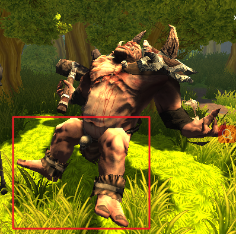

接下来对人形动画使用遮罩，我们先在PlayerAnimator创建一个Run动画层，然后在其中添加一个Run状态，在其Motion附上动画剪辑Run。从Any State到Run建立一个转变关系，转变条件设为id值等于1，同时将Base Layer里的Any State到Run的条件改为id等于1000。拷贝一个PlayerAvatar，名为PlayerAvatar 1，设置PlayerAvatar如下：


设置PlayerAvatar 1如下：

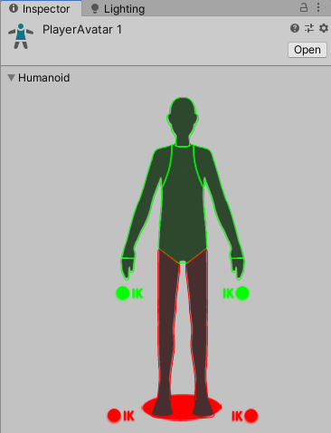

将PlayerAvatar 1应用到Base Layer，将PlayerAvatar应用到Run，并设置Run的Weight为1。

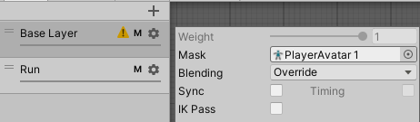


点击播放游戏，角色会立刻开始奔跑，当我们按2时，角色下半身保持奔跑，上半身做攻击动作。


# 四、分层控制和退出控制


# 五、动画事件