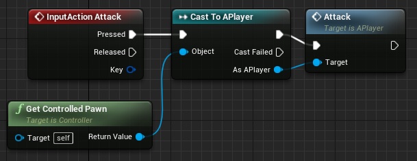
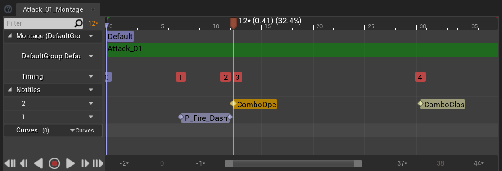
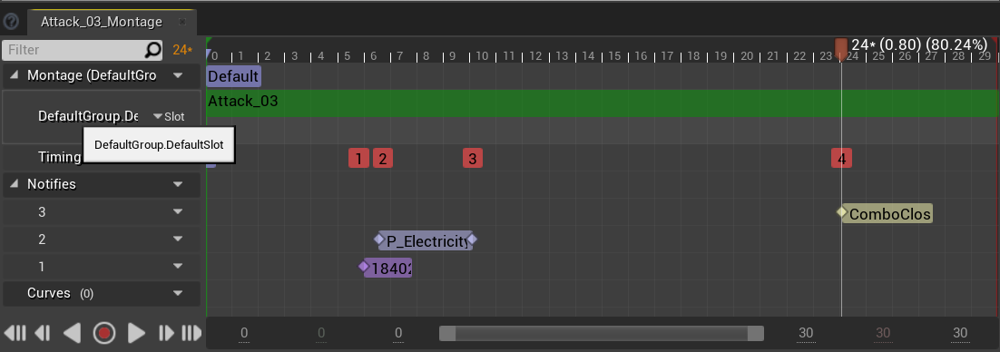
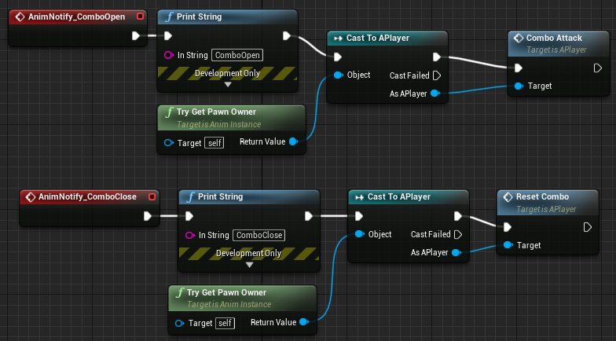
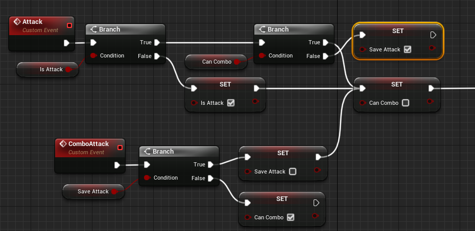

# UE4简单连招的实现

## 角色控制器蓝图设置

提前在项目设置里设置攻击键（Attack），在按下时调用角色蓝图的攻击函数Attack（在角色蓝图里添加自定义事件Attack）。

## 蒙太奇设置

前两个攻击动作在**开始收招**和**快要结束收招**的事件点分别添加**允许连招通知事件**（ComboOpen）和**禁止并重置连招通知事件**（ComboClose）

最后一个动作**快要结束收招**的时间点设置ComboClose来**重置连招**

## 角色动画蓝图设置

需要提前在蒙太奇里设置通知事件ComboOpen和ComboClose，以及在角色蓝图里设置自定义事件ComboAttack和ResetCombo。

ComboOpen调用ComboAttack以便开启允许连招，ComboClose调用ResetCombo以便关闭允许连招和重置连招。

## 角色蓝图设置

### 主动攻击事件和允许连招事件

提前设置布尔类型变量IsAttack，默认值为false。设置布尔类型变量CanCombo，默认值为false。(可选：设置布尔类型变量SaveAttack，默认值为false。)

**按下攻击后（Attack事件**），判断当前是否处于攻击中，如果没有，则执行连招部分。执行前吧IsAttack设置为true，因为刚开始播放，还没有播放到允许连招的片段，所以先不允许连招（设置CanCombo为false）。

如果按下攻击后当前还处于攻击中，则判断以下是否允许连招，如果允许，这执行连招部分，并先把CanCombo置为false，理由同上。

如果按下攻击后不允许连招，则说明下一个连招的输入提前了，如果是为了游戏的连贯或者说操作友好度，可以把这个多出来的输入存起来（SaveAttack置为true）。

如果触发了**允许连招事件（ComboAttack事件）**，（可选：先判断是否有上一个招式的多余输入，如果有，直接执行连招部分，执行前先把SaveAttack重置为false，如果没有多余的输入，）将标志量CanCombo置为true。

### 重置连招事件

重置连招的次数，是否正在攻击，是否有保存的多余输入，是否允许连招

### 每一次连招要执行的蓝图：

提前设置**当前连招动作的索引**（ComboIndex，整型，默认值0），设置蒙太奇列表类型变量，并配置好蒙太奇。

获取当前要播放的连招动作的索引（第几个连招动作，从0开始数）。

如果索引小于动作列表的长度则按索引取蒙太奇列表里的动作，否则重置为0。

执行播放以后索引加1。

判断加1后的索引是否超过蒙太奇列表的取值范围，如果超过置为0。

