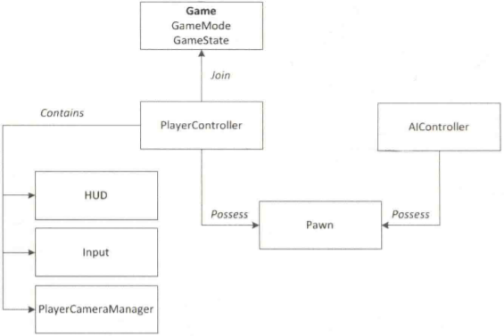

# UE4的Gameplay框架

[TOC]

## Game Mode

GameMode定义关卡的游戏规则以及获胜条件。它金存在于服务器上。GameMode一般再游戏工程中不会由太多数据改变，并且它一定不应该具有客户端需要的临时数据。

### Game Mode Base类

GameMode基类定义了游戏的基本规则

GameMode是玩法框架中的蓝图最顶层

## Game State

GameState和GameMode配合使用。

GameState记录着游戏的状态信息，包括关联玩家的列表、分数、象棋游戏中棋子位置或者开放世界游戏中已经完成的任务列表。GameState存在于服务器和所有客户端上，可以自由进行复制来保持同步。客户端可以请求GameState关于游戏的当前状态。服务端可以修改游戏的当前状态，并发给所有客户端。

### Game State Base类

## Player State

PlayerState是游戏中的一个参与者的状态。作为游戏一部分存在的AI没有PlayerState。PlayerState中适合包含的实例数据有：玩家昵称、分数，像多人在线竞技场这样的比赛中的级别，或者再夺旗游戏中玩家当前是否占领旗帜。所有玩家的PlayerState再所有机器上都存在（和PlayerController不同），并且可以自由地进行复制来保持同步。

PlayerState是每个玩家的可以访问的一个Actor。在单人游戏里只存在一个PlayerState，在多人游戏里，每个玩家都有自己的一个playerstate。

客户端和服务器都可以发现所有玩家的PlayerState。

PlayerState可以通过`GameState`类访问。

## 架构中类的关系

下图解释了这些了核心游戏类之间的关系：

一个游戏由GameMode和GameState构成。加入游戏的玩家同PlayerController关联。这些PlayerController允许玩家再游戏中占有pawn，以便它们再游戏中由物理表示。

PlayerController为玩家提供输入控制，HUD以及处理相机视图的PlayerCameraManager。

## Game Instance

当游戏启动的时候，GameInstance就成功创建了。只要游戏还在运行，GameInstance就一直存在。GameInstance贯穿游戏的始终。

GameInstance适合放置独立于关卡的数据，例如主界面UI的数据。

GameInstance可以在不同关卡之间传递消息。例如，玩家在某个关卡里打赢了一个挑战，可以将具体的信息存在GameInstance里。当玩家来到主界面的时候可以看到屏幕上显示的挑战项已被完成。

GameInstance是UObject的子类，不可被复制。存在于服务端和客户端。服务端或客户端除了自身，不会发现其他的GameInstance。

GameInstance用过Project Settings | Maps &Modes | Game Instance class进行设置。

## Actor类

Actor类是所有可以在游戏世界中放置和生成的对象的基类。

Actor支持对象的位置、角度、缩放的变换

Actor可以挂载任意数量的Actor组件类，这些Actor组件类定义了这个Actor是如何移动和被渲染的。

Actor默认没有任何可视化的表现形式，它的表现形式取决于挂在上边的组件。

Actor支持复用和函数调用。

生命周期

## Pawn类

Pawn是Actord的子类。它是玩家或AI实体再游戏世界中的物理象征。Pawn决定玩家或AI实体的外边，还决定再其再冲突和其他物理互动方面的交互方式。

Pawn由Controller控制，可以是PlayerController也可以是AIController。

pawn即使默认没有视觉表现，也能在游戏世界里表示自身的位置，角度，缩放等。

pawn可以由自己的动作逻辑，但最好由Controller来控制。

默认情况下，Controller和Pawn之间是一对一关系。在游戏过程中生成的Pawn不会被Controller自动控制。

在蓝图中，使用`SetActorLocation`是增加Pawn派生类运动的最佳方式。

### 默认Pawn

DefaultPawn类是Pawn的子类，附带额外功能。比如本地DefaultPawnMovementComponent、球形CollisionComponent和StaticMeshComponent。

DefaultPawnMovementComponent的运动风格默认为无重力运动。除了MovementComponent变量外，它还包括MaxSpeed、Acceleration和Deceleration浮点值。这三个白能量可在DefaultPawn派生的蓝图类中访问。

### 观众类

SpectatorPawn类是DefaultPawn的子类。

## Character类

Character是Pawn的子类，在Pawn的基础上进行了很多拓展，比如可以移动、有碰撞。

Character的视觉表现支持动画的骨骼网格体。

Character自带胶囊体组件，并以此模拟物理碰撞。

CharacterMovement组件，具有丰富的操控角色的功能，包括：走、跑、条、游、飞等。而且这个组件是Charactor特有的，区别于其他的class。

Character具有网络功能。

Character是操作两足类长相的角色的首选class。

当我们进入到一个创建的Charactor蓝图里，会看到如下组件：

- 胶囊体组件（CapsuleComponent）：这是actor的根部组件。它负责处理物理碰撞。CharacterMovement按照玩家输入，使胶囊体进行移动等活动。
- 箭头组件（ArrowComponent）：这是一个editor-only组件，它指明了角色的朝向。
- 网格体组件（Mesh）：Mesh是角色的视觉表现，并且属于骨骼网格体组件类型。
- 角色动作组件（CharacterMovement）：这个组件处理角色的动作逻辑。更新胶囊体的位置和转向，使其可以移动。

## Player Controller

PlayerController是Controller的子类。由玩家输入来控制Pawn，相应的，AIController由人工智能控制。

可以用一个PlayerController代表一个玩家。

默认情况下，一个Controller可以在任何时候通过调用`Possess()`函数控制一个Pawn。通过调用`UnPosses()`函数来停止控制。Controller也可以接收来自正在控制的Pawn的通知。

在网游里，服务端可以发现所有的客户端的controller，客户端只能发现自身的controller。

## 蓝图

UE特有的一种图形化编程工具。

## 关卡蓝图

关卡蓝图是特殊的蓝图，每一个关卡绑定一个关卡蓝图。关卡蓝图不能添加组件，只能进行图表操作。关卡蓝图不能复用。开发者可以在关卡蓝图中引用场景中的物体。

## 蓝图类

类似Unity的预制体。包含了很多组件和功能（代码），可以复用，放到场景中相当于实例化。

## 例子

如果你在写一个大逃杀类游戏，你可以使用以下类：

- `Game Mode`：这个类定义游戏规则。在这个类里，你可以记录每一局的玩家参与数、追踪没被淘汰的玩家的数量、被淘汰的玩家数量和，中途退游的玩家数。除此之外，这个类还可以记录游戏中的载具、局数等。
- `Game State`：这个类记录所有的游戏状态。例如当游戏从等待开始进入正式开始，GameState接收到这一状态转变后通知所有的客户端，游戏正式开始。
- `Game Instance`：这个类用于存储游戏中的挑战完成等记录，以便玩家回到主界面的时候能看到。
- `Character`：所有角色的视觉表现。
- `Pawn`：游戏中的某辆载具或某只动物。
- `Player Controller`：这个类处理玩家输入，创建并管理UI。同时可以发送RPC（远程方法调用）到服务端。让服务端可以察觉到所有客户端的controller。
- `Player State`：这个类用于存储玩家的具体数据，例如：击杀数、子弹数等。

## Component

### ActorComponent

UActorComponent是基础于UObject的一个子类，这意味着其实Component也是有UObject的那些通用功能的。

### SceneComponent

SceneComponent提供了两大能力：一是Transform，二是SceneComponent的互相嵌套。

## UObject

UObject提供的功能：

1. 元数据（MetaData）
2. 反射（Reflection）
3. 垃圾回收（Garbage collection）
4. 序列化（Serialization）
5. 和UE编辑器的自动交互（Automatic editor integration）
6. 类默认对象（Class Default Object）
7. 引用自动更新（Reference updating）
8. 自动检测默认变量的更改（Automatic updating of default property changes）
9. 自动变量初始化（Automatic property initialization）
10. 运行时类型识别（Type information available at runtime）
9. 网络复制（Network replication）