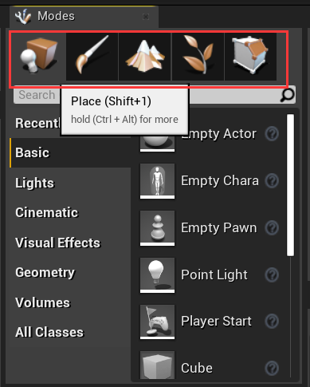
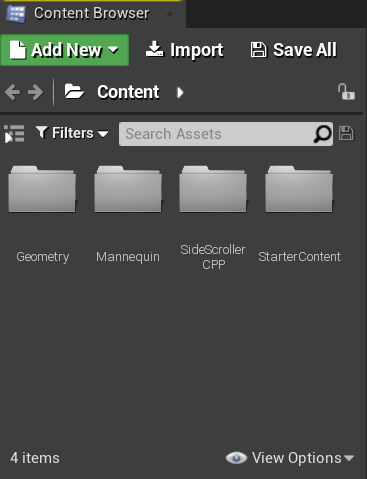
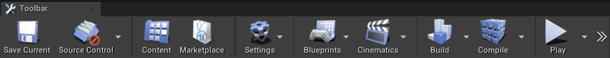
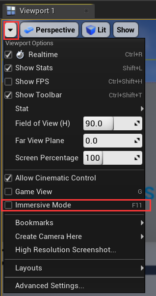
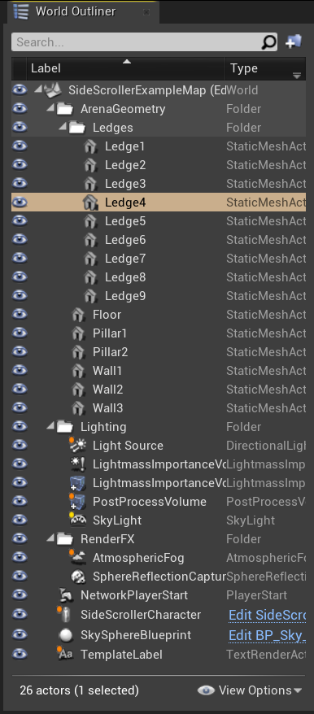
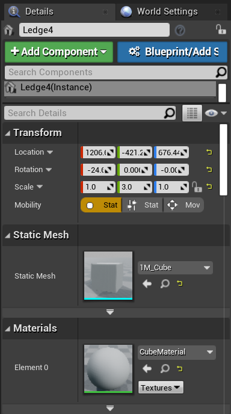

# UE4编辑器与项目结构

[TOC]

## UE4项目结构

- `Config`目录：存放编辑器设置或项目设置，你也可以创建自己的设置文件来保存数据。
- `Content`目录：存放游戏开发资源（美术资源，蓝图）
- `Intermediate`目录：编辑器和游戏临时文件在这里产生。临时文件可以放心删除，临时文件会在下一次启动编辑器时自动生成。
  - `Build`目录：中间文件，`.obj`和预编译头等
  - UHT预处理生成的`.generated/.cpp`文件
  - VS.vsxproj项目文件，可通过`.uproject`文件生成，编译生成的Shader文件。
  - `AssetRegistryCache`目录：Asset Registry系统的缓存文件，Asset Registry可以简单理解为一个索引了所有uasset资源头信息的注册表。CachedAssetRegistry.bin文件也是如此。

- `Saved`目录：存储自动保存文件，其他配置文件，日志文件，引擎崩溃日志，硬件信息，烘培信息数据等。gitignore

- `Binaries`目录：当你的项目包含C++源代码时会出现这个目录。存放项目的DLL文件，编译生成的结果二进制文件，该目录可以gitignore，反正每次都会生成。

- `DeriveDataCache`目录：这里存放着针对发布平台的资源的版本信息，比如一个图片，针对不同平台由不同的适合格式，这时候可以在不动原始uasset的基础上比较轻易的再生成不同格式资源版本，删除后会在编辑器下一次启动时再次生成，gitignore。

- `Source`目录：这个目录只在当你的项目包含C++源代码时出现。里边包含头文件（`.h`）和源文件（`.cpp`）。

- `Plugins`目录：这个目录包含项目里用到的所有插件。如果要创建新的插件，你的项目必须包含C++源代码。

## UE4编辑器

### 模式面板

位于左上方，用于切换编辑模式（快捷键（Shift + 1 到 5））。除了放置或移动3D模型这一模式外，还预备有生成风景的”地貌“模式、绘制风景及用于编辑3D模型的模式等。

- Place mode：给场景放置actor。
- Paint mode：允许你直接在viewport上绘制静态网格Actor。
- Landscape mode：新建或修改landscape。
- Foliage mode：绘制foliage。
- Brush mode：修改BSP(binary space partitioning)笔刷。这时一个几何工具，可以快速搭建关卡原型。

### 内容浏览器

你可以在这里导入、创建、查找、移动、删除游戏资源比如：蓝图、材质、序列。

### 工具栏

位于上方水平显示的一列图标。

- 保存：保存当前场景。
- Source Control：可以访问各种版本控制工具比如Perforce、Git、Subversion等。
- Content：打开内容浏览器。
- MarketPlace：打开UE4商店。
- Settings：可以快速访问一些编辑器设置、项目设置、世界设置。
- 蓝图：新建蓝图类或者打开关卡蓝图。
- Cinematics：添加关卡或者控制序列。
- Buid：搭建光照、导航、几何结构等。当游戏正在播放时无法Build。
- 播放游戏：播放当前关卡
- Launch：发布当前关卡到给定的设备上。

### 视口（Viewport）

在视口里，按快捷键**G**将在viewport里**切换游戏显示模式或编辑显示模式**。

在游戏播放时，在viewport按下**F11**可以**切换到窗口最大化**。

或者在游戏播放前，进行设置，如图：

#### 用鼠标操作视口

- 按住鼠标右键 + 键盘的WASD键
- 按住鼠标右键 ，前后左右拖拽，可以上下左右旋转相机的朝向，观看四周。
- 按住鼠标左键：
  - 前后拖动，可以前后移动显示位置
  - 左右拖动，可以进行左右旋转

- 按住鼠标中键/同时按住鼠标左右键，再拖拽，可以移动垂直方向的位置。前后拖动鼠标可以上下移动显示的位置，左右拖动鼠标可以左右平移。

#### 用键盘操作视口

前提：按住鼠标左键或右键：

- 前后左右移动：WASD、方向键、8462
- 上下移动：E/Q、9/7、PageUp/PageDown
- 缩放：C/Z、3/1

再选中物体后，通过快捷键 Ctrl + Shift + T可以切换viewport的工具栏的显示/隐藏。

### 世界大纲/场景大纲面板（World Outliner）

用于管理放置在编辑中的关卡的部件。

这里展示当前关卡中所有的正在显示的actor。通过点击眼睛图标可以快速隐藏或显示actor。

如果在视口中搜索物体时，加上减号比如`-table`可以过滤掉名字含有“table”的物体。

搜索加上加号比如`+table`将更精准的显示含有“table”的物体。

搜索的时候，将关键字用双引号括起来比如“lunch table”，将显示名字叫lunch table的物体。

### 细节面板

细节面板展示在场景中选中的actor信息和功能。

