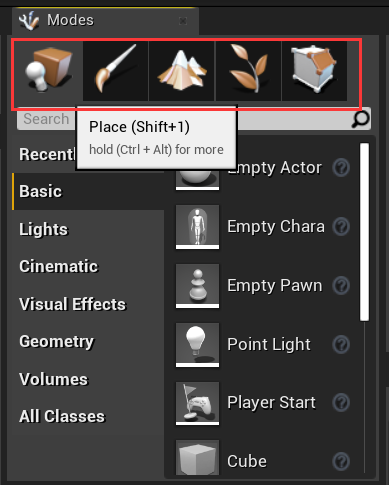

# UE4编辑器与项目结构

## UE4项目结构

`Config`目录：存放编辑器设置或项目设置，你也可以创建自己的设置文件来保存数据。

`Content`目录：存放游戏开发资源

`Intermediate`目录：编辑器和游戏临时文件在这里产生。临时文件可以放心删除，临时文件会在下一次启动编辑器时自动生成。

`Saved`目录：存放自动生成的设置文件、日志文件、自动保存文件。

`Binaries`目录：当你的项目包含C++源代码时会出现这个目录。存放项目的DLL文件。

`DeriveDataCache`目录：这里包含目标平台的资源的版本信息，删除后会在编辑器下一次启动时再次生成。

`Source`目录：这个目录只在当你的项目包含C++源代码时出现。里边包含头文件（`.h`）和源文件（`.cpp`）。

`Plugins`目录：这个目录包含项目里用到的所有插件。如果要创建新的插件，你的项目必须包含C++源代码。

## UE4编辑器

默认布局：

**工具栏**：

你可以在这里保存当前场景、打开内容浏览器、访问快速设置、搭建光照、播放游戏等。

**模组面板**：

你可以在这里切换各种模组，比如放置Actors模组（默认模组），Mesh Paint模组等。

**内容浏览器**：

你可以在这里导入和创建所有的游戏资源。

**细节面板**：

你可以在这里修改关卡里选中的actor的属性。

**World Outliner**：

这里展示当前关卡中所有的正在显示的actor。通过点击眼睛图标可以快速隐藏或显示actor。

### 工具栏

- 保存：保存当前场景。
- Source Control：可以访问各种版本控制工具比如Perforce、Git、Subversion等。
- Content：打开内容浏览器。
- MarketPlace：打开UE4商店。
- Settings：可以快速访问一些编辑器设置、项目设置、世界设置。
- 蓝图：新建蓝图类或者打开关卡蓝图。
- Cinematics：添加关卡或者控制序列。
- Buid：搭建光照、导航、几何结构等。当游戏正在播放时无法Build。
- 播放游戏：播放当前关卡
- Launch：发布当前关卡到给定的设备上。

### 模组面板

模组面板可以切换各种不同的工具模式，快捷键（Shift + 1 到 5）。

- Place mode：给场景放置actor。
- Paint mode：允许你直接在viewport上绘制静态网格Actor。
- Landscape mode：新建或修改landscape。
- Foliage mode：绘制foliage。
- Brush mode：修改BSP(binary space partitioning)笔刷。这时一个几何工具，可以快速搭建关卡原型。

### 内容浏览器

你可以在这里导入和创建游戏资源比如：蓝图、材质、序列。

### 细节面板

细节面板展示在场景中选中的actor信息和功能。

### World Outliner

搜索物体时，加上减号比如`-table`可以过滤掉名字含有“table”的物体。

搜索加上加号比如`+table`将更精准的显示含有“table”的物体。

搜索的时候，将关键字用双引号括起来比如“lunch table”，将显示名字叫lunch table的物体。

### Viewport

在Viewport里，按快捷键**G**将在viewport里**切换游戏显示模式或编辑显示模式**。

在游戏播放时，在viewport按下**F11**可以**切换到窗口最大化**。

或者在游戏播放前，进行设置，如图：

以下操作时关于如何在viewport里游览：

- 按住鼠标右键 + 键盘的WASD键
- 按住鼠标右键 + 移动鼠标，可以观看四周。
- 按住鼠标左键 + 移动鼠标
- 按住鼠标中键 + 移动鼠标，可以实现视野平移。

再选中物体后，通过快捷键 Ctrl + Shift + T可以切换viewport的工具栏的显示/隐藏。