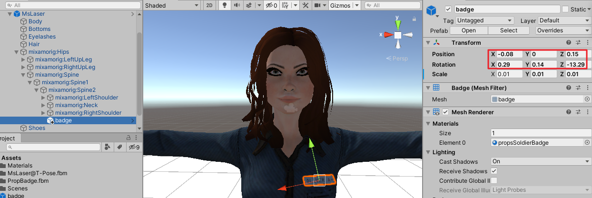
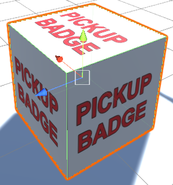
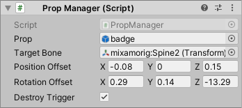
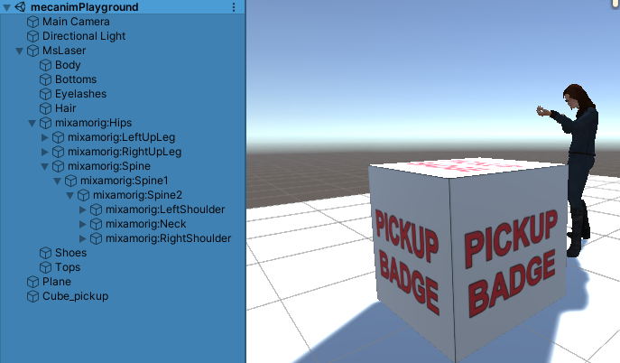
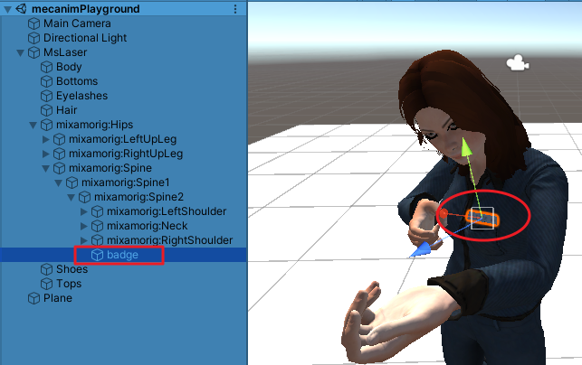

# 为动画角色添加刚性道具
date: 2020-06-22 15:44:16

**Unity 2018 Cookbook | Charpter 10 3D Animation | Adding rigid props to animated characters**

如果在建模和制作动画时没有为角色提供足够数量的道具，你可能需要让角色在游戏中收集新的道具。在本文中，我们将学习如何实例化一个GameObject，并将其分配给动画层次结构中的角色。

使用的资源链接：https://github.com/PacktPublishing/Unity-2018-Cookbook-Third-Edition/tree/master/Chapter10_3DAnimation/10_06_rigid_props

完成后项目资源链接：https://github.com/dr-matt-smith/unity-cookbook-2018-ch10-06-adding-rigid-props

# 一、提前确定道具在角色身上的位置

新建一个3D项目，导入Props.unitypackage和纹理texture_pickupBadge.png，打开场景mecanimPlayground。

将项目窗口中的badge拖拽到Hierarchy中。将badge拖拽到mixamorig:Spine2的子项（ MsLaser |mixamorig:Hips | mixamorig:Spine |mixamorig:Spine1 | mixamorig:Spine2 ）。

修改badge的Transform | Position为 ( -0.08, 0, 0.15 )，修改Rotation  ( 0.29, 0.14, -13.29 )，使之别在角色胸前。



记下Position和Rotation的值，然后从场景中删掉badge。

# 二、地上待捡道具

添加一个3D 正方体取名为Cube_pickup，将其Transform | Position设置为( 0, 0.5, 2 )，勾选其Box Collider组件的IsTrigger选项。

从项目窗口将纹理texture_pickupBadge.png拖拽到Cube_pickup上。



# 三、编写脚本

新建脚本PropManager.cs，将PropManager.cs拖拽到Cube_pickup，编写以下代码：

```c# PropManager.cs
using System;
using System.Collections;
using System.Collections.Generic;
using UnityEngine;

public class PropManager : MonoBehaviour
{
    public GameObject prop;
    public Transform targetBone;
    public Vector3 positionOffset;
    public Vector3 rotationOffset;
    public bool destroyTrigger = true;

    void OnTriggerEnter(Collider collision)
    {
        bool addPropCondition = targetBone.IsChildOf(collision.transform) & !AlreadyHasChilObject();

        if (addPropCondition)
            addProp();
    }

    private void addProp()
    {
        GameObject newprop;
        newprop = Instantiate(prop, targetBone.position, targetBone.rotation) as GameObject;
        newprop.name = prop.name;
        newprop.transform.parent = targetBone;
        newprop.transform.localPosition += positionOffset;
        newprop.transform.localEulerAngles += rotationOffset;

        if (destroyTrigger)
            Destroy(gameObject);
    }

    private bool AlreadyHasChilObject()
    {
        string propName = prop.name;
        foreach(Transform child in targetBone)
        {
            if (child.name == propName)
                return true;
        }
        return false;
    }
}
```

# 四、设置道具管理组件

保存脚本，回到Unity编辑器，给Cube_pickup|PropManager(Script)设置以下参数：

Prop : 预制体badge（从项目窗口里拖进来）

Target Bone : mixamorig:Spine2（Hierarchy下MsLaser的子项） 

Position Offset : ( -0.08, 0, 0.15 )

Rotation Offset : ( 0.29, 0.14, -13.29 )

Destroy Trigger : 勾选 ( true )



播放游戏，控制角色走向Cube_pickup，当角色触碰Cube_pickup时，Cube_pickup消失，角色胸前出现badge。





# 五、工作原理

当角色触发捡起道具时，脚本将配置的预制体实例化一个并附在配置好的角色骨骼上（Target Bone）以及骨骼相对位置上(Position Offset, Rotation Offset)。附上的道具将随着其父物体运动而运动。

AlreadyHasChildObject()方法用于检测是否已存在同名道具以避免角色身上多出一个。

# 六、拓展

创建一个相似的脚本来移除道具，在OnTriggerEnter方法里调用RemoveProp( )如下：

```c#
private void RemoveProp()
{
    string propName = prop.name;

    foreach(Transform child in targetBone)
    {
        if (child.name == propName)
            Destroy(child.gameObject);
    }
}
```

修改PropManager.cs如下：

```c# PropManager.cs
using System;
using System.Collections;
using System.Collections.Generic;
using UnityEngine;

public class PropManager : MonoBehaviour
{
    public GameObject prop;
    public Transform targetBone;
    public Vector3 positionOffset;
    public Vector3 rotationOffset;
    public bool destroyTrigger = false;
    public bool removePropCondition = false;

    void OnTriggerEnter(Collider collision)
    {
        bool addPropCondition = targetBone.IsChildOf(collision.transform) & !AlreadyHasChilObject();

        if (addPropCondition)
            addProp();
        
        if (removePropCondition)
            RemoveProp();
    }

    private void addProp()
    {
        GameObject newprop;
        newprop = Instantiate(prop, targetBone.position, targetBone.rotation) as GameObject;
        newprop.name = prop.name;
        newprop.transform.parent = targetBone;
        newprop.transform.localPosition += positionOffset;
        newprop.transform.localEulerAngles += rotationOffset;

        if (destroyTrigger)
            Destroy(gameObject);

    }

    private void RemoveProp()
    {
        string propName = prop.name;

        foreach(Transform child in targetBone)
        {
            if (child.name == propName)
                Destroy(child.gameObject);
        }
    }

    private bool AlreadyHasChilObject()
    {
        string propName = prop.name;
        foreach(Transform child in targetBone)
        {
            if (child.name == propName)
                return true;
        }
        return false;
    }
}
```

播放游戏控制角色碰撞Cube_pickup，角色胸前出现badge后，后退到原来位置，勾选Cube_pickup|PropManager（Script）|removePropCondition，再次碰撞Cube_pickup，角色胸前的badge消除。