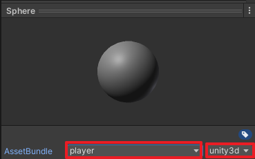
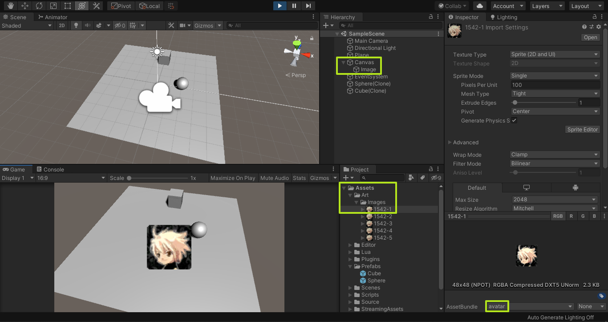

# AssetBundle与Unity热更新

[TOC]

**什么是AssetBundle?**

AssetBundle是一个归档文件，可以存储任意一种Unity能够识别的资源。

AssetBundle可以理解为一种以特殊的压缩方式来存储资源的文件格式。

它可以存储场景、模型、贴图、预制体、音效、材质等资源，也可以包含开发者自定义的二进制文件。

# AssetBundle的作用

1. 相对Resource下的资源，AB更方便管理资源：
   1. 首先，Resource文件夹下的资源无论是否会用到，都会被打包，而且是只读文件，只能以Resource.Load()的方式读取。
   2. AB包的存储位置可以自定义（可以通过网络下载可以存放本地），压缩方式可以自定义（LZMA、LZ4、不压缩、自定义包的大小），后期可以动态更新。
2. 减小包的文件大小
   1. 压缩资源
   2. 减小初始包大小
3. 热更新
   1. 资源热更新
   2. 脚本热更新


**热更新基本规则：**

客户端：自带很少的默认资源和资源对比文件

服务端：资源服务器带有资源对比文件和最新的各种AB包

第一步：获取资源服务器地址

第二步：通过资源对比文件，检测哪些要更新，哪些要下载，下载AB包。


# 生成AB包资源文件

1. Unity编辑器开发，**自己写打包工具**
2. 官方提供的打包工具：**Asset Bundle Browser**

**使用Asset Bundle Browser打包：**

从package manager或github下载安装，安装后从菜单栏|Window|AssetBundle Browser打开。

如何把资源关联到AB包里：

选中要关联的预制体，在Inpsector预览窗口底部修改AB包名，后缀默认为None（可多选将多个资源批量关联到一个Bundle名上）。

C#是编译语言，无法打包到AssetBundle里，但可以打包Lua脚本。被打包的预制体并没有把组件脚本打包，而是将预制体关联的代码的数据打包了

**Unity游戏热更新流程：**


**AssetBundle压缩格式：**

LZMA格式：包体积最小，用一个资源解压所有，解压缩时间较长

LZ4格式（推荐）：包体积较大，使用到才解压，解压缩的时间相对较短，内存占用低

不压缩：没有经过压缩的包体积最大，但解压速度最快

**打包AssetBundle生成的文件：**

1. AB包文件：资源文件
2. manifest文件：AB包文件信息，当加载时提供关键信息。资源信息，依赖关系，版本信息等
3. 关键AB包（和目录名一样的包）：主包、AB包依赖关键信息

**自定义打包AssetBundle的方法：**

1. 在Unity编辑器界面手动设置
2. 遍历所有要打包的资源，通过代码修改assetBundleName

**通过自己写的脚本打包AssetBundle例子：**

在场景中新建一个小球（Sphere），然后做成预制体，选中该预制体，在Inspector下方预览窗口底部，编辑assetsbundle名称和后缀名，点击下拉框，选择New再编辑即可：



在路径Assets/Editor下新建一个脚本CreateAssetBundles.cs：

```c# CreateAssetBundles.cs
using System.Collections;
using System.Collections.Generic;
using System.IO;
using UnityEditor;
using UnityEngine;

public class CreateAssetBundles
{
    [MenuItem("AssetBundle/Build AssetBundles")]
    static void BuildAllAssetBundles()
    {
        string streamPath = Application.streamingAssetsPath;
        if (Directory.Exists(streamPath))
        {
            Directory.Delete(streamPath);
        }
        Directory.CreateDirectory(streamPath);
        AssetDatabase.Refresh();

        BuildPipeline.BuildAssetBundles(streamPath, BuildAssetBundleOptions.None, BuildTarget.StandaloneWindows64);
    }
}
```

回到Unity编辑器，点击菜单栏|AssetsBundle|Build AssetsBundle

生成StreamingAssets文件夹，以及其中4个文件：StreamingAssets、player.unity3d、StreamingAssets.manifest、player.unity3d.manifest。

# 使用（加载）AssetBundle

**加载AssetsBundle的方法：**

1. 从内存中加载：LoadFromMemory
2. 从本地加载：LoadFromFile
3. 从本地或服务器加载WWW
4. 从服务器端加载UnityWebRequest

**加载依赖资源包：**

1. 获得总的依赖配置（StreamingAssets）
2. 根据名称找到目标加载资源的所有依赖
3. 加载所有依赖的资源

**本地同步加载AB包例子：**

在场景中新建一个Cube和一个Sphere，然后用AssetBundle Browser打包，编写ABTest.cs脚本并添加到Main Camera上。

```c# ABTest.cs
using System.Collections;
using System.Collections.Generic;
using UnityEngine;

public class ABTest : MonoBehaviour
{
    void Start()
    {
        //第一步 加载AB包，注意AB包不能够重复加载，否则报错，例如不能第二次加载model
        AssetBundle ab = AssetBundle.LoadFromFile(Application.streamingAssetsPath
            + "/" + "model");
        //第二步 加载AB包中的资源
        //只是用名字加载 会出现 同名不同类型资源 分不清
        //建议用泛型加载或type指定类型
        GameObject obj = ab.LoadAsset<GameObject>("Sphere");
        Instantiate(obj);//初始化
        GameObject obj2 = ab.LoadAsset("Cube",typeof(GameObject)) as GameObject;
        Instantiate(obj2);
    }
}
```

播放游戏，场景中将生成一个Sphere(Clone)和一个Cube(Clone)。

**本地异步加载AB包例子：**

z在上边同步加载例子的基础上，在场景中新建一个Image。项目素材加入几张图片，并应用为Sprite，然后标记AssetBundle为“avatar”并再打包一次。然后修改ABTest.cs脚本如下，保存后将场景中的Image拖拽到Main Camera|AB Test（Script）|Img。

```c# ABTest.cs
using System.Collections;
using System.Collections.Generic;
using UnityEngine;
using UnityEngine.UI;

public class ABTest : MonoBehaviour
{
    public Image img;

    void Start()
    {
        /*******同步加载*******/
        //第一步 加载 AB包
        AssetBundle ab = AssetBundle.LoadFromFile(Application.streamingAssetsPath
            + "/" + "model");
        //第二步 加载 AB包中的资源
        //只是用名字加载 会出现 同名不同类型资源 分不清
        //建议用泛型加载或type指定类型
        GameObject obj = ab.LoadAsset<GameObject>("Sphere");
        Instantiate(obj);
        GameObject obj2 = ab.LoadAsset("Cube",typeof(GameObject)) as GameObject;
        Instantiate(obj2);

        /*****异步加载、协程******/
        StartCoroutine(LoadABRes("avatar","1542-1"));
    }
    IEnumerator LoadABRes(string ABName,string resName)
    {
        //第一步 加载AB包
        AssetBundleCreateRequest abcr = AssetBundle.LoadFromFileAsync(Application.streamingAssetsPath
            + "/" + ABName);
        yield return abcr;
        //第二步 加载资源
        AssetBundleRequest abq = abcr.assetBundle.LoadAssetAsync(resName,typeof(Sprite));
        yield return abq;
        img.sprite = abq.asset as Sprite;
    }
}
```

播放游戏，场景中在Cube和Sphere都加载完后才加载了图片1542-1。



**AB包的卸载：**

```c# ABTest.cs
using System.Collections;
using System.Collections.Generic;
using UnityEngine;
using UnityEngine.UI;

public class ABTest : MonoBehaviour
{
    public Image img;
    public AssetBundle ab;
    void Start()
    {
        /*******同步加载*******/
        //第一步 加载 AB包
        ab = AssetBundle.LoadFromFile(Application.streamingAssetsPath
            + "/" + "model");
        //第二步 加载 AB包中的资源
        //只是用名字加载 会出现 同名不同类型资源 分不清
        //建议用泛型加载或type指定类型
        GameObject obj = ab.LoadAsset<GameObject>("Sphere");
        Instantiate(obj);
        GameObject obj2 = ab.LoadAsset("Cube",typeof(GameObject)) as GameObject;
        Instantiate(obj2);
        
        /*****异步加载、协程******/
        StartCoroutine(LoadABRes("avatar","1542-1"));
    }
    private void Update()
    {
        if (Input.GetKeyDown(KeyCode.Space))
        {
            //卸载所有加载的AB包，参数为true,会把通过AB包加载的资源也卸载了
            //参数为false,只卸载AB包，不卸载资源
            AssetBundle.UnloadAllAssetBundles(false);
            Debug.Log("SPACE");
        }
        if (Input.GetKeyDown(KeyCode.Q))
        {
            //卸载单个加载的AB包，参数为true,会把通过AB包加载的资源也卸载了
            //参数为false,只卸载AB包，不卸载资源
            ab.Unload(false);
            Debug.Log("Q");
        }

    }

    IEnumerator LoadABRes(string ABName,string resName)
    {
        //第一步 加载AB包
        AssetBundleCreateRequest abcr = AssetBundle.LoadFromFileAsync(Application.streamingAssetsPath
            + "/" + ABName);
        yield return abcr;
        //第二步 加载资源
        AssetBundleRequest abq = abcr.assetBundle.LoadAssetAsync(resName,typeof(Sprite));
        yield return abq;
        img.sprite = abq.asset as Sprite;
    }
}
```

**AB包的依赖：**

举例：当我们给一个Cube添加一个材质球，在打包Cube的时候，这个材质球默认被打包到到和Cube所在的AB包里。我们也可以通过标记指定这个材质球被打包到哪个AB包中。

但是，一个资源上用到了别的AB包中的资源，如果只加载该资源所在AB包，在创建对象的时候会出现资源丢失的情况。这时候需要把依赖包也加载，才能正常。

可以通过猪宝获取依赖信息：

1. 加载主包
2. 加载主包中的固定文件
3. 从固定文件中得到依赖信息

我们给Cube添加一个材质Red（红色材质），给该材质AssetBundle标记为material，然后重新打包。用NotePad++打开PC.manifest文件，可以发现在主包里，model依赖material。

```
ManifestFileVersion: 0
CRC: 3054450928
AssetBundleManifest:
  AssetBundleInfos:
    Info_0:
      Name: model
      Dependencies:
        Dependency_0: material
    Info_1:
      Name: avatar
      Dependencies: {}
    Info_2:
      Name: material
      Dependencies: {}
```

而打开model.manifest，却发现虽然model依赖material，但却不没有记录哪个资源依赖material

```
ManifestFileVersion: 0
CRC: 2415619212
Hashes:
  AssetFileHash:
    serializedVersion: 2
    Hash: 22442521b07dcf7a7d44f9eb0980b134
  TypeTreeHash:
    serializedVersion: 2
    Hash: 455dde68235999262d75635ed5df448a
HashAppended: 0
ClassTypes:
- Class: 1
  Script: {instanceID: 0}
- Class: 4
  Script: {instanceID: 0}
- Class: 21
  Script: {instanceID: 0}
- Class: 23
  Script: {instanceID: 0}
- Class: 33
  Script: {instanceID: 0}
- Class: 43
  Script: {instanceID: 0}
- Class: 48
  Script: {instanceID: 0}
- Class: 65
  Script: {instanceID: 0}
- Class: 135
  Script: {instanceID: 0}
Assets:
- Assets/Prefabs/Cube.prefab
- Assets/Prefabs/Sphere.prefab
Dependencies:
- D:/work/Unity Project/ToluaExample/AssetBundles/PC/material
```

因此我们可以通过主包获取依赖信息，不需要手动加载AB包。（如果一个AB包依赖大量其他AB包，大量手动加载也不方便维护）

```c# ABTest.cs
using System.Collections;
using System.Collections.Generic;
using UnityEngine;
using UnityEngine.UI;

public class ABTest : MonoBehaviour
{
    public Image img;
    public AssetBundle ab;
    void Start()
    {
        /*******同步加载*******/
        //第一步 加载 AB包
        ab = AssetBundle.LoadFromFile(Application.streamingAssetsPath
            + "/" + "model");
        //加载主包
        AssetBundle abMain = AssetBundle.LoadFromFile(Application.streamingAssetsPath
            + "/" + "PC");
        //加载主包中的固定文件
        AssetBundleManifest abMainfest = abMain.LoadAsset<AssetBundleManifest>("AssetBundleManifest");
        //从固定文件中得到依赖信息
        string[] strs = abMainfest.GetAllDependencies("model");
        //得到了依赖包的名字
        for (int i = 0; i < strs.Length; i++)
        {
            AssetBundle.LoadFromFile(Application.streamingAssetsPath
                + "/" + strs[i]);
        }
        //第二步 加载 AB包中的资源
        //只是用名字加载 会出现 同名不同类型资源 分不清
        //建议用泛型加载或type指定类型
        GameObject obj = ab.LoadAsset("Cube",typeof(GameObject)) as GameObject;
        Instantiate(obj);
    }
}
```

# 编写AB包资源加载管理器

## 同步加载

编写脚本ABMgr.cs、SingletonAutoMono.cs

```c# ABMgr.cs
using System;
using System.Collections;
using System.Collections.Generic;
using UnityEngine;
using UnityEngine.Events;
using Object = UnityEngine.Object;

public class ABMgr : SingletonAutoMono<ABMgr>
{
    //AB包管理器的目的是让外部更方便的进行资源加载
    
    //主包
    private AssetBundle mainAB = null;
    //依赖包获取用的配置文件
    private AssetBundleManifest manifest = null;
    //AB包不能重复加载，重复加载会报错
    //用字典存储加载过的AB包
    private Dictionary<string, AssetBundle> abDict = new Dictionary<string, AssetBundle>();
    
    private string PathUrl
    {
        get { return Application.streamingAssetsPath + '/'; }
    }
    /// <summary>
    /// 主包名，方便修改
    /// </summary>
    private string MainABName
    {
        get
        {
#if UNITY_IOS
            return "IOS";
#elif UNITY_ANDROID
            return "Android";
#else
            return "PC";
#endif
        }
    }
    private void LoadAB(string abName)
    {
        //加载AB主包
        if (mainAB == null)
        {
            mainAB = AssetBundle.LoadFromFile(PathUrl + MainABName);
            manifest = mainAB.LoadAsset<AssetBundleManifest>("AssetBundleManifest");
        }
        //获取依赖包信息
        AssetBundle ab = null;
        string[] strs = manifest.GetAllDependencies(abName);
        for (int i = 0; i < strs.Length; i++)
        {
            //判断包是否加载过
            if (!abDict.ContainsKey(strs[i]))
            {
                ab = AssetBundle.LoadFromFile(PathUrl + strs[i]);
                abDict.Add(strs[i], ab);
            }
        }
        //加载资源来源包
        //如果没有加载过，再加载
        if (!abDict.ContainsKey(abName))
        {
            ab = AssetBundle.LoadFromFile(PathUrl + abName);
            abDict.Add(abName, ab);
        }
    }
    //同步加载,不指定类型
    public Object LoadRes(string abName, string resName)
    {
        LoadAB(abName);
        //加载资源包
        Object obj = abDict[abName].LoadAsset(resName);
        if (obj is GameObject)
            return Instantiate(obj);
        else
            return obj;
    }
    //重载，同步加载，根据type指定类型
    public Object LoadRes(string abName,string resName, System.Type type)
    {
        LoadAB(abName);
        //加载资源包
        Object obj = abDict[abName].LoadAsset(resName, type);
        if (obj is GameObject)
            return Instantiate(obj);
        else
            return obj;
    }
    //重载,同步加载，根据泛型指定类型
    public T LoadRes<T>(string abName, string resName)where T:Object
    {
        LoadAB(abName);
        //加载资源包
        T obj = abDict[abName].LoadAsset<T>(resName);
        if (obj is GameObject)
            return Instantiate(obj);
        else
            return obj;
    }
    //异步加载的方法
    //这里的异步加载只是从AB包中加载资源时使用异步
    //根据名字异步加载资源
    public void LoadResAsync(string abName, string resName, UnityAction<Object> callback)
    {
        StartCoroutine(ReallyLoadResAsync(abName, resName, callback));
    }

    private IEnumerator ReallyLoadResAsync(string abName, string resName, UnityAction<Object> callback)
    {
        LoadAB(abName);
        AssetBundleRequest abr = abDict[abName].LoadAssetAsync(resName);

        yield return abr;//异步加载结束后通过委托传递给外部使用

        if (abr.asset is GameObject)
            callback(Instantiate(abr.asset));
        else
            callback(abr.asset);
    }

    //根据type异步加载资源
    public void LoadResAsync(string abName, string resName, System.Type type, UnityAction<Object> callback)
    {
        StartCoroutine(ReallyLoadResAsync(abName, resName, type, callback));
    }

    private IEnumerator ReallyLoadResAsync(string abName, string resName, System.Type type, UnityAction<Object> callback)
    {
        LoadAB(abName);
        AssetBundleRequest abr = abDict[abName].LoadAssetAsync(resName, type);

        yield return abr;
        //异步加载结束后通过委托传递给外部使用

        if (abr.asset is GameObject)
            callback(Instantiate(abr.asset));
        else
            callback(abr.asset);
    }

    //根据泛型异步加载资源
    public void LoadResAsync<T>(string abName, string resName, UnityAction<T> callback) where T:Object
    {
        StartCoroutine(ReallyLoadResAsync<T>(abName, resName, callback));
    }

    private IEnumerator ReallyLoadResAsync<T>(string abName, string resName, UnityAction<T> callback) where T : Object
    {
        LoadAB(abName);
        AssetBundleRequest abr = abDict[abName].LoadAssetAsync<T>(resName);

        yield return abr;
        //异步加载结束后通过委托传递给外部使用

        if (abr.asset is GameObject)
            callback(Instantiate(abr.asset) as T);
        else
            callback(abr.asset as T);
    }
    
    //单个包的卸载
    public void UnLoad(string abName)
    {
        if (abDict.ContainsKey(abName))
        {
            abDict[abName].Unload(false);
            abDict.Remove(abName);
        }
    }
    //所有包的卸载
    public void ClearAB()
    {
        AssetBundle.UnloadAllAssetBundles(false);
        abDict.Clear();
        mainAB = null;
        manifest = null;
    }
}
```

```c# SingletonAutoMono.cs
using System.Collections;
using System.Collections.Generic;
using UnityEngine;

public class SingletonAutoMono<T> : MonoBehaviour where T : MonoBehaviour
{
    private static T instance;

    public static T GetInstance()
    {
        if (instance == null)
        {
            GameObject obj = new GameObject();
            //设置对象的名字为脚本名
            obj.name = typeof(T).ToString();
            instance = obj.AddComponent<T>();
        }
        return instance;
    }
}

```

修改ABTest.cs，调用方法进行AB包的同步加载和异步加载：

```c# ABTest.cs
using System.Collections;
using System.Collections.Generic;
using UnityEngine;
using UnityEngine.UI;

public class ABTest : MonoBehaviour
{
    //public Image img;
    //public AssetBundle ab;
    void Start()
    {
        /******异步加载3种写法***********/
        //ABMgr.GetInstance().LoadResAsync("model", "Cube",
        //    (obj) => { (obj as GameObject).transform.position = 2 * Vector3.up; });
        ABMgr.GetInstance().LoadResAsync<GameObject>("model", "Cube",
            (obj) => { obj.transform.position = 2 * Vector3.up; });
        ABMgr.GetInstance().LoadResAsync("model", "Cube",typeof(GameObject),
            (obj) => { (obj as GameObject).transform.position = 4 * Vector3.up; });

        /******同步加载3种写法*********/
        /*
        GameObject obj = ABMgr.GetInstance().LoadRes("model", "Cube") as GameObject;
        obj.transform.position = Vector3.up;

        GameObject obj2 = ABMgr.GetInstance().LoadRes("model", "Cube",typeof(GameObject)) as GameObject;
        obj2.transform.position = 3 * Vector3.up;

        GameObject obj3 = ABMgr.GetInstance().LoadRes<GameObject>("model", "Cube") as GameObject;
        obj3.transform.position = 5 * Vector3.up;
        */
    }
}

```

