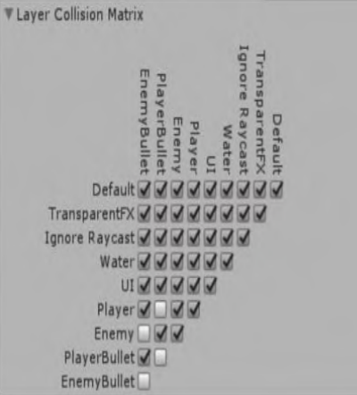

# Unity物理系统脚本编程

Unity内置了一套完整易用的物理系统，而且这套物理系统的底层基于先进的PhysX物理引擎。

## 基本概念

物理引擎是一套基于牛顿力学的模拟计算系统，它仅仅是对现实物理的一种近似模拟。

从运算精度上看，物理运动的计算不能无限精确下去，每一次计算都可能隐含着精度的损失，而且这种精度损失可能随着计算的迭代而逐步增大。

从时间连续性上看，物理引擎的计算是离散化进行的，每两次计算间隔十几至几十毫秒之久，并不能像真实世界那样保持连续性，这也会导致计算准确性显著下降。

### 刚体

刚体是让物体产生物理行为的主要组件。一旦物体挂载了`Rigidbody`组件，它就被纳入了物理引擎的控制之中，可以受到力的影响并作出反应。

已经被挂载刚体组件的物体，不建议再用脚本直接修改该物体的位置或者直接改变物体的朝向。如果要让物体运动，可以考虑通过对刚体施加作用力来推动物体，然后让 物理引擎运算并产生想要的结果；或者直接修改物体的速度（velocity）和角速度 （angular velocity），这样比施加作用力更直接。

一些情况下，只需要物体具有Rigidbody组件，但又不能让它的运动受到物理引擎 的控制。例如，让角色完全受脚本直接控制，但同时又不让角色被触发器检测到，这种 不直接受物理控制的、但用其他方式进行的刚体运动称为运动学（Kinematic）。这种 刚体的运动方式虽然部分脱离了物理系统控制而不再受到力的影响，但在需要碰撞检测 等情境下依然会被物理系统处理。

可以在脚本中随时开启或关闭物体的`Is Kinematic`选项，但是这样操作会带来一些性能开销，不应频繁使用。

### 休眠

当一个刚体的移动速度和旋转速度已经慢于某个事先定义的阈值，并保持一定时间，那么物理引擎就可以假定它暂时稳定了。在这种情况下，直到它再次受到力的影响之前，物理引擎都不再需要反复计算该物体的运动，这时就可以说该物体进入了“休眠 （Sleeping）”状态。这是一种优化性能的方案，“休眠”的物体不会被物理引擎持续更新，从而节约了运算资源，直到它重新被“唤醒”为止。

大多数情况下，刚体的休眠和唤醒都是自动进行的，也就是说开发者不用关心这个细节。但是，总有一些情况物体无法被自动唤醒，这种情况下可能会得到一些奇怪的结果。例如，一个稳定放在地面上且带有Rigidbody组件的物体，在地面被移除后它依然悬挂在空中。如果遇到类似的情况，可以在脚本中主动调用WakeUp方法。

### 碰撞体

碰撞体组件定义了物体的物理形状。碰撞体本身是隐形的，不一定要和物体的外形 完全一致。而且实际上，在游戏制作时会更多使用物体的近似物理形状而不是精确外形，这样可以提升游戏运行效率。

最简单且最节省计算资源的碰撞体，是一系列基本碰撞体。它们包括盒子碰撞体 （Box Collider）、球体碰撞体（Sphere Collider）和胶囊碰撞体（Capsule Collider）。在2D物理系统中有类似的2D盒子碰撞体（Box Collider 2D）和2D圆形碰撞体（Circle Collider 2D）。

一个物体上可以同时挂载多个碰撞体组件，这就形成了组合碰撞体（Compound Colliders）。

组合碰撞体是一个Unity术语，它不是一个组件，而是一个概念，指的是一个物体挂载了多个碰撞体组件或该物体具有多个碰撞体的子物体。子物体所挂载的碰撞体组件，也会成为父物体物理外形的一部分。

也就是说，既可以给一个物体添加多个基本碰撞体组件，也可以通过把碰撞体组件挂载到子物体上来添加，这样都能构造出组合碰撞体。

通过仔细调节碰撞体的位置和大小，组合碰撞体的形状可以精确地接近物体的实际形状，同时依然保证了较小的计算资源开销，如可以用旋转到特定角度的盒子碰撞体拟合物体的形状。在模拟外形复杂的物体时，建议多添加几个子物体来表示物理外形，因为用子物体方便单独控制偏移和旋转。这么做的时候，要**注意**只在**父物体**上**挂载一个刚体**组件，**子物体**上**不要挂载刚体**组件。

注意：**基本碰撞体不支持非等比缩放。**当对物体进行了非等比缩放时，基本碰撞体的范围可能和需要的不一样。这意味着要么可能发生计算错误，要么物体的物理外形和设想的不一致。无论哪种情况都不是好的结果，因此应当避免在非等比缩放的物体上挂载碰撞体组件。

从原理上讲，球体、胶囊等基本碰撞体都是特殊优化过的碰撞体，它们的碰撞检测 计算资源消耗较小，而球体碰撞体并不会因物体伸缩而变成椭球体。

### 物理材质

必须模拟碰撞体表面材料的特性，这样碰撞体之间发生交互时才能正确模拟实际的物理效果。例如，冰面上会非常滑，木板在冰面上能够滑很远的距离；而橡胶球表面的 摩擦力很大，且具有明显的弹性。尽管在碰撞发生时碰撞体的外形不会变化，但是可以通过物理材质（Physics Materials）设置物体表面的摩擦系数和弹性。要得到完全理想的参数可能需要反复尝试，但是大体上可以为冰面设置一个接近零的摩擦系数，给橡胶球设置一个很大的摩擦系数和一个接近1的弹性系数。

**刚体和柔体：**

在任何力的作用下，体积和形状都不发生改变的物体叫作“刚体（Rigid Body）”。它是力学中的一个抽象概念，即理想模型。事实上任何物体受到外力都不可能不改变形状，现实中的物体都不是真正的刚体。

为了简化问题、减少计算量，很多时候可将物体当作刚体来处理而忽略物体的形状变化，这样所得结果仍与实际情况相当符合。绝大部分常用的物理系统都是基于刚体的，这样可以在表现效果和运算资源开销上取得良好的平衡。

如今有一些物理系统支持“柔体（Soft Body）”。被定义为柔体的物体，其外形会随着力和加速度的变化而变化，能够逼真还原碰撞发生的具体过程。例如模拟皮球反弹的过程，就可以对皮球受到挤压、产生形变、产生弹力、反弹后形状进一 步变化的整个过程进行模拟。这种物理系统目前还没有被广泛地使用，它在表现真实的车辆碰撞损坏、模拟水体或柔软物体方面有着很大的潜力。

### 触发器

碰撞体会默认阻挡刚体的运动，如地板会阻挡小球的下坠。但有时候，需要**让物理系统检测两个物体发生重叠，但又不引起物理上的实际碰撞**，这时就需要勾选碰撞体组件的`Is Trigger`属性，将它变成一个触发器。

作为触发器的物体**不再是物理上的固体，反而允许其他物体随意从中穿过**。当另一个碰撞体进入了触发器的范围，就会调用脚本的`OnTriggerEnter()`方法。但要**特别注意两个物体必须至少有一个带有刚体组件（可以是动力学刚体），否则无法触发脚本。**

当两个物体发生接触时，因物体的具体设置不同，某些情况下会产生碰撞或触发事件，而另一些情况下不会产生碰撞或触发事件。


### 碰撞体的分类


#### 静态碰撞体（Static Collider）

**没有挂载刚体**组件的碰撞体，称为静态碰撞体。

静态碰撞体通常**用于制作关卡中固定的部分**，例如地形和障碍物一般不会移动位置，在刚体碰撞到它们的时候，它们的位置也不会变化。

物理系统会假定静态碰撞体不会移动和改变位置，以这个假定为前提，系统做了很多性能优化。

同时，在游戏运行时，不应当改变静态碰撞体的开启或关闭的状态，也不应当移动或缩放碰撞体。

如果这么做，物理系统会重新计算，带来额外的计算量，进而导致运行效率显著下降。

更为严重的是，重新计算可能会进入一些未定义的状态，导致不正确的结果。

例如，休眠的刚体在被一个静态碰撞体碰撞到时，很可能不会被立即唤醒，且无法计算正确的反作用力。

因此，应当仅修改非静态碰撞体的运动状态，而不要修改静态碰撞体的运动状态。 

如果需要碰撞体不被碰撞所影响，但又需要在脚本中让它运动，那么可以将刚体组件设置为动力学刚体。

总之，**对于会移动的碰撞体，务必要挂载刚体组件，并根据需要勾选`Is Kinematic`选项。**


#### 刚体碰撞体（Rigidbody Collider）

**挂载了普通刚体**组件的碰撞体，称为刚体碰撞体。

物理引擎会一直模拟计算刚体碰撞体的物理状态，因此刚体碰撞体会对碰撞以及脚本施加的力做出反应。


#### 动力学刚体碰撞体（Kinematic Rigidbody Collider）

**挂载了刚体**组件**且刚体组件设置为动力学刚体**的碰撞体，称为动力学刚体碰撞体。

可以在脚本中直接修改动力学刚体碰撞体的位置来移动它，但它并**不会对碰撞、力和速度的变化做出反应**。

通常**用在需要改变位置或状态的碰撞体上**，如一个可以滑动的门，大部分时间门就与静止的障碍物一样，但是在必要的时候可以打开。

正确地使用动力学刚体碰撞体，可以让物理引擎妥善处理各种细节问题，同时不会带来性能问题。

例如动力学刚体碰撞体可以对其他物体产生适当的摩擦力，也可以在发生碰撞时正确唤醒其他刚体。 

就算是在没有发生移动的情况下，动力学刚体碰撞体与静态碰撞体也有微妙的区别。

例如，一个刚体碰撞体可以随时开启或关闭`Is Kinematic`选项，而对静态碰撞体来说，直接开启或关闭碰撞体组件会导致重新计算，带来性能问题。 

再如，一个角色在正常情况下受动画系统的控制，但它在被爆炸冲击力波及或被严重撞击的时候，就会受物理影响而被击飞。这是由于该角色默认是一个动力学刚体碰撞体，它的肢体受动画系统的控制，但是在必要的时候，会取消勾选`Is Kinematic`选项， 从而让它变成一个受物理影响的刚体。

**布偶（Ragdoll）：**

在现代游戏中，人形角色在死亡或失去控制后，会保持人形骨骼关节的物理运动方式，并被物理系统完全接管，这种受物理控制的人形角色称为“布偶 （Ragdoll）”。

Unity也支持布偶，在场景中创建物体，选择Create | 3D | Ragdoll…就会打开一个布偶关节编辑框，用于将人形角色对应为布偶。

### 碰撞事件表

根据发生接触的两个物体是否为触发器、是否为刚体、是否选择动力学 选项，会有多种排列组合的情况，并且根据碰撞体参数设置的不同，被调用的脚本方法 也不同。两个不同参数设置的物体与是否调用脚本方法的关系见表：

|                  | 静态碰撞体 | 刚体碰撞体 | 动力学刚体碰撞体 | 静态触发器 | 刚体触发器 | 动力学刚体触发器 |
| ---------------- | ---------- | ---------- | ---------------- | ---------- | ---------- | ---------------- |
| 静态碰撞体       | ×          | 碰撞事件   | ×                | ×          | 触发事件   | 触发             |
| 刚体碰撞体       | 碰撞       | 碰撞       | 碰撞             | 触发       | 触发       | 触发             |
| 动力学刚体碰撞体 | ×          | 碰撞       | ×                | 触发       | 触发       | 触发             |
| 静态触发器       | ×          | 触发       | 触发             |            | 触发       | 触发             |
| 刚体触发器       | 触发       | 触发       | 触发             | 触发       | 触发       | 触发             |
| 动力学刚体触发器 | 触发       | 触发       | 触发             | 触发       | 触发       | 触发             |

上表的总结：

1. 只有碰撞体之间会产生碰撞事件。产生接触的两个物体，**只要有一个是触发器， 则不会产生碰撞事件**。
2. 两个物体发生碰撞，不仅要**两者都是碰撞体**，而且需要**至少有一个物体是刚体**， **且不能是动力学刚体**。
3. 产生触发事件没有太多要求，仅在静态触发器之间、静态触发器和静态碰撞体之间不会产生触发事件。大体上**只要有刚体和触发器，就会产生触发器事件**。

例子：

1. 如果要做一个物理游戏，主要角色利用物理系统的力、速度来控制，那么角色本身应当是刚体碰撞体，游戏中的障碍物和平台也都应是碰撞体。 
2. 对于不会移动的障碍物和平台，做成静态碰撞体即可。对于会移动或旋转的障碍物，可以做成动力学刚体碰撞体。由于角色是刚体，因此不影响两者之间的碰撞。
3. 如果两个障碍物之间需要碰撞，如两个可以互相影响的齿轮。这时候应该将其中不受作用力影响的齿轮设置为动力学刚体，会受外力影响的齿轮设置为普通刚体。 当然根据具体需求，两者都设置为刚体也是可以的。
4. 如果只需要碰撞检测的功能，而不需要力的作用，那么仅使用动力学刚体碰撞体和触发器就可以了。触发器使用比较方便，因为产生触发事件的情况比较多。

### 层

与物体的标签（Tag）类似，每个物体也可以属于一个“层”（Layer）。层和标签都是游戏物体的基本属性，在Inspector窗口中可以查看和修改。

层的概念对于物理系统来说有着很多意义。将物体巧妙地安排在不同的层上，可以达到特定目的。例如玩家在单击游戏画面时，只能选中某几层的物体，而其他层的物体被阻挡，这样可以让玩家的操作不会被无关物体干扰。

甚至可以有更复杂的设定，例如玩家发射的多颗子弹不会互相碰撞，玩家的子弹只会碰撞敌人而不会碰撞自己，敌人的子弹也是如此。列出所有的层，并指定每两层之间是否发生碰撞，就形成了一个Layer Collision Matrix（层碰撞矩阵）



可以在Unity主菜单的`Edit | Project Settings | Physics`中找到层碰撞矩阵。层碰 撞矩阵左边和上边都是所有层的名称，勾选表示对应的两层会发生碰撞，不勾选则对应 的两层不会发生碰撞。

### 物理关节

关节（Joints）特指一种物理上的连接关系，如门的合页、滑动门的滑轨、笔记本 计算机屏幕与键盘之间的铰链都属于关节，甚至绳子也可以用许多关节来模拟。关节总 是限制一类运动的自由度，允许另外一类运动的自由度。例如，普通的房门就允许大幅 度旋转，但不允许平移。

Unity提供了很多不同类型的关节，可用于不同的情景。例如，铰链关节（Hinge Joint）就适用于普通的房门，准确地说它限制物体只能绕一个点旋转。而弹簧关节 （Spring Joint）则可以让两个物体之间始终保持适当的距离，不会过远或过近。

除了3D关节，也有相对应的2D关节，如2D铰链关节（Hinge Joint 2D）。

| 物理关节   | 组件            | 简介 |
| ---------- | --------------- | ---- |
| 固定关节   | Fixed Joint     |      |
| 铰链关节   | Hinge Joint     |      |
| 弹簧关节   | Spring Joint    |      |
| 人物关节   | Character Joint |      |
| 2D固定关节 | Fixed Joint 2D  |      |
| 2D铰链关节 | Hinge Joint 2D  |      |
| 2D滑动关节 | Slider Joint 2D |      |
| 2D车轮关节 | Wheel Joint 2D  |      |

Unity中的关节提供了许多选项和参数，以对应特定的功能。例如，可以设定当拉 力大于特定的阈值时关节会断开，也可以设定弹簧关节的弹性系数，甚至还可以把铰链 关节变成一个不断旋转的马达（Motor）。

### 射线检测

“射线检测”是在游戏开发实践中不可或缺的一项技术，但在Unity官方文档中对 它的介绍较少，且被归纳在事件系统（EventSystem）中。

简单来说，射线检测就是在游戏世界中发射一条虚拟的“射线”，并观察该射线是 否击中了某个物体，以及具体击中了该物体的哪个位置。

虽然名字叫作“射线” （Ray），但实际发射的位置、方向和长度均可以根据实际需求来设置。

不仅有直线状的射线，还有球形射线、盒子射线等，所以射线检测中的“射线”可以看作有一定范围和粗细的广义“射线”。

### 角色控制器与物理系统

控制角色大体上有两种方法：

1. 直接用脚本改变物体的位置和朝向。
2. 通过刚体施加力和改变速度来控制角色的行为。

总的来说，**用刚体控制角色**是一种简单易行的方法，包括重力、阻挡、被外力影响 都可以让物理系统帮忙处理，用极少的代码就能做出一个操作手感很好的角色。

但物理控制方法也有一些**弊端**，如角色可能被墙角卡住、可能因障碍物挤压而被弹飞，或是因摩擦力过大而运动受阻等。这些情况大部分都是因为现实的物理环境复杂，多种力作用的结果不易考虑周全，所以产生各种bug难以避免。

如果**不使用刚体**，主要**用脚本控制角色的所有行为**，那么重力、阻挡、跳跃等多种基础功能都需要编写代码来实现。这种方式灵活性和可控性非常高，如角色能爬上多大 角度的坡、能上多高的台阶都能详细指定，但是编写代码的难度较高，工作量也较大。

传统的动作游戏均采用编写专用角色控制器（非刚体）的方式实现。

如果需要进行精确的角色控制，那么借用Unity提供的角色控制器 （Character Controller）或者在资源商店购买成熟的角色控制器模版，在使用中借鉴和修改。

### 3D物理系统与2D物理系统

Unity具有两套完全独立的物理系统，分别是3D物理系统和2D物理系统。实际上， 这两者是两套截然不同的系统，虽然它们的名字很像、使用方法也很像，但从根源上看，并没有太多联系。

虽然本质不同，但3D物理系统与2D物理系统的绝大部分概念都有对称关系，3D物理 系统的概念大部分在2D物理系统中都有对应的概念。


## 物理系统脚本编程


### 获取刚体

```c#
using UnityEngine;
public class Test : MonoBehaviour
{
    Rigidbody rigid;
    void Start()
    {
        rigid = GetComponent<Rigidbody>();
    }
}
```

### 施加作用力

```c#
 private void Update()
 {
     if (Input.GetButtonDown("Jump"))
     {
         rigid.AddForce(new Vector3(0, 100, 0));
     }
 }
```

在玩家按下空格键时，对刚体施加一个向上的力，大小为100牛，持续时间是一个物理帧间隔（默认0.02秒）。如果物体只有1千克，重力不到10牛，那么这个力会让它跳起一定高度。

牛顿力学告诉我们，力必须且至少要持续一点时间才能引起物体速度的变化。力和时间的乘积叫作冲量，冲量和物体速度变化的关系为：F·△t=m·△v。 

由于编程时使用的AddForce方法不需要给出力的作用时间，因此开发者经常忘 记还有个隐含的时间参数。

不过好在设计游戏时一般不需要精确计算，只需要一边测试一边修改，确定一个合适的值即可。

### 修改速度

在使用Transform组件时，让物体匀速移动的方法是，每帧让物体的位置前进一段很短的距离。Transform组件本身并没有速度这一属性，但通常在脚本中会定义速度变量，以方便控制物体的移动速度。

对物理系统中的刚体来说，速度是一个非常重要的固有属性。速度影响着物体的动量、动能，决定着碰撞的结果。

在Unity中，不仅可以获取刚体当前的速度，还可以直接修改速度，其方法如下：

```c#
Vector3 velocity = rigid.velocity;
rigid.velocity = velocity + new Vector3(0, 0, 1);
```

直接修改速度还有一个典型的用法，那就是制作游戏中的“二段跳”。

```c#
using UnityEngine;
public class SimpleJump : MonoBehaviour
{
    Rigidbody rigid;
    void Start()
    {
        rigid = GetComponent<Rigidbody>();
    }
    private void Update()
    {
        if (Input.GetButtonDown("Jump"))
        {
            rigid.AddForce(new Vector3(0, 100, 0));
        }
    }
}
```

实际测试会发现，如果角色处于上升阶段时再次跳跃，角色就会跳得很高，最大高度大于单次跳跃的2倍。如果角色处于下降阶段，角色就很难在空中跳起来，可能只会停顿一下，延缓下落时间。 

这个现象完全符合物理现实，物体速度向下时（即处于重力下降过程中），再加一个力会让物体减速、让物体下降得更慢。除非施加的力非常大，大到足以减速、抵消重力并重新弹起来，否则就达不到多次跳跃的效果。

可以运用物理中“冲量和动量”的思路，并通过计算精确抵消垂直速度，然后再叠加弹跳力，从而实现“二段跳”。但这种方法太学术化，实践中有更好的办法，即在跳跃时先将角色的纵向速度直接设置为0。将上文的Update函数修改如下：

```c#
private void Update()
    {
        if (Input.GetButtonDown("Jump"))
        {
            rigid.velocity = new Vector3(rigid.velocity.x, 0, rigid.velocity.z);
            rigid.AddForce(new Vector3(0, 100, 0));
        }
    }
```


### 射线的使用

例子：

1. 游戏中有单击地面的操作，因此要发射射线以确定是否点中了可单击区域和单击位置的坐标。 
2. 在判定子弹或技能是否击中目标时，如果采用碰撞体需要考虑子弹速度，且存在穿透问题，而射线是没有速度的（瞬时发生），不仅易于使用，而且综合效率更高。
3. 在3D动作游戏或2D动作游戏中，判断玩家是否落地时，可以向角色脚下发射射线；判断玩家是否接触墙壁时，可以往左右两侧发射射线；判断玩家是否需要低头时，可以往头顶发射射线；判断玩家是否需要攀爬时，同样也可以采用射线检测的方法。
4. 因为射线与视线一样会被障碍物阻挡，所以在游戏AI设计中，可以用射线模拟AI角色的视线。

注意，上所述的各种射线检测都是以物理系统为基础的。射线需要与碰撞体和触发 器配合才能发挥出作用。

### 修改物理材质


### FixedUpdate详解


### 修改角速度


### 质心


### 其他施加力的方式


### 刚体约束

