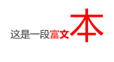

# Unity脚本与UI系统

UGUI是公认的性能最好的UI系统。FairyGUI脱离Unity资源导入方式自成一派，有自己的一套编辑器，通过编辑器来创建界面和编辑UI动画，将UI设计和程序脱离开。Unity官方也做了一个类似的系统，UI Toolkit。

## UGUI系统的运行原理

UGUI是在3D网格下建立起来的UI系统，它的每个可显示的元素都是通过3D模型网格的形式构建起来的。

**当UI系统被实例化时**，UGUI系统首先要做的是**构建网格**。

即，Unity在制作**一个图元**或按钮或背景时，都会先构建一个**方形网格**，绑定一个**材质球**，再在这个材质球里放入要显示的**图片**。

如果每个元素都生成模型且绑定一个材质球存入图片，引擎在渲染时就需要读取成千上万张图以及成千上万个材质球。如果GPU对每个材质球和网格都进行渲染，将导致GPU负担重大，drawcall过高。

UGUI针对这种情况做了优化，将一部分相同类型的图片集合成一张图，再将拥有相同图片、相同着色器的材质球指向同一个材质球，并把分散开的模型网格合并起来。

这样就生成了几个大网格和几个不同图集的材质球，以及少许整张的图集，节省了很多材质球、图片、网格的渲染。

即，**图集概念，把很多张图片放置在一个图集上，使大量图片和材质球不需要重复绘制，只要改变模型顶点上UV和颜色即可。**

UGUI并非把所有网格和材质球都合并成一个，如果这样，模型前后层级就有问题。

UGUI只把**相同层级**的元素，以及相同层级上的**拥有相同材质球参数**的进行**合并**。

合并成一个网格，相当于一个静止模型，如果移动了任何元素，或者销毁任何元素，或者改变任何元素的参数，原来合并的网格就不符合新的要求。于是UGUI会销毁这个网格，并重新构建一个。

如果每时每刻都在移动一个元素，那么UGUI将不停地拆分合并网格，不停地消耗CPU来使画面保持应有的样子。

我们要**尽一切可能节省CPU内存，尽量把多余CPU让给核心逻辑**。性能优劣差距很多时候就体现在这里。

我们要想方设法**合并更多的元素，减少重构网格的次数**，以达到更少的性能开销目的。

## 用脚本操控常用UI控件

在界面系统的术语中，将一个具有独立的状态、外观和操作的对象称为**控件**。

例如，常见的**交互控件**有按钮、输入框、滑动条等，常见的**非交互控件**有文本标签、图片等。

Unity采用了父子物体和组件的设计思想，它的每个界面控件，往 往也是由游戏物体挂载组件，以及一些子物体实现的。例如，按钮控 件是由按钮物体加上一个文本子物体构成的，而按钮核心的功能组件 也叫按钮（Button）。

画布的核心组件有两个：

1. Canvas（画布）组件
2. Canvas Scaler（画布缩放器）组件。

### Canvas组件

一般来说**所有的UI控件都必须是Canvas的子物体**，这样才能方便统一布局。

Unity允许存在多个Canvas，形成多个独立的界面层。但是过多的 Canvas会影响游戏性能。

**我们把各种元素放在Canvas上后，Canvas要做的就是合并这些元素。**

合并规则：在同一个Canvas里，将相同层级、相同材质球的元素进行合并，从而减少drawcall。

但相同层级并非指gameobject上的节点层级，而是覆盖层级。

Canvas里如果两个元素重叠，则可以认为它们是上下层关系，将所有重叠的层级数排列顺序计算完毕后，将从第0层开始的同一层级的元素合并，再将第1、2、3...层的元素同样合并。

Canvas上的参数Render Mode（渲染模式）比较重要。

- **Screen Space-Overlay（屏幕空间-覆盖，默认）**：

  不以Camera为基准，与空间上的排序没有任何关系，画布**完全与游戏场景无关**，只是在**渲染完场景之后，把UI层渲染到游戏的最上层**。

  空间上的前后位置不再对元素起作用，常用于纯UI系统的区域内，Camera排序有别于其他模式，Sort order参数再排序时被重点用到，Sort order参数值越大，越靠前渲染。

- **Screen Space-Camera（屏幕空间-摄像机，常用）**：

  依赖Camera的平面透视，渲染时的布局依赖于它绑定的Camera。想让更多非UGUI元素加入到UI中，Screen Space-Camera模式更有优势。UGUI底层针对排序有一些规定，比如对z轴不为0的元素，会单独提取出来渲染，不参与合并。

  它是对覆盖模式的改进，**需要指定摄像机**。在实际游戏开发中，为了增强表现力，有时需要**把场景中的粒子或动画放在UI层里播放**，就像是在UI层的上面又多了一层。选择Screen Space-Camera模式后，**整个画布会像普通物体一样被摄像机渲染**，而且正好和摄像机视野一样大，贴合画面且具有一定的z轴深度。如此**离镜头更近的物体就自然被渲染到UI层前面**了。

- **World Space（世界空间）**：

  主要用于当UI物体放在3D世界中时，比如一个大的场景需要将一张标志图放在一块石头上，这时就需要World Space模式。与Screen Space-Camera的区别是，它常在世界空间中与普通3D物体一同展示，依赖于透视Camera。当UI物体处于这个Camera视野中，相当于渲染了一个普通的3D图片，除了普通的渲染Canvas外，还会对这些场景里的UI进行合并处理。

### Canvas Scaler组件

Canvas Scaler用于指定画布中元素的比例大小，与屏幕适配密切相关。它的第1个选项UI Scale Mode（UI缩放模式）有以下3种选择：

1. **Constant Pixel Size（固定像素大小）**。无论游戏屏幕是放大还是缩小，每张图片所具有的像素数不变。这样做的UI适应性不强。
2. **Constant Physical Size（固定物理大小）**。与固定像素 大小类似，只是基于的单位不同。此选项是基于场景的长度单位。
3. **Scale With Screen Size（根据屏幕大小缩放）**。以屏幕为基准自动适配比例大小，使用这一方式才有可能适应不同的屏幕分辨率和比例。

决定了UI Scale Mode后，还需要设置Screen Match Mode（屏幕适配模式）。此时还需先了解画布缩放的原理。

### Graphic Raycaster组件

Graphic Raycaster是输入系统的图形碰撞测试组件，不会检测Canvas以外的内容，检测的都是Canvas下的元素。

当图元素上存在有效碰撞体时，Graphic Raycaster组件会统一使用射线碰撞测试来检测碰撞的元素。

也可以设置完全忽略输入的方式来彻底取消点击响应，还可以指定阻止对某些layers进行响应。

### 界面比例问题

如果新建多个UI控件，会发现在Game窗口里能看到控件，而在场景中，UI控件会以非常巨大的比例展现，必须要将场景镜 头拉得很远才能看清楚UI控件整体。

这是由于UI系统是以Canvas为载体，而Canvas很多时候和最终屏 幕显示有直接的对应关系。UI的默认比例是以1像素为单位的，而正常三维场景是以1米为单位的。因此，UI的1个像素等价于三维世界的1米。对1920像素×1080像素的界面来说，横向就有1920 米，这比一个标准尺寸的操场还要大几倍。

三维游戏场景的比例尺与默认界面系统的比例尺的差距很大，这 就导致在编辑界面时感到很不自然。为了改善操作的便利性，Unity在 场景中提供了2D按钮，为编辑界面带来了方便。

**导入自定义图片的设置**

Unity支持多种图片格式，只需将图片素材拖曳到Project窗 口，或者将图片复制到当前工程的Assets文件夹下，就可以实现导入。

关键是在图片导入以后，选中图片文件并在Inspector窗口中将 Texture Type（贴图类型）设置为Sprite (2D and UI)。这是因为在3D工程中，图片被默认为材质贴图，这与UI系统或2D精灵需要的 格式不同。


### 矩形变换组件（Rect Transform）

选中界面上的控件，会发现每个物体并不带有基本的Transform组件，取而代之的是Rect Transform（矩形变换）组件。其实Rect Transform组件是Transform组件的子类，因此并不违反“每个 物体必须有且只有一个Transform组件”的规定。其中的Rect是Rectangle的简写，即“矩形”的意思。

**在UI系统中不得不用Rect Transform组件，而不能直接用基本的 Transform组件，是由于界面控件的位置、大小相对于游戏中的其他物 体来说要复杂得多。**

它的复杂性体现在很多方面，例如以下情况：

1. **界面布局直接受到客户端屏幕大小、长宽比例的影响**。例如，移 动端显示屏具有多种分辨率和长宽比，分辨率有720P、1080P、1440P 等多种情况，长宽比有4：3、16：9、18：9 等情况，加上个人计算 机、电视机等设备，情况就更多了。
2. **界面上的控件位置、大小直接影响着用户体验。**界面元素位置不合适或比例不合适，会直接导致糟糕的用户体验。
3. **在很多游戏和应用程序中，用户可以拖曳窗口的位置或修改窗口的大小。**例如，游戏的聊天窗口位置和大小通常是可以动态调整的。在这种情况下使窗口内部元素动态适应窗口大小、自动改变窗口内部元素的布局十分必要。

由于存在种种复杂的情况，如果UI控件还使用简单的“位置、旋转和缩放”来定义自身位置，显然无法满足需求。因此Unity总结了众多游戏屏幕适配的经验和方法，设计了Rect Transform组件。

简单来说，**Rect Transform组件是用多种相对参数取代了绝对的位置参数。**例如，所有的物体都是默认的 “居中对齐”方式。这时右边的位置参数为Pos X、Pos Y，其代表的是控件与父控件之间的偏移量，（Pos X=0, Pos Y=0）代表位于父控件的正中央。

如果改为“上方对齐”，那么（Pos X=0, Pos Y=0） 就代表位于父控件上方；如果改为“右下角对齐”，则（Pos X=0, Pos Y=0）代表位于父控件右下角。

在各种对齐情况下（所有的非拉伸情况，用红色参考线表示），控件的大小都可以通过Height（高度）和Width（宽度）指定。也就是说，**物体的位置是相对的，物体的大小是确定的。**

而当用户选择Stretch（拉伸）模式时，位置和大小的参数会发生根本的变化。

在拉伸模式下，定位物体的Pos X、Pos Y消失了，取而代之的是 Left（左偏移）、Top（顶偏移）、Right（右偏移）和Bottom（底偏 移）。如果将4个偏移参数改为0，则代表这个控件将铺满父控件的全部空间，而且无论父控件扩大或缩小，依然会保持铺满的状态。

这时“左偏移”代表的是“离左边有多远”，“顶偏移”代表的 是“离顶部有多远”，如左偏移文本框中填写10代表离左边10个单 位，填写负数则表示可以超出父控件的范围。这种铺满的模式适合用于表示游戏中的主体窗口。

### Image组件、RawImage组件

图片组件（Image）用于展示UI上的图片。在界面上可以设置的属性如下：

1. 指定任意**图片源**（Source Image）。
2. 修改图片的**叠加颜色**（Color）。
3. 指定**图片材质**（Material），一般应该置为空。
4. **射线检测目标**（Raycast Target），大部分的UI组件都包含这 一选项，它决定了控件是否会被单击到。
5. **图片类型**（Image Type），包括**简单（Simple）**、**切片 （Sliced）**、**瓦片（Tiled）**与**填充（Filled）**4种类型。其中的切片与瓦片类型需要对图片导入参数进行设置后才能正常使用。**切片类型**通常用于制作可以**任意缩放但边缘不变形的图片**（也称为**九宫格图片**）
6. **Set Native Size（设为原始大小）按钮**可以重置整个图片为原始像素大小。
7. 当图片类型为简单和填充时，会出现“Preserve Aspect（保留长宽比）”选项，勾选它能够保证图片在放大、缩小时长宽比例不 变，这一功能比较常用。

用脚本控制图片的基本方法例子：

```c#
using UnityEngine;
using UnityEngine.UI; // UI 脚本要包含此命名空间
public class ImageAnimTest : MonoBehaviour
{
    Image image;
    // 可以在编辑器里指定另一张图片
    public Sprite otherSprite;
    float fillAmount = 0;
    void Start()
    {
        // 获取Image组件
        image = GetComponent<Image>();

        // 直接将图片换为另一张图片
        if (otherSprite != null)
        {
            image.sprite = otherSprite;
        }
        // 将图片类型改为Filled，360°填充，方便制作旋转动画
        image.type = Image.Type.Filled;
        image.fillMethod = Image.FillMethod.Radial360;
    }
    void Update()
    {
        // 制作一个旋转显示的动画效果，直线效果也是类似的
        // 取值为0~1
        image.fillAmount = fillAmount;
        fillAmount += 0.02f;
        if (fillAmount > 1)
        {
            fillAmount = 0;
        }
    }
}
```

在运行之前，可以给脚本的Other Sprite字段指定一张新的图片，这样在运行时，就会将内容替换为新的图片，并产生旋转显示的效果。

**注意：使用第三方字体务必注意版权问题**

Unity的Asset Store有很多免费和收费的字体可供使用，但大部分是英文字体，中文字体请自行寻找。

要强调的是，任何字体如果用于商业目的或互联网传播，都要小心授权协议，特别是中文字体。Windows系统的字体也并非都可以用于商业用途，依据具体的字体授权方式有所不同。作为开发者应当具有法律意识，谨防侵权。

#### Image组件、RawImage组件两者的区别

Image组件仅能展示图集中的图元，展示的图元可以参与合并。

RawImage组件能展示单张图片，无法参与合并。

通常我们会将小块的图片打包成图集来展示，这样性能更高，更节省内存。

每个图片资源都有一个tag标记，标记决定了哪些元素会合并到同一张图集内，如果没有tag标记，默认不会合并图集，它自己就是自己的图集。

不使用图集而使用RawImage展示单张图片时，通常都是图片尺寸太大而导致合并图集的效率太低，或者相同类型的图片数量太多，导致合并图集后的图集太大，而实际在画面上需要展示的这种类型的图片又很少，图集方式反而浪费大量内存空间，因此使用RawImage逐一展示。

### Mask组件、RectMask2D组件

遮挡组件，将子节点下矩形区域外的内容剔除，是滚动窗口中最常用的组件。

这两个组件主要是在剔除的方法上有所区别，虽然实现效果上都一样，但其中Mask组件使用顶点重构的方式剔除矩形区域外的部分，而RectMask2D组件采用着色器的剔除方式，每个元素都有自己的材质球实例和实例参数。

### Text组件

文本组件在界面上可以设置的属性如下：

1. Text（文本内容），就是要显示的文字内容，支持富文本标签。
2. Font（字体），默认为Arial字体。Unity支持用户安装其他类型的字体，只要将合适的字体文件复制到工程的Assets/Fonts文件夹下即可自动导入。
3. Font Style（字体风格），包括普通、黑体、斜体、黑体加斜 体4种选择。
4. Line Spacing（行间距），行间距可调。
5. Rich Text（富文本），可以开启或关闭富文本功能。后文会举一个简单的例子说明富文本的简单使用方法。
6. Alignment（段落对齐方式），包括横向的靠左、居中和靠右对齐，以及纵向的靠左、居中和靠右对齐。
7. Horizontal Overflow（横向超出），指定横向超出控件大小的字符的处理方式，可以选择Wrap（折行）或Overflow（放任超出边界）。
8. Vertical Overflow（纵向超出），指定纵向超出控件大小的字符的处理方式，可以选择Truncate（丢弃）或Overflow（放任超出边界）。
9. Best Fit（最佳匹配），自动根据文本控件的大小改变字体的大小，可以限制自动调整的最大值和最小值。
10. Color（文字颜色），默认的文字颜色。
11. Material（材质），与2D图片一样，字体也可以指定材质，一般留空即可。
12. Raycast Target（射线检测目标），大部分的UI组件都包含这一选项，它决定了控件是否会被单击到。

富文本使用方法：

文本控件支持用户给文字添加丰富的小变化，支持修改局部字体的大小、颜色、风格等。

```text
这是一段<color=#ff0000ff>富<b>文</b><size=50>本</size></color>
```



**富文本**是一种**用特殊标签标记的字符串**，**语法类似于HTML**，支持常规的变色、加粗、改变大小等功能。

如果文字不显示或显示不全，可以将文本框拉大一些。测试时会发现字体的颜色、大小和加粗风格都可以变化，更多细节功能可以查阅相关资料，自行尝试。

### Button组件

按钮的主要属性介绍如下：

1. Interactable（是否可交互）。
2. Transition（外观状态切换），每个按钮都有**普通、高亮、按下和禁用**4种状态，这4种状态下按钮外观应该表现出区别。Unity提供了几种方式来定义外观的变化，后文会展开说明。
3. Navigation（导航顺序），当玩家使用键盘或手柄在UI控件之 间切换时，按键切换的顺序会变成一个复杂的问题，“导航顺序”就 是为了解决这一问题而存在的。Visualize（导航可视化）按钮也是为导航准备的。

**按钮外观状态切换的方法**

按钮状态切换与按钮的实际应用密切相关，默认按钮的状态切换是Color Tint（颜色叠加，实际上是对颜色做乘法运算）。

在做简单测试时，用颜色叠加十分方便。因为只需要准备一张按钮图片，默认状态下乘以白色，也就是不改变图片颜色；在高亮时乘亮灰色；在按下时乘深灰色，按钮明显变暗；在禁用按钮时，乘 半透明的深灰色，按钮不仅变暗还会有透明效果。如此一来，就可以用一张图片代表4种状态，效果也不错，简单易行。

另一种效果更好的方式是根据需要准备2~4张图片，然后选择 Sprite Swap（切换精灵图）模式。在此模式下，需要对按钮的普通状态、高亮状态、按下状态和禁用状态分别指定不同的图片。当然，如果游戏中不会出现高亮或禁用状态，也可以不指定高亮或禁用对应的图片。

**按钮是组合的控件**

仔细观察按钮在Inspector窗口中的详细信息，会发现它不仅具有 Button组件，还具有Image组件，另外它还包含一个Text子物体，这说 明按钮是由多种组件和父子物体组成的。其中的Image组件代表按钮默 认的外观，而Text子物体决定了按钮上显示的文字。例如，需要一个 不带文字的纯图片按钮，就可以删除Text子物体。

 **OnClick（点击）事件**

按钮最常用的功能就是单击，单击需要和脚本联动，一般是通过调用某个方法来实现的。事件的关联可以直接在编辑器中操作。

1. 看Button组件的On Click ()选项，第一个Runtime Only选项不变 （Runtime Only代表仅在游戏运行时有效，Editor And Runtime则表示在 编辑器中也会响应单击）。
2. 单击左下角编辑框右侧的小圆圈，然后选择Image物体；也可以 将场景列表中的图片物体拖曳到该编辑框中。小圆圈代表单击按钮后对哪个物体进行操作。
3.  右边是一个下拉框，可以指定被调用的方法。指定物体后，该下拉框就变成了可编辑状态。

OnClick事件可以对场景中的任意物体操作，且可以调用物体的任何一个公开方法。

```c#
using UnityEngine;
public class ButtonTest : MonoBehaviour
{
    public void TestButtonClick(int param)
    {
        Debug.Log("按钮被点击");
        Debug.Log("事件参数为："+para m);
    }
}
```

将该脚本挂载到界面的图片上。在按钮组件中，依然选中图片物体，在下拉框中找到 ButtonTest.TestButtonClick。由于此方法具有一个int参数，因此可以指 定参数的值，如“233”。运行游戏进行测试，单击按钮，会在Console窗口中看到输出的信息。

**OnClick事件触发的方法可以有任意参数**

按钮OnClick事件可以触发任意物体的任何方法，而且该方法可以是无参数的、有一个参数的或者有多个参数的，读者可以自行实验。 甚至还可以在按下按钮时触发多个方法。单击编辑框下方的加号即可添加更多方法。


### 单选框（Toggle）组件

单选框组件（Toggle）与按钮组件类似，只不过它具有“勾选” 和“不勾选”两种状态。在创建物体的菜单中选择UI>Toggle即可创建单选框。

相比按钮组件，单选框组件多出几个选项，说明如下：

1. Is On选项，代表是否处于勾选状态。
2. Transition（外观状态切换），用于定义外观和切换效果，类似按钮组件。
3. Toggle Transition代表勾选时的动态效果，有“淡入淡出”和 “无效果”两种选择。
4. Graphic代表对钩图片对应的子物体。一般单选框对应的对钩图 片是CheckMark子物体，如果需要替换小图片外观，修改CheckMark子物体即可。
5. Group代表单选框组，可以让多个单选框组成多选一的结构。
6. 勾选或取消勾选单选框时，会触发OnValueChanged消息，带有一个bool参数。

在勾选或取消勾选单选框时会触发一个方法，只要将TestToggleChange方法添加到单选框的响应方法中即可。

```c#
using UnityEngine;
using UnityEngine.UI;
public class TestToggle : MonoBehaviour
{
    Toggle toggle;
    void Start()
    {
        toggle = GetComponent<Toggle>();
        // 初始不勾选
        toggle.isOn = false;
    }
    public void TestToggleChange(bool b)
    {
        if (b) {
            Debug.Log(" 勾选了单选框");
        }
        else {
            Debug.Log(" 取消勾选单选框");
        }
    }
}
```

单选框不仅可以用来表示一个单独的状态，通常也用于从多个选项中选取一个选项的情况，例如常见的单项选择题。这种选项的特点 是，多个单选框形成一个组，同一时间只有其中之一处于勾选状态。如果勾选了其中一个，另外几个选项会自动取消勾选。

1. 创建3个单选框（Toggle）物体，摆在合适的位置。并修改子物 体Label上的文字，以方便查看。
2. 在UI画布中创建一个空物体，并取一个名字，如Group1。
3. 在场景列表中，将3个单选框拖曳到空物体上，使它们都作为 Group1的子物体。
4. 给这个父物体添加组件Toggle Group，即单选框组组件。
5. 将每个单选框的Group选项，都指定为这个空物体。这一步可以 同时选中这3个单选框，统一操作，比较方便。

完成之后就可以运行游戏进行测试。勾选其中任意一个选项，另 外两个选项都会自动取消勾选。如果初始状态下三者都是勾选状态， 那么可以通过修改Is On选项来改变初始状态。注意在这个例子中为了管理方便使用了“父子”物体，其实不一定要用此方法实现，只要指定好分组即可。


### 滑动条组件（Slider）

Slider（滑动条组件）通常用来显示和编辑一定范围内的数据， 一般左边是最小值，右边是最大值。另外也有垂直布局、异形布局的滑动条组件。例如很多游戏中的血条就具有特殊的形状，但它们依然可以利用滑动条控件制作。

滑动条控件由多个物体组成：

1. Background（背景物体）作为滑动条的整体外观；
2. Fill Rect（已填充区域），滑动手柄时，左侧就是已填充区域；
3. 滑动条的Handle Rect（手柄区域），用户可以拖曳手柄改变滑动条的值。

Slider的属性如下：

1. Interactable（是否可交互），不可交互的滑动条可以用来作为血条、进度条等。
2. Transition（外观状态切换），用于定义外观和切换效果，类似按钮组件。
3. Fill Rect（填充区域），对应滑动条的左侧已填满区域。
4. Handle Rect（手柄区域），对应滑动条的手柄区域。单独定义这两个区域，目的是将Slider与子物体联系起来。
5. Direction（滑动条方向），支持从左到右、从右到左、从上到 下、从下到上4种方向的滑动条。
6. Min Value（最小值）、Max Value（最大值），指定滑动条所表示的最小值和最大值。
7. Whole Numbers（整数），可以简单理解为“勾选之后数值都只能取整数”。
8. Value（值），是Slider中最重要的属性，是目前滑动条上的数值，这个值一定在最大值与最小值之间。直接修改这个值会引起滑动条显示的相应变化。可以用脚本修改这个值。

例子：

```c#
using UnityEngine;
using UnityEngine.UI;
public class TestSlider : MonoBehaviour
{
    // 所控制的图片
    public Image image;
    // 滑动条组件
    Slider slider;
    void Start()
    {
        slider = GetComponent<Slider>();
        slider.minValue = 0;
        slider.maxValue = 1;

        // 将图片类型改为Filled，360°填充
        image.type = Image.Type.Filled;
        image.fillMethod = Image.FillMethod.Radial360;
    }
    void Update()
    {
        // 每一帧都让滑动条的值决定图片的填充大小
        image.fillAmount = slider.value;
    }
}
```

将编写好的脚本挂载到滑动条上，再指定Image变量为场景 中的图片，即可进行测试。

### 输入框组件（Input Field）

用户在输入文字的时候，就会用到Input Field（输入框组件）。

Input Field也是由父子物体组成的，简单来说父物体上的Input Field用来定义外观、处理输入，而文本显示则由子物体的Text属性负责。 

Input Field的属性如下。

1. Interactable（是否可交互）。
2. Transition（外观状态切换），用于定义外观和切换效果，类似按钮组件。
3. Text Component（关联的文本组件），是对子物体的引用，将子物体的Text与父物体关联起来。
4. Text（文本内容），是一个字符串。用户输入的内容可以从此属性中获取，也可以用脚本设置它的内容。
5. Character Limit（字符数量限制），限制用户输入的最大字符数量。
6. Content Type（内容类型），指定输入的格式，例如 Standard（普通输入）、Password（密码输入）、Integer Number（只能输入整数）、Email Address（邮箱地址格式）等。各种应用场景中输入需求有所不同，例如输入密码时要隐藏字符，因此这个属性十分必要。
7. Line Type（换行方式），可以指定单行或多行文本。
8. Place Holder（占位符），也是对子物体的引用。默认占位符是显示一个灰色文本，例如灰色的“请输入姓名……”字样，起到指 引和提示的作用。
9. 与光标相关的选项，包括Caret Blink Rate（光标闪烁频 率）、Caret Width（光标宽度）、Custom Caret Color（是否自定义 光标颜色）。
10. Selection Color（选中颜色），用于指定用户选中的文字的背景色。
11. Hide Mobile Input（隐藏移动设备输入），用于隐藏移动设备的虚拟键盘。
12. Read Only（只读），只读状态下无法输入内容。

Input Field有两种事件：

1. On Value Changed（内容变化）事件，在内容产生变化（添加、删除和修改文字）时触发。
2. On End Edit（结束编辑）事件， 用户结束编辑时触发。

### 滚动区域组件（Scroll Rect）

在实际中，经常会遇到信息显示长度远大于设备显示器大小的情况。例如手机中的通讯录、游戏中的道具列表等，往往都有几十条甚 至上百条内容，但屏幕一次只能显示有限的条数。这时需要使用一种 能够纵向、横向自由滑动，方便查看所有内容的控件，即Scroll View（滚动视图控件），核心功能组件名为ScrollRect（滚动区域组件）。

观察Scroll View的子物体，可以看到它具有3个子物体：

1. Viewport（视口）
2. Scrollbar Horizontal（横向滚动条）
3. Scrollbar Vertical（纵向滚动条）

Viewport区域是控件的显示主体，用户只能通过Viewport看到 Content的一部分。Content可以比Viewport小，也可以比Viewport 大。

实际制作时，可以借用默认的Content物体，将图片、文字等内容作为Content的子物体，然后计算并设置Content的大小，让Content的 大小刚好能容纳所有内容，这样就可以实现滚动浏览所有内容的效果了。

**注意：不要设计既能横向滑动，又能纵向滑动的滚动视图**

一般来说，人们阅读较多信息时，习惯是从上到下，从左到右。需要显示更多内容时需要向下滑动，或者向右滑动，但只需要向一个方向滚动。

既能左右滚动、又能上下滑动的设计，往往是违背用户使用习 惯的。这种设计不仅不易理解，而且用户在滚动时会找不到参照物，不清楚自己正在看的是哪个部分。

在实际设计时，可以让Content宽度不大于Viewport宽度，这样就只需要纵向滑动，不需要横向滑动。同理也可以固定Viewport高度，仅横向滑动而不纵向滑动。

在现代界面中的滚动条有很多注重体验的设计，如流畅的动画、 惯性和超出范围时的弹性效果等。这些细节实现起来非常麻烦，好在 Unity已经提供了常用的动态效果，只需简单设置即可使用。Scroll Rect的关键属性如下：

1. Content（内容引用），指向子物体Content，通过Content包含 所有的内容。它是实现滚动功能的关键之一。
2. Horizontal（是否可以横向滚动）。
3. Vertical（是否可以纵向滚动）。
4. Movement Type（移动方式），包含Elastic（弹性）、 Clamped（硬限制）和Unrestricted（不限制）。这个选项指的是滚动窗口达到边缘时的效果。“弹性”效果常用于手机界面，“硬限制” 常用于PC端界面，“不限制”效果不常用。
5. Elasticity（弹性），在使用弹性效果时，指定回弹力度的大小。
6. Inertia（惯性），快速滚动时，可以开启惯性效果。开启惯性 后可以指定Deceleration Rate（减速率）。
7. Scroll Sensitivity（滚动灵敏度），影响滚动速度。
8. Viewport（视口引用），指向子物体Viewport，它是实现滚动功能的关键之一。
9. Horizontal Scrollbar（横向滚动条），指向子物体Scrollbar Horizontal，该子物体又有一个组件Scrollbar，以实现指示当前位置的功能。
10. Vertical Scrollbar（纵向滚动条），指向子物体Scrollbar Vertical，与横向滚动条类似。

当指定了横向或纵向滚动条时，还可以指定当Content不超出Viewport范围时，是否隐藏滚动条。

可选项有：

Permanent（始终显示）

Auto Hide（自动隐藏）

Auto Hide And Expand Viewport（自动隐藏并扩展）

Auto Hide And Expand Viewport的方式可以自动根据Viewport大小调整滚动条长度，建议在实际开发中试验。

Scroll Rect默认含有On Value Changed事件，可以在用户滚动滚动条时调用脚本方法，方法参数为当前滚动的位置，类型为 Vector2。

```c#
public void OnScrollChange(Vector2 pos)
{
    Debug.Log("滚动位置：" + pos);
}
```


## 脚本与事件系统

在场景中创建了UI画布之后，就会自动创建 另一个物体——事件系统（EventSystem）。

界面上各 个控件的响应事件，如按钮OnClick事件、输入文字事件等，它们的调用都离不开EventSystem的支持。如果不慎删除了EventSystem物体， 就会得到界面控件都不响应的结果，按钮不能单击，输入框也无法输入。

EventSystem提供了一种向游戏物体发送消息的途径，这些消息通常是输入消息，包括键盘、鼠标、触摸和自定义输入事件。 EventSystem包含了一系列组件，它们互相配合，以达到管理和触发事件的功能。

如果查看物体的EventSystem，会发现可调参数并不多，这是因为EventSystem本身被设计为一种管理器，而不是事件的具体处理者。

EventSystem的功能包含以下几个方面：

1. Message System（消息分发系统）
2. Input Modules（输入模块）
3. 提供多种常用输入事件接口
4. 管理各种射线，包括图形射线（Graphic Raycaster，用于UI系统）、物理射线和2D物理射线

**EventSystem不是UI专用的**

EventSystem在界面系统中最为常见，初学者也往往是在学习UI时学到EventSystem的。但这并不表示EventSystem只是UI的子系统，相反，EventSystem是一个基础系统，为其他系统提供支持。例如，整个游戏的按键检测、触摸输入、射线检测等许多需要异步调用的系统背后都有着EventSystem的支持。

甚至还可以通过编写脚本创建自定义事件，让EventSystem为特定目标服务。

### 常用输入事件

Unity至少支持17种常用输入事件：

| 事件名称（接口名称）            | 说明                                 |
| ------------------------------- | ------------------------------------ |
| IPointerEnterHandler            | 鼠标进入                             |
| IPointerExitHandler             | 鼠标离开                             |
| IPointerDownHandler             | 鼠标按下                             |
| IPointerUpHandler               | 鼠标抬起                             |
| IPointerClickHandler            | 鼠标单击（按下再抬起）               |
| IInitializePotentialDragHandler | 发现可拖拽物体，可用于初始化一些变量 |
| IBeginDragHandler               | 开始拖拽                             |
| IDragHandler                    | 拖拽中                               |
| IEndDragHandler                 | 拖拽结束                             |
| IDropHandler                    | 拖拽释放                             |
| IScrollHandler                  | 鼠标滚轮                             |
| IUpdateSelectedHandler          | 选中物体时，反复触发                 |
| ISelectHandler                  | 物体被选择                           |
| IDeselectHandler                | 物体被取消选择                       |
| IMoveHandler                    | 物体移动                             |
| ISubmitHandler                  | 提交按钮按下                         |
| ICancelHandler                  | 取消按钮按下                         |

各种输入事件不仅能用于UI控件，也能用于任意的游戏物体。例子：

```c#
using UnityEngine;
using UnityEngine.EventSystems;
public class SupportedEvents : MonoBehaviour, IPointerEnterHandler, IPointerExitHandler, IPointerDownHandler, IPointerUpHandler, IPointerClickHandler, IInitializePotentialDragHandler, IBeginDragHandler, IDragHandler, IEndDragHandler, IDropHandler, IScrollHandler, IUpdateSelectedHandler, ISelectHandler, IDeselectHandler, IMoveHandler, ISubmitHandler, ICancelHandler
{
    public void OnBeginDrag(PointerEventData eventData) {
        Debug.Log("OnBeginDrag");
    }

    public void OnCancel(BaseEventData eventData) {
        Debug.Log("OnCancel");
    }

    public void OnDeselect(BaseEventData eventData) {
        Debug.Log("OnDeselect");
    }

    public void OnDrag(PointerEventData eventData) {
        Debug.Log("OnDrag");
    }

    public void OnDrop(PointerEventData eventData) {
        Debug.Log("OnDrop");
    }

    public void OnEndDrag(PointerEventData eventData) {
        Debug.Log("OnEndDrag");
    }
    public void OnInitializePotentialDrag(PointerEventData
                                          eventData) {
        Debug.Log("OnInitializePotentialDrag");
    }

    public void OnMove(AxisEventData eventData) {
        Debug.Log("OnMove");
    }

    public void OnPointerClick(PointerEventData eventData) {
        Debug.Log("OnPointerClick");
    }

    public void OnPointerDown(PointerEventData eventData) {
        Debug.Log("OnPointerDow n");
    }
    public void OnPointerEnter(PointerEventData eventData) {
        Debug.Log("OnPointerEnter");
    }
    public void OnPointerExit(PointerEventData eventData) {
        Debug.Log("OnPointerExit");
    }
    public void OnPointerUp(PointerEventData eventData) {
        Debug.Log("OnPointerUp");
    }

    public void OnScroll(PointerEventData eventData) {
        Debug.Log("OnScroll");
    }

    public void OnSelect(BaseEventData eventData) {
        Debug.Log("OnSelect");
    }

    public void OnSubmit(BaseEventData eventData) {
        Debug.Log("OnSubmit");
    }

    public void OnUpdateSelected(BaseEventData eventData) {
        Debug.Log("OnUpdateSelected");
    }
} 
```

将脚本挂载到任意UI控件上，比如文本框控件，此时运行游戏进行测试，会发现用鼠标指针在文本框上移动、单击、鼠标右键单击、转动滚轮、按滚轮、拖曳等操作，都会在 Console窗口中输出对应的信息，这说明正确捕获到了各类事件。

**捕获到这些事件**需要以下多种组件的配合支持。

第1种，EventSystem物体上挂载的**EventSystem组件**和**Standalone Input Module组件**（独立输入模块组件）。

第2种，**画布**上挂载的**Graphic Raycaster组件**，这种射线一般**只对UI物体生效**。

EventSystem不仅支持单击、拖曳界面上的控件，还支持让场景中的2D物体、3D物体也响应这些操作。只需稍加改动，就可以让场景中的3D物体也支持上文的事件，其步骤如下：

1. 在场景中创建一个球体。
2. 将球体放在游戏中可以看到的位置，注意不要被UI控件遮挡。
3. 给球体挂载同样的SupportedEvents测试脚本。
4. 给摄像机增加一个组件——Physics Raycaster（物理射线发射器），这种射线会对具有3D碰撞体的物体起效。

运行游戏，用鼠标对Game窗口中的球体做各种输入操作，得到与UI控件类似的事件响应，这说明EventSystem对UI物体与3D物体都能起作用。

### 常用输入事件的参数

上一小节中介绍的多种输入事件，它们的参数类型有所不同。

参数是与事件相关的数据，目前以下3种有：

BaseEventData：所有事件数据的基类

PointerEventData：用于表示指针滑动、单击的数据

AxisEventData：所有的轴类输入数据，如常见手柄的摇杆就属于轴类输入

这3个类中有一些属性比较实用，如下表所示：

| BaseEventData属性  | 数据类型        | 说明                             |
| ------------------ | --------------- | -------------------------------- |
| currentInputModule | BaseInputModule | 当前输入模块                     |
| selectedObject     | GameObject      | 当前选中的物体，也就是“焦点”物体 |

| AxisEventData属性 | 数据类型          | 说明                                    |
| ----------------- | ----------------- | --------------------------------------- |
| moveVector        | Vector2           | 输入的原始值，横向、纵向的值            |
| moveDir           | MoveDirection枚举 | 将原始输入转化未上下左右或无方向5种情况 |

| PointerEventData属性  | 数据类型           | 说明                             |
| --------------------- | ------------------ | -------------------------------- |
| button                | InputButton枚举    | 触发此事件的按钮，鼠标的左中右键 |
| clickCount            | int                | 短时间内连击按钮的次数           |
| clickTime             | float              | 上次发送OnClick事件的时间        |
| delta                 | Vector2            |                                  |
| dragging              | bool               |                                  |
| enterEventCamera      | Camera             |                                  |
| hovered               | List< GameObject > |                                  |
| lastPress             | GameObject         |                                  |
| pointerCurrentRaycast | RaycastResult      |                                  |
| pointerDrag           | GameObject         |                                  |
| pointerEnter          | GameObject         |                                  |
| pointerId             | int                |                                  |
| pointerPress          | GameObject         |                                  |
| pointerPressRaycast   | RaycastResult      |                                  |
| position              | Vector2            |                                  |
| pressEventCamera      | Camera             |                                  |
| pressPosition         | Vector2            |                                  |
| rawPointerPress       | GameObject         |                                  |
| scrollDelta           | Vector2            |                                  |


### 动态添加事件响应方法

前边介绍的方法都有一个共同点，需要事先将每个物体和响应函数对应起来。

某些时候需要在运行游戏时，给控件动态指定方法。

例如在游戏中，当玩家选择不同技能时，按下攻击按钮会调用不同的技能函数。

可以在运行游戏时动态地给控件指定调用的方法，也可以删除、改变和添加响应方法。

例子：在任意场景中添加3个按钮，分别命名为Button1、Button2、 Button3，将这3个按钮置于同一个父物体下。新建脚本TestAddEvent.cs，其内容如下：

```c#
using System.Collections;
using System.Collections.Generic;
using UnityEngine;
using UnityEngine.UI;

public class UITestEvent : MonoBehaviour
{
    void Start()
    {
        Button btn = transform.GetChild(0).GetComponent<Button>();
        btn.onClick.AddListener(Btn1);
        btn = transform.GetChild(1).GetComponent<Button>();
        btn.onClick.AddListener(()=>{Debug.Log("Btn222");});
        btn = transform.GetChild(2).GetComponent<Button>();
        btn.onClick.AddListener(Btn3);
    }

    void Btn1()
    {
        Debug.Log("Btn111");
    }
    void Btn3()
    {
        Debug.Log("Btn333");
        Debug.Log("删除按钮3的响应函数");
        Button btn = transform.GetChild(2).GetComponent<Button>();
        btn.onClick.RemoveAllListeners();
    }
}
```

将脚本挂载到父物体上。

运行游戏，分别反复单击3个按钮，可以看到在Console窗口中输出的响应的信息。由于第3个按钮在被单击一次以后，就会删除响应函 数，因此第3个按钮只会显示一次信息。

动态绑定事件的技巧会给较复杂的游戏开发带来极大便利，有很多大型游戏项目会利用EventSystem提供的功能，为游戏定制一套易用 的框架，如加入自动绑定事件的功能，方便后续的开发工作。

### Event Trigger组件

Unity支持至少17种输入事件，用脚本可以用到所有这些事件。但是编写专门的脚本绑定事件函数，还是显得比较复杂。

实际中有更方便的办法，即使用Event Trigger（事件触发器）。

可以为任意物体添加`Event Trigger`组件，添加该组件后，单击`Add New Event Type`按钮，就可以添加任意事件了。

几乎可以为物体添加所有的输入事件类型，鼠标进入、离开、按下、 滚轮和单击等功能皆可直接指定。配合Graphic Raycaster进行响应。

添加事件类型以后，响应函数的指定方法和按钮、输入框等控件是类似的。只是响应函数多了一个BaseEventData类型的参数，可以用它获取相关的事件信息，例如以下的响应函数：

```c#
public void OnBtnEvent(BaseEventData ev)
{
    Debug.Log("当前焦点物体为："+ev.selectedObject);
    // 将基类变量转为派生类变量
    PointerEventData pev = ev as PointerEventData;
    // 如果不是鼠标相关的事件，转换会失败
    if (pev == null)
    {
        Debug.Log(" 转换PointerEventData失败");
        return;
    }
    // Pointer类型的事件有更多信息，例如位置等
    Debug.Log("事件坐标：" + pev.position);
}
```

BaseEventData类型的参数，本身的信息十分有限，仅有 CurrentInputModule（当前输入模块）与SelectedObject（当前焦点物体）两个。

而很多时候需要注意的都是鼠标或触摸事件，如单击、拖曳、进 入物体或离开物体的事件，这类事件往往都属于派生类PointerEventData，可以通过类型转换的方法把它们转换为派生类变量，进而获取到更多有用的信息。

### 动态绑定事件的高级技巧

在实际游戏开发中仅对按钮添加OnClick事件可能仍然是不够的，可能还需要添加鼠标进入事件、鼠标离开事件、滚轮事件或拖曳事件等更多特定的事件。添加这些事件也都可以用脚本来完成。

接下来将演示动态添加Event Trigger组件的方法，体现极致的动态特性。

修改脚本UITestEvent.cs的内容如下：

```c#
using System.Collections.Generic;
using UnityEngine;
using UnityEngine.UI;
using UnityEngine.EventSystems;
public class UITestEvent : MonoBehaviour
{
    void Start()
    {
        // ---- 先给第1个按钮添加EventTrigger----
        GameObject btn = transform.GetChild(0).gameObject;
        
        EventTrigger eventTrigger = btn.AddComponent<EventTrigger>();
        eventTrigger.triggers = new List<EventTrigger.Entry>();
        EventTrigger.Entry entry1 = new EventTrigger.Entry();
        
        // 指定事件类型，PointerDown 指鼠标按下事件
        entry1.eventID = EventTriggerType.PointerDown;
        entry1.callback.AddListener(OnBtnEvent); // 响应函数为OnBtnEvent
        
        // 将Entry添加到事件列表中，可以添加多个
        eventTrigger.triggers.Add(entry1);
        
        // ---- 再给第2个按钮添加一些事件----
        btn = transform.GetChild(1).gameObject;
        
        EventTrigger eventTrigger2 = btn.AddComponent<EventTrigger>();
        eventTrigger2.triggers = new List<EventTrigger.Entry>();
        
        EventTrigger.Entry entry2 = new EventTrigger.Entry();
        entry2.eventID = EventTriggerType.PointerExit; //鼠标离开事件
        entry2.callback.AddListener(OnBtnEvent);

        EventTrigger.Entry entry2_2 = new EventTrigger.Entry();
        entry2_2.eventID = EventTriggerType.PointerEnter; // 鼠标进入事件
        entry2_2.callback.AddListener(OnBtnEvent);

        eventTrigger2.triggers.Add(entry2);
        eventTrigger2.triggers.Add(entry2_2);
    }

    void OnBtnEvent(BaseEventData evt)
    {
        // 上面的各种事件被绑在同一个函数上，必须想办法区分出各个事件
        // 将基类变量转为派生类变量
        PointerEventData pevt = evt as PointerEventData;
        // 如果不是Pointer相关的事件，转换会失败
        if (pevt == null)
        {
            Debug.Log(" 转换PointerEventData失败");
            return;
        }
        Debug.Log("事件坐标：" + pevt.position);
        // 获取这个事件对应的按钮
        // 假设当前具有“焦点”的物体就是事件发生的物体
        GameObject obj = pevt.selectedObject;
        if (obj == null)
        {
            Debug.Log("事件对应物体无法获取");
            return;
        }

        Debug.Log("事件对应物体："+obj.name);
    }

    public void Btn1()
    {
        Debug.Log("1111");
    }
}
```

运行游戏进行测试，鼠标指针在滑过第2个按钮时，会产生两次事件，分别为“进入”和“离开”。同时，会显示鼠标指针进入和离开时的位置以及“事件对应物体无法获取”的信息。

用鼠标单击第一个按钮会触发事件，也会输出鼠标位置和按钮名称Button1。

以上代码主要做了以下4件事：

1. 给前两个按钮添加Event Trigger组件。
2. 给第1个Event Trigger组件添加鼠标按下事件，给第2个 Event Trigger组件添加鼠标进入和鼠标离开事件。且将这3种事件的响应函数设定为同一个函数。
3. 将相应事件的响应函数设置为同一个函数，会带来一个问题——无法确定事件是由哪个物体产生的。因此OnBtnEvent函数还演 示了获取事件信息的技巧。
4. 第一次鼠标指针滑过按钮时，显示无法确定事件对应的物体。这是因为该按钮没有被单击过，导致获取不到当前的焦点物体。如果测试时单击一次第2个按钮，再进行测试，就可以获取到物体名称 了。

### UGUI事件系统剖析

UGUI系统分为三部分：输入事件、动画、核心渲染。

动画部分相对比较简单，采用tween补间动画的形式对颜色、位置、大小进行渐进的操作。

tween的原理是启动一个协程，在协程里对元素的属性进行渐进式修改。除了改属性数值，tween还设置多种曲线供选择，比如内翻曲线、外翻曲线等，一个数值从起点到终点的过程可以通过曲线来控制。

#### 输入事件

UGUI系统将输入事件模块分为4部分：事件数据模块、输入事件捕获模块、射线碰撞检测模块、事件逻辑处理及回调模块。

##### 事件数据模块

事件数据模块对整个输入事件系统的作用：主要定义且存储事件发生时的位置、与事件对应的物体、事件的位移大小、触发事件的输入类型以及事件的设备信息等。

事件数据模块主要是为了获取数据，提供数据服务。

事件数据模块包含3大类：PointerEventData、AxisEventData、BaseEventData。

##### 输入事件捕获模块


##### 射线碰撞检测模块


##### 事件逻辑处理模块

EventInterfaces类、EventTrigger类、EventTriggerType类定义了事件回调函数，ExecuteEvents类编写了所有执行事件的回调函数。

EventSystem类主逻辑里基本上都在处理由射线碰撞检测后引起的各类事件。比如，判断事件是否成立，若成立，则发起事件回调，若不成立，则继续轮询检查，等待事件的发生。

EventSystem类是事件处理模块中唯一继承MonoBehavior类并在Update帧循环中做轮询的。也就是说，所有UI事件的发生都是通过EventSystem轮询监测并且实施的。

EventSystem类通过调用输入事件检测模块、检测碰撞模块来形成自己的主要逻辑部分。因此可以说EventSystem是主逻辑类，是整个事件模块的入口。

输入监测由输入事件捕捉模块完成，碰撞检测由碰撞检测模块完成，事件的数据类都有各自的定义，EventSystem类的主要作用是把这些模块拼装起来成为主逻辑块。


#### UGUI核心源码剖析

以文件夹为单位拆分模块，有Culling裁剪、Layout布局、MaterialModifiers材质球修改器、SpecializedCollections收集、Utility实用工具、VertexModifiers顶点修改器。


#### 核心渲染类


Graphic类


VertexHelper类


Mask类

## 框架搭建建议

1. 管理类
2. 基类
3. 输入事件响应机制
4. 自定义组件


## UGUI优化

### 动静分离


### 拆分过重的UI


### UI预加载


### 图集Alpha分离


### 字体拆分


## 界面适配

### Game窗口缩放技巧

Game窗口本身就是一个可以模拟各种显示屏的最佳工具。

Game窗口上方有一个屏幕分辨率选项（默认显示为Free Aspect）

打开屏幕分辨率选项，会看到有各种分辨率和比例的列表，还有一个Free Aspect（自由大小）选项。

通过屏幕分辨率选项可以让Game 窗口变身为各种各样的屏幕，如标准的1080P显示器，分辨率为 1920×1080，选择它之后窗口大小不会变化，但却模拟了显示器上的效果。

列表还有只关心比例不关心实际像素分辨率的选项，如4∶3、 16∶9等。

还有一种在高级屏幕适配中很常用的Free Aspect方式，此方式下的Game窗口大小直接对应屏幕大小，开发者可以随意扩大或缩 小Game窗口模拟各种各样的屏幕，一边变化屏幕大小一边观察屏幕适配情况。

### 画布缩放原理

为说明画布缩放原理，可以在UI中新建一张黑色图片，宽设置为800像素，高设置为600像素。将画布的参考分辨率设定为800像素 ×600像素，因此这张图应该会占满整个Game窗口（几乎占满）。然后再新建4个图片控件，随意排成矩形。

将Canvas Scaler的UI Scale Mode设置为Scale With Screen Size，将Screen Match Mode保持默认的Match Width or Height（适 配宽度或高度）。这时下面的滑动条默认在Width上，代表优先适配宽 度。

这时将Came窗口屏幕分辨率设置为Free Aspect，然后纵向扩大或 缩小Came窗口，即只改变Came窗口高度。当窗口变高时，黑色背景可 能不够大，上下露出空白的情形，而4个正方形的大小和间距不变。

最后再横向扩大或缩小Came窗口，会发现窗口宽度的变化会影响 正方形本身的大小，且持续加大宽度时，黑色背景也会跟着变大，但 不会露出空白。这正是选择了Match Width or Height，并选择Width 的效果。

屏幕变化时画布有两种行为：一是仅放大画布，二是画布和内容一起放大。 也可以取中间值：画布和内容都放大，但画布放大得多一些，内容放大得少一些。

如果仅放大画布不放大内容，事先准备的背景有可能不够大，就 会出现空白；而画布和内容一起放大，会导致一部分游戏内容超出屏 幕范围，从而用户就看不全了。

### 画布缩放器组件——屏幕适配模式

从原理上讲，缩放画布只有两种整体性方案：要么尽量放大内容占满画布，让内容超出范围；要么不放大内容任由画布放大，留下空白区域。

这两种方案各有利弊，不存在一 劳永逸的解法。Unity的方案是提供多种方法，让开发者根据游戏的特 点选择合适的方案，方案总体有**Match Width or Height**、**Expand**和 **Shrink**这3种。

- Match Width or Height（适配宽度或高度），根据屏幕的方向和内容，自行选择优先匹配宽度还是高度。 

- Expand（扩展模式），将内容适当放大到满足画布的长和宽其中任意一边为止。当继续朝一个方向扩大画布时，内容就不再扩大了。

- Shrink（另一种扩展模式），将内容放大，直到同时满足画布的宽和高。此模式相当于是同时匹配宽和高，无论哪一边有空白，都会扩大内容，直到占满画布为止。

**对缩放算法更本质的理解：**如果一边测试，一边查看画布物体的Rect Transform组件中的 宽度和高度的变化，会更容易理解这种算法的本质。其中关键的是 “实际分辨率”与“逻辑分辨率”的关系，它们之间有着变化的比 例。

### 分辨率参考值和每单位像素数参考值

画布随屏幕缩放时，还会出现**Reference Resolution（分辨率参考值）**和**Reference Pixels Per Unit（每单位像素数参考值）**两个参数。

关于Reference Resolution，画布缩放与内容缩放时，这个值会对算法有影响，因此应当取一个适合目标平台的，比较典型的值。例如，某个游戏的主要目标平台是屏幕分辨率为1920像素×1080像素的手机设备，那么如果是竖屏游戏则填写1080像素×1920像素，如果是横屏游戏则填写1920像素×1080像素。其他屏幕比例为18∶9的手机， 或者720P的手机，都会以参考值为基础自动调整。

Reference Pixels Per Unit中的关键词Pixels Per Unit在图片导入设置里也有，它们是同一个意思。在同一个项目中，保持各种素材的单位长度像素数一致，画布比例也一致，有助于统一素材规格， 避免图片模糊、图标大小不一等问题。


- 用于UI的图片，贴图类型一般都是Sprite (2D and UI)。

- 如果素材没有一个文件中放多个图片的情况，因此Sprite Mode（精灵模式）选Single（单图），如果使用多图合并的图片， 就要选择Multiple（多图）。
- 九宫格设置：单击图片导入设置中的Sprite Editor（精灵编辑）按钮，会打开一个图片编辑窗口。观察编辑窗口，在图片边缘可以分别找到4条绿色的边线，将绿色边线拖曳到合适的位置，就可以将图片分割成9份了。分割的关键是注意4个角落。
- **调整UI控件大小时不要修改物体Scale（缩放）**。所有UI控件的位置和大小调整，都应当在Rect Transform组件中修改相应的位置、大小和边距，千万不要直接使用缩放工具修改图片大小，那样会与UI布局冲突。原始物体的Scale（缩放）在Rect Transform组件的下方也有显示。Unity主工具栏中，在位移、旋转 和缩放工具右侧还有一个矩形变换工具，专门用于缩放或移动2D物 体和UI物体，在选中UI控件时会自动切换到此工具。
- 图片设置为Sliced模式后，会多出一个Fill Center（填充中央） 选项。如果取消勾选则不填充九宫格中央的图片，留下一个空白。

### 实践经验

1. 界面分区

在做界面时也要贯彻整体思路，因为无论界面如何缩放，顶部区域一定是贴紧顶部，且绝对高度可以不变。底部与顶部类似，只是贴 紧底部。而中间区域会为顶部和底部的适配而变大或变小。

首先，用Panel（面板）控件把大体区域划分出来，只划出顶部和 底部，中间不用管。而且未来所有的顶部控件都是顶部Panel的子节 点，设计逻辑与表现是一致的。

每个控件的适配，最关键的选项永远是Rect Transform组件左上 角的对齐方式。对顶部框来说，它的宽度要正好占满屏幕，因此横向 是拉伸的，且左边距为0，右边矩为0；而在纵向上要始终位于屏幕最 上方，因此纵向是靠上对齐，且Pos Y为0。高度则根据喜好调整， 250~350都可以。

2. 锚点问题

当Pos Y设为0时，面板位置可能会超出上边缘。这是因为每个控 件都有一个“锚点（Pivot）”，锚点就是以哪个点为准的意思。默认 锚点在中心，而有些控件锚点应该在左上角，有些应该在正上方等。

对顶部面板来说，锚点应该在它的正上方，因此在Pivot的设置 中，X是0.5（中间），Y是1（上方）。

底部面板的Pivot设置中，X是0.5（中间），Y是0（下方）。

与顶部区域设置相似，底部区域设置横向拉伸，纵向靠下对齐，左右边距都是0，Pos Y是0。

**用Panel控件作为父物体有个好处**是它**带有一个图片组件**，在定位 时用户可以**清晰地看到区域的大小**。如果需要**隐藏白框**，只需要**取消勾选图片组件**就可以了。

**控件定位的方法不是唯一的**。

3. 顶部控件制作

为什么小控件一定要作为顶部区域的子物体呢？因为子物体的对 齐是相对父物体而言的。例如，头像靠左，指的是停靠于顶部面板的 左边；系统设置按钮靠右，指的是停靠于顶部面板的右边。游戏界面 就是要这样分层排列，具有一定逻辑性，才能在布局时随心所欲，把 定位问题层层化解。

针对每个控件，以下给出一些制作提示以供参考。

提示1，头像是一个图片控件。它靠左上角对齐，或者靠左对齐。 注意所有的图片都要勾选图片组件的Preserve Aspect（保持长宽比） 选项，防止在修改大小时变形。

提示2，名字是一个文本控件，与头像对齐方式一样。

提示3，进度条是一个滑动条控件，只是更换了颜色，去掉了滑动 手柄。滑动条的修改在本节末尾会展开解释。

提示4，设置按钮是一个按钮控件，靠右上角对齐，或者靠右对 齐。在缩放屏幕时，它会一直靠在右上角。

4. 底部控件制作

游戏界面的底部可以排列一些按钮，与顶部控件类似。

5. 游戏设置窗口

游戏设置窗口是一个独立的小窗口，长宽固定，不怎么需要考虑屏幕适配。

整个窗口和底图用一个九宫格图片框制作即可。底图Pivot设为(0.5, 0.5)，居中对齐，且位置的X 和Y都设为0，这样就可以让窗口位于屏幕正中央了。

在设置窗口中需要一些文本控件和按钮控件，全都居中对齐即可。

因为设置窗口中所有控件都没有拉伸，所以窗口底图和按钮的相 对位置不会变。

Unity自带的字体Arial和卡通风格的图片不是很搭配，可以在 Asset Store中安装其他字体。

### 制作背包界面的经验

背包界面是此实例中的重点，因为它的屏幕适配比较有代表性。

首先用一个Panel给整个道具框定位，由于窗口允许较大的伸缩幅 度，因此可以采用让横向、纵向都拉伸的方式。

背包界面横向、纵向都采用伸缩方式，且距离上下左右都有一定 距离。这样做出来的效果可适配范围会非常大。

大体位置确定了，接下来道具列表的主体就是一个单独的Scroll View。由于已经做好了背包界面的整体定位，因此滚动区域作为子物 体，只需要横向、纵向全拉伸，且距离上下左右都为0，就可以填满整 个背包界面。

接下来制作每个单独的小道具项目。为简单起见，每个道具项只 用1张底图、1个图标和1个文本组成，其中底图是父物体，图标和文本 是底图的子物体。做好之后把整个物体作为prefab，未来使用时根据 背包里的道具创建更多项目，并填到Scroll View中即可。

Scroll View的功能已经比较强大了，而且它的横向、纵向滚动条 会自动隐藏。我们的主要工作就是把表示每一个道具的控件填在 Scroll View里面。方法也很简单，就是把所有的内容都作为Scroll View/Viewport/Content的子物体，只要放在Content下，就会被自动识别了。

在实际项目中，需要用脚本创建道具项目，同样也是将创建好的 项目作为Content的子物体即可。

### 利用进度条制作血条

Unity提供的滑动条可以很方便地修改外形，因此改为血条也毫无 问题，甚至还能做成环形、圆形，并加入扇形动画。

首先新建一个滑动条，将其拉伸至合适的长度和宽度。进度条大 体都是用九宫格图片制作的，因此可以随意拉伸而不破坏其外形。

作为血条时不需要滑动手柄，将子物体Handle Slide Area/Handle隐藏即可，不需要删除。

接下来用鼠标修改滑动条组件的Value，从左到右滑动，会发现到 达最大值时，滑动条的外观没有全满。其修改方法是，将子物体Fill Area的右边距改小一些，如把默认的15 改为5。

这样血条就几乎做好了，接着修改颜色。只需找到子物体Fill Area/Fill，然后修改其中的图片颜色即可。如果需要无底图血条，只 需隐藏子物体Background即可。

当前的血条用的依然是默认素材，只是换了颜色。但它有一个缺 点，由于九宫格图片不能无限缩小，因此值为0时填充的颜色不会完全 消失。更好的方法是利用Unity的“Image Type: Filled（图片类型： 填充）”这一功能，其关键思路如下：

1. 修改整个滑动条的大小，让长宽基本符合准备的图片比例。
2. 修改Background和Fill两张图片，必要时可以设置为保持长宽比。 
3. Background图片保持Simple模式，而Fill图片则改为Filled（填 充）模式，然后可以选择各种填充方法，横向、纵向、圆环等都可 以，还可以进一步指定移动方向。
4. 微调Fill Area物体的位置，让填充物与背景对齐。

此方法制作的血条不仅效果多样，对图片几乎也没有要求，而且不存在值最大时不满，值最小时不空的情况。
