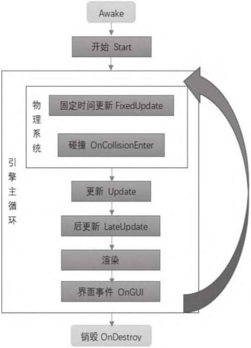

# Unity脚本基础


## 正式开始之前

**新建脚本的方法（2种）：**

1. 在工程窗口的某个文件夹内右键菜单里创建。
2. 选中要添加脚本的物体，在检视窗口中点击Add Component按钮，选择New Script选项。

**给物体挂载脚本的方法（2种）：**

1. 拖拽工程窗口中的脚本文件到场景中的物体上。
2. 拖拽工程窗口中的脚本文件到检视窗口里最下边。

**创建脚本注意事项：**

1. Unity规定，能够挂在到物体上的脚本必须是“脚本组件”（区别于不是组件的脚本文件），脚本组件要继承自MonoBehaviour，且脚本代码中的class名称必须于文件名一致。一般脚本创建时会自动生成部分内容，但如果修改了脚本文件名，那么在挂载时就会报错。这时就必须修改文件名或class名称，让它们一致，这样才能正确挂载。
2. Unity支持一个物体挂载多个同样的脚本组件，但一般来说只需要一个。如果由于操作失误挂载了多个脚本组件，就要删除多余的，这也是建议把脚本文件拖拽到检视窗口内的原因，这样易于确认是否挂载了多个脚本组件。


**Start事件、Update事件：**

`Start()`函数在游戏开始运行的时候执行一次，特别**适合进行组件 初始化**。

`Update()`函数**每帧都会执行**，在**不同设备上更新的频率有所区别**，特别是当系统硬件资源不足时，帧率就会降低，因此`Update()`函数**实际执行的频率是变化的**。

Start和Update又被称为“事件”，因为它们分别是在“**该组件开始运行**”和“**更新该组件**”这两个事件发生时被调用的**。**

### 控制物体移动的基本操作

#### 修改物体位置

在Unity里修改物体位置，实际上就是修改Transform（变换）组件的数据。

在界面中可以修改的参数在脚本中也能修改，而在脚本中可以修改的参数就不一定会在界面上出现了，因为脚本的功能比界面上展示的功能要多得多。

修改Transform组件中的Position有2种常用方法：

1. 使用`Translate()`方法

   ```c#
   // 物体将沿着自身的右侧方向(X轴正方向也称为向右)前进1.5个单位
   transform.Translate(1.5f, 0, 0);
   ```

2. 直接指定新的位置。

   ```c#
   transform.position = new Vector3(1, 2.5f, 3);
   ```

根据C#语法的规定，直接写2.5会被认为是double类型的数，而这里需要的是float类型的数，因此必须加后缀**f**。使用`new`是因为`Vector3`是一个值类型，而position是一个属性，由于C#中引用和值的原理，不能使用`transform.position.y = 2.5f`这种写法直接修改物体的位置。

如果要做一个连续的位移动画，只需要让物体每帧都移动一段很小的距离就可以了。也就是说，可以把改变位置的代码写在Update() 函数里，但是每帧都要比前一帧多改变一些位置。

```c#
void Update () {
	transform.Translate(0, 0, 0.1f);
    //或者:
    //transform.position += new Vector3(0, 0, 0.1f);
}
```

注意，物体位置的两种写法有本质区别：Translate()函数默认为局部坐标系，而修改position的写法是以世界坐标系为参考系。

由于系统繁忙时无法保证稳定的帧率，因此对于上面的写法，如果帧率高，小球移动就快；帧率低，小球移动就慢。

我们需要在“每帧移动同样的距离”和“每秒移动同样的距离”之间做出选择。 按游戏开发的常规方法，应当选择“每秒移动同样的距离”。

举个例子，如果帧率为60帧/秒时物体每帧移动0.01米，那么帧率只有30 帧/秒时就应该每帧移动0.02米，这样才能保证物体移动1秒的距离都是0.6米。

修改如下：

```c#
void Update () {
 transform.Translate(0, 0, 5 * Time.deltaTime);
 //或者:
 //transform.position += new Vector3(0, 0, 5 * Time.deltaTime);
 }
```

`Time.deltaTime`表示两帧之间的间隔，如帧率为60帧/秒时这个值为0.0167秒，帧率只有10帧/秒时这个值为0.1秒，用它乘以移动速度 就可以抵消帧率变化的影响。

由于`Time.deltaTime`是一个比较小的数，因此速度的数值应适当放大一些。

#### 读取和处理输入

Unity支持多种多样的输入设备，如键盘、鼠标、手柄、摇杆、触摸屏等。很多输入设备有着类似的控制方式，如按键盘上的W键或上箭 头键，将手柄的左摇杆向前推，都代表“向上”，用Unity的术语表述则是“沿纵轴（Vertical）向上”。以下代码就可以获取用户当前的纵轴输入和横轴输入。

```c#
void Update () {
    float v = Input.GetAxis("Vertical");
    float h = Input.GetAxis("Horizontal");
    Debug.Log("当前输入, 纵向:"+ v + " " + "横向:" + h);
    transform.Translate(h*10*Time.deltaTime, 0, v*10*Time.deltaTime);
}
```

`Input.GetAxis()`函数的返回值是一个float类型的值，取值范围 为-1~1。

Unity默认将public字段直接放在界面上，用户可以随时修改public字段的值，并且被修改的参数会在下一次Update()函数执行时立即生效。

唯一需要注意的是，运行时的改动都不会被自动保存，需要在调整时记下合适的数字，停止运行后手动修改。

#### 摄像机的移动

摄像机移动的方法（2种）：

1. 像控制物体/角色移动一样为摄像机挂载控制脚本，使其与物体/角色保持同步运动。
2. 更为简单直接地，将摄像机设置为物体/角色的子物体，此时摄像机在没有其他代码控制的情况下会与物体/角色保持相对静止，随着物体/角色移动。

### 触发器事件

抛开高级游戏引擎提供的各种技术，直接判断物体之间的距离就足以实现碰撞检测，即两个物体之间的距离小于某个值，就是碰到了。早期的游戏就是这么做的，不过Unity等现代游戏引擎给出了更统一、更简便的方法——使用触发器。

**触发器**是一个组件，它定义了一个范围。当其他带有碰撞体组件 的物体进入了这个范围时，就会产生一个触发事件，脚本捕捉到这个 事件的时候，就可以做出相应的处理。

#### 创建触发器

在Unity中，触发器和碰撞体共用了同一种组件——Collider，实 际上两者是不同的概念。勾选Box Collider面板中的Is Trigger选 项，碰撞体就变成了同样外形的触发器。

并不是任何物体进入触发器的范围都会产生触发事件。

#### 触发器事件函数

碰撞和触发总是发生在两个物体之间，所以根据不同情况，可以选择其中一个物体进行碰撞或触发的处理。

触发事件实际上有3种，即开始触发（OnTriggerEnter）、触发持续中（OnTriggerStay）及结束触发（OnTriggerExit），分别代表另 一个物体进入触发范围、在触发范围内、离开触发范围这3个阶段。

**提示：**

删除不必要的事件函数是一种良好的编码习惯，可以减少不必要的函数执行。即使是函数体为空的函数，执行时依然会消耗CPU资源。


**小知识：**

**按住Ctrl键拖曳物体的作用**

按住Ctrl键拖曳物体会让其以一个固定值移动（可以在 Edit→Snap Settings中修改这个固定值），调整物体的旋转和缩放时也是同理。这个功能在搭建场景时可以很方便地对齐物体的位置，特别是当物体为同一规格大小时。

**什么是预制体？**

预制体简单来说就是一个事先定义好的游戏物体，之后可以在游戏中反复使用。最简单的创建预制体的方法是直接将场景内的物体拖曳到Project窗口中，这时在Hierarchy（层级）窗口中所有与预制体关联的物体名称都会以蓝色显示（普通物体的名称是黑色）。

**`Time.timeScale`是什么？**

`Time.timeScale`表示游戏的运行时间倍率，设置为0即表示游戏里的时间停滞，1即正常的时间流逝速度，2即两倍于正常的时间流逝速度，以此类推。


## Unity的基本概念

用Unity创建的游戏是由一个或多个场景组成的，默认Unity会打开 一个场景。

在游戏开发时，绝大部分操作都是在某一个场景中进行的，因此一开始不用关心多个场景之间的关系，只需关心在一个场景之内发生的事情。实际上，关键的概念只有`GameObject`（游戏物体）、`Component`（组件）和父子关系3个。

### 游戏物体和组件

“一个游戏场景中有很多物体”这句话很直观地表达了意思，Unity也正是这么设计的。

Unity将游戏中的物体称为`GameObject`，即**游戏物体**。一个场景中可以包含任意数量的游戏物体。

游戏物体只是一个**空的容器**，**专门用来存放组件**。

**组件**是**实现功能特性的单元**。

物体的所有重要或不重要的性质，包括外形、颜色、父子关系、 重量、碰撞体、脚本功能等，甚至包括物体的位置本身，都需要用组件表示。

游戏物体除了名称和标签等基本信息外，本身不具备任何可直观感受到的特性，但它拥有**最关键的一个功能——挂载组件**。

**“挂载”**的意思是**让物体拥有这个组件**，即让组件附属于某个物体。**能够挂载组件**是**游戏物体最主要的功能。**

一个物体可以挂载任意多个组件，只要挂载合适的组件，物体就会 “摇身一变”，变成游戏中的图片、UI界面、模型或摄像机等。多个组件共同作用，就能组成一个有功能性的物体。

#### 1. 空物体

如果游戏物体没有组件，我们就连物体的位置都无法表示。为避免出现这种尴尬的情况，**Unity规定任何物体必须有且只有一个 Transform组件。**也就是说，**Transform组件和物体一一对应。**

因此，所谓的**“空物体”**就是**只包含一个Transform组件的物体**。

空物体没有外形，因此在场景中无法看到它的外观，但是可以对它使用位移、旋转等工具，改变它的位置及其在空间中的朝向。

空物体是游戏开发中最常用的物体类型。空物体要结合“父子关系”才能真正发挥出实际意义。

#### 2. 球体等3D原型物体

与创建空物体的方法类似，再创建一些球体（Sphere）、立方体 （Cube）、平面（Plane）等，它们有一个不常用的名字叫作**原型物体 （Primitive）**。原型物体还包含胶囊体（Capsule）、圆柱体 （Cylinder）、竖直小平面（Quad）。

原型物体在抽象的小游戏中可以直接使用，在正式的游戏项目中， 也可以用来给模型占位置，或者用来设置触发器范围等。

除每个物体都具备的Transform组件外，球体还具有网格过滤器 （Mesh Filter，用于存储网格数据）、网格渲染器（Mesh Renderer）和球体碰撞体组件 （Sphere Collider）。

**三维模型是由三角面组成的网格。**

一个能看到的三维模型是由很多三角面定义的基本外形，以及一 个或多个材质定义的表面视觉属性组合形成的。其中每个材质又可能 包含一张或多张贴图。

目前几乎所有的三维模型都是用三角面表示的，主流硬件设备也是以三角面作为三维模型的基本要素。

三角面网格是用一个个的顶点（用三维坐标表示），以及它们之 间的连线（每三个顶点序号代表一个三角面）表示的。这样就组成了 大量的三角形面，组合为Mesh（网格）。

所有组件的最下方有一个颜色较浅的区域`DefaultMaterial`。它不是组件，而是一个材质，是专门供网格渲染器使用的。

有网格渲染器才能指定材质，删除网格渲染器，材质也会消失。网格渲染器将以指定的材质去渲染物体，得到特定颜色/贴图/反光度/凹凸感的物体。

#### 3. 灯光

Unity场景默认具备一个名为方向光源（Directional Light）的物体，如果没有它，Unity场景将是漆黑一片。

绝大多数场景都会有一个方向光源，作为场景照明的基础。Unity还支持其他类型的光源，如点光源、探照灯光源等，它们与方向光源一样都包含光源组件，区别是光源类型、参数不 同。

#### 4. 摄像机

Unity的场景默认有一个摄像机，叫作Main Camera。如果试着删除它，会发现场景窗口中并没有什么变化，但是Game窗口变成了漆黑一 片。

在3D游戏中，用户看到的应当只是从场景的某个角度看到的一部分，这是显然的，而且是必要的。首先，3D渲染的原理就是从某个角度 观察场景，渲染出从该角度下看到的情景，不指定观察角度和范围就无法进行渲染。其次，从游戏设计角度看，如果玩家能在场景中随意浏 览，就能看到本不应当看到的东西，游戏机制也就乱了套。

因此这里的“摄像机”就充当了玩家的眼睛，其功能是通过 Camera（摄像机）组件实现的。

除了视频还有音频。Audio Listener（音频侦听器）组件也 与Camera组件类似，只不过Camera组件决定游戏画面，Audio Listener 决定游戏音频。3D游戏中的声音也是有位置、强度、范围变化的，3D游 戏也可以模拟出发声的位置，因此Audio Listener的位置会直接影响最终听到的声音。如果音源位置和Audio Listener位置距离过远，玩家甚至会听不到声音。另外也有无播放位置的音效，则无论从哪收听都一样清晰，如电影旁白、界面音效等。 

总之，要在游戏中看到画面，就必须有Camera组件；要想听到声音，就必须有Audio Listener组件。默认的摄像机物体就包含了这两者。

### 变换组件

总体来说，Transform组件掌管着物体的3种空间位置属性：位置、 朝向和缩放比例。

此外，它还有核心功能——“父子关系”。

#### 1. 位置

Transform组件的位置（Position）有X、Y、Z这3个 值，用来表示或修改物体在空间中的位置。其中X代表右方，Y代表上 方，Z代表前方。

这3个值均为浮点数，且符合国际标准单位制，也就是说单位长度是1米。

我们既可以在场景窗口中用位移工具修改物体位置，又可以直接在 Inspector窗口中修改数据来指定物体的位置。

#### 2. 朝向

按照三维设计软件的惯例，Unity中朝向也是用3个角度表示，分别是绕x轴、y轴和z轴的旋转角度，这种用3个角度表示朝向或旋转的方法叫作欧拉角（Euler Angle）。

用欧拉角调整场景中的物体，方便且直观，但实际在软件内部，使用欧拉角表示物体的朝向有着致命的弊端。虽然Unity在编辑 器面板上使用欧拉角表示朝向，但在引擎内部是使用四元数表示朝向和 旋转的。

#### 3. 缩放比例

物体是按比例缩放的，缩放的大小不能代表物体的大小。

缩放本身没有物理单位（或者说单位是1），物体的最终长度是本身长度乘缩放比例得到的。

**缩放默认使用的是物体局部坐标系。**

#### 4. 父子关系

“父子关系”让多个物体形成嵌套的、树形的结构。很多游戏开发 技术，如骨骼动画、指定旋转的锚点、统一物体生命期等问题都可以用 “父子关系”表示或解决。


### 详解父子关系

#### 1. 使用“父子关系”复用零件

在某些游戏引擎中，可以重复使用的零件也被称为“组件”。例如，制作出的一个灯泡既可以用在吊灯上，也可以用在台灯上。但是这 样会带来一个概念上的小问题，因为一旦组件可以单独存在，那么概念就变得复杂了——又多出来一种可以单独存在的“组件”，甚至它还可以有自身的位置，如灯泡在吊灯里的位置是可以调节的。

Unity严格规定了物体和组件分别能做什么、不能做什么。例如， 组件必须挂载于物体之上，不能单独存在；组件本身不具有位置参数； 由于组件与物体是一体的，因此脚本中引用组件实际上是引用了物体。 这样的规定让组件无法独立存在，从表面上看限制了实现时的灵活性。

可以重复使用的灯泡显然是必要的，在很多游戏中都可以找到重复 使用物体的例子。对复用零件的问题，Unity的解决方案是使用子物体。 简单来说，只要把灯泡做成一个单独的物体，然后把它作为吊灯或台灯 的子物体，这样灯泡就成了吊灯或台灯的一部分，问题就解决了。由于子物体可以任意移动位置，因此仍然可以把它放在吊灯的任意位置。

#### 2. “父子关系”与局部坐标系

每个场景整体都有一个大的坐标系，称为世界坐标系。世界坐标系也有x轴、y轴和z轴，在Unity中分别规定为右方、上方、前方。

简单来说，局部坐标系就是父物体自身的坐标系，父物体的位置就是局部坐标系的原点，父物体的右方、上方、前方分别就是局部坐标系 的x轴、y轴和z轴。一旦缩放父物体，所有的子物体也会缩放。

举个实际例子，局部坐标系有一个非常经典的应用——实现房门的 转动。 如果直接旋转一个门，一般门会沿着模型的中线旋转。如果要规定 门的转轴的位置，就可以给门做一个空的父物体，将父物体定位在门的 转轴位置。这时旋转父物体，门就会绕父物体转动了。

#### 3. 用“父子关系”表示角色的骨骼

骨骼动画是现代3D游戏不可或缺的基本功能。简单来说，3D角色不仅有一个模型外观，该模型内部还有一个虚拟的骨骼，这个骨骼的运动会拉扯模型的表面材质跟着运动，这样一来只需要移动骨骼，就可以让模型做出各种动作了。

如果将人类的骨骼结构看作一种连接结构，每一个可旋转的部分都有对应的关节连接。肘的旋转会带动小臂和手的旋转，再结合前文提到的局部坐标系思考，这些骨骼关系正好可以用“父子关系”表示。

事实也确实如此，Unity直接用“父子关系”表示模型骨骼，再在模 型表面蒙上一层可伸缩的网格，就像皮肤一样（皮肤一样的网格组件叫作Skinned Mesh），这样就用“父子关系”解决了骨骼动画的问题。

**小知识：**

**Skinned Mesh Renderer组件**

在Unity中看不到单独的Skinned Mesh组件。带骨骼的三维模型使用Skinned Mesh Renderer统一管理网格和材质，而不像一般的模型用Mesh Filter和Mesh Renderer分别表示。

#### 4. 利用父物体统一管理大量物体

某些游戏会大量生成同类物体，如射击游戏中的子弹物体、塔防游戏中的大量敌人等。很多时候需要统一管理这些子弹，如一起隐藏、一起销毁等。如果它们散布在整个场景中，要同时对它们进行操作就会很麻烦。这时可以创建一个空物体作为父物体，让这些大量的同类对象都成为父物体的子物体。那么只要隐藏父物体，它们就会一起隐藏；只要销毁父物体，它们就会一起销毁。

结合父物体可以轻松设计出有效的物体管理器。

**注意：**

**慎重使用非等比例缩放**

**父物体的缩放会直接引起子物体的缩放**，可以认为父物体缩放后，形成了一个按比例拉伸或收缩的局部坐标系。其中，如果沿x 轴、y轴和z轴缩放的比例相同，就叫作等比缩放，如果沿3个轴缩放 的比例不相等，就叫作非等比缩放。 

等比缩放和非等比缩放实际差异很大。当存在多级嵌套的“父子关系”，每一级物体都具有不同的缩放以及不同的旋转角度时，那么最后一级子物体的局部坐标系将会多么复杂和难以理解。 

Unity官方文档指出：**如果在父物体上使用了非等比缩放，那么在某些特殊情况下有可能导致子物体的位置、朝向计算错误**，因此建议**在父物体上尽可能避免非等比缩放。**


### 物体的标签和层

在设计中可以使用物体的名称标识一个物体，但是很多时候名称会有冗长、重复和易变的问题。

现代游戏引擎都具有**标签（Tag）**这一功能，简单来说，标签就是**物体的另一个名字**，但它有另一些特点。

与标签类似，**层（Layer）**也很常用，它更多的是**与碰撞检测相关**。

#### 1. 标签Tag的简要说明

1. 引擎内部对物体的标签建立了索引。**通过标签查找物体，要比通过名字查找物体快得多**。
2. 标签最多只能有32个。前几个是常用标签，具有特定含义，例如 玩家（Player）、主摄像机（Main Camera）等。后面空白的标签可以自 行定义和使用。
3. 举个例子，在射击游戏中，可以将表示玩家的物体标记为Player，将所有表示怪物的物体标记为Monster。这样无论玩家和怪物的名字是什么，都可以方便地编写逻辑代码。这些标签既便于查找所有怪物，又可以用于判断物体是不是怪物。
4. 善用标签有助于团队协作。例如，事先定义好游戏中的各类标签，很容易就知道某个物体是做什么用的，从而可以让关卡设计师、美术设计师和软件工程师更好地协作。

#### 2. 层（Layer）的简要说明

1. 层与标签一样，也最多只有32个，同样也是前几层有特殊用途， 例如默认层（Default）、透明特效层（TransparentFX）、忽略射线层 （Ignore Raycast），未被引擎占用的层都可以自行定义和使用。
2. 层的**第一个常用用法**就是**定义游戏世界中层与层之间是否发生碰撞**。例如，足球游戏中，可以让足球和场上的裁判处于不同的层，且让两个层不会碰撞，这样可以避免很多麻烦。
3. 层的**第二个常用用法**与**射线检测**有关。“射线”是一条虚拟的线，大部分触屏、鼠标操作的3D游戏都要用到它。例如，用户单击地面时，就会向游戏世界发射一条射线，以确定单击到了什么位置。有时障碍物会阻挡射线，这时就可以设定该射线仅与地面层碰撞，而不与障碍 物层碰撞，从而改善操作体验。

### 常用组件

Unity的组件非常庞杂，但用户可以随时制作新的组件，也可以在资 源商店（Asset Store）里下载更多组件。

Transform, Light, Camera, Post Processing, Mesh Filter, Mesh Renderer, Skinned Mesh Render, Mesh Collider, Sphere Collider, Box Collider, Capsule Collider, Character Controller, Rigidbody, Particle System, Audio Source, Audio Listener, Animation, Animator, Navmesh Agent, Terrian。

## 用脚本获取物体和组件

### 物体、组件、对象

先澄清一个基本问题：某个自己编写的脚本是一种组件类（class），挂载到物体上的脚本是一个实例化的组件，即一个对象（编程语言中的object）。

从面向对象的角度来看，Unity的逻辑架构是非常自然的。一个游戏物体是一个对象；**没有被挂载到物体上的脚本，是一个未被实例化的类**，暂时还不是具体的对象；当脚本被挂载到物体上以后，就成了一个实实在在的对象。

例如，同一个脚本被挂载到物体A上2次，又被挂载到物体B上1次，这样就创建了该脚本的3个实例，共有3个脚本组件对象。

脚本在执行时，一般已经挂载到了某个物体上。因此在脚本代码中，可以随时访问脚本目前挂载到了哪个物体对象，直接用gameObject 即可。

```c#
// 输出脚本当前所挂载的物体对象的名称
Debug.Log(gameObject.name);
//完整写法：Debug.Log(this.gameObject.name);
```

在脚本代码中，this表示该脚本对象自身，而gameObject是当前脚本的一个属性，指的是当前的物体， 因此可以直接获取到。

### 获取组件的方法

获得某个物体以后，就可以通过物体获取到它的每一个组件。

举个例子：先创建一个球体，新建一个脚本文件Test并将其挂载到球体上， 脚本内容保持默认。

为了获取到Sphere Collider组件，可以直接用游戏物体的 GetComponent()方法，将Test脚本内容修改如下：

```c#
using UnityEngine;
public class Test : MonoBehaviour
{
    SphereCollider collider;
    void Start()
    {
        // 获取到组件后，将它的引用保存在collider字段中，方便下次使用
        collider = gameObject.GetComponent<SphereCollider>();
    }
}
```

以上是很常见的获取组件的代码，即先从当前脚本组件获取到游戏物体，再到游戏物体中找到某种组件。

Transform组件也可以用GetComponent()方法获得，但是由于Transform组件太过常用，因此随时可以通过字段transform访问到 Transform组件，不需要通过代码获取。

Unity为了方便，设计了获取组件的简便写法。其思路是，在同一个物体上，从任意一个组件出发都可以直接获取到其他组件，不需要先获取游戏物体。例如：

```c#
collider = gameObject.GetComponent<SphereCollider>();
// 以下每一句写法均与上面一句等价
collider = this.GetComponent<SphereCollider>();
collider = GetComponent<SphereCollider>(); // 同上，省略了this
collider = transform.GetComponent<SphereCollider>(); // 通过transform组件获得其他组件
collider = transform.GetComponent<MeshRenderer>().GetComponent<SphereCollider>();
collider = transform.GetComponent<SphereCollider>().GetComponent<SphereCollider>();// 多此一举的写法，但是结果也正确
```

这里有一个明显的推论，也是编程时的常 用技巧——可以用物体上任意一个组件代表该物体。也就是说，物体的一部分可以指代物体本身，因为它们同属于一个物体。

当一个物体可能包含多个同类型组件时，也可以直接获取到所有同类的组件，该方法名为GetComponents，它会返回一个装着所有找到的组件的数组。

```c#
void Start()
{
    // 获取到所有的脚本组件，放在数组中
    Test[] tests = GetComponents<Test>();
    Debug.Log(" 共有 " + tests.Length + " 个Test 脚本组件 ");
}
```

如果运行游戏，发现在Console窗口中输出了3遍“共有3个Test脚本 组件”，可以分析一下为什么。

### 获取物体的方法

因为很多时候都需要让代码同时操作多个不 同的物体，这样才能得到更高的灵活性。例如玩家开枪时，要同时控制枪、子弹和火焰粒子等。

#### 1. 通过名称获取物体

可以通过物体的名称直接获取物体，使用`GameObject.Find()`方法即 可。新建一个立方体，并挂载一个TestGetGameObject脚本，内容如下：

```c#
public class TestGetGameObject : MonoBehaviour
{
    GameObject objMainCam;
    GameObject objMainLight;
    void Start()
    {
        objMainCam = GameObject.Find("Main Camera");
        objMainLight = GameObject.Find("Directional Light");
        Debug.Log("主摄像机：" + objMainCam.name);
        Debug.Log("主光源：" + objMainLight.name);
        // 将主摄像机放在这个物体后方1米的位置
        objMainCam.transform.position = transform.position - transform.forward;
    }
}
```

以上代码获取了场景中的摄像机物体和方向光源物体，接着又把主 摄像机移动到该脚本所在的物体后方1米。

`GameObject.Find()`方法比较常用，但是它有**两个弊端**。

1. GameObject.Find()方法**无法找到未激活的物体**。
2. GameObject.Find()方法需要**遍历场景中的所有物体**，从**性能**上看是**非常低效**的。

本质上GameObject.Find()方法需要遍历场景中的所有物体才能找到指定名字的物体（如果有多个重名物体，则会返回 最先找到的那个）。

由于遍历物体会造成性能问题，因此这种方法非常低效，但在简单场景里很难察觉。而在一个完整的游戏中，场景中经常会有成千上万个物体，那时的效率差异就会相当明显。

但是这也不代表就不能使用GameObject.Find()方法，例如按照现在的写法，仅在Start()方法中调用一次GameObject.Find()，然后将物体保存在变量objMainCam中，以后都不用再重新查找，这样就不会产生明显的效率差异。

#### 2. 通过标签查找物体

标签可以用来高效地查找物体，具体方法就是 先指定物体的标签，然后使用如下方法：

```c#
// 查找第一个标签为Player的物体
GameObject player = GameObject.FindGameObjectWithTag("Player")
// 查找所有标签为Monster的物体，注意返回值是一个数组，结果可以是0 个或多个
GameObject[] monsters = GameObject.FindGameObjectsWithTag("Monster");
// 注：以上两个方法名称的区别是两者差了一个“s”
```

除了在编辑器中修改物体的标签，也可以在脚本中修改物体的标签。

```c#
// 获得某个Player物体
GameObject m = GameObject.FindGameObjectWithTag("Player");
// 将它的标签设置为Cube
m.tag = "Cube";
// 判断m的标签是不是Cube
If (m.CompareTag("Cube"))// CompareTag用法等价于m.tag == "Cube"，推荐使用CompareTag
{
 ...
}
```

用标签查找物体的效率明显优于用名称查找物体。 

以上就是在场景中直接查找并获取物体的几种方法，再加上通过“父子关系”获取同一物体上的所有组件，将这些知识组合在 一起，就掌握了快速定位任意物体或组件的方法。

### 在物体和组件之间任意遨游

#### 1. 通过“父子关系”获取物体

在Unity中，“父子关系”的表达是Transform组件的职责。

transform.Find(), transform.GetChild(), transform.GetChildCount(), transform.GetSiblingIndex(), transform.IsChildOf()

transform.parent, transform.root, transform.childCount

#### 2. 通过父子路径获取物体

查找物体的路径与操作系统的文件路径类似。当需要指明下一级节点时，就写出该节点的名称。

如果还要继续指明下一级，就加上斜杠符 号“/”分隔。

如果要引用上一级节点，使用两个英文句号“..”即可。 

这样一来，理论上从一个物体出发就可以获取到场景中任意一个节点。

```c#
using UnityEngine;
public class TestGetTransform : MonoBehaviour
{
    void Start()
    {
        Transform rightLeg = transform.Find("Character1 _ Reference/Character1 _Hips/Character1 _ RightUpLeg");
        Debug.Log("获得了" + rightLeg.gameObject.name);
        Transform root = rightLeg.Find("../../..");
        Debug.Log("从右腿回到第一层节点" + root.gameObject.name);
        Transform leftLeg = rightLeg.Find("../Character1 _LeftUpLeg");
        Debug.Log("从右腿出发找到左腿" + leftLeg.gameObject.name);
    }
}
```

上文的代码演示了3种情况。一是从根节点出发获取右腿；二是从右腿出发获取根节点，连用了3个“..”；三是从右腿出发获取左腿，方法是先返回上一级，再查找左腿。

#### 3. 其他查找父子物体的方式

使用路径已经足够用来查找父子物体了，但某些情况下使用另一些方法更合适。例如获取父物体可以用transform.parent属性。

```c#
// 以下两种写法等价，p1与p2相同
Transform p1 = transform.parent;
Transform p2 = transform.Find("..");
```

获取子物体时，可以用子物体序号指定：

```c#
Transform hips = transform.Find("Character1 _Reference/Character1 _ Hips");
Transform rightLeg = hips.GetChild(1);
```

既然能用序号获取子物体，那么如果能知道子物体的总数，然后再结合二者使用就能得到遍历子物体的方法。很多时候要对所有子物体做统一的操作，只要结合使用`transform.GetChild()`方法和 `transform.childCount()`方法即可，其示例代码如下：

```c#
void Test()
{
    for (int i=0; i<transform.childCount; i++)
    {
        GameObject child = transform.GetChild(i).gameObject;
        Debug.Log("第"+ i +"个子物体名称为:" + child.name);
        Debug.Log("它还有 " + child.transform.childCount + "个下一级子物体");
    }
} 
```

#### 4. 一些有用的技巧

在实际游戏开发中，经常用嵌套的多层“父子关系”表示一个复杂 物体。为了方便起见，Unity提供了一系列直接从子物体中获取组件的方法，有了它们就不需要像GetComponent()方法那样先找到对应物体才能获取组件。这是一系列很实用的方法，虽然它们也可以用基本方法组合而成的方法代替，但是使用它们在很多情况下能精简代码，事半功倍：

GetComponentInChildren(), GetComponentsInChildren(), GetComponentInParent(), GetComponentsInParent()

注意，以上方法以及常规的GetComponent()方法都可以通过任意游戏物体或任意组件调用，因为这些方法位于Unity的基类Object里，而游戏物体与组件都继承了Object类。

### 利用公开变量引用物体和组件

首先在任意脚本组件中，添加一个公开的GameObject类型的变量。

```c#
using UnityEngine;
public class TestGetTransform : MonoBehaviour
{
    public GameObject other;
    void Start(){
        if (other != null)
        {
            Debug.Log("other 物体名称为 "+other.name);
        }
        else
        {
            Debug.Log(" 未指定 other物体 ");
        }
    }
}
```

然后查看Inspector窗口，脚本属性中会多一个该变量的编辑框，默认值为None(类型）。可以直接把任意符合该类型的物体拖曳到编辑框中。

得益于自洽的物体、组件体系，脚本中也可以使用任意组件类型的变量代替GameObject。

```c#
using UnityEngine;
public class TestGetTransform : MonoBehaviour
{
    public GameObject other;
    public Transform otherTrans;
    public MeshFilter otherMesh;
    public Rigidbody otherRigid;
    void Start()
    {
        // 可以任意使用前面定义的变量
    }
}
```

以上代码会改变Inspector窗口中的脚本属性。以Other Mesh编辑框为例，任何具有Mesh Filter组件的物体都可以被拖入此框里，但是没有Mesh Filter组件的物体就不能被拖进来。

Unity中每个组件一定有所挂载的物体。虽然变量的类型为Mesh Filter，但它所代表的是具有Mesh Filter的对象，而不是独立存在的组件。

这种拖曳的编辑方式在大型游戏项目中也很常用，某些项目往往会 在脚本中使用数十个可编辑的公开变量，甚至会使用可改变长度的组件 列表，方便添加更多数据，这也有助于程序员与设计师的协作。但是也 有一些开发团队不喜欢这种方式，因为容易拖入错误的物体。具体是否使用这种方法依具体情况而定，但可以肯定的是，它是一种值得考虑的方案。

拖曳组件或物体来引用其他物体的方式非常直观方便，而且可以用 组件类型作为限制，防止拖入错误类型的物体。

总结一下，**获取物体和组件的方式**主要有以下**6种**：

1. 通过**名称**或**标签**，可以找到任意未禁用的物体。 
2. 通过**“父子关系**”，从一个物体出发，可以沿路径找到任意物体。
3. 只要获得了某个**游戏物体**或者**该物体上的任意组件**，就可以得到所有其他组件，也可以**通过任意组件获得物体本身**。
4. 可以**遍历某个物体下一级的所有子物体**。（遍历所有层级的子物体需要用到搜索算法）
5. 编写脚本组件时，**this**是指**当前的脚本组件**，**this.gameObject**就是**本组件所挂载的物体**，**this.transform**则是**本物体的Transform组件**。
6. 可以使用**公开变量**的方式，**在编辑器里拖曳或选取物体**。

## 用脚本创建物体

很多时候，无法事先创建所有需要的物体，如子弹、炮弹或随机刷新的怪物。这些物体要么是根据玩家操作而随时创建，要么是依据游戏玩法在特定时刻创建，都无法事先确定它们在什么时候出现。

用脚本动态创建物体，即在游戏进行中创建物体，是一项基本功能。

### 预制体

简单来说，预制体就是一个物体的模板，可以随时从Project窗口再 次拖入场景，这就相当于用模板又创建了一个物体。

在游戏开发的实践中，一般将可能需要动态创建的物体，如怪物、 子弹、导弹等都事先做成预制体，然后在游戏运行过程中由脚本负责创建即可。

#### 1. 场景物体与预制体的关联

任何由预制体创建的物体，都会在Inspector窗口中多3个工具按钮（Open, Select, Override）。

这些工具按钮用于场景物体和预制体之间的操作。

**Open**：打开预制体。单击它可以打开单独的预制体编辑场景，对预制体的编辑会应用到所有关联的物体。

**Select**：选中预制体文件。单击它，Project窗口将自动定位到预制体文件，这个功能可以方便地找到当前物体是从哪一个预制体创建的。

**Overrides**：覆盖预制体。对物体的参数和组件做修改后，预制体文件本身是不变的。单击此按钮后，会弹出一个小窗口提示用户具体修改了哪些属性。

这个小窗口提供了丰富的功能。首先，确认了修改内容后，单击小 窗口的Apply All按钮可以让这些修改应用到物体上；而单击Revert All 按钮则会撤销所有改动，让物体回到和预制体相同的状态。

另外，小窗口中的每一个具体改动也是可以单击的，单击单独一项改动可以查看和对比修改细节，并且还可以单独应用（Apply All按钮） 或撤销（Revert All按钮）某一项改动。

**注意谨防对预制体的误操作**：

由于对预制体的改动会应用到所有关联的物体上，因此在单击 Apply All按钮时要考虑清楚，谨防不慎修改大量物体。如发现误操作，可以及时使用相应指令撤销上一次操作，快捷键为Ctrl+Z。

#### 2. 编辑预制体

在新版本的Unity中，除了可以先修改物体再应用到预制体外，还可以在单独的场景中编辑预制体。鼠标左键双击预制体文件，打开一个独立的场景，在这个场景中对预制体的编辑会保存到预制体文件中。 编辑完成后，单击Hierarchy窗口左上方的向左的箭头，就可以回到主场景。

### 创建物体

利用预制体创建物体，要使用实例化方法`Instantiate()`。它需要一 个预制体的引用作为模版，返回值总是新创建那个物体的引用。如果预制体以GameObject类型传入，那么返回的结果也是GameObject类型。

**任意物体都可以作为模版，但不一定是预制体。**

预制体的类型是GameObject。有时候由于写代码时的失误，用场景中的某个物体作为Instantiate()方法的第1个参数，同样也能成功创建新物体。

这说明在游戏运行以后，预制体和其他物体有着同等的地位，都可以使用。这种设计一方面增强了脚本的灵活性，另一方面也经常出现因混淆而引起的各种bug。关键是要搞清楚引用对象的关系。

在实际使用时，有时候要具体指定新建物体的位置、朝向和父物体，因此Instantiate()方法也具有多种重载形式，它们的区别在于参数不同。

Instantiate方法的3种常用的重载形式：

| 重载形式               | 参数1  | 参数2                                                       | 参数3                      | 参数4                                                       |
| ---------------------- | ------ | ----------------------------------------------------------- | -------------------------- | ----------------------------------------------------------- |
| 仅指定父物体           | 预制体 | 父物体的Transform类型，null表示没有父物体，置于场景根节点。 |                            |                                                             |
| 指定位置和朝向         | 预制体 | 空间位置，世界坐标系，Vector3类型                           | 物体的朝向，Quaternion类型 |                                                             |
| 指定位置、朝向和父物体 | 预制体 | 空间位置，世界坐标系，Vector3类型                           | 物体的朝向，Quaternion类型 | 父物体的Transform类型，null表示没有父物体，置于场景根节点。 |

**预制体也可以用组件代表。**

查看Instantiate方法的原型，会发现第1个参数的类型有点奇怪。Instantiate方法的第1个参数是预制体，理应是一个GameObject类型，但实际上，这个参数的类型有Object和泛型两种。

这是由于此方法在设计时，兼容了“用组件代表预制体”这一用 法，前面提过组件也可以代表所挂载的物体。如果用某个预制体上挂 载的组件作为模板，那么Instantiate方法依然会把该物体创建出 来，同时返回新物体上同名的组件。这种设计虽然保持了功能不变， 但少了一步获取组件的操作。 

从学习的角度出发，将Instantiate看作一种单纯的创建物体的 方法，有利于排除细节的干扰，抓住问题的本质。

例子：

```c#
using UnityEngine;
public class TestInstantiate : MonoBehaviour
{
    public GameObject prefab;
    void Start()
    {
        // 在场景根节点创建物体
        GameObject objA = Instantiate(prefab, null);
        // 创建一个物体，作为当前脚本所在物体的子物体
        GameObject objB = Instantiate(prefab, transform);
        // 创建一个物体，指定它的位置和朝向
        GameObject objC = Instantiate(prefab, new Vector3(3,0,3), Quaternion.identity);
    }
}
```

以上代码利用预制体创建了3个物体，而且为了获得预制体的引用，特地将prefab变量公开，以便在编辑器中给它赋值。

先在编辑器中给prefab设置初始值，然后再运行脚本，就会以prefab为模版，创建3个物体。

有时需要有规则地创建一系列物体。例如10个物体 等间距围成一个标准的环形，这种情况用编辑器拖曳是很难做到精确 的，最好是用脚本创建它们，其代码如下：

```c#
using UnityEngine;
public class TestInstantiate : MonoBehaviour
{
    public GameObject prefab;
    void Start()
    {
        // 创建10个物体围成环形
        for (int i=0; i<10; i++)
        {
            Vector3 pos = new Vector3(Mathf.Cos(i * (2*Mathf.PI)/10), 0, Mathf.Sin(i*(2*Mathf.PI)/10));
            pos *= 5; // 圆环半径是5
            Instantiate(prefab, pos, Quaternion.identity);
        }
    }
}
```

### 创建组件

创建组件并将其添加到物体上，通常使用GameObject.AddComponent()方法。

```c#
using UnityEngine;
public class TestInstantiate : MonoBehaviour
{
    void Start()
    {
        GameObject go = GameObject.Find("Cube");
        go.AddComponent<Rigidbody>();
    }
}
```

AddComponent使用时要带上一个尖括号，里面写上要创建的组件的 类型。这种写法与GetComponent类似，它们都利用了C#的泛型语法。 AddComponent是GameObject类的方法，调用主体是某个游戏物体。

### 销毁物体和组件

使用Destroy()方法可以销毁物体或组件。

```c#
using UnityEngine;
public class TestDestroy : MonoBehaviour
{
    public GameObject prefab;
    void Start()
    {
        // 创建20个物体围成环形
        for (int i=0; i<20; i++)
        {
            Vector3 pos = new Vector3(Mathf.Cos(i* (2*Mathf.PI)/20), 0, Mathf.Sin(i*(2*Mathf.PI)/20));
            pos *= 5; // 圆环半径是5
            Instantiate(prefab, pos, Quaternion.identity);
        }
    }
    void Update()
    {
        if (Input.GetKeyDown(KeyCode.D))
        {
            GameObject cube = GameObject.Find("Cube(Clone)");
            Destroy(cu be);
        }
    }
}
```

这段代码演示了创建物体与销毁物体，它是在之前创建物体的代码 基础上修改而成的。运行游戏时，会先创建20个物体，然后每当用户按D键，就会删除一个物体。

```c#
void Update()
 {
    if (Input.GetKeyDown(KeyCode.D))
    {
        GameObject cube = GameObject.Find("Cube(Clone)");
        Destroy(cube);
        cube.AddComponent<Rigidbody>();
    }
 }
```

Unity在设计之初就考 虑了引用失效的问题，因此在执行Destroy()方法后，并不会立即销毁该物体，而是稍后放在合适的时机去销毁。这样就保证了在当前这一帧里，对cube的操作不会产生错误。

在个别情况下如果有立即销毁的需求，Unity提供了`DestroyImmediate()`方法。

在游戏开发中，代码执行的“时机”是一个根本性的难题，实践中大量bug背后都是时机不合适导致的。

### 定时创建和销毁物体

游戏中延迟创建物体和延迟销毁物体是常见的需求。 

延迟创建物体一般用于等待动画结束和定时刷新怪物等。延迟销毁 物体则用于定时让子弹、尸体消失等情况，因为游戏中的物体不能只创 建而不销毁，不然物体会越来越多，从而导致游戏卡顿甚至无响应。 

延迟需要准确定时，如在未来的第几秒执行。

这里用简易的Invoke()方法。Invoke()方法有两个参数，第1个参数是以字符串表示的**方法名称**，第2个参数表示**延迟的时间**，单位为秒。 

Invoke()方法可以**延迟调用一个方法**，但要求**该方法没有参数**也**没有返回值**。 

可以用Invoke()方法编写一个每隔0.5秒生成一个物体的动态效果，其代码如下：

```c#
using UnityEngine;
public class TestInvoke : MonoBehaviour
{
    public GameObject prefab;
    int counter = 0;
    void Start()
    {
        Invoke("CreatePrefab", 0.5f);
    }
    void CreatePrefab()
    {
        Vector3 pos = new Vector3(Mathf.Cos(counter * (2 * Mathf.PI) / 10), 0, Mathf.Sin(counter * (2 * Mathf.PI) / 10));
        pos *= 5; // 圆环半径是5
        Instantiate(prefab, pos, Quaternion.identity);
        counter++;
        if (counter < 10)
        {
            Invoke("CreatePrefab", 0.5f);
        }
    }
}
```

由于Invoke()方法不支持参数，因此需要用巧妙的方式实现。上面的代码依靠在被调用方法的内部再次调用Invoke()，模拟实现了循环过程，并用counter计数器限制了循环的次数。

与延迟创建物体类似，延迟销毁也同样可以用Invoke()实现。但延迟销毁的需求更为常见，因此Unity为Destroy()方法增添了延时的功能。Destroy()方法的第2个参数就可以用于指定销毁延迟的时间。

```c#
void Update()
 {
    if (Input.GetKeyDown(KeyCode.D))
    {
        GameObject cube = GameObject.Find("Cube(Clone)");
        Destroy(cube, 0.8f);//延迟0.8 秒
    }
 }
```

## 脚本的生命周期

脚本的生命周期（MonoBehaviour Lifecycle）是Unity官方给出的术语。

可以简单理解为，一个脚本的创建和销毁两个关键事件，以及在此过程中可能触发的各种事件。

这里最关心的是所有事 件的种类，以及它们的触发时机，因为脚本逻辑只有写在合适的事件里，且在合适的时机执行，才能恰到好处地实现想要的功能。

首先要确定，脚本虽然功能强大，但它毕竟是Unity的众多系统之一，完全受到引擎的管理和调度。在脚本中可以编写各种功能，但什么时候脚本会被调用，这完全由Unity决定。

以熟悉的Start()方法和Update()方法为例。当在组件脚本中写下Update()方法时，就意味着向引擎“注册”了更新事件。当引擎对所有 组件执行更新操作时，也会捎带这个脚本组件。反过来说，如果没有定义Update()方法，那么引擎在更新时，就会跳过这个脚本。

**建议彻底删除不需要的事件方法：**

默认脚本中已经写好了Start方法和Update方法。如果不需要Update方法，最好将它的定义彻底删除。只要Update存在，就算内容是空的，这个空白的方法也会被调用，理论上每秒会带来数十次 调用方法的性能开销。虽然这个性能开销很小，但是调用频率较高且毫无必要。

可以把引擎每一帧需要做的事，想象成在标准跑道上跑一圈。在跑 一圈的过程中会有很多项常规工作，也有一些突发事件需要处理。引擎 允许脚本订阅它所挂载物体的各类事件，当这个事件发生时，引擎就会通知脚本组件，并运行相应的方法。这些事件的种类较多，大体上包含 了初始化、物理计算、更新、渲染和析构等方面。

### 理解脚本的生命周期



脚本代码的执行，只是引擎整体运行的一个小环节。由于脚本执行时还占用着计算资源，引擎还等待着脚本执行完毕，因此脚本方法必须尽快执行，尽快返回。如果方法的执行时间超过了数十毫秒，就会引起明显的脚本卡顿，如果脚本出现了死循环等问题，就会导致整个游戏进程卡死。

由于不能妨碍引擎的正常运行，因此当需要延迟或定时执行操作时，不能用死循环或休眠等方式，以免影响代码的执行。

**死循环会导致Unity程序卡死：**

在脚本中出现死循环等情况，会导致Unity主进程卡死。如果彻底卡死无响应，就只能用计算机操作系统的任务管理器强行结束任务。

### 常见的事件方法

MonoBehaviour的事件非常多，官方文档中共列举了64个。下面将其 中较为常见的几十个事件按逻辑分类，并列举出来：

| 事件                       | 说明                                             |
| -------------------------- | ------------------------------------------------ |
| Awake                      | 脚本被加载后调用，时机早于Start                  |
| Start                      | 脚本可用的第一帧，正好在第一次Update之前调用1    |
| Update                     | 每帧调用                                         |
| LateUpdate                 | 每帧调用，保证在所有的Update执行过后才执行       |
| FixedUpdate                | 物理更新，会尽可能确保调用频率                   |
| OnCollisionEnter           |                                                  |
| OnCollisionStay            |                                                  |
| OnCollisionExit            |                                                  |
| OnTriggerEnter             |                                                  |
| OnTriggerStay              |                                                  |
| OnTriggerExit              |                                                  |
| OnCollisionEnter2D         |                                                  |
| OnCollisionStay2D          |                                                  |
| OnCollisionExit2D          |                                                  |
| OnTriggerEnter2D           |                                                  |
| OnTriggerStay2D            |                                                  |
| OnTriggerExit2D            |                                                  |
| OnParticleCollision        |                                                  |
| OnParticleSystemStopped    |                                                  |
| OnParticleTrigger          |                                                  |
| OnGUI                      | 渲染与处理GUI事件时调用                          |
| OnEnble                    | 物体被激活时调用                                 |
| OnDisable                  | 物体被禁用时调用                                 |
| OnDestroy                  | 销毁组件时调用                                   |
| OnPreRender                | 即将渲染事件，某个摄像机开始渲染前调用           |
| OnRenderObject             | 渲染事件，某个摄像机渲染场景时调用               |
| OnPostRender               | 渲染后事件，某个摄像机结束渲染时调用             |
| OnWillRenderObject         | 每个摄像机渲染非UI的可见物体时调用               |
| OnPreCull                  | 摄像机进行可见性裁剪之前调用                     |
| OnTransformChildrenChanged | 物体的子物体发生变化时调用                       |
| OnTransformParentChanged   | 物体的父物体发生变化时调用                       |
| OnApplicationFocus         | Game窗口失去焦点或获得焦点时调用                 |
| OnApplicationPause         | 游戏暂停时调用                                   |
| OnApplicationQuit          | 游戏退出时调用                                   |
| OnBecameVisible            | 物体变得可见时调用                               |
| OnBecameInvisible          | 物体变得不可见时调用                             |
| OnMouseDown                | 鼠标在UI元素或碰撞体上按下时调用                 |
| OnMouseDrag                | 鼠标在UI元素或碰撞体上持续按下时调用             |
| OnMouseEnter               | 鼠标进入UI元素或碰撞体范围内时调用               |
| OnMouseExit                | 鼠标离开UI元素或碰撞体范围内时调用               |
| OnMouseOver                | 鼠标在UI元素或碰撞体范围内时，每帧调用           |
| OnMouseUp                  | 用户放开鼠标按键时调用                           |
| OnMouseUpAsButton          | 用户在同一个UI元素或碰撞体上，松开鼠标按键时调用 |

例子（跟随摄像机）：

```c#
//挂载到Main Camera
using UnityEngine;
public class FollowCam : MonoBehaviour
{
    // 追踪的目标，在编辑器里指定
    public Transform followTarget;
    Vector3 offset;
    void Start()
    {
        // 算出从目标到摄像机的向量，作为摄像机的偏移量
        offset = transform.position - followTarget.position;
    }
    void LateUpdate()
    {
        // 每帧更新摄像机的位置
        transform.position = followTarget.position + offset;
    }
}
```

### 触发器事件

如果没有触发器，就需要用大量数学运算来检测物体之间的碰撞。

例子：

在默认场景中创建一个立方体和一个球体。

1. 假设小球是运动的，且已经有了碰撞体组件。给小球添加 Rigidbody组件，并勾选刚体的Is Kinematic选项。
2. 假设立方体表示一个静止的范围，勾选立方体的Box Collider中的 Is Trigger选项，将它变成一个触发器。
3. 如果需要一个透明但有触发效果的范围，可以禁用立方体的Mesh Renderer组件。
4. 创建脚本TestTrigger，并将其挂载到立方体上，其内容如下：

```c#
using UnityEngine;
public class TestTrigger : MonoBehaviour
{
    private void OnTriggerEnter(Collider other)
    {
        Debug.Log("---- 碰撞！ " + other.name);
    }
    private void OnTriggerStay(Collider other)
    {
        Debug.Log("---- 碰撞持续中…… " + Time.time);
    }
    private void OnTriggerExit(Collider other)
    {
        Debug.Log("==== 碰撞结束 " + other.name);
    }
}
```

如果仔细观察，会发现输出信息的时间间隔是0.02秒，这正是默认的FixedUpdate事件的时间间隔。

注意：**必须给运动的碰撞体加上刚体组件：**

要让两个物体之间产生触发器事件或者碰撞事件，就要求其中一个物体必须带有刚体组件（可以是动力学刚体）。如果两个物体均不含刚体组件，那么就不会触发物理事件。

在两个物体中，应当给运动的物体挂载刚体组件（可以是动力学刚体）。

如果需要一个透明但有触发效果的范围，可以禁用物体的Mesh Renderer组件。