# C#委托与事件


# 一、委托

> 委托就是方法的管理器、调度器。
>
> 委托把方法当参数传递和调度。

## Delegate

“ 委托的老大——Delegate类。”

C#的Delegate类似C的指针，不同的是C的指针既可以指方法又可以指变量，而且可以进行类型转换。

C的指针实际上是内存地址变量它既可以直接操作内存，又可以通过内存地址直接访问变量，直接调用方法。

C#的Delegate是强类型，在委托声明时，就已经指定了该变量只能指向具有特定参数和返回值的方法。

使用Delegate可以直接建立任何名称的委托类型，当进行系统编译时，系统将自动生成此类型

我们可以使用“ delegate void delegateName() ”的格式建立一个委托类。

在建立委托对象时，委托的参数类型必须与委托方法相对应。只要往委托对象的构造函数输入方法名，委托就会直接绑定此方法。

使用" DelegateName.Invoke(stringMessage); "可以显式调用委托的方法。实际操作中，我们无须使用Invoke方法，直接使用“ DelegateName(); ”即可。

使用反编译指令ILDASM.exe可以观察其成员。由ILDASM.exe中可以看到，它继承了System.MulticastDelegate类，并自动生成BeginInvole、EndInvoke、Invoke等三种常用方法。

Invoke方法用于同步调用委托对象的对应方法，BeginInvoke、EndInvoke用于以异步的方式调用对应方法。

MulticastDelegate是System.Delegate的子类，是一个特殊类，编译器和其他工具可以从此类派生，但自定义类不能显式地从此类进行派生。它支持多路广播委托，并拥有一个带有链接的委托列表，在调用多路广播委托时，系统将按照调用列表中的委托出现顺序来同步调用这些委托。

MulticastDelegate具有两个常用属性：Method、Target。其中Method用于获取委托所表示的方法Target用于获取当前调用的类实例。

## 例1（无返回值的委托，技能激活）

```c# Program.cs
using System;
using System.Collections.Generic;
using System.Linq;
using System.Text;
using System.Threading.Tasks;

namespace ProjectDelegate
{
    delegate void Skills();//声明一个委托，返回类型和要绑定的方法返回类型一致

    class Program
    {      
        static void Main(string[] args)
        {
            Skills skills = new Skills(MeleeSkill01);
            //委托是一个类，现在实例化一个委托Skills，一定要传入一个方法名
            //也可以直接写成：Skills skills = MeleeSkill01;
            skills += MeleeSkill03;//再绑定一个方法
            skills += MeleeSkill02;

            RangeSkill rangeSkill = new RangeSkill();
            skills += rangeSkill.RangeSkill02;
            skills += rangeSkill.RangeSkill01;

            Console.WriteLine("------Round 1------");
            skills.Invoke();//同步调用委托对象skills的方法

            Console.WriteLine("\n------Round 2------");
            skills -= MeleeSkill01;//从委托中去掉指定的方法
            skills -= rangeSkill.RangeSkill01;
            skills += rangeSkill.RangeSkill03;
            skills.Invoke();//也可以直接写成：skills();
        }

        public static void MeleeSkill01()
        {
            Console.WriteLine("Meleeskill 01 is activated !");
        }

        public static void MeleeSkill02()
        {
            Console.WriteLine("Meleeskill 02 is activated !");
        }

        public static void MeleeSkill03()
        {
            Console.WriteLine("Meleeskill 03 is activated !");
        }

    }
    
    class RangeSkill
    {
        public void RangeSkill01()
        {
            Console.WriteLine("RangeSkill 01 is activated !");
        }

        public void RangeSkill02()
        {
            Console.WriteLine("RangeSkill 02 is activated !");
        }

        public void RangeSkill03()
        {
            Console.WriteLine("RangeSkill 03 is activated !");
        }
    }
}
```

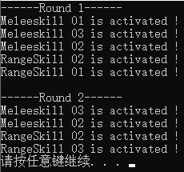

## 例2（无返回值的委托，任务逻辑）

```c# Program.cs
using System;
using System.Collections.Generic;
using System.Linq;
using System.Text;
using System.Threading.Tasks;

namespace ProjectDelegate
{
    delegate void Quests(Player player);

    class Program
    {        
        static void Main(string[] args)
        {
            Player player = new Player(100);

            Quests quests = Quest01;
            quests += Quest02;
            quests += Quest03;

            Console.WriteLine("Player stamina : 100\n");
            quests(player);
        }

        public static void Quest01(Player player)
        {
            if (player.Stamina > 0)
            {
                Console.WriteLine("Quest01 Begin !");

                player.Stamina = player.Stamina - 10;
                Console.WriteLine("Stamina -10 !");

                Console.WriteLine("Quest01 Complete !");
                Console.WriteLine("Player stamina : " + player.Stamina + "\n");
            }                
            else
            {
                Console.WriteLine("Quest01 fail !");
            }
        }

        public static void Quest02(Player player)
        {
            if (player.Stamina > 0)
            {
                Console.WriteLine("Quest02 Begin !");

                player.Stamina = player.Stamina - 20;
                Console.WriteLine("Stamina -20 !");

                Console.WriteLine("Quest02 Complete !");
                Console.WriteLine("Stamina : " + player.Stamina + "\n");
            }
            else
            {
                Console.WriteLine("Quest02 fail !");
            }
        }

        public static void Quest03(Player player)
        {
            if (player.Stamina > 0)
            {
                Console.WriteLine("Quest03 Begin !");

                player.Stamina = player.Stamina - 30;
                Console.WriteLine("Stamina -30 !");

                Console.WriteLine("Quest03 Complete !");
                Console.WriteLine("Player stamina : " + player.Stamina + "\n");
            }
            else
            {
                Console.WriteLine("Quest03 fail !");
            }
        }
    }
    
    class Player
    {
        float stamina;
        //构造
        public Player(float stamina)
        {
            this.stamina = stamina;
        }
        //封装
        public float Stamina
        {
            get
            {
                return stamina;
            }
            set
            {
                stamina = value;
            }
        }
    }
}
```

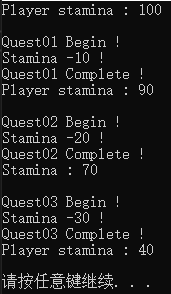

## 例3（有返回值的委托）

```c# Program.cs
using System;
using System.Collections.Generic;
using System.Linq;
using System.Text;
using System.Threading.Tasks;

namespace ProjectDelegate
{
    delegate string Steps();
    
    class Program
    {        
        static void Main(string[] args)
        {
            Steps steps = Step01;
            steps += Step02;
            steps += Step03;
            Console.WriteLine("------Round 1------");
            Console.WriteLine("The return value of steps() is " + steps());
            
            steps += Step02;
            steps -= Step01;
            Console.WriteLine("\n------Round 2------");
            Console.WriteLine("The return value of steps() is " + steps());
        }
        
        public static string Step01()
        {
            Console.WriteLine("Step01");
            return "Step01";
        }

        public static string Step02()
        {
            Console.WriteLine("Step02");
            return "Step02";
        }

        public static string Step03()
        {
            Console.WriteLine("Step03");
            return "Step03";
        }
    }
}
```

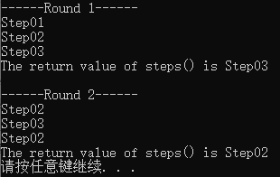

## 例4（多路委托）

例1、例2、例3均使用多路委托。

多路委托：一个委托绑定并调用了多个方法。

## 例5（泛型委托，任务逻辑）

```c#  Program.cs
using System;
using System.Collections.Generic;
using System.Linq;
using System.Text;
using System.Threading.Tasks;

namespace ProjectDelegate
{
    delegate void Quests<T>(T t);//使用泛型来声明委托

    class Program
    {        
        static void Main(string[] args)
        {
            Warrior warrior = new Warrior(100);
            Mage mage = new Mage(200);

            Quests<Warrior> questsW = Quest01;
            questsW += Quest02;

            Quests<Mage> questsM = Quest03;
            questsM += Quest04;

            questsW(warrior);
            questsM(mage);
        }

        public static void Quest01(Warrior warrior)
        {
            if (warrior.Stamina > 0)
            {
                Console.WriteLine("Warrior has completed Quest01 !");
                warrior.Stamina = warrior.Stamina - 100;
            }                
            else
            {
                Console.WriteLine("Quest01 fail !");
            }
        }

        public static void Quest02(Warrior warrior)
        {
            if (warrior.Stamina > 0)
            {
                Console.WriteLine("Warrior has completed Quest02 !");
            }
            else
            {
                Console.WriteLine("Quest02 fail !");
            }
        }

        public static void Quest03(Mage mage)
        {
            if (mage.Mana > 0)
            {
                Console.WriteLine("Mage has completed Quest03 !");
            }
            else
            {
                Console.WriteLine("Quest03 fail !");
            }
        }

        public static void Quest04(Mage mage)
        {
            if (mage.Mana > 0)
            {
                Console.WriteLine("Mage has completed Quest04 !");
            }
            else
            {
                Console.WriteLine("Quest04 fail !");
            }
        }
    }
    
    class Warrior
    {
        float stamina;
        //构造
        public Warrior(float stamina)
        {
            this.stamina = stamina;
        }
        //封装
        public float Stamina
        {
            get
            {
                return stamina;
            }
            set
            {
                stamina = value;
            }
        }
    }

    class Mage
    {
        float mana;
        //构造
        public Mage(float mana)
        {
            this.mana = mana;
        }
        //封装
        public float Mana
        {
            get
            {
                return mana;
            }
            set
            {
                mana = value;
            }
        }
    }
}
```

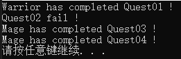

# 二、事件

事件是一种特殊的委托，它为委托提供了封装性，即：

1. 允许从类的外部增加、删除方法；

2. 不允许从类的外部来调用委托绑定的方法。

事件为委托对象隐式地建立起**add MethodName()**、**remote MethodName()**两个方法，用作**注册**与**注销**事件的处理方法。而且事件对应的**成员变量**将会被视为**private变量**，外界无法越过事件所在对象直接访问它们。

观察事件的编译过程可知，在编译时，系统为事件自动建立add EventName()、remote EventName()方法。

事件通过“+=”、“-=”两种方式注册或注销方法，使用“+=”或“-=”操作符时，系统自动调用对应的add MethodName()、remote MethodName()进行处理。

## event关键字

使用格式：

```c#
public delegate Type DelegateName()
public event DelegateName EventName;
```

## 例1（连锁反应）

```c#  Program.cs
using System;
using System.Collections.Generic;
using System.Linq;
using System.Text;
using System.Threading.Tasks;

namespace ProjectEvent
{
    class Program
    {
        static void Main(string[] args)
        {
            Guy guy = new Guy();
            Cat cat = new Cat();
            Dog dog = new Dog();
            Home home = new Home(guy, cat, dog);

            home.alarm += cat.Attack;//不能写home.alarm = cat.Attack;只能 "+=" 或 "-="。
            home.alarm += dog.Attack;
            home.alarm += guy.Awake;
            home.Life("peace");//不触发alarm。
            Console.WriteLine("------------");
            home.Life("thief enter.");//触发alarm。
            //无法直接使用home.alarm();
        }
    }
    class Guy
    {
        public void Sleep()
        {
            Console.WriteLine("This Guy is sleeping.");
        }

        public void Awake()
        {
            Console.WriteLine("This Guy is Awaked.");
        }
    }

    class Cat
    {
        public void Sunbath()
        {
            Console.WriteLine("The cat is sunbathing.");
        }
        public void Attack()
        {
            Console.WriteLine("The cat attacks.");
        }
    }

    class Dog
    {
        public void Play()
        {
            Console.WriteLine("The dog is catching a rat.");
        }

        public void Attack()
        {
            Console.WriteLine("The dog barks.");
        }
    }

    delegate void Alarm();//声明委托

    class Home
    {
        Guy guy;
        Cat cat;
        Dog dog;
        public event Alarm alarm;//声明事件

        public void Life(string action)
        {
            if (action == "peace")
            {
                guy.Sleep();
                cat.Sunbath();
                dog.Play();
            }
            else
            {
                if(alarm != null)
                {
                    alarm();
                }
            }

        }
        //构造
        public Home(Guy guy, Cat cat, Dog dog)
        {
            this.guy = guy;
            this.cat = cat;
            this.dog = dog;
        }
        //封装
        internal Guy Guy { get => guy; set => guy = value; }
        internal Cat Cat { get => cat; set => cat = value; }
        internal Dog Dog { get => dog; set => dog = value; }
    }
}
```

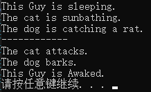


**注意**：

1. 在例1中，Home类的Life方法的事件alarm如果绑定方法不为空，即可使用alarm(string)来引发事件，但在外部的Main方法中直接使用home.Life(string)引发事件，将导致系统发出错误报告。

2. 在事件所处的对象之外，事件只能出现在+=、-=的左边。

## 例2（交通信号）

```c#  Program.cs
using System;
using System.Collections.Generic;
using System.Linq;
using System.Text;
using System.Threading.Tasks;
using System.Threading;

namespace ProjectEvent
{
    delegate void Notify(bool IsPass);//声明一个委托
    interface NotifyPass //声明一个接口
    {
        event Notify notify;
    }

    class Program
    {
        static void Main(string[] args)
        {
            TestTrafficLight();
        }

        public static void TestTrafficLight()
        {
            TranfficSignal signal = new TranfficSignal();
            Bus bus = new Bus();
            People people = new People();
            signal.notify += bus.Movement;
            signal.notify += people.Movement;
            while(true) signal.Wait();
            
        }
    }
    class TranfficSignal : NotifyPass
    {
        public event Notify notify;//声明一个事件
        bool IsPass = false;
        public void Wait()
        {
            for(int i=10; i >= 0; i--)
            {
                Thread.Sleep(1000);//线程休眠一秒
                Console.WriteLine(i);
            }
            IsPass = !IsPass;
            notify(IsPass);
        }
    }
    class Bus
    {
        public void Movement(bool IsPass)
        {
            Console.WriteLine(IsPass?"Bus go !":"Bus await.");
        }
    }
    class People
    {
        public void Movement(bool IsPass)
        {
            Console.WriteLine(IsPass?"People go !":"People await.");
        }
    }
}
```

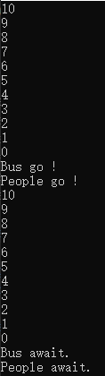

## 匿名方法绑定事件

## 例1（交通信号）

```c#  Program.cs
using System;
using System.Collections.Generic;
using System.Linq;
using System.Text;
using System.Threading.Tasks;
using System.Threading;

namespace ProjectEvent
{
    delegate void Notify(bool IsPass);
    interface NotifyPass //声明一个接口
    {
        event Notify notify;
    }

    class Program
    {
        static void Main(string[] args)
        {
            TestTrafficLight();
        }
        public static void TestTrafficLight()
        {
            TranfficSignal signal = new TranfficSignal();
           
            signal.notify += delegate (bool pass)
            {
                Console.WriteLine(pass ? "Bus go !" : "Bus await");
            };
            signal.notify += delegate (bool pass)
            {
                Console.WriteLine(pass ? "People go !" : "People await");
            };
            signal.notify += delegate (bool pass)
            {
                Console.WriteLine(pass ? "Carriage go !" : "Carriage await");
            };
            while (true) signal.Wait();
        }
    }
    class TranfficSignal : NotifyPass
    {
        public event Notify notify;
        bool IsPass = false;
        public void Wait()
        {
            for(int i=10; i >= 0; i--)
            {
                Thread.Sleep(1000);
                Console.WriteLine(i);
            }
            IsPass = !IsPass;
            notify(IsPass);
        }
    }
}
```

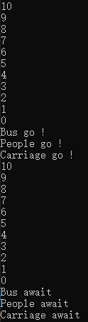

# 三、Lambda

在Framework 2.0以前，声明委托的唯一方法时通过方法命名，从Framework 2.0起，系统开始支持匿名方法。

通过匿名方法，可以直接把一段代码绑定给事件，减少了实例化委托所需的编码系统开销。

从Framework 3.0起，Lambda表达式逐渐取代匿名方法，作为编写内联代码的首选方式。

总体来说，Lambda表达式使用更简单的方式编写匿名方法，彻底简化委托的使用方式。

## 例1（交通信号）

```c#  Program.cs
using System;
using System.Collections.Generic;
using System.Linq;
using System.Text;
using System.Threading.Tasks;
using System.Threading;

namespace ProjectEvent
{
    delegate void Notify(bool IsPass);
    interface NotifyPass //声明一个接口
    {
        event Notify notify;
    }

    class Program
    {
        static void Main(string[] args)
        {
            TestTrafficLight();
        }
        public static void TestTrafficLight()
        {
            TranfficSignal signal = new TranfficSignal();
           
            signal.notify += (p) => 
            {
                Console.WriteLine(p ? "Bus go !" : "Bus await");
            };
            signal.notify += (p) => 
            {
                Console.WriteLine(p ? "People go !" : "People await");
            };
            signal.notify += (p) =>{ Console.WriteLine("Ambulance GO!!!");};
            while (true) signal.Wait();
        }
    }
    class TranfficSignal : NotifyPass
    {
        public event Notify notify;
        bool IsPass = false;
        public void Wait()
        {
            for(int i=10; i >= 0; i--)
            {
                Thread.Sleep(1000);
                Console.WriteLine(i);
            }
            IsPass = !IsPass;
            notify(IsPass);
        }
    }
}
```

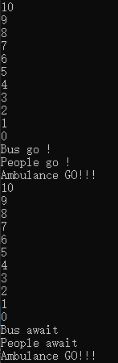

# 四、类库中的委托

## 例1（角色信息排序）

```c#  Program.cs
using System;
using System.Collections.Generic;
using System.Linq;
using System.Text;
using System.Threading.Tasks;
using System.Threading;

namespace ProjectEvent
{
    class Program
    {
        static void Main(string[] args)
        {
            ListSort();
        }

        public static void ListSort()
        {
            List<Character> list = new List<Character>()
            {
                new Character("Warrior", 100, 2000),
                new Character("Mage", 120, 1000),
                new Character("Ranger", 80, 1500)
            };

            list.Sort((x, y) => { return (int)(x.Health - y.Health); });
            Console.WriteLine("\n按生命值排序: \nName\tHealth\tDaseDamage");
            foreach(var item in list)
            {
                Console.WriteLine(item);
            }

            list.Sort((x, y) => { return (int)(x.BaseDamage - y.BaseDamage); });
            Console.WriteLine("\n按攻击力排序: \nName\tHealth\tDaseDamage");
            foreach (var item in list)
            {
                Console.WriteLine(item);
            }

            list.Sort((x, y) => { return x.Name.CompareTo(y.Name); });//
            Console.WriteLine("\n按名字排序: \nName\tHealth\tDaseDamage");
            foreach (var item in list)
            {
                Console.WriteLine(item);
            }
        }
    }
    class Character
    {
        string name;
        float health;
        float baseDamage;

        public Character(string name, float health, float baseDamage)
        {
            this.name = name;
            this.health = health;
            this.baseDamage = baseDamage;
        }

        public string Name { get => name; set => name = value; }
        public float Health { get => health; set => health = value; }
        public float BaseDamage { get => baseDamage; set => baseDamage = value; }

        public override string ToString()
        {
            return String.Format("{0}\t{1}\t{2}", name, health, BaseDamage);
        }
    }
}
```

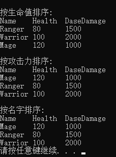

参考[List\<T\>.Sort方法详情](https://docs.microsoft.com/en-us/dotnet/api/system.collections.generic.list-1.sort?view=netcore-3.1#System_Collections_Generic_List_1_Sort)

# 五、常用委托

# Action

泛型委托Action由系统提供，无须声明。

Action支持0~16个参数，可以按需求任意使用，无返回值。

```C#
Action<>

Action<T>

Action<T1, T2>

...

Action<T1, T2, ..., T16>
```

## 例1（交通信号）

```c#  Program.cs
using System;
using System.Collections.Generic;
using System.Linq;
using System.Text;
using System.Threading.Tasks;
using System.Threading;

namespace ProjectAction
{
    interface NotifyPass //声明一个接口
    {
        event Action<bool> notify;
    }
    class Program
    {
        static void Main(string[] args)
        {
            TestTrafficLight();
        }
        public static void TestTrafficLight()
        {
            TranfficSignal signal = new TranfficSignal();
            signal.notify += (p) =>
            {
                Console.WriteLine(p ? "Bus go !" : "Bus await");
            };
            signal.notify += (p) =>
            {
                Console.WriteLine(p ? "People go !" : "People await");
            };
            signal.notify += (p) => { Console.WriteLine("Ambulance GO!!!"); };
            while (true) signal.Wait();
        }
 
        class TranfficSignal : NotifyPass
        {
            public event Action<bool> notify;
            bool IsPass = false;
            public void Wait()
            {
                for (int i = 10; i >= 0; i--)
                {
                    Thread.Sleep(1000);
                    Console.WriteLine(i);
                }
                IsPass = !IsPass;
                notify(IsPass);
            }
        }
    }
}
```

结果同：三、Lambda|例1

# Func

委托Func与Action相似，同样支持0~16个参数，不同在于Func必须具备返回值。

```c#
Func<TResult>
Func<T, TResult>
Func<T1, T2, TResult>
Func<T1, T2, ..., T16, TResult>
```

## 例1（计算实际伤害）

```c# Program.cs
using System;
using System.Collections.Generic;
using System.Linq;
using System.Text;
using System.Threading.Tasks;

namespace ProjectFunc
{
    class Program
    {
        static void Main(string[] args)
        {
            Attack(
                new Character("Warrior1", 500, 300, 100, 2),
                new Character("Warrior2", 600, 400, 90, 3)
                );
        }
        public static void Attack(Character c1, Character c2)
        {
            //作为内联代码，外部无法获知
            Func<float, float, float, float> damage = (b, f, a) =>
            {
                return b * f - a;
            };

            Console.WriteLine("{0}对{1}的实际伤害：{2}",
                  c1.Name, c2.Name, damage(c1.BaseDamage, c1.Factor, c2.Armor));
            Console.WriteLine("{0}对{1}的实际伤害：{2}",
                  c2.Name, c1.Name, damage(c2.BaseDamage, c2.Factor, c1.Armor));
        }
    }
    class Character
    {
        string name;
        float health;
        float baseDamage;
        float armor;
        float factor;

        public Character(string name, float health, float baseDamage, float armor, float factor)
        {
            this.name = name;
            this.health = health;
            this.baseDamage = baseDamage;
            this.armor = armor;
            this.factor = factor;
        }

        public string Name { get => name; set => name = value; }
        public float Health { get => health; set => health = value; }
        public float BaseDamage { get => baseDamage; set => baseDamage = value; }
        public float Armor { get => armor; set => armor = value; }
        public float Factor { get => factor; set => factor = value; }
    }
}
```

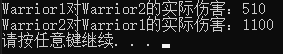

## 例2

```c# Program.cs
using System;
using System.Collections.Generic;
using System.Linq;
using System.Text;
using System.Threading.Tasks;

namespace Project_Func
{
    class Program
    {
        //Action支持绑定1~16个带参数的方法
        //Func支持绑定1~16个带参数的方法，但这些带参数的方法都必须有返回值
        static Func<int, int, int> func1;
        static void Main(string[] args)
        {
            //将方法与委托进行绑定
            //func1 = Test;
            func1 += Test;
            func1 += Test2;
            //将委托调用的时候，实际就是调用绑定的方法
            int result = func1(100, 500);//实际只返回Test2的结果
            Console.WriteLine("结果1是：" + result);
            //取消委托的注册，实际上就是移除掉绑定的方法
            func1 -= Test2;
            int result2 = func1(100, 500);
            Console.WriteLine("结果2是：" + result2);

            //把它当作方法的参数进行传递
            int result3 = Test3(Test2, 100, 500);
            Console.WriteLine("结果3是：" + result3);
        }

        public static int Test(int a, int b)
        {
            return a + b;
        }
        public static int Test2(int a, int b)
        {
            return a * b;
        }
        //回调，有时候也不是很方便，这时可以换用Action
        public static int Test3(Func<int,int,int> callback, int a, int b)
        {
            Console.WriteLine("Test3...");
            if(callback != null)
            {
                return callback(a, b);
            }
            return 0;
        }
    }
}
```

程序运行结果：

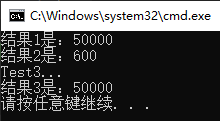
