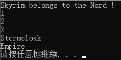
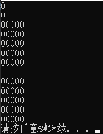
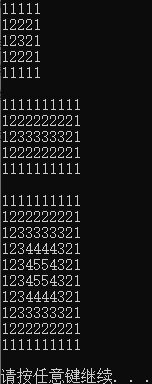
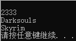

# C#数据结构（二）Array

# 一、Array数组的创建与访问

数组为数据结构中的顺序表。
Array是抽象的基类（“数组世界的老大”），提供CreateInstance方法来创建数组

```c#
Array obj1 = Array.CreateInstance(typeof(string), 10);
Array obj2 = Array.CreateInstance(typeof(string), 2, 3, 4);
```

数组的局限性：
1. 元素个数固定，且必须在创建数组时知道元素个数；
2. 元素类型必须相同；
3. 只能通过索引访问数组元素。

## 例1（用Array创建数组，并访问）

```c#
using System;
using System.Collections.Generic;
using System.Linq;
using System.Text;
using System.Threading.Tasks;

namespace ProjectArray
{
    class Program
    {
        static void Main(string[] args)
        {
            CreateArray();
            ForeachArray(new int[] { 1, 2, 3 });
            ForeachArray(new String[] { "Stormcloak", "Empire" });
        }
        public static void ForeachArray(Array array)
        {
            for (int i = 0; i < array.Length; i++)
            {
                Console.WriteLine(array.GetValue(i));
            }
        }
        public static void CreateArray()
        {
            //子类直接创建数组
            int[] array01;
            String[] array02;
            //直接用Array的方式创建数组
            Array array03 = Array.CreateInstance(typeof(String), 10);
            //等价于String[] array03 = new String[10];
            
            //Console.WriteLine(array03[0]);错误用法，会报错，因为Array不支持索引器
            array03.SetValue("Skyrim belongs to the Nord !", 0);
            Console.WriteLine(array03.GetValue(0));            
        }
    }
}
```



# 二、多维数组

数组的数组即为多维数组。

## 例1（多维数组创建与访问）

```c#
using System;
using System.Collections.Generic;
using System.Linq;
using System.Text;
using System.Threading.Tasks;

namespace ProjectArray
{
    class Program
    {
        static void Main(string[] args)
        {
            MutipleRanksArray();
        }
        public static void MutipleRanksArray()
        {
            //Array方式（统一处理数组才推荐）
            Array array01 = Array.CreateInstance(typeof(int),5,5);
            Console.WriteLine(array01.GetValue(1,1));
            //子类方式（一般推荐）
            int[,] array02 = new int[5, 5];
            Console.WriteLine(array02[1,1]);

            for (int i = 0; i < array01.GetLength(0); i++)//array01.Length返回的是所有维数的元素数
                //Array.GetLength方法返回指定为维度中的元素数，参数为Array从0开始的维度。
            {
                for (int j = 0; j < array01.GetLength(1); j++)
                {
                    Console.Write(array01.GetValue(i,j));
                }
                Console.WriteLine();
            }
            
            Console.WriteLine();
            
            for (int i = 0; i < array02.GetLength(0); i++)        
            {
                for (int j = 0; j < array02.GetLength(1); j++)
                {
                    Console.Write(array02[i, j]);
                }
                Console.WriteLine();
            }
        }
    }
}
```



## 例2（用二维数组打印出回型矩阵）

```c#
using System;
using System.Collections.Generic;
using System.Linq;
using System.Text;
using System.Threading.Tasks;

namespace ProjectArray
{
    class Program
    {
        static void Main(string[] args)
        {
            Task(5,5);
            Task(5,10);
            Task(10,10);

        }
        public static void Task(int rows, int cols)
        {   //111111
            //122221
            //123321
            //122221
            //111111

            //i, j
            //0,0->4,5 1圈起来的范围
            //1,1->3,4 2圈起来的范围
            //2,2->2,3 3圈起来的范围

            //5,6 => 3
            //5,7 => 3
            //5,(>=5) => 3
            //6,6 => 3
            //7,7 => 4
            //8,8 => 4
            //(min+1)/2 行和列的最小值决定中间的值
            
            int[,] array = new int[rows, cols];
            //覆盖式循环赋值
            for (int i = 0; i < (Math.Min(rows,cols) + 1) / 2; i++)
            {
                //第一次覆盖：1;第二次：2，... ;i+1
                //每一次覆盖都让行覆盖范围的两端往回缩,即第i行到第rows-i行
                for (int j = i; j < (rows - i); j++)
                {	//每一次覆盖都让列覆盖范围的两端往回缩，即第i列到第cols-i列
                    for (int k = i; k < (cols - i); k++)
                    {
                        array[j, k] = i + 1;
                    }
                }
            }

            for (int i = 0; i < rows; i++)
            {
                for (int j = 0; j < cols; j++)
                {
                    Console.Write(array[i, j]);
                }
                Console.WriteLine();
            }
            Console.WriteLine();
        }
    }
}

```



# 三、Array类的练习

## 题目

1. 设置一个数组只能读取，无法修正。
2. 为一个数组进行排序。
3. 清空一个数组，为下一次的填充做准备。
4. 将一个数组的后一半合并到另一个数组中。
5. 如何判定两个数组是否相等。
6. 查询某元素在数组中的第一次出现的索引位置。
7. 查询某元素在数组中的最后一次出现的索引位置。
8. 将数组反序。
9. 怎么为数组扩容。

## 解答

## 1

```c#
using System;
using System.Collections.Generic;
using System.Linq;
using System.Text;
using System.Threading.Tasks;
using System.Collections.ObjectModel;

namespace ProjectArray
{
    class Program
    {
        static void Main(string[] args)
        {
            ReadOnlyCollection<int> read = ReadOnlyArray(new int[] { 1, 2, 3 });

        }
        public static ReadOnlyCollection<int> ReadOnlyArray(int[] array)
        {
            ReadOnlyCollection<int> read = Array.AsReadOnly(array);
            //read[0] = 10;只能看不能改。
            Console.WriteLine(read[0]);
            return read;
        }
	}
}   
```

## 2

```c#
using System;
using System.Collections.Generic;
using System.Linq;
using System.Text;
using System.Threading.Tasks;

namespace ProjectArray
{
    class Program
    {
        static void Main(string[] args)
        {
            //ReadOnlyCollection<int> read = ReadOnlyArray(new int[] { 1, 2, 3 });
            SortArray();
        }
        public static void SortArray()
        {
            String[] str = { "Darksouls","Skyrim",null,"2333"};
            Array.Sort(str);
            ForeachArray(str);
        }
        public static void ForeachArray(Array array)
        {
            for (int i = 0; i < array.Length; i++)
            {
                Console.WriteLine(array.GetValue(i));
            }
        }
    }
}
```



## 3

```c#

```

