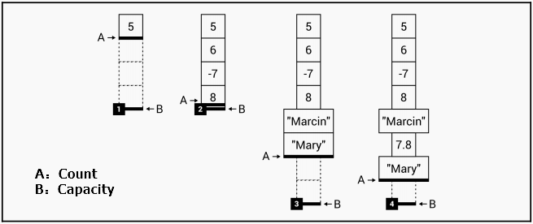
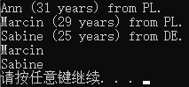
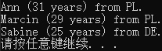

# C#数据结构：List

# 一、简单列表

## ArrayList列表

```c#
ArrayList arrayList = new ArrayList();
arrayList.Add(5);//添加单个元素
arrayList.AddRange(new int[] { 6, -7, 8 });//添加多个元素
arrayList.AddRange(new object[] { "Marcin", "Mary" });//添加多个元素
arrayList.Insert(5, 7.8);//在指定索引插入元素
```

如果要指定列表中元素的类型，则需使用泛型List。

如何通过索引访问列表？

```c#
object firt = arrayList[0];
int third = (int)arrayList[2];
```

因为ArrayList中存储的都是object类型的元素，所以要复制到其他类型的变量上需要强行转换。

使用foreach循环访问列表中的所有元素：

```c#
foreach (object element in arrayList)
{
    Console.WriteLine(element);
}
```

除此之外，ArrayList还有很多属性和方法供协助你的开发。

首先来看看**属性Count和Capacity**。

```c#
int count = arrayList.Count;
int capacity = arrayList.Capacity;
```

arrayList.Count返回列表中存储的元素数目，arrayList.Capacity返回列表可以存储多少个元素。每当我们往列表中添加一个元素时，arrayList.Capacity会自动增加到合适的数字。



**Contains方法**用于检查列表是否存在某个具体元素

```c#
bool containsMary = arrayList.Contains("Mary");
```

如果该元素存在则arrayList.Contains()返回true，否则返回false。

**IndexOf和LastIndexOf方法**用于查询某一元素的索引。

```c#
int minusIndex = arrayList.IndexOf(-7);
```

IndexOf返回元素在列表中第一次出现的索引，LastIndexOf返回元素在列表中最后一次出现的索引，如果找不到这个索引，则返回-1。

**Remove、RemoveRange方法**用于删除元素：

```c#
arrayList.Remove(5);//传入参数：元素的值，如果有相同，只删除第一次出现的元素。
arrayList.RemoveRange(1,2)//传入参数：起始索引、删除元素个数。
arrayList.Clear();//删除所有元素
```

**Reverse方法**用于将列表的元素倒序排列

**ToArray方法**用于将ArrayList列表中的所有元素复制到一个Array数组里。

关于ArrayList的详细信息，请参考： https://msdn.microsoft.com/library/system.collections.arraylist.aspx

## 泛型List

ArrayList虽然有一系列的属性，但ArrayList不是强类型列表。想要发挥强类型的优势，需要使用泛型List列表来表示集合，这样我们随时可以增加或减少列表的存储空间大小。

关于泛型List的详细信息，请参考：https://msdn.microsoft.com/library/6sh2ey19.aspx.

```c#
List<double> numbers = new List<double>();
do
{
 Console.Write("Enter the number: ");
 string numberString = Console.ReadLine();
 if (!double.TryParse(numberString, NumberStyles.Float,
 new NumberFormatInfo(), out double number))
 {
 break;
 }
 numbers.Add(number);
 Console.WriteLine($"The average value: {numbers.Average()}");
}
while (true);
```

## 例1：求平均值

```c# Program.cs
using System;
using System.Collections.Generic;
using System.Linq;
using System.Text;
using System.Threading.Tasks;
using System.Globalization;

namespace ListAndDictionary
{
    class Program
    {
        static void Main(string[] args)
        {
            List<double> numbers = new List<double>();
            do
            {
                Console.Write("Enter the number: ");
                string numberString = Console.ReadLine();
                if (!double.TryParse(numberString, NumberStyles.Float,
                new NumberFormatInfo(), out double number))
                {
                    break;
                }
                numbers.Add(number);
                Console.WriteLine($"The average value: {numbers.Average()}");
            }
            while (true);
        }
    }
}
```

在该例中，用户每输入一个数，先检测该输入能否成功转为浮点型，成功则添加到numbers列表中，然后计算并打印numbers里所有元素的平均值，失败则退出循环。

## 例2：人物信息列表

```c# Program.cs
using System;
using System.Collections.Generic;
using System.Linq;
using System.Text;
using System.Threading.Tasks;
using System.Globalization;

namespace ListAndDictionary
{
    class Program
    {
        static void Main(string[] args)
        {
            List<Person> people = new List<Person>();
            people.Add(new Person(){Name = "Marcin",Country = CountryEnum.PL,Age = 29});
            people.Add(new Person(){Name = "Sabine",Country = CountryEnum.DE,Age = 25});
            people.Add(new Person(){Name = "Ann",Country = CountryEnum.PL,Age = 31});

            List<Person> results = people.OrderBy(p => p.Name).ToList();

            foreach (Person person in results)
            {
                Console.WriteLine($"{person.Name} ({person.Age} years) from {person.Country}.");
            }
            //LINQ表达式：
			//方法语法
            List<string> names = people.Where(p => p.Age <= 30)
                                    .OrderBy(p => p.Name)
                                    .Select(p => p.Name)
                                    .ToList();
            //查询语法
            //List<string> names = (from p in people
            //                      where p.Age <= 30
            //                      orderby p.Name
            //                      select p.Name).ToList();

            foreach (string n in names)
            {
                Console.WriteLine(n);
            }
        }
    }
    public class Person
    {
        public string Name { get; set; }
        public int Age { get; set; }
        public CountryEnum Country { get; set; }
    }
    public enum CountryEnum
    {
        PL,
        UK,
        DE
    }
}
```



# 二、排序列表

关于SortedList的详细信息，参考：https://msdn.microsoft.com/library/ms132319.aspx

例1：地址册

```c# Program.cs
using System;
using System.Collections.Generic;
using System.Linq;
using System.Text;
using System.Threading.Tasks;
using System.Globalization;

namespace ListAndDictionary
{
    class Program
    {
        static void Main(string[] args)
        {
            SortedList<string, Person> people = new SortedList<string, Person>();
            people.Add("Marcin", new Person(){Name = "Marcin",Country = CountryEnum.PL,Age = 29});
            people.Add("Sabine", new Person(){Name = "Sabine",Country = CountryEnum.DE,Age = 25});
            people.Add("Ann", new Person(){Name = "Ann",Country = CountryEnum.PL,Age = 31});
            foreach (KeyValuePair<string, Person> person in people)
            {
                Console.WriteLine($"{person.Value.Name} ({person.Value.Age} years) from { person.Value.Country}.");
            }
        }
    }
    public class Person
    {
        public string Name { get; set; }
        public int Age { get; set; }
        public CountryEnum Country { get; set; }
    }
    public enum CountryEnum
    {
        PL,
        UK,
        DE
    }
}
```



# 三、链表


# 四、循环列表


# 总结

