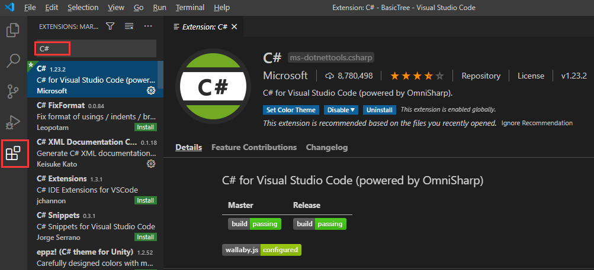
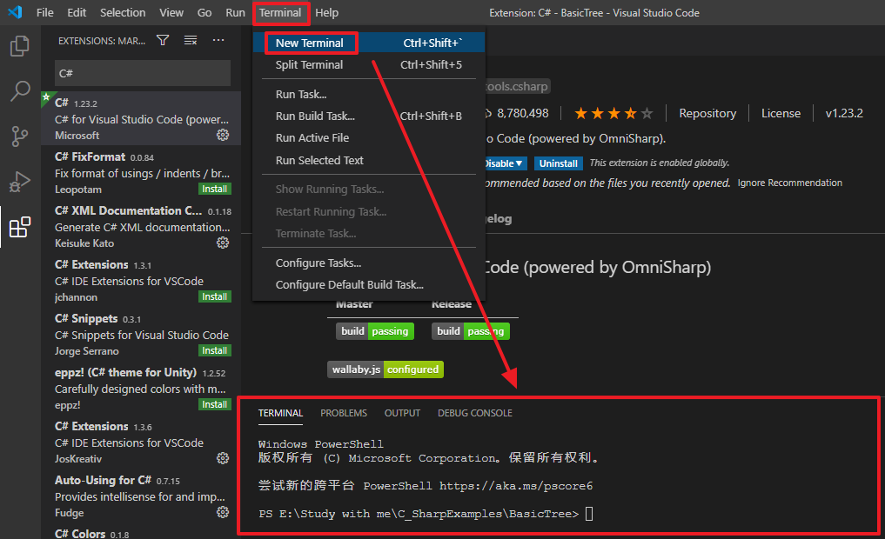
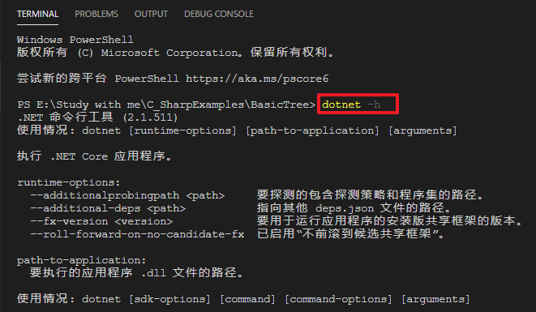
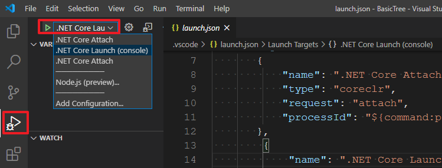

# C#的VSCode开发环境搭建

和VS不同，VS省去的步骤，在VSCode需要开发者自己操作

<!--more-->

[下载安装VSCode](https://code.visualstudio.com/)

[下载安装.NetCore SDK](https://dotnet.microsoft.com/download)

打开VSCode，安装C#所需插件：C#，推荐再安装C# Extensions。

在VSCode里打开终端命令窗口，cd到项目文件夹下。

输入命令`dotnet -h`，返回以下内容说明.NET SDK安装成功。

输入并执行命令`dotnet new console`以项目文件夹为项目名新建控制台项目。在生成的Program.cs里编写脚本即可。

怎么无调试运行？

需要配置launch.json 和 task.json这两个配置文件。在VSCode上切换到Debug页面，点击按钮添加启动配置,选择.Net Core,会在项目目录自动生成launch.json

打开launch.json，修改 **program** 选项，其中：**insert-target-framework-here** 替换为 .net core版本，比如（netcoreapp2.1.551）
**insert-project-name-here** 替换为 YourProjectName.dll，结果如下：
`"program": "${workspaceFolder}/bin/Debug/netcoreapp2.1.551/BasicTree.dll",`

按F5启动调试项目会发现一个失败的错误提示，原因是没有配置task.json。在弹出的对话框点击**Configure Task**，然后在下拉菜单中选择.**Net Core**即可。

**运行控制台应用的方式：**

一、（推荐）在VSCode的控制台窗口cd到项目文件夹下输入命令`dotnet run`，回车。

二、（不推荐）通过菜单栏|Run|Start Debugging调试或者Run Without Debugging无调试运行。