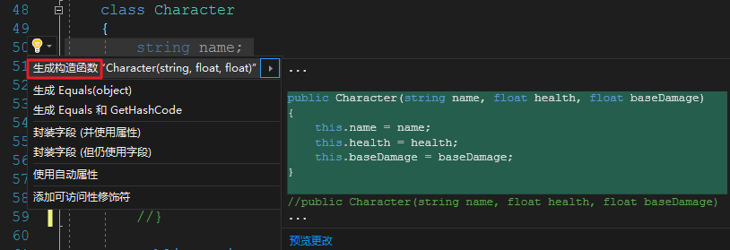
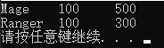
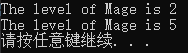

# C#面向对象基础（一）抽象


# 一、什么是面向对象？

**面型对象的概念**
Object Oriented Programming，OOP
用认识一个系统的方式来分析、设计、实现一个系统。
**面试答案**：**封装**、**继承**、**多态**即为面向对象

**面向对象的方法**
面向对象分析（OOA，Object-Oriented Analysis）
面向对象设计（OOD，Object-Oriented Design）
面向对象程序设计（OOP，Object-Oriented Programming）


主要围绕以下几个概念：
**对象、抽象数据类型、类、继承性、多态性**


**对比面向过程**：相辅相成
面向过程：先有算法，后有结构
面向对象：先有结构，后又算法


优点：**可复用（类）、可拓展（继承）、可管理（接口）**


四个基本机制：**抽象、封装、继承与派生、多态**

# 二、抽象

现实/虚幻的事物 => 计算机可处理的数据结构（类）
用**类（Class）**描述**复杂/复合**的事物
用数据抽象（**变量**）描述某类对象的**状态**（对象相互区别的物理量）
代码抽象（**方法**）描述某类对象的共有**功能**

如何实现抽象：
1. 分析事物，提取状态（变量）和行为（方法/函数）；
2. 要有主次，关注重要的，忽略不重要的。


# 三、类的定义、使用、实例化

类，一种复杂的数据类型，程序的基本单元。

## 定义语法

```c#
[访问修饰符] [修饰符] class 类名 [:<基类名>][,<接口列表>]
{
	构造方法;
	析构方法;
	[访问修饰符] [修饰符] 数据类型 <变量名>;
	[访问修饰符] [修饰符] 数据类型 <属性名>;
	...
	[访问修饰符] [修饰符] <返回值类型> <方法名>([参数列表]);
}
```

## 使用方式（声明 -> 赋值 -> 使用）

**1. 声明**类变量格式

```c#
类名 变量名
```
**类变量**又叫**对象的引用**、**等待指向对象**。

**2. 赋值：**
对象的实例化：对象的生成比较复杂，称为**实例化**
```c#
new <类名>([<参数1>,<参数2>...])
```
将引用指向实例：
```c#
变量名 = new <类名>([参数列表])
```

**3. 使用**
通过引用来寻找对象的变量和方法
```c#
对象引用.成员变量
对象引用.成员方法([参数列表])
```

**4. 对象的构造过程**
1. 为对象开辟空间；
2. 调用构造方法初始化；
3. 返回对象的引用。

**5. 类和对象的关系**

1. 类是对象的模板；
2. 一个类可以创建多个对象；
3. 对象是类的一个具体个体；
4. 对象有独立的内存空间，不会相互影响。

# 三、构造方法（构造函数，构造器）

类的特殊的成员方法

**声明：**构造方法与类同名，且没有**返回值类型**；构造可以无参也可带参。

快捷生成构造方法：“ctor” + 两次Tab键

**使用：**必须使用new关键字调用

**作用：**创建类的实例并初始化对象。

初始化的缺省值都是确定的：

布尔类型变量初值：false
整型变量初值：0
浮点型变量初值：0.0
字符变量初值：'\0'
引用（复合）变量的初值：null

**注意：**

- 系统为每一个类自动提供一个默认的无参的构造方法；若自定义构造方法，无参构造方法不在提供。
- 成员方法中的局部变量必须显式手动进行初始化。

**快速构成：**

选中参与构造的成员变量后右键或按"Ctrl + ."，选择“生成构造函数”



# 四、析构方法

一个对象时如何出生的？

1. 在内存上根据类模板申请一片存储空间，再根据模板的内容填上相应的成员变量和成员方法；

2. 构造默认初始值，如果有自定义初始值则直接通过构造参数填入；

3. 将对象地址告知栈中的类变量要指向该对象进行引用。

对象的死亡？

对象的存储空间被回收（程序被关闭，进程终结，垃圾回收）。

**析构方法声明：**

```c#
~类名()
```

**使用：**

程序中的对象有垃圾回收器（garbage collector）负责释放，回收之前会自动调用对象对应类的析构函数，做释放前的准备工作（关闭占用资源等）。

**注意：**

1. 一个类只有一个析构方法，没有返回值类型。
2. 除非特殊需要，通常被省略。


# 五、this的用法

this是成员方法中的隐参，是方法所在类的一个引用变量。

声明：每个成员方法自带，无需声明。

作用：

1. 方法被调用时，立即指向调用该方法的对象；
2. 区分同名的局部变量和成员变量；
3. 调用本类的其他构造方法，拷贝构造中使用较多。

拷贝构造：批量无差异产生对象之后进行少量差异化赋值。

## 例1（拷贝构造）

```c# Program.cs
using System;
using System.Collections.Generic;
using System.Linq;
using System.Text;
using System.Threading.Tasks;

namespace ProjectCopyObject
{
    class Program
    {
        static void Main(string[] args)
        {
            Character c1 = new Character("Mage", 100, 500);
            Character c2 = new Character(c1);
            c2.name = "Ranger";
            c2.damage -= 200;
            Console.WriteLine("{0}\t{1}\t{2}",c1.name,c1.health,c1.damage);
            Console.WriteLine("{0}\t{1}\t{2}",c2.name,c2.health,c2.damage);
        }
    }
    class Character
    {
        public string name;
        public float health;
        public float damage;
        //构造函数
        public Character(string name, float health, float damage)
        {
            this.name = name;
            this.health = health;
            this.damage = damage;
        }        
        //拷贝构造函数
        public Character(Character c):this(c.name, c.health, c.damage)
        {

        }
    }
}
```



## 例2（把类看成一种数据类型）

```c# Program.cs
using System;
using System.Collections.Generic;
using System.Linq;
using System.Text;
using System.Threading.Tasks;

namespace ProjectThis
{
    class Program
    {
        static void Main(string[] args)
        {
            Character c = new Character("Mage", 1);
            c.LevelUp();
            c.ShowLevel();
            c.LevelUp().LevelUp().LevelUp().ShowLevel();
        }
    }
    class Character
    {
        public string name;
        public int level;

        public Character(string name, int level)
        {
            this.name = name;
            this.level = level;
        }
        //把类看成一种数据类型，
        //哪个Character类的对象调用LevelUp方法，
        //哪个对象的level就+1，并返回该对象。
        public Character LevelUp()
        {
            this.level++;
            return this;
        }

        public void ShowLevel()
        {
            Console.WriteLine("The level of {0} is {1}", this.name, this.level);
        }

    }
}
```

