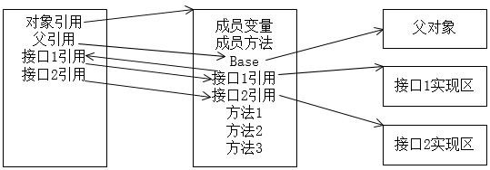

# C#面向对象基础（七）接口与索引器


# 一、接口

在构建类的过程中，经常遇到这样一种特殊情况：

在描述某个类的各个方法时，对每个方法我们只能给出其功能实现的要求（原形声明）但不能给出具体的功能实现（方法体）。因为我们要处理的问题只是一个泛泛的功能说明，并没有针对某一具体类型的问题来说明。

**接口：一组只有成员方法声明，没有方法体的方法集。**

接口中**可写的内容：方法、属性、索引器、事件**

接口的**作用**：

1. 提供完全的抽象；
2. 规定类应具有的形式；
3. 接口中的方法在多个实现接口的类中表现为多态性；
4. 便于设计、管理、协作项目。

## 接口的定义

要点：类似于类的定义格式，只是以**interface**作为定义符。

```c#
[访问修饰符] interface 接口名
{
	返回值类型 方法名([参数列表]);
}
```

多继承模式：

```c#
[访问修饰符] interface 派生的接口名 : 父接口名列表
{
	返回值类型 方法名([参数列表]);
}
```

**注意：**接口中声明的方法都是**默认public**的，**不能自定义访问级别**。

## 实现接口

**一个类**可以实现**多个接口**。

```c#
class 类名 : 接口1, 接口2, 接口3, ...
{
	//所有接口定义方法的实现
}
```

**一个接口**可以被**多个类**实现。

```c#
class 类1 : 接口1
{
	//接口1定义方法的实现
}
class 类2 : 接口1
{
	//接口2定义方法的实现
}
class 类3 : 接口1
{
	//接口3定义方法的实现
}
```

**实现原则：**

1. 实现的方法必须与接口的原型定义保持一致；
2. 必须实现接口中的所有成员方法。

**实现方式：隐式实现、显式实现**

**隐式实现：**

```c#
interface Interface01
{
	void Method01();
}
interface Interface02
{
	void Method02();
}
class ClassName : Interface01, Interface02
{
	public void Method01()//没有标识表明这个方法是哪一个接口的还是类内自己定义的
	{
	
	}
	public void Method02()
	{
	
	}
}
```

**显示实现：**

```c#
interface Interface01
{
	void Method01();
}
interface Interface02
{
	void Method02();
}
class ClassName : Interface01, Interface02
{
	void Interface01.Method01()//显示实现在类中明确方法是哪一个接口的
	{
	
	}
	void Interface02.Method02()//但是显示实现全部为私有化实现
	{
	
	}
}
```

**选哪个?**

若实现的所有方法均**无重名**，使用**隐式**；
若实现的所有方法中出现**重名**，使用**显式**。

## 接口回调

接口引用=实现类对象

**含义：**

**接口**也是**引用数据类型**，可以**指向**任意实现了该接口的**类实例**

**作用：**

1. 统一管理实现类对象；

2. 访问显示实现的方法。

**注意：**

显示实现的方法只能用接口回调来调用，无法用实现类引用调用。



## 抽象类和接口的区别

1. 接口用interface来定义，而不是class；（接口不是类，只是一个功能集合）
2. 接口不能创建实例，抽象类可以间接实例化（通过子类）；
3. 抽象的程度：接口完全抽象，抽象类部分抽象；
4. 接口采用多重继承机制，类采用单一的继承机制。

## 例1（接口实现）

```c# Program.cs
using System;
using System.Collections.Generic;
using System.Linq;
using System.Text;
using System.Threading.Tasks;

namespace ProjectInterface
{
    interface Skills : Warrior, Mage, Ranger
    {

    }
    class Program
    {
        static void Main(string[] args)
        {
        }
    }
    class Player : Skills
    {
        int warriorWeaponId;
        int mageWeaponId;
        int rangerWeaponId;
        //显示实现属性
        int Warrior.WeaponId { get => warriorWeaponId; set => warriorWeaponId = value; }
        int Mage.WeaponId { get => mageWeaponId; set => mageWeaponId = value; }
        int Ranger.WeaponId { get => rangerWeaponId; set => rangerWeaponId = value; }
        //隐式实现方法
        public void Arrow()
        {
            
        }

        public void Spell()
        {
            
        }

        public void Sword()
        {
            
        }
    }
    interface Warrior
    {
        int WeaponId { get; set; }
        void Sword();
    }
    interface Mage
    {
        int WeaponId { get; set; }
        void Spell();
    }
    interface Ranger
    {
        int WeaponId { get; set; }
        void Arrow();

    }
}
```

## 例2（接口回调）

```c# Program.cs
using System;
using System.Collections.Generic;
using System.Linq;
using System.Text;
using System.Threading.Tasks;

namespace ProjectInterface
{
    interface IHello
    {
        void Bellow();
    }
    class Program
    {
        static void Main(string[] args)
        {
            Speak speak = new Speak();
            //speak.Bellow();错误
            (speak as IHello).Bellow();//不安全
            //原因：有可能出现空指针异常
            IHello ih = speak as IHello;//接口回调
            if(ih != null)
            {
                ih.Bellow();//安全
            }
        }
    }
    class Speak : IHello
    {
        void IHello.Bellow()
        {
            Console.WriteLine("Hello");
        }
    }
}
```

## 例3（接口协作）

```c# Program.cs
using System;
using System.Collections.Generic;
using System.Linq;
using System.Text;
using System.Threading.Tasks;

namespace ProjectInterface
{
    interface IWeapon
    {
        int Damage { get; set; }
    }
    class Program
    {
        static void Main(string[] args)
        {
            Hero hero = new Hero(100);
            hero.Weapon = new Sword(1000);
            hero.Attack();

        }
    }
    class Hero
    {
        int atk;
        IWeapon weapon;

        public Hero(int atk)
        {
            this.atk = atk;
        }

        public int Atk { get => atk;}
        internal IWeapon Weapon { get => weapon; set => weapon = value; }

        public void Attack()
        {
            int damage = this.atk + weapon.Damage;
            Console.WriteLine("产生了{0}伤害", damage);
        }
    }
    class Sword : IWeapon
    {
        int damage;

        public Sword(int damage)
        {
            this.damage = damage;
        }

        public int Damage { get => damage; set => damage = value; }
    }
}
```


# 二、索引器

要声明**类**或者**结构**上的索引器，请使用this关键字：

```c#
[访问修饰符] 返回值类型 this [形参1, 形参2, ...]//至少一个参数
{
	get
	{
	
	}
	set
	{
		//使用隐参value接收实际参数
	}
}
```

**接口中声明索引器的方法**：

```c#
数据类型 this [参数列表]{get;set}
```

**实质：**方法的变异品种。

**作用：**访问方法从**对象.方法名(参数)** => **对象[参数]**

**自定义索引器**对比**数组索引器**：

1. 索引器的索引值（index）类型不受限制；
2. 索引器允许重载；
3. 索引器不是一个变量。

**索引器**对比**属性**：

1. 属性以名称来标识，索引器以函数形式标识；
2. 索引器可以被重载，属性不可以；（因为属性没参数）
3. 索引器不能声明为static，属性可以。

## 例1（类的索引器）

```c# Program.cs
using System;
using System.Collections.Generic;
using System.Linq;
using System.Text;
using System.Threading.Tasks;

namespace ProjectIndex
{
    class Program
    {
        static void Main(string[] args)
        {
            Student s = new Student();
            s.Name = "MJ";
            Console.WriteLine(s.Name);

            //索引器方式
            s["name"] = "Jessie";
            Console.WriteLine(s["name"]);
        }
    }
    class Student
    {
        String name;
        int age;

        //"indexer" + Tab键
        public object this[String proName]//索引器
        {
            get
            {
                if(proName == "name")
                {
                    return this.name;
                }
                if(proName == "age")
                {
                    return this.age;
                }
                return null;
            }
            set
            {
                if (proName == "name")
                {
                    this.name = value as String;
                }
                if (proName == "age")
                {
                    this.age = (int)value;
                }
            }
        }
        public string Name { get => name; set => name = value; }
        public int Age { get => age; set => age = value; }
    }
}
```

## 例2（接口索引器应用于管理类）

```c# Program.cs
using System;
using System.Collections.Generic;
using System.Linq;
using System.Text;
using System.Threading.Tasks;

namespace ProjectIndex
{
    interface IStudent
    {
        Student this[String studentName]{get;}
    }

    class Program
    {
        static void Main(string[] args)
        {
            StudentManager manager = new StudentManager();
            Console.WriteLine(manager["张0"]);
            manager["张0"]["age"] = 18;
            Console.WriteLine(manager["张0"]);
        }
    }
    class Student
    {
        String name;
        int age;

        public Student()
        {
        }

        public Student(string name, int age)
        {
            this.name = name;
            this.age = age;
        }

        //"indexer" + Tab键
        public object this[String proName]//索引器
        {
            get
            {
                if(proName == "name")
                {
                    return this.name;
                }
                if(proName == "age")
                {
                    return this.age;
                }
                return null;
            }
            set
            {
                if (proName == "name")
                {
                    this.name = value as String;
                }
                if (proName == "age")
                {
                    this.age = (int)value;
                }
            }
        }

        public string Name { get => name; set => name = value; }
        public int Age { get => age; set => age = value; }

        public override string ToString()
        {
            return String.Format("{0} {1}", name, age);
        }
    }
    /// <summary>
    /// 管理学员类
    /// </summary>
    class StudentManager : IStudent
    {
        Student[] students = new Student[1000];

        public StudentManager()
        {
            for(int i = 0; i < 10; i++)
            {
                Student s = new Student("张" + i, (i + 1) * 2 +10);
                students[i] = s;
            }
        }
        public Student this[string studentName]
        {
            get
            {
                for (int i = 0; i < this.students.Length; i++)
                {
                    if(students[i] == null)
                    {
                        break;
                    }
                    String name = (students[i]["name"] as String);
                    if (name.Equals(studentName))
                    {
                        return students[i];
                    }
                }
                return null;
            }
        }
    }
}
```

