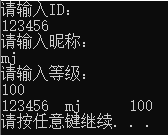
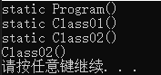
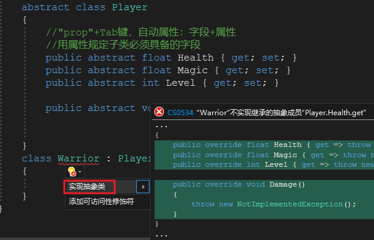

# C#面向对象基础（六）附加修饰符


# 一、static

## 静态成员

**类成员**：类中的所有东西只要由static关键字修饰，都叫类成员。（区别于对象成员，与对象没有关系，只属于类。）
**特点**：可以在不创建类的对象前就用格式：”  类名.类成员 ”直接调用类成员。

**类变量**：由static关键字修饰的字段。
**特点**：隶属于类模板（共用），可直接使用格式：” 类名. 类变量名“进行访问。
**注意**：无法使用对象引用。

**类方法**：由static关键字修饰的方法。
**特点**：隶属于类模板，直接使用格式：“ 类名.类方法名 ”访问。
**注意**：无法使用对象引用，方法中不能使用this、base。

## 静态构造方法

格式：

```c#
static ClassName(){}
```

**用处**：初始化static变量

（对象构造函数初始化的是成员变量）

**特点**：

1. 每个类中都由此方法（看不见可以自己写出来）；

2. 不可以被直接调用；

3. 在使用类时**自动执行**（使用类：使用类变量、访问类方法、new一个对象）；

4. 运行期间只执行一次。

5. 静态构造必须无参。

## 静态类

由static修饰的类

**特点：**

1. 不能实例化（没有对象）；
2. 共享（访问格式：“ 类名.访问内容 ”）

**原则**：静态类中的所有成员必须是静态的。


## 类内部调用关系


## 例1（同类对象共享类变量）

```c#
using System;
using System.Collections.Generic;
using System.Linq;
using System.Text;
using System.Threading.Tasks;

namespace ProjectStatic
{
    class Program
    {
        static void Main(string[] args)
        {
            Player player01 = new Player();
            Player player02 = new Player();
            Player player03 = new Player();
            Console.WriteLine("The number of players is {0}.", Player.Count);
        }
    }
    class Player
    {
        static int count;
        public Player()
        {
            count++;
        }
        public static int Count { get => count;}
    }
}
```


## 例2（静态类使用）

```c#
using System;
using System.Collections.Generic;
using System.Linq;
using System.Text;
using System.Threading.Tasks;

namespace ProjectStatic
{
    class Program
    {
        static void Main(string[] args)
        {
            string id = Tool.Input("ID");
            string name = Tool.Input("昵称");
            string level = Tool.Input("等级");
            Console.WriteLine("{0}\t{1}\t{2}", id, name, level);
        }
    }
    static class Tool
    {
        public static string Input(string msg)
        {
            Console.WriteLine("请输入{0}：", msg);
            return Console.ReadLine();
        }
    }
}
```




# 二、类内部加载次序，调用关系

**多类的加载次序**

1. 优先加载Main方法所在的类；
2. 执行Main方法；
3. 执行过程中使用到哪个类，加载哪个类。

**单个类的加载次序**

1. 加载类中的静态变量、静态方法；
2. 执行静态构造为静态变量进行初期化；
3. 当产生对象时（new对象时），分配成员变量和成员方法到对象中。

**注意**：非静态的可以调用静态和非静态的，静态的只能调用静态的。

## 例1（加载次序）

```c#
using System;
using System.Collections.Generic;
using System.Linq;
using System.Text;
using System.Threading.Tasks;

namespace ProjectStatic
{
    class Program
    {
        static void Main(string[] args)
        {
            Class01 c1 = new Class01();
        }
        static Program()
        {
            Console.WriteLine("static Program()");
        }
    }
    class Class01
    {
        public Class01()
        {
            Class02 c2 = new Class02();
        }
        static Class01()
        {
            Console.WriteLine("static Class01()");
        }
    }
    class Class02
    {
        public Class02()
        {
            Console.WriteLine("Class02()");
        }
        static Class02()
        {
            Console.WriteLine("static Class02()");
        }
    }
}
```



# 三、单例模式

## 例1

```c#
using System;
using System.Collections.Generic;
using System.Linq;
using System.Text;
using System.Threading.Tasks;

namespace ProjectStatic
{
    class Program
    {
        static Program()
        {
            Hero.GetHero().AddData(1, "Mage");
        }
        static void Main(string[] args)
        {
            Hero.GetHero().AddData(0,"Warrior");
            for(int i = 0; i < Hero.GetHero().Data.Length; i++)
            {
                if (Hero.GetHero().Data[i] != null)
                    Console.WriteLine("{0}\t{1}", i, Hero.GetHero().Data[i]);
            }
        }
    }
    class Hero
    {
        String[] data;

        static Hero hero;
        //私有化构造
        Hero() { data = new String[10]; }

        public String[] Data { get => data; }

        //向系统提供该单例
        public static Hero GetHero()
        {
            if(hero == null)
                //自己手动生成当前类对象
                hero = new Hero();
            return hero;
        }

        public void AddData(int index, String data)
        {
            this.data[index] = data;
        }
    }
}
```


# 四、abstract

抽象的意义：描述抽象的概念，规定必须**实现**的方法的统一接口。

## 抽象类

用abstract关键字来修饰的类

```c#
abstract class AbstractClass
{
}
```

**特点：**

1. 必须被继承才可以使用；
2. 不能被直接实例化；
3. 和密封类（sealed类）正好相反。

## 抽象方法

用abstract类修饰的方法

```c#
abstract returnType AbstractMethod([paramlist]);
```

**特点：**

1. 必须被重写（override）；
2. 只有方法头，没有方法体；
3. 抽象方法必须在抽象类中。

## 规则

1. 抽象类中不一定包含抽象方法；
2. 有抽象方法的类必定是抽象类；
3. 抽象方法只是声明，没有方法的实现；
4. 构造方法、类方法不能声明为抽象方法；（因为构造方法、类方法无法override）
5. 子类必须实现抽象方法，除非子类也是抽象类；
6. 抽象类中不一定全是抽象方法，可以有一部分具体实现。

## 例1（抽象实现）

```c#
using System;
using System.Collections.Generic;
using System.Linq;
using System.Text;
using System.Threading.Tasks;

namespace ProjectAbstract
{
    class Program
    {
        static void Main(string[] args)
        {
            Warrior warrior = new Warrior(100,100,1);
            Console.WriteLine("{0}\t{1}\t{2}", warrior.Health, warrior.Magic, warrior.Level);
            warrior.Damage();
        }
    }
    abstract class Player
    {
        //"prop"+Tab键，自动属性：字段+属性
        //用属性规定子类必须具备的字段
        public abstract float Health { get; set; }
        public abstract float Magic { get; set; }
        public abstract int Level { get; set; }

        public abstract void Damage();      
        
    }
    class Warrior : Player
    {
        float health;
        float magic;
        int level;

        public Warrior(float health, float magic, int level)
        {
            this.health = health;
            this.magic = magic;
            this.level = level;
        }

        public override float Health { get => health; set => health = value; }
        public override float Magic { get => magic; set => magic = value; }
        public override int Level { get => level; set => level = value; }

        public override void Damage()
        {
            Console.WriteLine("Heavy Attack!");
        }
    }
}
```




# 五、sealed

>不允许继承，不允许重写，继承到此为止。

## 密封类

被sealed修饰的类被称为**密封类**

```c#
sealed class SealedClass
{
}
```

**特性：密封类不能被继承**

## 密封方法

被sealed修饰的方法被称为**密封方法**

```c#
sealed override returnType SealedMethodName([paramLlist])
{
}
```

**特性：**

1. 密封方法会**重写基类中的方法**；

2. 密封方法**无法被重写**。

**注意**：必须始终与override一起使用。

## 密封属性

被sealed修饰的属性被称为密封属性

```c#
sealed override returnType Property
{
	set
	{
	}
	get
	{
	}
}
```

**特性：**

1. 密封属性会覆盖基类中的属性；
2. 密封属性无法被覆盖。

**注意：必须始终与override一起使用。**

sealed常用语类库中，一般实际项目里使用较少。

# 六、const

1. 声明常量；

2. 声明的同时赋值；

3. 运行期间不能改变它的值；

4. 属于编译时常量；

5. 不能用new初始化。

**const一般修饰值类型和String。**

# 七、readonly

1. 只读变量

2. 属于运行时变量

3. 可以在构造方法里改变它的值

4. 不能作用于局部变量

**初始化时机：**

1. 声明的同时赋值；
2. 静态变量，在静态构造中初始化；
3. 非静态变量，在非静态构造中初始化。

# 八、总结

static修饰：类、变量、方法。

static修饰类，则这个类为整个工程提供公共的变量、公共的方法。

static修饰方法，可以直接通过类名.方法名调用，属于类模板方法。

static修饰变量，该变量属于类模板，所有此类对象均可通过类名.变量名访问。

abstract修饰：类、方法。

abstract修饰类，该类无法直接实例化，必须出具子类才可以使用该类的方法，鼓励继承。

abstract修饰方法，要求子类必须具备某种功能（方法），某种字段（抽象属性）。

sealed修饰：类、方法。

sealed修饰类，禁止有子类。

sealed修饰方法，重写基类方法并禁止子类重写。

const修饰：变量（通常修饰值类型和String）。

readonly修饰：变量（通常修饰引用类型）。