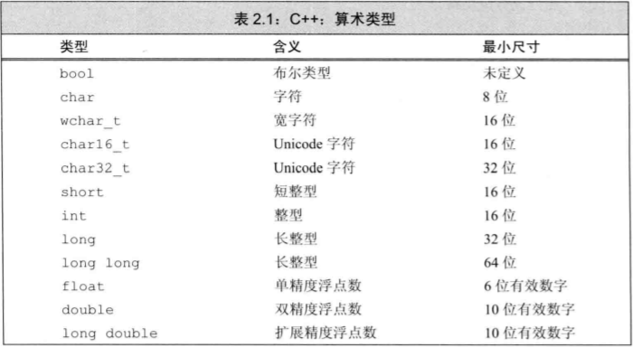

# Cpp变量和基本类型

## 基本内置类型

C++定义了包括**算术类型**和**空类型**在内的基本数据类型。

算数类型包含了字符、整型、布尔、浮点型，空类型不对应具体的值，仅用在一些特殊场合，最常见的是，当函数不返回任何值时使用空类型作为返回类型。

### 算术类型

整型（int，包括字符，布尔）、浮点型。

内置类型的机器实现：

大多数计算机以2的整数次幂个比特作为块来处理内存，可寻址的最小内存块称为“字节（byte）”，存储的基本单元称为“字（word）”，一个字由几个字节组成。

大部分机器的字节由8比特构成，字有32或64比特构成。

大多数计算机将内存中的每个字节和一个数字关联起来，这个数字称为“地址”。

我们可以使用某个地址表示从这个地址开始的大小不同的比特串。

为了赋予内存中某个地址明确的含义，必须首先知道存储在该地址的数据的类型。类型决定了数据所占的比特数以及如何解释比特内容。

浮点型可表示单精度、双精度和扩展精度值。

除了布尔型，和拓展的字符型，其他整型可以划分为带符号和无符号两种。带符号类型表示正数、负数、0，无符号类型仅仅用于表示大于等于0的值。

带符号：int、short、long、long long。

无符号：前边加unsigned

字符型被分为三种：char、signed char、unsigned char。

char实际上会表现为带符号和无符号中的一种，具体是哪种由编译器决定。

无符号类型中，所有比特都用来存储，比如8 bit的unsigned char可以表示0~255区间内的值。

C++标准没有规定带符号类型应该如何表示，但约定了在表示范围内正值和负值的量应该平衡。

**选择类型和一些经验准则**：

- 当明确知晓**数值不可能为负时，选无符号类型**。
- 使用**int**执行**整数运算**，实际中，如果**数值超过了int**的表示范围，选用**long long**。
- 在**算术表达式中不要使用char或bool**，只有在存放字符或者布尔值时才使用它们，因为char在一些机器上有符号，在另一些机器上有是无符号的，容易出问题。如果需要使用一个不大的整数，请明确指出它的类型是signed char或unsigned char。
- 执行浮点数运算选用double，因为float通常精度不够，而且双精度浮点数和单精度浮点数的计算代价相差无几。实际中，在某些机器上，双精度运算比单精度还快。long double提供的精度在一般情况下是没必要的，况且它带来的运算消耗也不容忽视。

类型int、long、long long和short的区别是什么？

无符号类型和带符号类型的区别是什么？

float和double的区别是什么？

计算按揭贷款时，对于利率、本金和付款分别应选择何种数据类型？理由是？

### 类型转换

