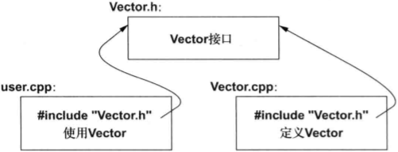

# Cpp基础知识

## 基本概念

C++是一种编译型语言。即，想要运行一段C++程序，需要先用编译器把源文件转换为对象文件，然后再用连接器把这些对象文件组合生成可执行程序。一个C++程序通常包含许多源代码文件。


一个可执行程序适用于一种特定的硬件/系统组合，是不可移植的。

当我们谈论C++程序的可移植性时，通产是指源代码的可移植性。即，同一份源代码可以再不同的系统上成功编译并运行。

ISO的C++标准定义了两种实体：

1. **核心语言功能**，比如**内置类型**（`char`、`int`等）和**循环**（`for`、`while`）
2. **标准库组件**，比如**容器**（`vector`、`map`），I/O操作（`<<`、`getline()`等）。

每个C++实现都会提供标准库组件，C++标准库可以用C++语言本身实现（仅在实现线程上下文切换这样的功能时才时才使用少量机器代码）。

C++是一种静态类型语言，当编译器再处理任何实体（对象、值、名称、表达式等）时们都必须清楚它的类型。对象的类型决定了能在该对象上执行哪些操作。

每个C++程序中有且只有一个名为`main()`的全局函数，在执行一个程序时首先执行该函数。

如果`main()`返回一个`int`值，这个值将作为程序给“系统”的返回值。

如果`main()`没有返回任何值，则系统也将收到一个表示程序成功完成的值。

来自`main()`的非零返回值表示程序执行失败。

并非多有操作系统和执行环境都会用到这个返回值：基于Linux/Unix的环境通常会用到，而基于Windows的环境一般不会用到。

## 变量

每种基本类型都与硬件特性直接相关，尺寸固定不变，决定了其中多能存储的值的范围。

类型的实际尺寸依赖于实现（不同的机器上可能不同），可以通过`sizeof`运算符得到，例如`sizeof(char)`等于1，`sizeof(int)`常常是4。

符号`=`是最早被C语言使用的一种比较传统的初始化方式。如果拿不准的话，最好在C++中使用更通用的`{}`，可以确保不会发生某些可能导致信息丢失的类型转换。

```cpp
double d1 = 2.3;
double d2 {2.3};
vector<int> v {1,2,3,4,5,6};
int i1 {7.2};//这么写会因为类型转换而报错
int i2 = {7.2};//这么写也会类型转换而报错，而且=是多余的
```

在定义一个变量时，如果变量的类型可以有初始化器推断达到，则无需显式指定其类型：

```cpp
auto b = true;	//变量类型是bool
auto ch = 'x';	//变量类型是char
auto num = 123;	//变量类型是int
auto d = 1.2;	//变量类型是double
auto z = sqrt(y);	//变量类型是sqrt(y)的返回类型
```

在此过程中不存在可能引发错误的类型转换。

使用`auto`可以避免冗余，无需书写长类型名，这一点在泛型编程中尤其重要，因为在泛型编程中很难知道对象的确切类型，况且类型名字可能相当长。

当没有明显的理由需要显式指定数据类型时，一般使用`auto`。

明显的理由：

- 该定义位于一个比较大的作用域中，我们希望看代码的人清楚地直到其类型；
- 明确规定某个变量的范围和精度（比如使用`double`而非`float`）。

## 常量

C++支持两种不变性概念：

- `const`：承诺不改变这个值。

  主要用于说明接口，这样在把变量传入函数时就不必担心变量会在函数内被改变了。

  编译器负责确认并执行`const`的承诺。

- `constexpr`：在编译时求值。

  主要用于说明常量，作用是允许将数据置于只读内存中（不太可能被破坏）以及提升性能。

例如：

```cpp
const int dmv = 17;		//dmv是一个命名的常量
constexpr double max1 = 1.4 * square(dmv);//如果square(17)是常量表达式，则正确
int num = 18;
constexpr double max2 = 1.4 * square(num);//错误，因为num不是常量表达式
const double max3 = 1.4 * square(num);//正确，因为可在运行时求值
```

如果某个函数用在常量表达式中，即表达式在编译时求值，函数必须定义成`constexpr`，例如：

```cpp
constexpr double square(double x){ return x*x;}
```

要定义成`constexpr`，函数必须非常简单：函数中只能有一条用于计算某个值的`return`语句。

`constexpr`函数可以接受变量实参，但此时结果将不会是一个常量表达式。

当程序的上下文不需要常量表达式时，我们可以使用变量表达式实参来调用`constexpr`函数，这样我们就不用把同一个函数定义两次了：其中一个用于常量表达式，另一个用于变量。

## 指针

**在声明语句中**，一元后置运算符**`&`**表示**“......的引用”**，**`*`**表示**“指向......”**。

**在表达式中**，前置一元运算符**`*`**表示**“......的内容”**，而且前置一元运算符**`&`**表示**“......的地址”**。

指针变量中存放着一个相应类型对象的地1址：

```cpp
char* p = &v[3]; //p指向v的第4个元素
char x = *p;	//*p是p所指的对象
```

引用类似指针，唯一的区别：无需使用`*`访问所引用的值。

一个引用在初始化之后就不能在引用其他对象。

当用于声明语句时，运算符`&`、`*`称为声明运算符。

**确保指针永远指向某个对象，这样解引用该指针的操作就是合法的。**

当确实没有对象可指或者要表达一种”没有可用对象“的含义时，令指针取值为`nullptr`（空指针）。

所有指针类型都共享一个`nullptr`。

```cpp
int x = nullptr;	//错误，nullptr是指针，不是整数。
```

可以使用`++`将指针移动到数组的下一个元素。

## 用户自定义类型

为了于内置类型（built-in type）区别开，把利用C++的抽象机制构建的新类型称为用户自定义类型(user=defined type)，例如类、枚举等。

### 结构

例子：

```cpp
struct PlayerData{	//结构体定义
    int statusNum;	//玩家状态个数
    double* status;	//指向玩家状态值的指针
}

void init_player_data(PlayerData& data, int statusNum){
    data.status = new double[statusNum];	//分配一个数组
    data.statusNum = statusNum;
}

double read_and_sum(int num){
    PlayerData data;
    init_player_data(data, num);
    for(int i=0;i!=num;++i){
        cin >> data.status[i];
    }
    double sum = 0;
    for(int i=0;i!=s;++i){
        sum += data.status[i];
    }
    return sum;
}
```

`new`运算符从一块名为**自由存储（free store）又称动态存储（dynamic memory）**或**堆（heap）**的区域中分配内存。

访问`struct`成员的方式有两种：

1. 通过名字或引用，这时使用`.`（点运算符）；
2. 通过指针，这时使用`->`。

```cpp
void f(PlayerData data, PlayerData& rData, PlayerData* pData){
    int statusNum = data.statusNum;	//通过名字访问
    int statusNum2 = rData.statusNum;	//通过引用访问
    int statusNum3 = pData->statusNum;	//通过指针访问
}
```

### 类

使用结构体的时候，数据和操作是分隔的。

当我们希望自己构建的类型易于使用和修改，数据的使用具有一致性，并且表示形式最好对用户是不可见的。此时最理想的做法是把类型的接口与其实现分立出来。

实现这一目的的语言机制称为类（class），类的成员可能是数据、函数或者类型。

类的public成员定义该类的接口，private成员则只能通过接口访问。例如：

```cpp
class Vector{
    public:
    	Vector(int s): elem{new double[s]}, sz{s} {}	//构建一个Vector
    	double& operator[](int i){ return elem[i];}	//通过下标访问元素
    	int size(){ return sz;}
    private:
    	double* elem;	//指向元素的指针
    	int sz;	//元素的数量
};
```

构造函数使用成员初始化器列表（`{}`）来初始化Vector的成员：

```cpp
:elem {new double[s]},sz{s}
```

这条语句的含义：首先从自由空间获取s个double类型的元素，并用一个指向这些元素的指针初始化elem；然后用s初始化sz。

**访问元素**的功能是由一个下标函数提供的，这个函数名为`operator[]`，它的返回值是对相应元素的引用（double&）。

### 枚举

```cpp
enum class Color {red, blue, green};
enum class Traffic_light {green, yellow, red};
Color color = Color::red;
Traffic_light light = Tranffic_light::red;
```

枚举类型常**用于描述规模较小的整数值集合**。通过使用由指代有意义的枚举值名字可**提高代码的可读性，降低出错的风险**。

`enum`后的`class`指明了**枚举是强类型的**，且它的枚举值位于指定的作用域中。不同的`enum class`是不同的类型，有助于防止对常量的意外误用。

注意不能隐式地混用枚举和整数值：

```cpp
int i = Color::red;	//错误，Color::red不是一个int
Color c = 2;	//错误，2不是一个Color对象
```

如果你不想显式地限定枚举值名字，并且希望枚举值可以是`int`，则应该去掉`class`得到一个“普通的”`enum`。

默认情况下，`enum class`只是定义了赋值、初始化和比较操作。

## 模块化

构建C++程序的关键是清晰地定义这些组成部分之间的交互关系。

第一步是将某个部分的接口和实现分离开来。

在语言层面，C++使用声明来描述接口。声明指定了使用某个函数或者某种类型所需的所有内容。例如：

```cpp
double sqrt(double);	//接受一个double，返回值也是一个double

class Vector{
    public:
    	Vector(int s);
    	double& operator[](int i);
    	int size();
    private:
    	double* elem;	//elem指向一个数组，该数组包含sz个double
    	int sz;
};
```
```cpp
double sqrt(double d){
    ...
}
Vector::Vector(int s)	//构造函数的定义
    :elem{new double[s]},sz{s}{	//初始化成员
    
}
double& Vector::operator[](int i){	//下标运算符的定义
    return elem[i];
}
int Vector::size(){	//size()的定义
    return sz;
}
```

### 分离编译

C++支持分离编译，用户代码只能看见所用类型和函数的声明，它们的定义则放置在分离的源文件里，并被分别编译。这种机制有助于将一个程序组织成一组半独立的代码片段。

优点是编译时间减到最少，并且强制要求程序中逻辑独立的部分分离开来。

一个库通常是一组分离编译的代码片段（比如函数）的集合

一般情况下，我们把描述模块接口的声明放置在一个特定的文件中，文件名常常指示模块的预期用途。例如：

```cpp
//Vector.h:
class Vector{
    public:
    	Vector(int s);
    	double& operator[](int i);
    	int size();
    private:
    	double* elem;
    	int sz;
}
```

这段声明被置于`Vector.h`文件中，称为**头文件**，用户将其包含进程序以访问接口。例如：

```cpp
// user.cpp:
#include "Vector.h"	//获得Vector的接口
#include <cmath>	//获得标准库数学函数接口，其中含有sqrt()
using namespace std;	//令std成员可见

double sqrt_sum(Vector& v){
    double sum = 0;
    for(int i=0;i!=v.size();++i){
        sum += sqrt(v[i]);	//平方根的和
    }
    return sum;
}
```

为帮助编译器确保一致性，负责提供`Vector`实现部分的`.cpp`文件同样应该包含提供接口的`.h`文件：

```cpp
//Vector.cpp
#include "Vector.h"	//获得接口
Vector::Vector(int s)
    :elem{new double[s]},sz{s}{
    
}
double& Vector::operator[](int i){
    return elem[i];
}
int Vector::size(){
    return sz;
}
```

`user.cpp`和`Vector.cpp`中的代码共享`Vector.h`提供的`Vector`接口信息，但这两个文件是相互独立的，可以被分离编译。



分离编译不是语言问题，而是关于如何以最佳方式利用特定语言实现的问题。

分离编译机制在实际的编译过程中非常重要。最好的方法是最大限度地模块化，逻辑上通过语言特性描述模块，物理上通过划分文件及高效分离编译来充分利用模块化。

### 命名空间

命名空间机制一方面表达某些声明是属于一个整体的，另一方面表明它们的名字不会与其他命名空间中的名字冲突。例如：

```cpp
namespace My_code{
    class complex{/* ... */};
    complex sqrt(complex);
    // ...
    int main();
}
int My_code::main(){
    complex z{1,2};
    auto z2 = sqrt(z);
    std::cout << '{' << z2.real() << ',' << z2.imag() << "}\n";
    // ...
};
int main(){
    return My_code::main();
}
```

将代码放在命名空间中，可以确保自己的名字不会和命名空间std中的标准库名字冲突，因为标准库确实支持complex算术运算。

访问其他命名空间的某个名字最简单的方法是在这个名字前加上命名空间的名字作为限定，例如：

`std::cout`和`My_code::main`。“真正的`main()`”定义在全局命名空间中，它不属于任何自定义命名空间、类或函数。

想要获取标准库命名空间中名字的访问权，我们应该使用`using`指示。

命名空间主要用于组织较大规模的程序组件，最典型的例子是库。

### 错误处理

在构建应用程序时，通常的做法是建立更多适合应用的新类型（如string、map、regex）和算法（如sort()、find_if()和draw_all()）。

这些高层次结构简化了程序设计，减少了产生错误的机会，同时增加了编译器捕获错误的概率。

这种模块化和抽象机制的一个重要影响是运行时错误的捕获位置与错误处理的位置被分离开来。

#### 异常

#### 不变式

#### 静态断言
