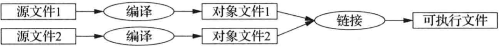

# Cpp基础知识

## 基本概念

C++是一种编译型语言。即，想要运行一段C++程序，需要先用编译器把源文件转换为对象文件，然后再用连接器把这些对象文件组合生成可执行程序。一个C++程序通常包含许多源代码文件。



一个可执行程序适用于一种特定的硬件/系统组合，是不可移植的。

当我们谈论C++程序的可移植性时，通产是指源代码的可移植性。即，同一份源代码可以再不同的系统上成功编译并运行。

ISO的C++标准定义了两种实体：

1. **核心语言功能**，比如**内置类型**（`char`、`int`等）和**循环**（`for`、`while`）
2. **标准库组件**，比如**容器**（`vector`、`map`），I/O操作（`<<`、`getline()`等）。

每个C++实现都会提供标准库组件，C++标准库可以用C++语言本身实现（仅在实现线程上下文切换这样的功能时才时才使用少量机器代码）。

C++是一种静态类型语言，当编译器再处理任何实体（对象、值、名称、表达式等）时们都必须清楚它的类型。对象的类型决定了能在该对象上执行哪些操作。

每个C++程序中有且只有一个名为`main()`的全局函数，在执行一个程序时首先执行该函数。

如果`main()`返回一个`int`值，这个值将作为程序给“系统”的返回值。

如果`main()`没有返回任何值，则系统也将收到一个表示程序成功完成的值。

来自`main()`的非零返回值表示程序执行失败。

并非多有操作系统和执行环境都会用到这个返回值：基于Linux/Unix的环境通常会用到，而基于Windows的环境一般不会用到。

## 变量

每种基本类型都与硬件特性直接相关，尺寸固定不变，决定了其中多能存储的值的范围。

类型的实际尺寸依赖于实现（不同的机器上可能不同），可以通过`sizeof`运算符得到，例如`sizeof(char)`等于1，`sizeof(int)`常常是4。

符号`=`是最早被C语言使用的一种比较传统的初始化方式。如果拿不准的话，最好在C++中使用更通用的`{}`，可以确保不会发生某些可能导致信息丢失的类型转换。

```cpp
double d1 = 2.3;
double d2 {2.3};
vector<int> v {1,2,3,4,5,6};
int i1 {7.2};//这么写会因为类型转换而报错
int i2 = {7.2};//这么写也会类型转换而报错，而且=是多余的
```

在定义一个变量时，如果变量的类型可以有初始化器推断达到，则无需显式指定其类型：

```cpp
auto b = true;	//变量类型是bool
auto ch = 'x';	//变量类型是char
auto num = 123;	//变量类型是int
auto d = 1.2;	//变量类型是double
auto z = sqrt(y);	//变量类型是sqrt(y)的返回类型
```

在此过程中不存在可能引发错误的类型转换。

使用`auto`可以避免冗余，无需书写长类型名，这一点在泛型编程中尤其重要，因为在泛型编程中很难知道对象的确切类型，况且类型名字可能相当长。

当没有明显的理由需要显式指定数据类型时，一般使用`auto`。

明显的理由：

- 该定义位于一个比较大的作用域中，我们希望看代码的人清楚地直到其类型；
- 明确规定某个变量的范围和精度（比如使用`double`而非`float`）。

## 常量

C++支持两种不变性概念：

- `const`：承诺不改变这个值。

  主要用于说明接口，这样在把变量传入函数时就不必担心变量会在函数内被改变了。

  编译器负责确认并执行`const`的承诺。

- `constexpr`：在编译时求值。

  主要用于说明常量，作用是允许将数据置于只读内存中（不太可能被破坏）以及提升性能。

例如：

```cpp
const int dmv = 17;		//dmv是一个命名的常量
constexpr double max1 = 1.4 * square(dmv);//如果square(17)是常量表达式，则正确
int num = 18;
constexpr double max2 = 1.4 * square(num);//错误，因为num不是常量表达式
const double max3 = 1.4 * square(num);//正确，因为可在运行时求值
```

如果某个函数用在常量表达式中，即表达式在编译时求值，函数必须定义成`constexpr`，例如：

```cpp
constexpr double square(double x){ return x*x;}
```

要定义成`constexpr`，函数必须非常简单：函数中只能有一条用于计算某个值的`return`语句。

`constexpr`函数可以接受变量实参，但此时结果将不会是一个常量表达式。

当程序的上下文不需要常量表达式时，我们可以使用变量表达式实参来调用`constexpr`函数，这样我们就不用把同一个函数定义两次了：其中一个用于常量表达式，另一个用于变量。

## 指针

**在声明语句中**，一元后置运算符**`&`**表示**“......的引用”**，**`*`**表示**“指向......”**。

**在表达式中**，前置一元运算符**`*`**表示**“......的内容”**，而且前置一元运算符**`&`**表示**“......的地址”**。

指针变量中存放着一个相应类型对象的地1址：

```cpp
char* p = &v[3]; //p指向v的第4个元素
char x = *p;	//*p是p所指的对象
```

引用类似指针，唯一的区别：无需使用`*`访问所引用的值。

一个引用在初始化之后就不能在引用其他对象。

当用于声明语句时，运算符`&`、`*`称为声明运算符。

**确保指针永远指向某个对象，这样解引用该指针的操作就是合法的。**

当确实没有对象可指或者要表达一种”没有可用对象“的含义时，令指针取值为`nullptr`（空指针）。

所有指针类型都共享一个`nullptr`。

```cpp
int x = nullptr;	//错误，nullptr是指针，不是整数。
```

可以使用`++`将指针移动到数组的下一个元素。


#### 
