# DarkSoulsDemo part 10 玩家血条与伤害
date: 2020-06-23 15:41:04

## 一、放置UI元素

在Hierarchy新建UI|Canvas，在Canvas下新建一个空物体，取名Health Bar，调整Health Bar的锚点。

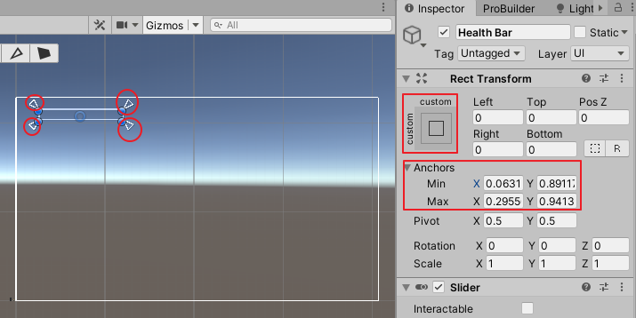

在Health Bar下新建两个Image，分别命名为Health Bar Fill和Health Bar Background，将它们的锚点都设置为stretch-stretch（按住Alt键）。

Health Bar Fill|Image|Color设置为红色，Health Bar Background|Image|Color设置为黑色。将Health Bar Fill拖拽到Health Bar Background下方（使Health Bar Fil遮挡住Health Bar Backgroundl）。

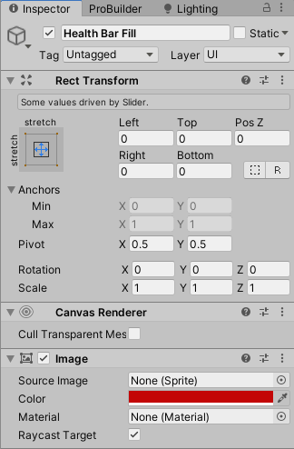

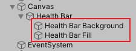

给Health Bar添加组件Slider，取消勾选IsInteractable，Transition和Navigation设置为None，将Health Bar Fill拖入Fill Rect。这时我们通过滑动Value滑条控制Health Bar Fill。

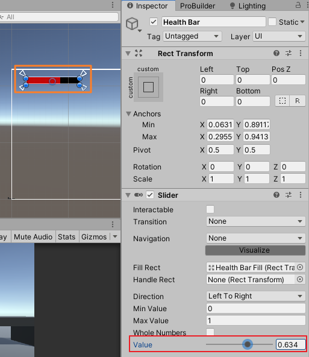

## 二、添加脚本

给Health Bar添加组件，在Add Component下拉框输入Healthbar后回车，作为新脚本创建并添加到Health Bar中。

编辑Healthbar.cs如下：

```c#
using System.Collections;
using System.Collections.Generic;
using UnityEngine;
using UnityEngine.UI;

namespace MJ
{
    public class HealthBar : MonoBehaviour
    {
        public Slider slider;

        public void SetMaxHealth(int maxHealth)
        {
            slider.maxValue = maxHealth;
            slider.value = maxHealth;
        }

        public void SetCurrentHealth(int currentHealth)
        {
            slider.value = currentHealth;
        }
    }
}
```

将Health Bar拖拽到Health Bar|Health Bar ( Script )|Slider

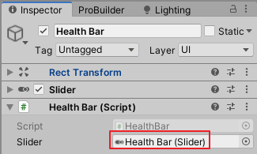

给Player新建并添加一个PlayerStats.cs，编写脚本如下：

```c#
using System.Collections;
using System.Collections.Generic;
using UnityEngine;
namespace MJ
{
    public class PlayerStats : MonoBehaviour
    {
        public int healthLevel = 10;
        public int maxHealth;
        public int currentHealth;

        public HealthBar healthBar;

        void Start()
        {
            maxHealth = SetMaxHealthFromHealthLevel();
            currentHealth = maxHealth;
            healthBar.SetMaxHealth(maxHealth);
        }

        private int SetMaxHealthFromHealthLevel()
        {
            maxHealth = healthLevel * 10;
            return maxHealth;
        }

        public void TakeDamage(int damage)
        {
            currentHealth = currentHealth - damage;

            healthBar.SetCurrentHealth(currentHealth);
        }
    }
}
```

回到Unity编辑器，将Health Bar拖拽到Player|Player Stats (Script)|Health Bar。

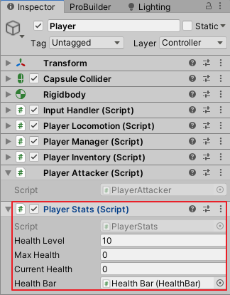

选中EventSystem，在其Standalone Input Module组件里会有兼容性警告，点击下方的Replace with InputSystemUIInputModule按钮即可。

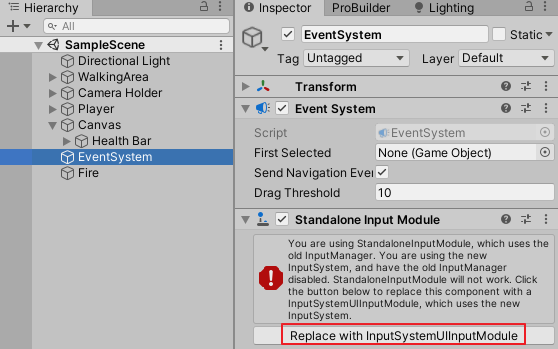

## 三、做一个扣血物体

在场景中新建一个圆柱体，取名为Fire，将它的Capsule Collider组件|Is Trigger勾选。给Fire添加脚本DamagePlayer.cs：

```c#
using System.Collections;
using System.Collections.Generic;
using UnityEngine;

namespace MJ
{
    public class DamagePlayer : MonoBehaviour
    {
        public int damage = 25;

        private void OnTriggerEnter(Collider other)
        {
            PlayerStats playerStats = other.GetComponent<PlayerStats>();

            if(playerStats != null)
            {
                playerStats.TakeDamage(damage);
            }
        }
    }
}
```

播放游戏，控制角色碰到Fire，左上角血条将减去一块。

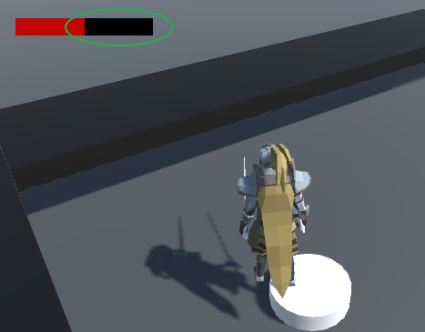

## 四、添加受伤动画、阵亡动画

想Animotor窗口网格区域拖入动画片段R_Damage_Left_02、R_Dead_04，分别重命名为Damage_Left、Dead，然后仅仅将Damage_Left这一个状态转向Empty状态。

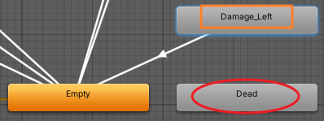

编辑PlayerStats.cs，t添加变量animatorHandler声明，用Awake方法获取，在TakeDamage方法里调用如下：

```c#
AnimatorHandler animatorHandler;

private void Awake()
{
    animatorHandler = GetComponentInChildren<AnimatorHandler>();
}

public void TakeDamage(int damage)
{
    ...
    animatorHandler.PlayerTargetAnimation("Damage_Left", true);

    if(currentHealth <= 0)
    {
        currentHealth = 0;
        animatorHandler.PlayerTargetAnimation("Dead", true);
    }
}
```

保存脚本，播放游戏，当角色碰到Fire时，有受伤动画，当角色血条全黑时，有死亡动画。

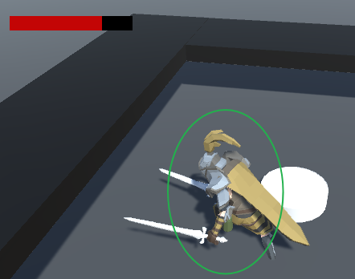

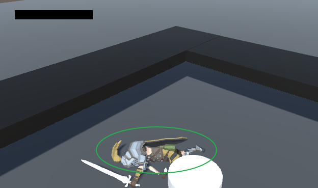

## 五、脚本汇总

### Healthbar.cs

```c#
using System.Collections;
using System.Collections.Generic;
using UnityEngine;
using UnityEngine.UI;

namespace MJ
{
    public class HealthBar : MonoBehaviour
    {
        public Slider slider;

        public void SetMaxHealth(int maxHealth)
        {
            slider.maxValue = maxHealth;
            slider.value = maxHealth;
        }

        public void SetCurrentHealth(int currentHealth)
        {
            slider.value = currentHealth;
        }
    }
}
```

### DamagePlayer.cs

```c#
using System.Collections;
using System.Collections.Generic;
using UnityEngine;

namespace MJ
{
    public class DamagePlayer : MonoBehaviour
    {
        public int damage = 25;

        private void OnTriggerEnter(Collider other)
        {
            PlayerStats playerStats = other.GetComponent<PlayerStats>();

            if(playerStats != null)
            {
                playerStats.TakeDamage(damage);
            }
        }
    }
}
```

### PlayerStats.cs

```c#
using System.Collections;
using System.Collections.Generic;
using UnityEngine;
namespace MJ
{
    public class PlayerStats : MonoBehaviour
    {
        public int healthLevel = 10;
        public int maxHealth;
        public int currentHealth;
        public HealthBar healthBar;
        AnimatorHandler animatorHandler;
        CapsuleCollider collider;

        private void Awake()
        {
            animatorHandler = GetComponentInChildren<AnimatorHandler>();
            collider = GetComponent<CapsuleCollider>();
        }

        void Start()
        {
            maxHealth = SetMaxHealthFromHealthLevel();
            currentHealth = maxHealth;
            healthBar.SetMaxHealth(maxHealth);
        }

        private int SetMaxHealthFromHealthLevel()
        {
            maxHealth = healthLevel * 10;
            return maxHealth;
        }
        public void TakeDamage(int damage)
        {
            currentHealth = currentHealth - damage;

            healthBar.SetCurrentHealth(currentHealth);

            animatorHandler.PlayerTargetAnimation("Damage_Left", true);

            if(currentHealth <= 0)
            {
                currentHealth = 0;
                animatorHandler.PlayerTargetAnimation("Dead", true);
                collider.enabled = false;
            }
        }
    }
}
```

