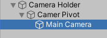
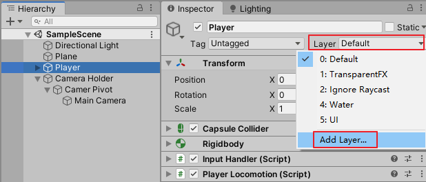
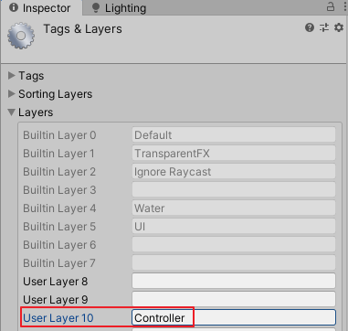
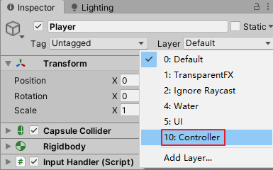
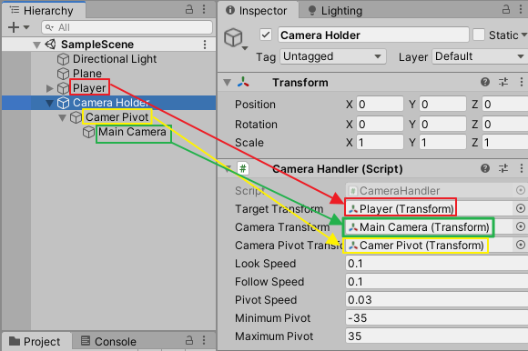
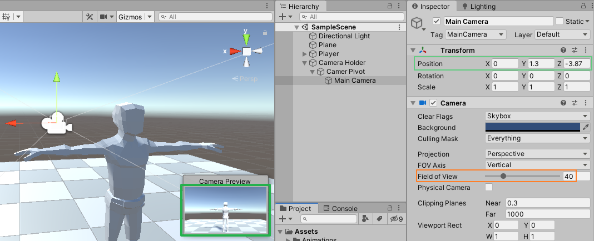

# DarkSoulsDemo part 2 摄像机管理器
date: 2020-06-19 13:44:52

本篇根据视频：https://www.youtube.com/watch?v=c1FYp1oOFIs

## 一、布置摄像机

在Hierarchy新建一个空物体，命名为Camera Holder，右键Camera Holder，新建一个空物体，命名为Camera Pivot，将Main Camera拖拽到Camera Pivot。



## 二、写脚本

新建一个脚本，取名CameraHandler.cs，用VS2017打开，编写代码如下：

```c#
using System.Collections;
using System.Collections.Generic;
using UnityEngine;

namespace MJ
{
    public class CameraHandler : MonoBehaviour
    {
        public Transform targetTransform;
        public Transform cameraTransform;
        public Transform cameraPivotTransform;
        private Transform myTransform;
        private Vector3 cameraTransformPosition;
        private LayerMask ignoreLayers;

        public static CameraHandler singleton;

        public float lookSpeed = 0.1f;
        public float followSpeed = 0.1f;
        public float pivotSpeed = 0.03f;

        private float defaultPosition;
        private float lookAngle;
        private float pivotAngle;
        public float minimumPivot = -35;
        public float maximumPivot = 35;

        private void Awake()
        {
            singleton = this;
            myTransform = transform;
            defaultPosition = cameraTransform.localPosition.z;
            ignoreLayers = ~(1 << 8 | 1 << 9 | 1 << 10);
        }
    }
}
```

## 三、设置层级、脚本补充

回到Unity编辑器，在Hierarchy选中Player，在Inspector设置层级。







回到CameraHandler.cs，在Awake方法下编写FollowTarget方法和HandleCameraRotation方法：

```c#
private void Awake()...
     
public void FollowTarget(float delta)
 {
     Vector3 targetPosition = Vector3.Lerp(myTransform.position, targetTransform.position, delta / followSpeed);
     myTransform.position = targetPosition;
 }

public void HandleCameraRotation(float delta, float mouseXInput, float mouseYInput)
{
    lookAngle += (mouseXInput * lookSpeed) / delta;
    pivotAngle -= (mouseYInput * pivotSpeed) / delta;
    pivotAngle = Mathf.Clamp(pivotAngle, minimumPivot, maximumPivot);

    Vector3 rotation = Vector3.zero;
    rotation.y = lookAngle;
    Quaternion targetRotation = Quaternion.Euler(rotation);
    myTransform.rotation = targetRotation;

    rotation = Vector3.zero;
    rotation.x = pivotAngle;
    targetRotation = Quaternion.Euler(rotation);
    cameraPivotTransform.localRotation = targetRotation;
}
```

回到InputHandler.cs 声明CameraHandler类型变量cameraHandler，编写Awake方法和FixedUpdate方法

```c#
CameraHandler cameraHandler;

private void Awake()
{
    cameraHandler = CameraHandler.singleton;
}

private void FixedUpdate()
{
    float delta = Time.fixedDeltaTime;

    if(cameraHandler != null)
    {
        cameraHandler.FollowTarget(delta);
        cameraHandler.HandleCameraRotation(delta, mouseX, mouseY);
    }
}
```

## 四、配置摄像机

保存脚本，回到Unity编辑器，选中将CameraHandler.cs添加到Camera Holder，并给Target Transform、Camera Transform、Camera Pivot Transform赋值。



然后将Player、Camera Holder、Camera Pivot的位置坐标全部重置为（0，0，0），选中Main Camera ,调整到角色后背合适的位置。调整摄像机视野Main Camera|Camera|Field of View。



现在保存场景，播放游戏，在移动角色的同时，我们可以像再黑暗之魂里一样移动摄像机的视角。

## 五、脚本汇总

### CameraHandler.cs

```c#
using System.Collections;
using System.Collections.Generic;
using UnityEngine;

namespace MJ
{
    public class CameraHandler : MonoBehaviour
    {
        public Transform targetTransform;
        public Transform cameraTransform;
        public Transform cameraPivotTransform;
        private Transform myTransform;
        private Vector3 cameraTransformPosition;
        private LayerMask ignoreLayers;

        public static CameraHandler singleton;

        public float lookSpeed = 0.1f;
        public float followSpeed = 0.1f;
        public float pivotSpeed = 0.03f;

        private float defaultPosition;
        private float lookAngle;
        private float pivotAngle;
        public float minimumPivot = -35;
        public float maximumPivot = 35;

        private void Awake()
        {
            singleton = this;
            myTransform = transform;
            defaultPosition = cameraTransform.localPosition.z;
            ignoreLayers = ~(1 << 8 | 1 << 9 | 1 << 10);
        }
        public void FollowTarget(float delta)
        {
            Vector3 targetPosition = Vector3.Lerp(myTransform.position, targetTransform.position, delta / followSpeed);
            myTransform.position = targetPosition;
        }

        public void HandleCameraRotation(float delta, float mouseXInput, float mouseYInput)
        {
            lookAngle += (mouseXInput * lookSpeed) / delta;
            pivotAngle -= (mouseYInput * pivotSpeed) / delta;
            pivotAngle = Mathf.Clamp(pivotAngle, minimumPivot, maximumPivot);

            Vector3 rotation = Vector3.zero;
            rotation.y = lookAngle;
            Quaternion targetRotation = Quaternion.Euler(rotation);
            myTransform.rotation = targetRotation;

            rotation = Vector3.zero;
            rotation.x = pivotAngle;
            targetRotation = Quaternion.Euler(rotation);
            cameraPivotTransform.localRotation = targetRotation;
        }
    }
}
```

### InputHandler.cs

```c#
using System.Collections;
using System.Collections.Generic;
using UnityEngine;

namespace MJ { 
    public class InputHandler : MonoBehaviour
    {
        public float horizontal;
        public float vertical;
        public float moveAmount;
        public float mouseX;
        public float mouseY;

        PlayerControls inputActions;
        CameraHandler cameraHandler;

        Vector2 movementInput;
        Vector2 cameraInput;

        private void Awake()
        {
            cameraHandler = CameraHandler.singleton;
        }

        private void FixedUpdate()
        {
            float delta = Time.fixedDeltaTime;

            if(cameraHandler != null)
            {
                cameraHandler.FollowTarget(delta);
                cameraHandler.HandleCameraRotation(delta, mouseX, mouseY);
            }
        }


        public void OnEnable()
        {
            if(inputActions == null)
            {
                inputActions = new PlayerControls();
                inputActions.PlayerMovement.Movement.performed += inputActions => movementInput = inputActions.ReadValue<Vector2>();
                inputActions.PlayerMovement.Camera.performed += i => cameraInput = i.ReadValue<Vector2>();
            }

            inputActions.Enable();
        }

        private void OnDisable()
        {
            inputActions.Disable();
        }

        public void TickInput(float delta)
        {
            MoveInput(delta);
        }

        private void MoveInput(float delta)
        {
            horizontal = movementInput.x;
            vertical = movementInput.y;
            moveAmount = Mathf.Clamp01(Mathf.Abs(horizontal) + Mathf.Abs(vertical));
            mouseX = cameraInput.x;
            mouseY = cameraInput.y;
        }
    }
}
```

