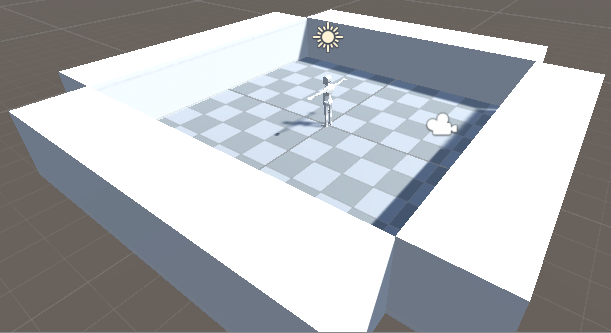
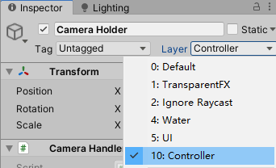
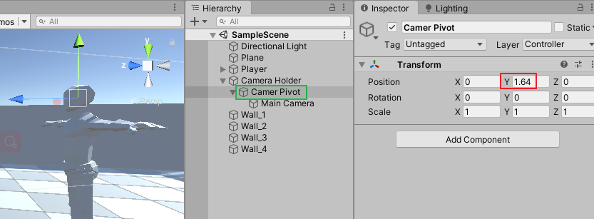
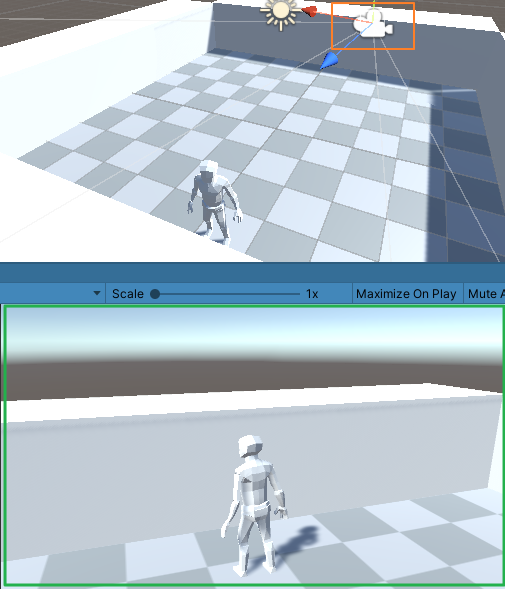
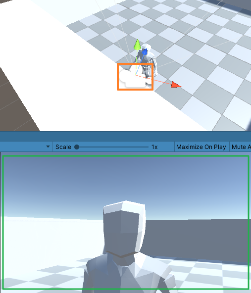

# DarkSoulsDemo part 3 摄像机碰撞
date: 2020-06-20 12:26:24

本片根据视频：https://www.youtube.com/watch?v=Don3lGSAF2A

给Plane围上围墙，播放游戏，角色走到墙边，如果移动鼠标使摄像机到墙里，角色会被墙挡住。接下来我们将解决这个问题



## 一、修改CameraHandler脚本

打开CameraHandler.cs，声明Vector3类型变量cameraFollowVelocity并初始化，修改FollowTarget方法。

```c#
...
private Vector3 cameraFollowVelocity = Vector3.zero;
...
public void FollowTarget(float delta)
{
    Vector3 targetPosition = Vector3.SmoothDamp(myTransform.position,
                                                targetTransform.position,
                                                ref cameraFollowVelocity,
                                                delta / followSpeed);
    myTransform.position = targetPosition;
}
```

声明如下变量并初始化，编写方法HandleCameraCollision

```c#
...
public float cameraSphereRadius = 0.2f;
public float cameraCollisionOffSet = 0.2f;
public float minimumCollisionOffSet = 0.2f;
...
private void HandleCameraCollision(float delta)
{
    targetPosition = defaultPosition;
    RaycastHit hit;
    Vector3 direction = cameraTransform.position - cameraPivotTransform.position;
    direction.Normalize();

    if(Physics.SphereCast(cameraPivotTransform.position,
                          cameraSphereRadius,
                          direction,
                          out hit,
                          Mathf.Abs(targetPosition),
                          ignoreLayers))
    {
        float dis = Vector3.Distance(cameraPivotTransform.position, hit.point);
        targetPosition = -(dis - cameraCollisionOffSet);
    }

    if(Mathf.Abs(targetPosition) < minimumCollisionOffSet)
    {
        targetPosition = -minimumCollisionOffSet;
    }

    cameraTransformPosition.z = Mathf.Lerp(cameraTransform.localPosition.z,
                                           targetPosition,
                                           delta / 0.2f);
    cameraTransform.localPosition = cameraTransformPosition;
}
```

再次修改FollowTarget方法，调用HandleCameraCollision方法。

```c#
public void FollowTarget(float delta)
{
    Vector3 targetPosition = Vector3.SmoothDamp(myTransform.position, 
                                                targetTransform.position, ref cameraFollowVelocity, delta / followSpeed);
    myTransform.position = targetPosition;
    HandleCameraCollision(delta);
}
```

## 二、修改层级，调整Camera Pivot

回到Unity编辑器，修改Camera Holder、Camera Pivot的层级为Controller。



调整Camera Pivot|Transform|Y到与角色的头部差不多高。



播放游戏，控制角色走到墙边，此时摄像机再身后保持正常距离。



移动鼠标使摄像机处在角色面前，摄像机与墙有碰撞而不会穿过墙。



## 三、脚本汇总

### CameraHandler.cs

```c#
using System.Collections;
using System.Collections.Generic;
using UnityEngine;

namespace MJ
{
    public class CameraHandler : MonoBehaviour
    {
        public Transform targetTransform;
        public Transform cameraTransform;
        public Transform cameraPivotTransform;
        private Transform myTransform;
        private Vector3 cameraTransformPosition;
        private LayerMask ignoreLayers;
        private Vector3 cameraFollowVelocity = Vector3.zero;

        public static CameraHandler singleton;

        public float lookSpeed = 0.1f;
        public float followSpeed = 0.1f;
        public float pivotSpeed = 0.03f;

        private float targetPosition;
        private float defaultPosition;
        private float lookAngle;
        private float pivotAngle;
        public float minimumPivot = -35;
        public float maximumPivot = 35;

        public float cameraSphereRadius = 0.2f;
        public float cameraCollisionOffSet = 0.2f;
        public float minimumCollisionOffSet = 0.2f;

        private void Awake()
        {
            singleton = this;
            myTransform = transform;
            defaultPosition = cameraTransform.localPosition.z;
            ignoreLayers = ~(1 << 8 | 1 << 9 | 1 << 10);
        }
        public void FollowTarget(float delta)
        {
            Vector3 targetPosition = Vector3.SmoothDamp(myTransform.position, 
                targetTransform.position, ref cameraFollowVelocity, delta / followSpeed);
            myTransform.position = targetPosition;
            HandleCameraCollision(delta);
        }

        public void HandleCameraRotation(float delta, float mouseXInput, float mouseYInput)
        {
            lookAngle += (mouseXInput * lookSpeed) / delta;
            pivotAngle -= (mouseYInput * pivotSpeed) / delta;
            pivotAngle = Mathf.Clamp(pivotAngle, minimumPivot, maximumPivot);

            Vector3 rotation = Vector3.zero;
            rotation.y = lookAngle;
            Quaternion targetRotation = Quaternion.Euler(rotation);
            myTransform.rotation = targetRotation;

            rotation = Vector3.zero;
            rotation.x = pivotAngle;
            targetRotation = Quaternion.Euler(rotation);
            cameraPivotTransform.localRotation = targetRotation;
        }

        private void HandleCameraCollision(float delta)
        {
            targetPosition = defaultPosition;
            RaycastHit hit;
            Vector3 direction = cameraTransform.position - cameraPivotTransform.position;
            direction.Normalize();

            if(Physics.SphereCast(cameraPivotTransform.position,
                cameraSphereRadius,
                direction,
                out hit,
                Mathf.Abs(targetPosition),
                ignoreLayers))
            {
                float dis = Vector3.Distance(cameraPivotTransform.position, hit.point);
                targetPosition = -(dis - cameraCollisionOffSet);
            }

            if(Mathf.Abs(targetPosition) < minimumCollisionOffSet)
            {
                targetPosition = -minimumCollisionOffSet;
            }

            cameraTransformPosition.z = Mathf.Lerp(cameraTransform.localPosition.z,
                targetPosition,
                delta / 0.2f);
            cameraTransform.localPosition = cameraTransformPosition;
        }
    }
}
```

