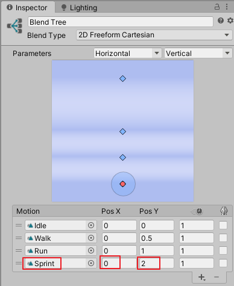

# DarkSoulsDemo part 5 角色冲刺
date: 2020-06-20 18:50:42

本文根据视频：https://www.youtube.com/watch?v=gyqfmE_1aus&t=315s

## 一、导入、添加冲刺动画片段

打开动画控制器Humanoid，双击进入Locomotion，选中Blend Tree，在Inspector的Motion列表里点击加号新增动作域，将动画片段Sprint拖入。修改Pos X、Pos Y的值分别为0、2。



## 二、修改脚本

用VS2017打开AnimatorHandler.cs，修改UpdateAnimatorValues方法如下：

```c# AnimatorHandler.cs
public void UpdateAnimatorValues(float verticalMovement, float horizontalMovement, bool isSprinting)
{
    #region Vertical ...

    #region Horizontal ...

    if (isSprinting)
    {
        v = 2;
        h = horizontalMovement;
    }

    anim.SetFloat(vertical, v, 0.1f, Time.deltaTime);
    anim.SetFloat(horizontal, h, 0.1f, Time.deltaTime);
}
```

在PlayerLocomotion.cs里添加声明bool类型变量isSprinting，并在HandleMovement()方法里传入animatorHandler.UpdateAnimatorValues()方法。

```c# PlayerLocomotion.cs
public bool isSprinting;

public void HandleMovement(float delta)
{
	...
    animatorHandler.UpdateAnimatorValues(inputHandler.moveAmount, 0, isSprinting);
	...
}
```

在InputHandler.cs里添加变量声明rollInputTimer、sprintFlag，修改HandleRollInput()方法。

```c# InputHandler.cs
public float rollInputTimer;
public bool sprintFlag;

private void HandleRollInput(float delta)
{
    b_Input = inputActions.PlayerAction.Roll.phase == UnityEngine.InputSystem.InputActionPhase.Started;
    if (b_Input)
    {
        rollInputTimer += delta;
        sprintFlag = true;
    }
    else
    {
        if(rollInputTimer > 0 && rollInputTimer < 0.5f)
        {
            sprintFlag = false;
            rollFlag = true;
        }

        rollInputTimer = 0;
    }
}
```

打开PlayerLocomotion.cs，声明变量sprintSpeed，修改HandlerMovement方法

```c# PlayerLocomotion.cs
[SerializeField]
float sprintSpeed = 7;

public void HandleMovement(float delta)
{
    if (inputHandler.rollFlag)
        return;

    moveDirection = cameraObject.forward * inputHandler.vertical;
    moveDirection += cameraObject.right * inputHandler.horizontal;
    moveDirection.Normalize();
    moveDirection.y = 0;

    float speed = movementSpeed;

    if (inputHandler.sprintFlag)
    {
        speed = sprintSpeed;
        isSprinting = true;
        moveDirection *= speed;
    }
    else
    {
        moveDirection *= speed;  
    }

    Vector3 projectedVelocity = Vector3.ProjectOnPlane(moveDirection, normalVector);
    rigidbody.velocity = projectedVelocity;

    animatorHandler.UpdateAnimatorValues(inputHandler.moveAmount, 0, isSprinting);

    if (animatorHandler.canRotate)
    {
        HandleRotation(delta);
    }
}
```

在Update方法里添加对isSprinting的赋值；

```c# PlayerLocomotion.cs
public void Update()
{
    float delta = Time.deltaTime;

    isSprinting = inputHandler.b_Input;
    inputHandler.TickInput(delta);
    HandleMovement(delta);
    HandleRollingAndSprinting(delta);

}
```

打开PlayerManager.cs，修改Update方法

```c# PlayerManager.cs
void Update()
{
    inputHandler.isInteracting = anim.GetBool("IsInteracting");
    inputHandler.rollFlag = false;
    inputHandler.sprintFlag = false;
}
```

保存所有脚本，播放游戏，控制角色移动并按住键盘左Shift键或手柄B键，角色冲刺。

## 三、脚本汇总

```c# AnimatorHandler.cs
using System.Collections;
using System.Collections.Generic;
using UnityEngine;

namespace MJ { 
    public class AnimatorHandler : MonoBehaviour
    {
        public Animator anim;
        public InputHandler inputHandler;
        public PlayerLocomotion playerLocomotion;
        int vertical;
        int horizontal;
        public bool canRotate;

        public void Initialize()
        {
            anim = GetComponent<Animator>();
            inputHandler = GetComponentInParent<InputHandler>();
            playerLocomotion = GetComponentInParent<PlayerLocomotion>();
            vertical = Animator.StringToHash("Vertical");
            horizontal = Animator.StringToHash("Horizontal");
        }
        public void UpdateAnimatorValues(float verticalMovement, float horizontalMovement, bool isSprinting)
        {
            #region Vertical
            float v = 0;

            if(verticalMovement > 0 && verticalMovement < 0.55f)
            {
                v = 0.5f;
            }else if(verticalMovement > 0.55f)
            {
                v = 1;
            }else if(verticalMovement < 0 && verticalMovement > -0.55f)
            {
                v = -0.5f;
            }else if(verticalMovement < -0.55f)
            {
                v = -1;
            }
            else
            {
                v = 0;
            }
            #endregion

            #region Horizontal
            float h = 0;

            if(horizontalMovement > 0 && horizontalMovement < 0.55f)
            {
                h = 0.5f;
            }else if(horizontalMovement > 0.55f)
            {
                h = 1;
            }else if(horizontalMovement < 0 && horizontalMovement > -0.55f)
            {
                h = -0.5f;
            }else if(verticalMovement < -0.55f)
            {
                h = -1;
            }
            else
            {
                h = 0;
            }
            #endregion

            if (isSprinting)
            {
                v = 2;
                h = horizontalMovement;
            }

            anim.SetFloat(vertical, v, 0.1f, Time.deltaTime);
            anim.SetFloat(horizontal, h, 0.1f, Time.deltaTime);

        }

        public void PlayerTargetAnimation(string targetAnim, bool isInteracting)
        {
            anim.applyRootMotion = isInteracting;
            anim.SetBool("IsInteracting", true);
            anim.CrossFade(targetAnim, 0.2f);
        }

        public void CanRotate()
        {
            canRotate = true;
        }
        public void StopRotate()
        {
            canRotate = false;
        }

        private void OnAnimatorMove()
        {
            if (inputHandler.isInteracting == false)
                return;

            float delta = Time.deltaTime;
            playerLocomotion.rigidbody.drag = 0;
            Vector3 deltaPosition = anim.deltaPosition;
            deltaPosition.y = 0;
            Vector3 velocity = deltaPosition / delta;
            playerLocomotion.rigidbody.velocity = velocity;
        }
    }
}
```

```c# InputHandler.cs
using System.Collections;
using System.Collections.Generic;
using UnityEngine;

namespace MJ { 
    public class InputHandler : MonoBehaviour
    {
        public float horizontal;
        public float vertical;
        public float moveAmount;
        public float mouseX;
        public float mouseY;

        public bool b_Input;

        public bool rollFlag;
        public bool sprintFlag;
        public float rollInputTimer;
        public bool isInteracting;

        PlayerControls inputActions;
        CameraHandler cameraHandler;

        Vector2 movementInput;
        Vector2 cameraInput;

        private void Awake()
        {
            cameraHandler = CameraHandler.singleton;
        }

        private void FixedUpdate()
        {
            float delta = Time.fixedDeltaTime;

            if(cameraHandler != null)
            {
                cameraHandler.FollowTarget(delta);
                cameraHandler.HandleCameraRotation(delta, mouseX, mouseY);
            }
        }


        public void OnEnable()
        {
            if(inputActions == null)
            {
                inputActions = new PlayerControls();
                inputActions.PlayerMovement.Movement.performed += inputActions => movementInput = inputActions.ReadValue<Vector2>();
                inputActions.PlayerMovement.Camera.performed += i => cameraInput = i.ReadValue<Vector2>();
            }

            inputActions.Enable();
        }

        private void OnDisable()
        {
            inputActions.Disable();
        }

        public void TickInput(float delta)
        {
            MoveInput(delta);
            HandleRollInput(delta);
        }

        private void MoveInput(float delta)
        {
            horizontal = movementInput.x;
            vertical = movementInput.y;
            moveAmount = Mathf.Clamp01(Mathf.Abs(horizontal) + Mathf.Abs(vertical));
            mouseX = cameraInput.x;
            mouseY = cameraInput.y;
        }

        private void HandleRollInput(float delta)
        {
            b_Input = inputActions.PlayerAction.Roll.phase == UnityEngine.InputSystem.InputActionPhase.Started;
            if (b_Input)
            {
                rollInputTimer += delta;
                sprintFlag = true;
            }
            else
            {
                if(rollInputTimer > 0 && rollInputTimer < 0.5f)
                {
                    sprintFlag = false;
                    rollFlag = true;
                }

                rollInputTimer = 0;
            }
        }
    }
}
```

```c# PlayerLocomotion.cs
using System.Collections;
using System.Collections.Generic;
using UnityEngine;

namespace MJ { 

    public class PlayerLocomotion : MonoBehaviour
    {
        Transform cameraObject;
        InputHandler inputHandler;
        Vector3 moveDirection;

        [HideInInspector]
        public Transform myTransform;
        [HideInInspector]
        public AnimatorHandler animatorHandler;

        public new Rigidbody rigidbody;
        public GameObject normalCamera;

        [Header("Stats")]
        [SerializeField]
        float movementSpeed = 5;
        [SerializeField]
        float sprintSpeed = 7;
        [SerializeField]
        float rotationSpeed = 10;

        public bool isSprinting;

        // Start is called before the first frame update
        void Start()
        {
            rigidbody = GetComponent<Rigidbody>();
            inputHandler = GetComponent<InputHandler>();
            animatorHandler = GetComponentInChildren<AnimatorHandler>();
            cameraObject = Camera.main.transform;
            myTransform = transform;
            animatorHandler.Initialize();
        }
        public void Update()
        {
            float delta = Time.deltaTime;

            isSprinting = inputHandler.b_Input;
            inputHandler.TickInput(delta);
            HandleMovement(delta);
            HandleRollingAndSprinting(delta);
           
        }

        #region Movement
        Vector3 normalVector;
        Vector3 targetPostion;

        private void HandleRotation(float delta)
        {
            Vector3 targetDir = Vector3.zero;
            float moveOverride = inputHandler.moveAmount;

            targetDir = cameraObject.forward * inputHandler.vertical;
            targetDir += cameraObject.right * inputHandler.horizontal;

            targetDir.Normalize();
            targetDir.y = 0;

            if(targetDir == Vector3.zero)
            {
                targetDir = myTransform.forward;
            }
            float rs = rotationSpeed;
            Quaternion tr = Quaternion.LookRotation(targetDir);
            Quaternion targetRotation = Quaternion.Slerp(myTransform.rotation, tr, rs * delta);

            myTransform.rotation = targetRotation;
        }

        public void HandleMovement(float delta)
        {
            if (inputHandler.rollFlag)
                return;

            moveDirection = cameraObject.forward * inputHandler.vertical;
            moveDirection += cameraObject.right * inputHandler.horizontal;
            moveDirection.Normalize();
            moveDirection.y = 0;

            float speed = movementSpeed;

            if (inputHandler.sprintFlag)
            {
                speed = sprintSpeed;
                isSprinting = true;
                moveDirection *= speed;
            }
            else
            {
                moveDirection *= speed;
            }

            Vector3 projectedVelocity = Vector3.ProjectOnPlane(moveDirection, normalVector);
            rigidbody.velocity = projectedVelocity;

            animatorHandler.UpdateAnimatorValues(inputHandler.moveAmount, 0, isSprinting);

            if (animatorHandler.canRotate)
            {
                HandleRotation(delta);
            }
        }
        
        public void HandleRollingAndSprinting(float delta)
        {
            if (animatorHandler.anim.GetBool("IsInteracting"))
                return;
            if (inputHandler.rollFlag)
            {
                moveDirection = cameraObject.forward * inputHandler.vertical;
                moveDirection += cameraObject.right * inputHandler.horizontal;
                if(inputHandler.moveAmount > 0)
                {
                    animatorHandler.PlayerTargetAnimation("Rolling", true);
                    moveDirection.y = 0;
                    Quaternion rollRotation = Quaternion.LookRotation(moveDirection);
                    myTransform.rotation = rollRotation;
                }
                else
                {
                    animatorHandler.PlayerTargetAnimation("Step_Back", true);
                }
            }
        }

        #endregion
    }
}
```

```c# PlayerManager.cs
using System.Collections;
using System.Collections.Generic;
using UnityEngine;
namespace MJ
{
    public class PlayerManager : MonoBehaviour
    {
        InputHandler inputHandler;
        Animator anim;

        void Start()
        {
            inputHandler = GetComponent<InputHandler>();
            anim = GetComponentInChildren<Animator>();
        }

        void Update()
        {
            inputHandler.isInteracting = anim.GetBool("IsInteracting");
            inputHandler.rollFlag = false;
            inputHandler.sprintFlag = false;
        }
    }
}
```

