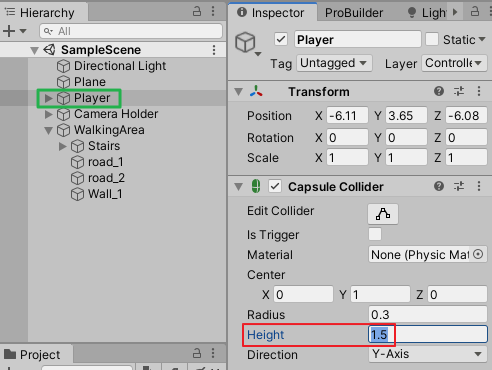
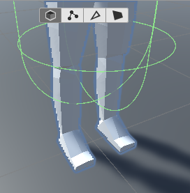
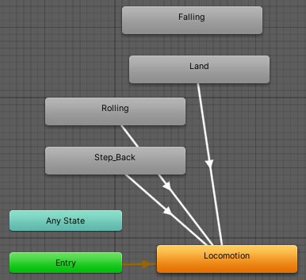
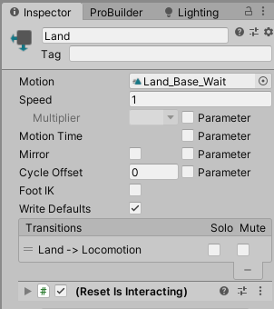
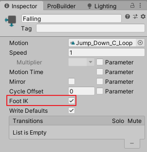
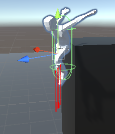

# DarkSoulsDemo（七）角色下落与着陆检测
date: 2020-06-21 19:38:47

本文根据视频教程：https://www.youtube.com/watch?v=dJdmUgqgZjU

使用到的动画片段Land_Base_Wait、Jump_Down_C_Loop，出自 Runner Action Animation Pack

## 一、修改碰撞体

选中Player，修改其胶囊碰撞体组件参数Height为1.5。





## 二、编辑脚本

打开PlayerManager.cs，声明变量isInAir、isGrounded

```c#
public bool isInAir;
public bool isGrounded;
```

打开PlayerLocomotion.cs，声明以下变量

```c#
[Header("Ground & Air Detection Stats")]
[SerializeField]
float groundDetectionRayStartPoint = 0.5f;
[SerializeField]
float minimumDistanceNeededToBeginFall = 1f;
[SerializeField]
float groundDirectionRayDistance = 0.2f;
LayerMask ignoreForGroundCheck;
public float inAirTimer;

[Header("Movement Stats")]
...
[SerializeField]
float fallingSpeed = 45;
```

回到PlayerManager.cs，再LateUpdate方法里添加以下语句

```c#
private void LateUpdate()
{
	...
    if (isInAir)
    {
        playerLocomotion.inAirTimer = playerLocomotion.inAirTimer + Time.deltaTime;
    }
}
```

再PlayerLocomotion.cs编写HandleFalling方法，修改moveDirection声明前加上关键字public。

```c#
...
public Vector3 moveDirection
...
void Start()
{
    ...
    playerManager.isGrounded = true;
    ignoreForGroundCheck = ~(1 << 8 | 1 << 11);
}
...
public void HandleFalling(float delta, Vector3 moveDirection)
{
    playerManager.isGrounded = false;
    RaycastHit hit;
    Vector3 origin = myTransform.position;
    origin.y += groundDetectionRayStartPoint;

    if(Physics.Raycast(origin, myTransform.forward, out hit, 0.4f))
    {
        moveDirection = Vector3.zero;
    }

    if (playerManager.isInAir)
    {
        rigidbody.AddForce(-Vector3.up * fallingSpeed);
        //This Force kicks your ass from the edge. ↓
        rigidbody.AddForce(moveDirection * fallingSpeed / 3f);
    }

    Vector3 dir = moveDirection;
    dir.Normalize();
    origin = origin + dir * groundDirectionRayDistance;

    targetPostion = myTransform.position;

    Debug.DrawRay(origin, = -Vector3.up * minimumDistanceNeededToBeginFall, Color.red, 0.1f, false);
    if(Physics.Raycast(origin, -Vector3.up, out hit, minimumDistanceNeededToBeginFall, ignoreForGroundCheck))
    {
        normalVector = hit.normal;
        Vector3 tp = hit.point;
        playerManager.isGrounded = true;
        targetPostion.y = tp.y;

        if (playerManager.isInAir)
        {
            if(inAirTimer > 0.5f)
            {
                Debug.Log("You were in the air for" + inAirTimer);
                animatorHandler.PlayerTargetAnimation("Land", true);
            }
            else
            {
                animatorHandler.PlayerTargetAnimation("Empty", false);
                inAirTimer = 0;
            }

            playerManager.isInAir = false;
        }
    }
    else
    {
        if (playerManager.isGrounded)
        {
            playerManager.isGrounded = false;
        }

        if(playerManager.isInAir == false)
        {
            if(playerManager.isInteracting == false)
            {
                animatorHandler.PlayerTargetAnimation("Falling", true);
            }
            Vector3 vel = rigidbody.velocity;
            vel.Normalize();
            rigidbody.velocity = vel * (movementSpeed / 2);
            playerManager.isInAir = true;
        }
    }
    if (playerManager.isGrounded)
    {
        if(playerManager.isInteracting || inputHandler.moveAmount > 0)
        {
            myTransform.position = Vector3.Lerp(myTransform.position, targetPostion, Time.deltaTime);
        }
        else
        {
            myTransform.position = targetPostion;
        }
    }
}
```

在PlayerManager.cs的Update方法里调用HandleFalling方法。

```c#
void Update()
{
...
playerLocomotion.HandleFalling(delta, playerLocomotion.moveDirection);
}
```

## 三、添加动画状态

将着陆动画片段Land_Base_Wait拖入动画Base Layer中，重命名为Land，建立到Locomotion的转变关系，添加ResetIsInteracting Behaviour。

将下落动画片段Jump_Down_C_Loop拖入动画Base Layer中，重命名为Falling，不要建立任何转变关系，不添加Behaviour，勾选Foot IK。







打开PlayerLocomotion.cs，在HandleMovement方法开头添加上角色互动信号判断：

```c#
public void HandleMovement(float delta)
{
    if (inputHandler.rollFlag)
        return;
    if (playerManager.isInteracting)
        return;
    ...
```

保存脚本，将角色放置在高处，播放游戏，让角色往下跳，角色检测下落做出下坠动作，检测着陆并播放着陆动画。



## 四、可能遇到的问题

角色卡在边缘没有下落

可能原因：水平方向的受力太小，水平方向速度满，胶囊碰撞体正好卡在边缘。

可以增大HandleFalling方法中" rigidbody.AddForce(moveDirection * fallingSpeed / 3f); "的值大小。即将末尾的3f减小或去掉。但可能会造成下落时“滑翔”太远。

```c#
public void HandleFalling(float delta, Vector3 moveDirection)
{
   	...
    if (playerManager.isInAir)
    {
        rigidbody.AddForce(-Vector3.up * fallingSpeed);
        //This Force kicks your ass from the edge. ↓
        rigidbody.AddForce(moveDirection * fallingSpeed / 3f);
    }
```

## 五、脚本汇总

### PlayerManager.cs

```c#
using System.Collections;
using System.Collections.Generic;
using UnityEngine;
namespace MJ
{
    public class PlayerManager : MonoBehaviour
    {
        InputHandler inputHandler;
        Animator anim;
        CameraHandler cameraHandler;
        PlayerLocomotion playerLocomotion;

        public bool isInteracting;

        [Header("Player Flags")]
        public bool isSprinting;
        public bool isInAir;
        public bool isGrounded;

        private void Awake()
        {
            cameraHandler = CameraHandler.singleton;
        }

        void Start()
        {
            inputHandler = GetComponent<InputHandler>();
            anim = GetComponentInChildren<Animator>();
            playerLocomotion = GetComponent<PlayerLocomotion>();
        }

        void Update()
        {
            float delta = Time.deltaTime;
            isInteracting = anim.GetBool("IsInteracting");

            inputHandler.TickInput(delta);
            playerLocomotion.HandleMovement(delta);
            playerLocomotion.HandleRollingAndSprinting(delta);
            playerLocomotion.HandleFalling(delta, playerLocomotion.moveDirection);
        }

        private void FixedUpdate()
        {
            float delta = Time.fixedDeltaTime;

            if (cameraHandler != null)
            {
                cameraHandler.FollowTarget(delta);
                cameraHandler.HandleCameraRotation(delta, inputHandler.mouseX, inputHandler.mouseY);
            }
        }

        private void LateUpdate()
        {
            inputHandler.rollFlag = false;
            inputHandler.sprintFlag = false;

            if (isInAir)
            {
                playerLocomotion.inAirTimer = playerLocomotion.inAirTimer + Time.deltaTime;
            }
        }
    }
}
```

### PlayerLocomotion.cs

```c#
using System.Collections;
using System.Collections.Generic;
using UnityEngine;

namespace MJ { 

    public class PlayerLocomotion : MonoBehaviour
    {
        PlayerManager playerManager;
        Transform cameraObject;
        InputHandler inputHandler;
        public Vector3 moveDirection;

        [HideInInspector]
        public Transform myTransform;
        [HideInInspector]
        public AnimatorHandler animatorHandler;

        public new Rigidbody rigidbody;
        public GameObject normalCamera;

        [Header("Ground & Air Detection Stats")]
        [SerializeField]
        float groundDetectionRayStartPoint = 0.5f;
        [SerializeField]
        float minimumDistanceNeededToBeginFall = 1f;
        [SerializeField]
        float groundDirectionRayDistance = 0.2f;
        LayerMask ignoreForGroundCheck;
        public float inAirTimer;

        [Header("Movement Stats")]
        [SerializeField]
        float walkingSpeed = 3;
        [SerializeField]
        float movementSpeed = 5;
        [SerializeField]
        float sprintSpeed = 7;
        [SerializeField]
        float rotationSpeed = 10;
        [SerializeField]
        float fallingSpeed = 45;

        // Start is called before the first frame update
        void Start()
        {
            playerManager = GetComponent<PlayerManager>();
            rigidbody = GetComponent<Rigidbody>();
            inputHandler = GetComponent<InputHandler>();
            animatorHandler = GetComponentInChildren<AnimatorHandler>();
            cameraObject = Camera.main.transform;
            myTransform = transform;
            animatorHandler.Initialize();

            playerManager.isGrounded = true;
            ignoreForGroundCheck = ~(1 << 8 | 1 << 11);
        }

        #region Movement
        Vector3 normalVector;
        Vector3 targetPostion;

        private void HandleRotation(float delta)
        {
            Vector3 targetDir = Vector3.zero;
            float moveOverride = inputHandler.moveAmount;

            targetDir = cameraObject.forward * inputHandler.vertical;
            targetDir += cameraObject.right * inputHandler.horizontal;

            targetDir.Normalize();
            targetDir.y = 0;

            if(targetDir == Vector3.zero)
            {
                targetDir = myTransform.forward;
            }
            float rs = rotationSpeed;
            Quaternion tr = Quaternion.LookRotation(targetDir);
            Quaternion targetRotation = Quaternion.Slerp(myTransform.rotation, tr, rs * delta);

            myTransform.rotation = targetRotation;
        }

        public void HandleMovement(float delta)
        {
            if (inputHandler.rollFlag)
                return;
            if (playerManager.isInteracting)
                return;

            moveDirection = cameraObject.forward * inputHandler.vertical;
            moveDirection += cameraObject.right * inputHandler.horizontal;
            moveDirection.Normalize();
            moveDirection.y = 0;

            float speed = movementSpeed;

            if (inputHandler.sprintFlag && inputHandler.moveAmount > 0.5)
            {
                speed = sprintSpeed;
                playerManager.isSprinting = true;
                moveDirection *= speed;
            }
            else
            {
                if(inputHandler.moveAmount < 0.5)
                {
                    moveDirection *= walkingSpeed;
                    playerManager.isSprinting = false;
                }
                else
                {
                    moveDirection *= speed;
                    playerManager.isSprinting = false;
                }
                
            }

            Vector3 projectedVelocity = Vector3.ProjectOnPlane(moveDirection, normalVector);
            rigidbody.velocity = projectedVelocity;

            animatorHandler.UpdateAnimatorValues(inputHandler.moveAmount,
                0, playerManager.isSprinting);

            if (animatorHandler.canRotate)
            {
                HandleRotation(delta);
            }
        }
        
        public void HandleRollingAndSprinting(float delta)
        {
            if (animatorHandler.anim.GetBool("IsInteracting"))
                return;
            if (inputHandler.rollFlag)
            {
                moveDirection = cameraObject.forward * inputHandler.vertical;
                moveDirection += cameraObject.right * inputHandler.horizontal;
                if(inputHandler.moveAmount > 0)
                {
                    animatorHandler.PlayerTargetAnimation("Rolling", true);
                    moveDirection.y = 0;
                    Quaternion rollRotation = Quaternion.LookRotation(moveDirection);
                    myTransform.rotation = rollRotation;
                }
                else
                {
                    animatorHandler.PlayerTargetAnimation("Step_Back", true);
                }
            }
        }

        public void HandleFalling(float delta, Vector3 moveDirection)
        {
            playerManager.isGrounded = false;
            RaycastHit hit;
            Vector3 origin = myTransform.position;
            origin.y += groundDetectionRayStartPoint;

            if(Physics.Raycast(origin, myTransform.forward, out hit, 0.4f))
            {
                moveDirection = Vector3.zero;
            }

            if (playerManager.isInAir)
            {
                rigidbody.AddForce(-Vector3.up * fallingSpeed);
                //This Force kicks your ass from the edge. ↓
                rigidbody.AddForce(moveDirection * fallingSpeed / 3f);
            }

            Vector3 dir = moveDirection;
            dir.Normalize();
            origin = origin + dir * groundDirectionRayDistance;

            targetPostion = myTransform.position;

            Debug.DrawRay(origin, -Vector3.up * minimumDistanceNeededToBeginFall, Color.red, 0.1f, false);
            if(Physics.Raycast(origin, -Vector3.up, out hit, minimumDistanceNeededToBeginFall, ignoreForGroundCheck))
            {
                normalVector = hit.normal;
                Vector3 tp = hit.point;
                playerManager.isGrounded = true;
                targetPostion.y = tp.y;

                if (playerManager.isInAir)
                {
                    if(inAirTimer > 0.5f)
                    {
                        Debug.Log("You were in the air for " + inAirTimer);
                        animatorHandler.PlayerTargetAnimation("Land", true);
                    }
                    else
                    {
                        animatorHandler.PlayerTargetAnimation("Empty", false);
                        inAirTimer = 0;
                    }

                    playerManager.isInAir = false;
                }
            }
            else
            {
                if (playerManager.isGrounded)
                {
                    playerManager.isGrounded = false;
                }

                if(playerManager.isInAir == false)
                {
                    if(playerManager.isInteracting == false)
                    {
                        animatorHandler.PlayerTargetAnimation("Falling", true);
                    }
                    Vector3 vel = rigidbody.velocity;
                    vel.Normalize();
                    rigidbody.velocity = vel * (movementSpeed / 2);
                    playerManager.isInAir = true;
                }
            }
            if (playerManager.isGrounded)
            {
                if(playerManager.isInteracting || inputHandler.moveAmount > 0)
                {
                    myTransform.position = Vector3.Lerp(myTransform.position, targetPostion, Time.deltaTime);
                }
                else
                {
                    myTransform.position = targetPostion;
                }
            }
        }

        #endregion
    }
}
```

