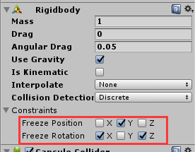
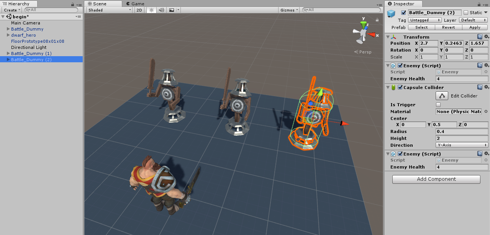
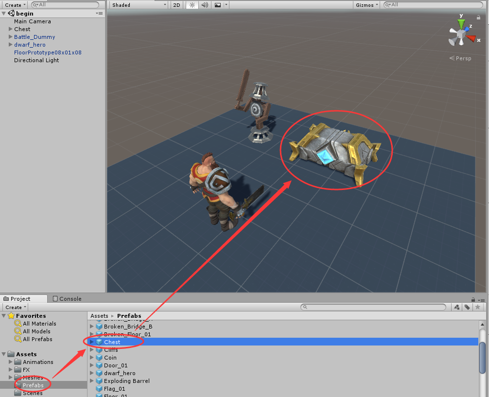
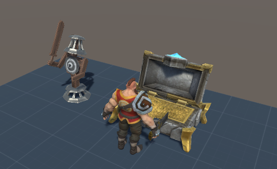
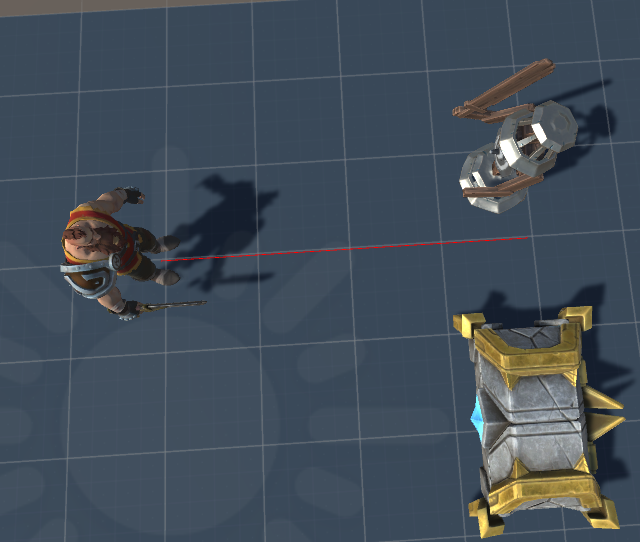
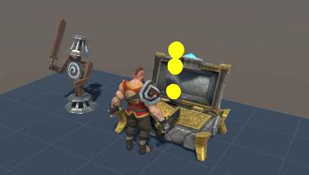

# Unity C Sharp脚本基础
date: 2020-01-18 17:34:55

Unity版本：Unity 2017.4.35f1 Personal

# 一、在Unity中创建C#脚本

1. Project>Assets下新建一个叫“Scripts”的文件夹用于存放脚本

2. 在Scripts文件夹下右键>Create>C# Script，取名“ExampleScript”


两种方法给物体添加脚本：

1. 左键单击并将脚本从项目文件夹拖拽到物体上
2. 在物体的Inspector窗口点击Add Component按钮，选择Scripts添加现有的脚本。

   通过Add Component按钮，选择New Script添加新建脚本，但脚本是被添加到Assets文件夹，而非Scripts文件夹。

删除物体的脚本：在物体的Inspector面板找到例如ExampleScript(Script)，点击小齿轮，选择Remove Component

调试时打开和关闭脚本：勾选或取消勾选相应的脚本。脚本中可能有错误，如果禁用它，它可能仍会出现并在底部显示错误。因此需要使用代码注释来屏蔽代码块

注意：项目窗口的脚本删除后无法撤销删除。


# 二、脚本结构

双击ExampleScript将自动加载到Visual Studio 2017，如果遇到”File Modification Detected“弹窗，选择“Reload All”重新加载脚本。在Visual Studio将看到ExampleScript.cs的代码：

```c#
using System.Collections;//命名空间
using System.Collections.Generic;//命名空间只是引用类的名称的集合
using UnityEngine;

public class NewBehaviourScript : MonoBehaviour {
//每一个通过Unity新建的脚本都继承自MonoBehavior

	// Use this for initialization
	void Start () {
		
	}	
	// Update is called once per frame
	void Update () {
		
	}
}
```

**MonoBehavior**来自命名空间UnityEngine，每一个通过Unity新建的脚本都继承自MonoBehavior。

MonoBehavior允许你将脚本作为组件附加到游戏对象中。

**类(Class)**，只是变量和方法的容器

注意到，类名和.cs文件名相同。如果要修改类的名字，.cs文件名也要一起修改。

起始函数Start()：脚本一启动就执行的方法。

更新函数Update()：每一帧都在执行以保证更新的方法。

# 三、对游戏对象的基本操作

## 1. 访问、操纵游戏对象组件

1. 导入资源包：首先在Assets文件夹导入Unity_C_Sharp_Fundamentals_Assets.unitypackage。

2. 创建一个Floor：在Assets/Standard Assets/Prototyping/Prefabs下找到FloorPrototype08x01x08，拖拽到场景中，重置其位置。

3. 放入角色：在Assets/Prefabs下找到dwarf_hero，拖拽到场景中的Floor上。给角色添加Capsule Collider组件，并将Capsule Collider下的Center > Y设为0.8，Radius设为0.4，Height设为1.6。

4. 为角色添加脚本：在Assets/Scripts下创建脚本Player.cs，打开脚本，编辑代码如下并保存。

   ```c#
   using System.Collections;
   using System.Collections.Generic;
   using UnityEngine;
   
   public class Player : MonoBehaviour {
       public CapsuleCollider playerConllider;
   	// Use this for initialization
   	void Start () {
           playerConllider = GetComponent<CapsuleCollider>();
   	}
   	
   	// Update is called once per frame
   	void Update () {
   		
   	}
   }
   ```

   回到Unity编辑器，将Player.cs拖拽到角色的Inspector窗口里。可以看到角色增加了一个叫Player(Script)的组件，里边的Player Collider的值为None(Collider)。当我们点击播放按钮，Player Collider会很容易地自动获取到Collider组件，因为Capsule Collider组件和脚本组件在同一个游戏物体里（角色）。

   如果我们在上边的代码中**public Collider playerCollider;**下插入一行**playerCollider.enabled = false;**，保存脚本回到Unity点击播放，则可以看到Capsule Collider组件被取消勾选。

   同理，如果我们在上边的代码中**public Collider playerCollider;**下插入一行**playerConllider.isTrigger = true;**，保存脚本回到Unity点击播放，则可以看到Capsule Collider组件下的Is Trigger被勾选。

   如果我们要在游戏启动时修改Capsule Collider的长度、中心位置，我们可以编写代码如下：

   ```c#
   void Start () {
       playerCollider = GetComponent<CapsuleCollider>();
       //playerCollider.enabled = false; //取消勾选Capsule Collider组件
       //playerCollider.isTrigger = true; //勾选Capsule Collider组件下Is Trigger选项
       playerCollider.height = 3f; //修改胶囊碰撞体的高（长度）
       playerCollider.center = new Vector3(0f, 2f, 0f); //修改胶囊碰撞体中心的位置坐标
   }
   ```

## 2. 用户输入

在Unity编辑器菜单栏，点击Edit > Project Settings > Input在Inspector窗口打开**InputManager**。我们可以在InputManager中编辑用户输入控制。

我们回到Player.cs，编辑Update函数如下：

```c#
void Update ()
{
	float moveHorizontal = Input.GetAxis("Horizontal");
	float moveVertical = Input.GetAxis("Vertical");

	print(moveHorizontal);
}
```

保存后回到Unity编辑器点击播放，当我们按住【A】键时，控制台将打印消息一系列大于-1且小于0的小数，打印的小数快速减小直到打印出-1，松开键盘后归0，按住【D】键，打印大于0且小于1的小数，并且打印的小数快速增大直至打印出1。

由此我们得知，按键A关联水平负方向，W关联水平正方向。

接下来将Player.cs编辑如下：

```c#
using System.Collections;
using System.Collections.Generic;
using UnityEngine;

public class Player : MonoBehaviour {
    public float moveSpeed = 5f;	
	// Update is called once per frame
	void Update ()
    {
        float moveHorizontal = Input.GetAxis("Horizontal");//获取左右移动分量
        float moveVertical = Input.GetAxis("Vertical");//获取前后移动分量
		//创建水平面移动矢量
        Vector3 movement = new Vector3(moveHorizontal, 0f, moveVertical);
		//将移动矢量转译到Transform组件
        transform.Translate(movement * Time.deltaTime * moveSpeed);
	}
}

```

保存后，在Unity编辑器将镜头摆到合适观察角色的位置，点击播放。通过【W】【A】【S】【D】键，我们可以控制角色前后左右移动。

# 四、游戏对象之间的交互

## 1. 脚本之间交互

在Assets/Prefabs下找到Battle_Dummy，拖拽进场景到Floor上。在Scripts文件夹新建一个Enemy.cs。将Enemy.cs拖拽到Battle_Dummy的Inpsector窗口中形成Enemy(Script)组件。

给Enemy添加上一个Health属性，即编辑Enemy.cs如下：

```c#
using System.Collections;
using System.Collections.Generic;
using UnityEngine;

public class Enemy : MonoBehaviour { //声明Enemy类
    public int enemyHealth = 4; //声明enemyHealth并初始化
	// Use this for initialization
	void Start (){
		
	}	
	// Update is called once per frame
	void Update (){
		
	}
}
```

编辑Player.cs如下

```c#
using System.Collections;
using System.Collections.Generic;
using UnityEngine;

public class Player : MonoBehaviour {
    public float moveSpeed = 5f;

    private GameObject enemy;
    private Enemy enemyScript;

	// Use this for initialization
	void Start (){
        enemy = GameObject.Find("Battle_Dummy");
        enemyScript = enemy.GetComponent<Enemy>();
    }
	
	// Update is called once per frame
	void Update (){
        float moveHorizontal = Input.GetAxis("Horizontal");
        float moveVertical = Input.GetAxis("Vertical");

        Vector3 movement = new Vector3(moveHorizontal, 0f, moveVertical);

        transform.Translate(movement * Time.deltaTime * moveSpeed);

        if (Input.GetKeyDown(KeyCode.Space)) //当键盘按下空格键时执行
        {
            enemyScript.enemyHealth--; //Health自减1
        }
	}
}
```

保存脚本后，回到Unity点击播放，当我们每按一次【空格】键时，点击Battle_Dummy，通过Inspector窗口可以看到Enemy组件下的Enemy Health都会减1。

## 2. 碰撞交互

给角色添加Rigidbody组件,并设置Constraints如图



给Battle_Dummy添加Capsule Collider组件，Center设置为（0，0.5，0），Radius设置为0.4，Height设置为2。通过快捷键Ctrl+D快速生成两个复制品，拖到旁边如图：



在Player.cs里为类Player添加方法OnCollisionEnter：

```c#
void OnCollisionEnter(Collision collision)
{
    if(collision.gameObject.tag == "Enemy")
    {
        enemyScript.enemyHealth--;
    }
}
```

回到Unity给3个Battle_Bummy添加Tag Enemy，角色添加Tag Player。

点击播放，选中Battle_Bummy，控制角色碰到Battle_Bummy一次，其Enemy组件下EnemyHealth减1一次。

但当我们控制角色碰撞Battle_Bummy(1)、Battle_Bummy(2)时，它们的EnemyHealth却没有减少。

修改Player.cs如下后即可解决问题：

```c#
using System.Collections;
using System.Collections.Generic;
using UnityEngine;

public class Player : MonoBehaviour {
    public float moveSpeed = 5f;

    //private GameObject enemy;
    private Enemy enemyScript;

	// Use this for initialization
	void Start ()
    {
        //enemy = GameObject.Find("Battle_Dummy");
        //enemyScript = enemy.GetComponent<Enemy>();
    }
	
	// Update is called once per frame
	void Update ()
    {
        float moveHorizontal = Input.GetAxis("Horizontal");
        float moveVertical = Input.GetAxis("Vertical");

        Vector3 movement = new Vector3(moveHorizontal, 0f, moveVertical);
        //角色移动
        transform.Translate(movement * Time.deltaTime * moveSpeed);

	}

    void OnCollisionEnter(Collision collision)
    {
        if(collision.gameObject.tag == "Enemy")
        {
            enemyScript = collision.gameObject.GetComponent<Enemy>();
            enemyScript.enemyHealth--;
        }
    }
}
```

## 3. 触发器

我们从Assets/Prefabs往场景里添加一个Chest



在Scripts文件夹里新建一个TreasureChest.cs，为类TreasureChest添加一个**OnTriggerEnter**方法。

```c#
void OnTriggerEnter(Collider other)
{
    if(other.gameObject.tag == "Player")
    {
	    print("Interacting!");
    }
}
```

在Unity中，给Chest添加上TreasureChest(Script)组件。

点击播放，当我们控制角色碰到Chest一次，控制台打印消息“Interacting!”一次。

如果把**OnTriggerEnter**换成**OnTriggerStay**，当我们控制角色停留在Chest旁边时，控制台会持续打印消息“Interacting!”。

如果在**OnTriggerEnter**方法下方添加**OnTriggerExit**方法：

```c#
void OnTriggerExit(Collider other)
{
    if(other.gameObject.tag == "Player")
    {
        print("Hey!");
    }
}
```

当我们的角色靠近Chest在离开，控制台将打印一次消息“Hey!”。

我们给TreasureChest添加一个布尔类型的公共属性interactable，并初始化为false。修改**OnTriggerEnter**方法和**OnTriggerExit**方法的内容如下：

```c#
using System.Collections;
using System.Collections.Generic;
using UnityEngine;

public class TreasureChest : MonoBehaviour {

    public bool interactable = false;
    void OnTriggerEnter(Collider other)
    {
        if(other.gameObject.tag == "Player")
        {
            interactable = true;
        }
    }
    private void OnTriggerExit(Collider other)
    {
        if(other.gameObject.tag == "Player")
        {
            interactable = false;
        }
    }
}
```

当我们播放游戏时，Chest的TreasureChest(Script)组件下会生成一个interactable选项，当角色靠近Chest时，interactable被勾选（值为true），当角色离开时，interactable取消勾选（值为false）。

接下来加入动画，

点击Unity菜单栏的Window > Animator打开Animator窗口，可以看到Parameters下有一个openChest，右边的转变图里，选中Idle_State，我们看到Transition下有一个转变情况：Idle_State -> ChestOpen。点击，下方出现转变条件（Conditions）——openChest的值为true（默认）。因此我们在Update方法里可以写上，当开箱按键（这里设为空格）按下后，动画设置openChest为true。

编辑后的TreasureChest.cs如下：

```c#
using System.Collections;
using System.Collections.Generic;
using UnityEngine;

public class TreasureChest : MonoBehaviour {

    public bool interactable = false;
    private Animator anim;
    // Use this for initialization
	void Start () {
        anim = GetComponent<Animator>();
	}
	
	// Update is called once per frame
	void Update () {
		if(interactable && Input.GetKeyDown(KeyCode.Space))
        {
            anim.SetBool("openChest", true);
        }
	}
    void OnTriggerEnter(Collider other)
    {
        if(other.gameObject.tag == "Player")
        {
            interactable = true;
        }
    }
    private void OnTriggerExit(Collider other)
    {
        if(other.gameObject.tag == "Player")
        {
            interactable = false;
        }
    }
}
```

播放游戏，当角色靠近Chest按下空格键，播放箱子打开动画。



## 4. 射线侦测（Raycasting）

射线的一个应用时侦测角色周围是否有敌人。

回到Player.cs，我们给类Player添加以下3个变量：

```c#
private RaycastHit hit;
private Ray ray;
public float rayDistance = 4f;
```

在Update方法做如下应用：

```c#
ray = new Ray(transform.position, transform.forward);
Debug.DrawRay(ray.origin, ray.direction * rayDistance, Color.red);
```

回到Unity播放游戏，点击Scene窗口，我们发现角色脚下正前方（Z轴正方向）出现一条4格长度的红线。



要把红线上移到角色重新，我们可以对上边两行代码的第一行修改成如下：

```c#
ray = new Ray(transform.position + new Vector3(0f,playerCollider.center.y,0f), transform.forward);
```

接下来实现射线反馈，在Update方法里继续编写如下代码：

```c#
if(Physics.Raycast(ray, out hit))
{
    if(hit.distance < rayDistance)
    {
        print("We hit something!");
    }
}
```

播放游戏，移动角色，当红线触及Battle_Dummy或Chest时（其实时触及它们的碰撞体），控制台持续打印消息“We hit something!”。

接下来修改执行反馈的代码如下：

```c#
if(Physics.Raycast(ray, out hit))
{
    if(hit.distance < rayDistance)
    {
        if(hit.collider.gameObject.tag == "Enemy")
        {
            print("There is an enemy ahead!");
        }
    }
}
```

播放游戏，当角色移动到Chest前边时，反馈但没有打印消息，当角色移动到Battle_Dummy前边时，控制台持续打印消息“There is an enemy ahead!”

至此，Player.cs完整代码如下：

```c#
using System.Collections;
using System.Collections.Generic;
using UnityEngine;

public class Player : MonoBehaviour {
    public CapsuleCollider playerCollider;
    public float moveSpeed = 5f;

    private Enemy enemyScript;

    private RaycastHit hit;
    private Ray ray;
    public float rayDistance = 4f;

	// Use this for initialization
	void Start ()
    {
        playerCollider = GetComponent<CapsuleCollider>();
    }
	
	// Update is called once per frame
	void Update ()
    {
        float moveHorizontal = Input.GetAxis("Horizontal");
        float moveVertical = Input.GetAxis("Vertical");

        Vector3 movement = new Vector3(moveHorizontal, 0f, moveVertical);
        //角色移动
        transform.Translate(movement * Time.deltaTime * moveSpeed);

        ray = new Ray(transform.position + new Vector3(0f,playerCollider.center.y,0f), transform.forward);
        Debug.DrawRay(ray.origin, ray.direction * rayDistance, Color.red);

        if(Physics.Raycast(ray, out hit))
        {
            if(hit.distance < rayDistance)
            {
                if(hit.collider.gameObject.tag == "Enemy")
                {
                    print("There is an enemy ahead!");
                }
            }
        }

	}

    void OnCollisionEnter(Collision collision)
    {
        if(collision.gameObject.tag == "Enemy")
        {
            enemyScript = collision.gameObject.GetComponent<Enemy>();
            enemyScript.enemyHealth--;
        }
    }
}
```

## 5. 实例化（Instantiate）和销毁

打开TreasureChest.cs，为将要实例化的预制体创建供存储的变量。

```c#
public Rigidbody coinPrefab;
public Transform spawner;
```
编辑Update函数如下：

```c#
void Update () {
    if(interactable && Input.GetKeyDown(KeyCode.Space))
    {
        anim.SetBool("openChest", true);
        Rigidbody coinInstance;
        coinInstance = Instantiate(coinPrefab, spawner.position, spawner.rotation) as Rigidbody;//将实例化结果由Object类型强转成Rigidbody类型
        coinInstance.AddForce(spawner.up * 100);//给coinInstance在Y轴正方向上添加受力
    }
}
```

回到Unity，我们看到Chest的Treasure Chest(Script)组件下多了两个属性Coin Prefabs和Spawner。从Assets/Prefabs拖拽Coin到Coin Prefabs，注意到我们的预制体Coin也具备Rigidbody组件，因此可以放入要求Rigidbody类型的Coin Prefabs。

选中Chest新建一个空的子Object，命名为spawner，将其拖拽到Chest的TreasureChest组件下Spawner属性。

选中spawner，将其往Y轴正方向移动到Chest上方（此处移动了0.86）。

播放游戏，当角色移动到Chest前，按一次空格键，Chest打开并弹起一个Coin然后垂直落回原位，Hierarchy窗口也会生成一个Coin(Clone)。

如果此时再按空格，则Coin继续弹出，并叠在之前的Coin上。



接下来我们实现Coin实例的销毁。

在Assets/Scripts下新建Coin.cs并在Visual Studio打开，在Start方法里添加语句：

```c#
Destroy(gameObject, 2.0f); //两秒后销毁gameObject
```

给Assets/Prefabs下的预制体Coin添加组件Coin(Script)

再次播放游戏，当我们每按一次空格，箱子里弹出的硬币均仅仅存在2秒。

Coin.cs完整代码：

```c#
using System.Collections;
using System.Collections.Generic;
using UnityEngine;

public class Coin : MonoBehaviour {
	// Use this for initialization
	void Start () {
        Destroy(gameObject, 2.0f); //两秒后销毁gameObject
	}
	// Update is called once per frame
	void Update () {
		
	}
}
```

TreasureChest.cs最终代码：

```c#
using System.Collections;
using System.Collections.Generic;
using UnityEngine;

public class TreasureChest : MonoBehaviour {

    public bool interactable = false;
    private Animator anim;

    public Rigidbody coinPrefab;
    public Transform spawner;
    // Use this for initialization
	void Start () {
        anim = GetComponent<Animator>();
	}
	
	// Update is called once per frame
	void Update () {
		if(interactable && Input.GetKeyDown(KeyCode.Space))
        {
            anim.SetBool("openChest", true);
            Rigidbody coinInstance;
            coinInstance = Instantiate(coinPrefab, spawner.position, spawner.rotation) as Rigidbody;//将实例化结果由Object类型强转成Rigidbody类型
            coinInstance.AddForce(spawner.up * 100);
        }
	}
    void OnTriggerEnter(Collider other)
    {
        if(other.gameObject.tag == "Player")
        {
            interactable = true;
        }
    }
    private void OnTriggerExit(Collider other)
    {
        if(other.gameObject.tag == "Player")
        {
            interactable = false;
        }
    }
}
```

