# Unity动画基础
date: 2020-02-23 22:36:46

Unity版本：Unity 2017.4.35f1 Personal

导入资源包unity_animation_fundamentals_module_2_begin.unitypackage

# 一、Animator（动画控制器）


## 创建动画片段

在Assets/Animations下新建Animation，命名为Chest_Open。

在菜单栏 > Window > Animation打开动画窗口。

找到选中场景中的Chest，在Animation窗口点击Create按钮在弹出的窗口中选中Open_Chest.anim点击保存。

在窗口中默认提供60帧，我们修改成30帧

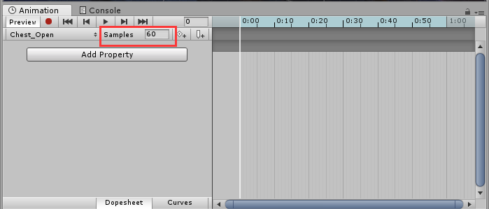

展开Chest选中chest_top，在Animation窗口点击Add Property，展开chest_top > Transform，点击Rotation右边的加号。

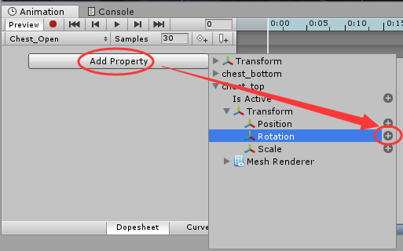

此时我们在动画起始和末尾各创建了一个关键帧，我们将白线拖动到最后一帧，然后点击记录按钮。

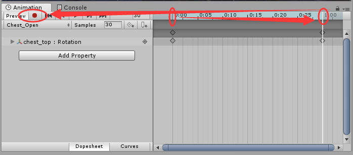

修改chest_top的Rotation的x为-130，再点击记录按钮关闭记录，这时我们点击Animation窗口的播放按钮，Scene窗口将循环播放Chest打开的动画。

如图操作，点击Clips列表，添加新的动画Clip，命名为Chest_Close

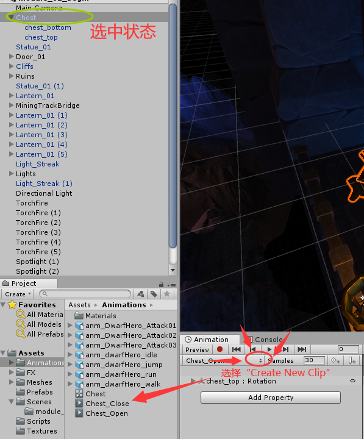

点击Clips列表，可改变当前要编辑的Clip.

点击Add Property，选中chest_top > Transform > Rotation。


## 使用动画曲线

保持Chest被选中，点击Animation窗口下的Curves按钮，打开动画曲线界面，

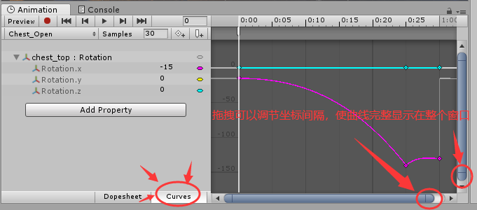

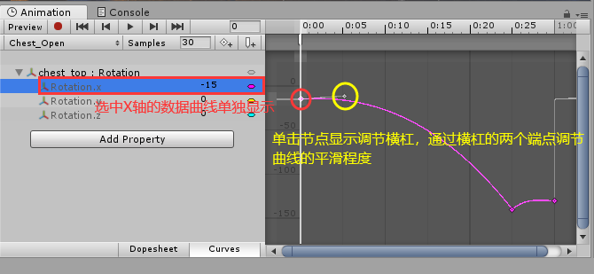


## 重新定时动画


## 使用动画事件

将动画光标移动到箱子完全打开的关键帧位置，点击添加动画事件按钮。

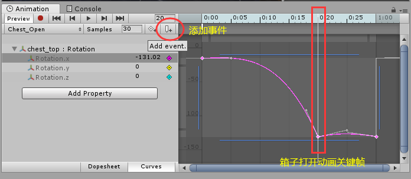

此时Inpsector面板出现动画事件函数设置。我们在Hierarchy选中Chest，为其添加组件Treasure Chest(Script)。

为Chest添加空的子GameObject并重命名为Spawner。将其拖拽添加到Chest的Treasure Chest(Script)组件下Spawner属性。从Assets/Prefabs下拖拽Coin到Chest的Treasure Chest(Script)组件下Coin Prefab属性。我们双击该组件下的Script属性打开脚本文件，在其中我们发现有一个OpenChest方法。

回到Unity，在Animation窗口点击刚才添加的动画事件标记，在Inspector窗口的动画事件函数选项里我们有3种函数可以选择。选择OpenChest，这个函数就与动画事件关联上了。当我们播放游戏时，开箱动画播放到完全打开关键帧时将自动触发动画事件，调用OpenChest函数，弹出硬币。

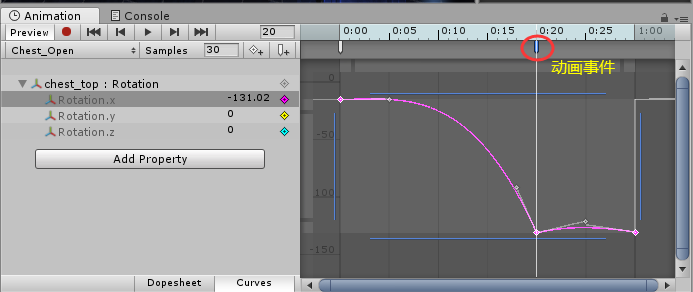


## 创建多个剪辑

首先为Chest_Close添加属性Rotation，通过Ctrl+C/V将Chest_Open的关键帧复制粘贴到Chest_Close里。

在Chest_Close里，将首尾两个关键帧交换位置，然后调整其动画曲线。

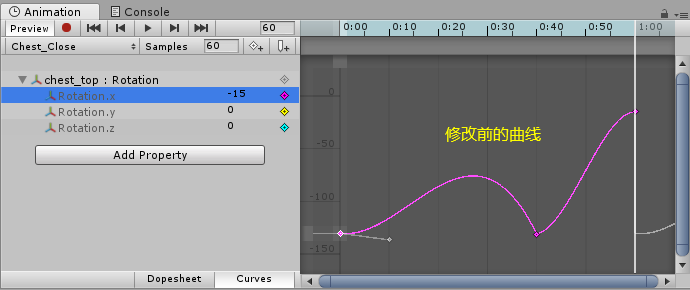

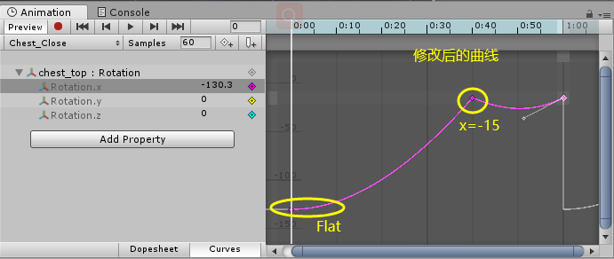


## Animator视窗里的基本操作

如果我们有多个动画片段，需要管理它们，甚至在一个动画到下一个动画之间转换，需要使用动画控制器。这是一个可以与动画组件一起使用的游戏Assets。当我们创建动画片段时，Unity会自动创建一个动画控制器，该动画控制器需要设置动画的控制参数。

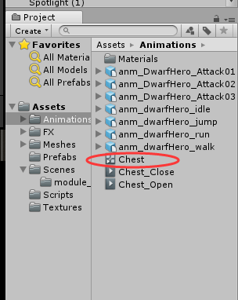

双击动画控制器，打开Animation窗口

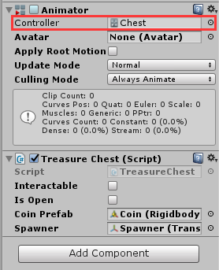

在Animation窗口中，我们看到四个节点，按住鼠标中键可以移动观图视角

Any State：特殊节点，允许中断正在播放的当前状态或正在播放以退出并进入另一个状态的当前动画。例如，当玩家的生命值降低到零，玩家处于生命状态并不重要，它将转到死亡动画。

Entry：任何游戏开始或基础层上的特殊状态机的开始，将进入的第一个默认状态/默认动画。

Exit：特殊节点，表明状态机应该退出。

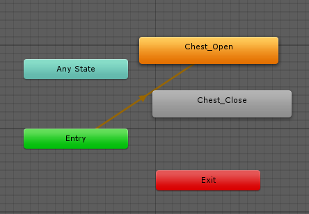

Chest_Open状态是橙色的，代表默认状态，表示这个动画将在游戏开始后立即播放。如果我们希望箱子在游戏开始时时保持关闭状态，我们需要先创建一个空状态。在Animator视窗空白处右键选择Create State|Empty，重命名为Chest_Idle，且它的Motion设为None。

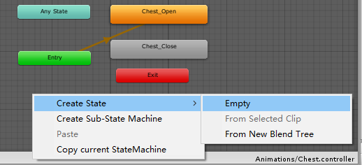

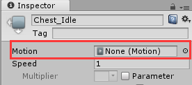

然后选中Chest_Idle右键选择Set as Layer Default State。此时播放动画，Chest保持关闭状态。

我们要箱子从Chest_Idle转变到Chest_Open状态，可以先右键Chest_Idle，选择Make Transition，然后点击Chest_Open，这样一个过渡箭头将两个状态连接起来。

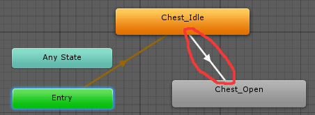

选中这个过渡箭头，我们可以在Inspector里设置过渡条件。通常我们会取消勾选Has Exit Time，并确保下方的Condition里设置了条件。

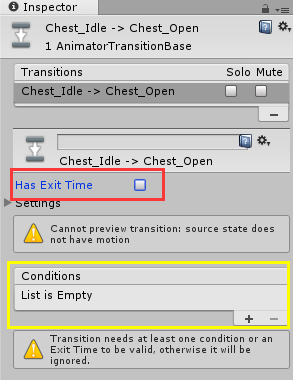

## 参数和条件

接下来我们将使用Condition（条件），条件在Animator视窗左边的Parameter（参数）视窗里创建。点击加号，我们可以看到有四种数据类型参数供选择，我们这次选择创建Bool（布尔类型）参数，并重命名为isOpen。我们将利用这个参数来控制箱子的开关，默认值设为false。

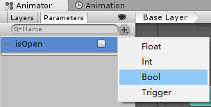

然后选中Chest_Idle到Chest_Open的过渡箭头，在Conditions点击加号，设置isOpen为true。

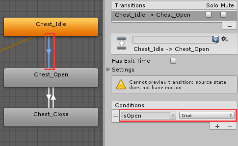

同理，我们将Chest_Open到Chest_Close之间的相互过渡也做条件设置，开箱到关箱的条件是isOpen为false，关箱到开箱的条件为true，记得都取消勾选Has Exit Time。

## 脚本控制条件参数

打开Assets/Scripts下的TreasureChest.cs，以下只展示部分关键代码（重点看Update方法）：

```c# TreasureChest.cs
using System.Collections;
using System.Collections.Generic;
using UnityEngine;

public class TreasureChest : MonoBehaviour
{
    public bool interactable = false;
    public bool isOpen = false;
    private Animator anim;

    public Rigidbody coinPrefab;
    public Transform spawner;

	// Use this for initialization
	void Start ()
    {
        anim = GetComponent<Animator>();
	}	
	// Update is called once per frame
	void Update ()
    {
		if(Input.GetKeyDown(KeyCode.Space))
        {
          isOpen = !isOpen;
          anim.SetBool("isOpen", isOpen);
        }
	}
...
}
```

然后回到Unity，将Animations文件夹下的Chest_Close、Chest_Open的Loop Time取消勾选，不让其循环播放动画剪辑。

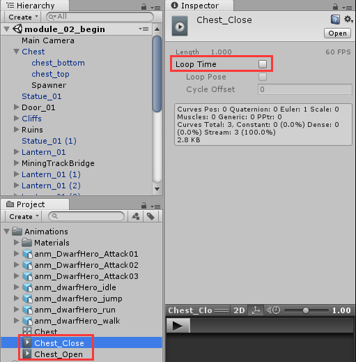

然后保存，播放场景，箱子一开始是关闭的，按空格键箱子打开，再按一次空格键箱子关闭。


# 二、Maya导出动画

用Maya 2018打开资料里Referenced Files里的rig_DwarfHero_root_motion.ma。


# 三、导入设置

回到Unity，选中Assets/Mesh/dwarf_hero，Inspector视窗里选中Model，取消勾选Import Visibility、Import Cameras、Import Lights，其他保持默认，点击Materials，勾选Import Materials，点击Apply。此时可见素材的材质得到了应用。

点击Rig，Animation Type默认设置为Generic。此项可以可选的值有：

None：一般用于箱子、机关门等，因为他们没有骨骼。

Legacy：专用功能，用于兼容老版本Unity 5项目。

Generic：基于骨骼创建avatar，没有人形的特征。

Humanoid：用于将已有的动画重新用在多个角色人物上。

这里我们将Animation Type设为Humanoid，Avatar Definition设置为Create From This Mode，点击Apply，点击Configure，选择保存当前场景，进入到角色的临时场景，角色处于T形姿势，方便在骨骼上绑定其他物品。

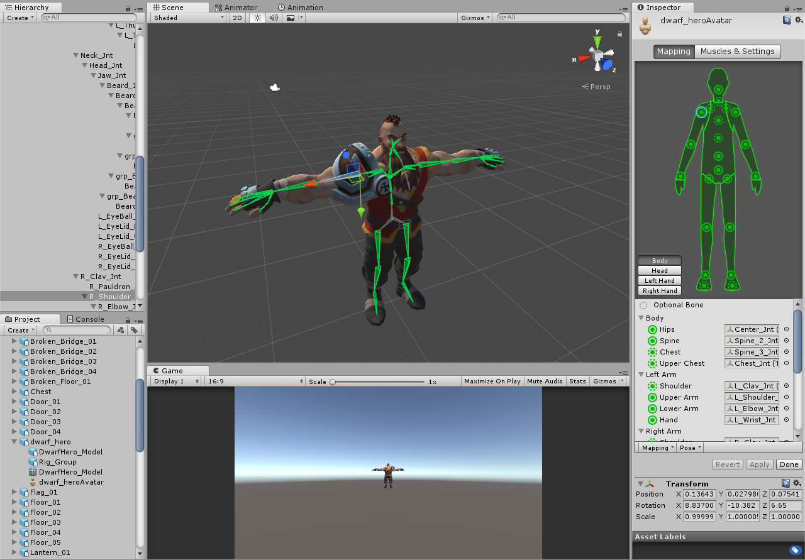

通过Inspector视窗我们可以定位骨骼关节并在场景窗口中改变骨骼布局。

Mapping中的点，外圈是实线环的是必要节点，外边是虚线环的是可选节点。

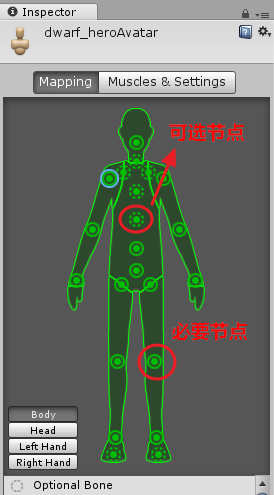

因为这个案例中的骨骼健壮性很强，所以在Unity中都自动映射好了。要使用Unity的自动映射，我们可以点击Mapping，选择Automap。

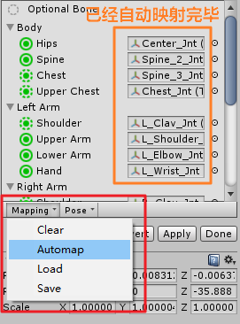

或者可以选择Clear，自己手动一个一个映射。

我们可以更改角色的姿势，点击Pose。当前我们使用的是Enforce T-Pose，如果选择Sample Blind-Pose则转为角色的原始姿势

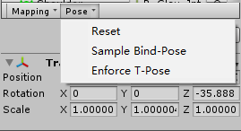

保持T-Pose，点击Apply应用设置。

骨骼设置好后，点击Muscles&Settings进行肌肉设置。

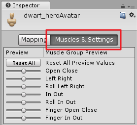

肌肉并非必要的设置项，它只是为骨骼设置运动范围。通过Musles Group Preview可以很好地了解角色的运动方式以及如何重定位角色的其他动画。例如，我们可以调节Open Close来调整骨骼的打开和关闭状态。

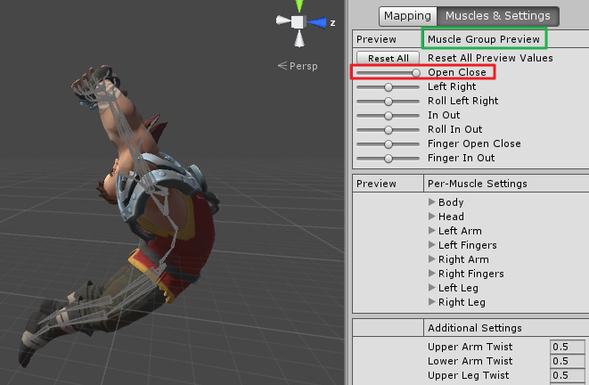

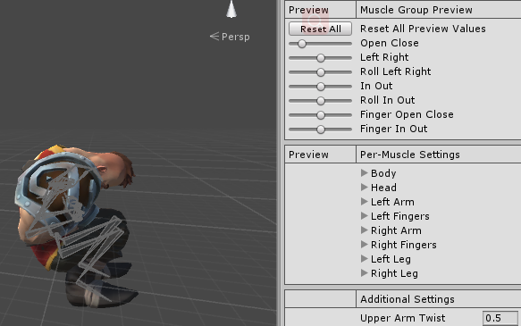

通过Per-Muscle Settings，我们可以对具体的骨骼本身进行运动范围的修改。例如我们要将body伸展开，调节时会有特定的范围。我们放大会看到扇形的范围区。

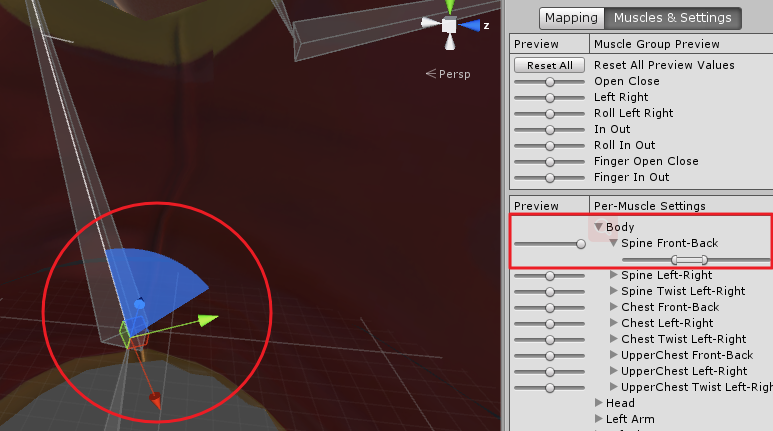

此时spine Front-Back处于最大值，对应骨骼处在扇形的边缘，我们可以调节下方的滑块的两端来调整活动范围最大值或最小值，可以看到扇形的大小也顺便改变了。

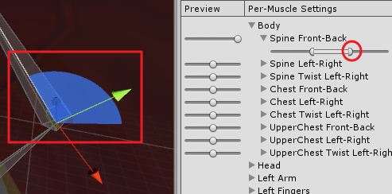

本案例的默认设定已经满足学习，我们可以点击Revert重置会默认设定，接着点击Done返回游戏场景。

那么我们使用humanoid类型有什么意义？

因为我们使用的动画可能来源各异，可能来自动作捕捉，可能来自Unity资源商店。humanoid类型提供很大的灵活性，方便我们使用不同的动画，提高开发效率。

# 四、导入动画剪辑

动画剪辑已经导入，我们先修改设置。先选中Animations文件夹下的anm_dwarfHero_idle、anm_dwarfHero_jump、anm_dwarfHero_run、anm_dwarfHero_walk动画，然后转到Model设置界面。

取消勾选Import Visibility、Import Cameras、Import Lights、Import Matrtials。因为我们不需要任何额外的东西，我们并不真正需要动画剪辑材料。

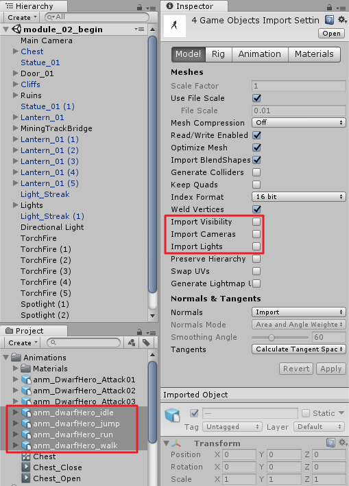

点击Rig将Animation Type设为Humanoid。现在我们可以继续为每个动画剪辑创建新的avatar，但没有多大作用，特别是我们将要用于重新定向。因此如果我们使用同一类型模型同一设置，只需将Avatar Definition设置为Copy From Other Avatar，然后在下方Source设置准备好的Avatar。这里我们设置上dwarf_heroAvatar，然后点击Apply。

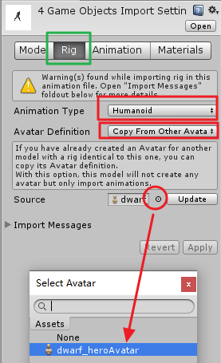

在Import Messages那会出现警告消息：我们重新定向的质量可能较低，因为我们没有在人形动画的Spine_1节点，实际上这属于正常情况。

然后我们选中Project视窗里的anm_dwarfHero_idle，在Inspector里点击Animation设置动画剪辑，将Loop Time勾选上，这将可以让闲置动画循环播放。下方的Loop Pose的作用是，如果动画中角色的骨骼或角色的根节点在动画开始和结束的位置存在偏差，Loop Pose将使这个衔接变得自然。在这里，loop match右边的灯是绿色的，表示衔接良好，所以我们无需勾选Loop Pose。

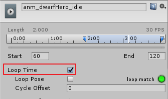

下方的Root Transform Rotation控制角色整体的根节点的转向。

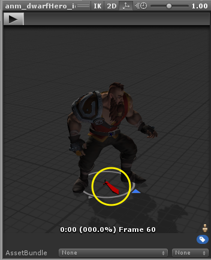

如果我们将其下的Based Upon设置为Body Orientation，则方向箭头会指向了Z轴。设置回Original。

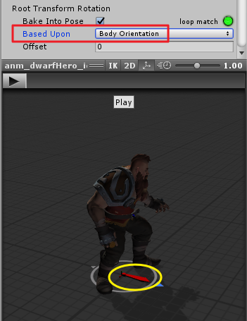

Root Transform Position(Y)可以控制角色的上下移动，如控制角色飞行。

在Additive Reference Pose下方有一个指示平均速率（Average Velocity）的消息。下图中，XZ方向上的速度均为0，Y方向上的速度为0.001。0.001虽然是个很小的数，但是如果控制角色移动足够远则会发现角色走到了半空中。

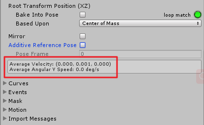

要解决这个问题，我们勾选Root Transform Position(Y)下的Bake Into Pose，将Based Upon (at Start)设置为Original或Feet，然后点击Apply。

# 五、根动作（Root motion)

接下来我们使用根动作让我们的角色向前行走。我们选中一个已经应用了根动作的动画剪辑anm_dwarfHero_walk。当我们播放该动画时，角色的根节点将自动被检测并随着行走动画，改变根节点的坐标，从而驱使角色向前移动。角色移动的速度受动画控制，从而避免了滑行（即角色的脚步与角色的速度不同步）。

让我们暂停动画进行设置，首先勾选上Loop Time。注意到Root Transform Position(XZ)的loop match为红灯，表示动画循环没有匹配良好。可以知道的是我们的角色移动在XZ方向上有偏差。造成偏差的原因是在用Maya制作此动画剪辑时，角色向前迈步，XZ方向上一定会有位移，动画首尾坐标不一致。这属于正常现象，我们需要解决的是不让角色速度方向有偏差。

我们先勾选上Root Transform Rotation的Bake Into Pose，此举可以将角色在Y方向上的平均角速度变为0，从转向上消除偏差。

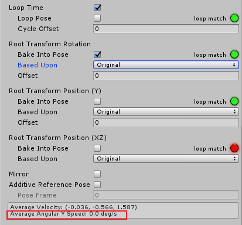

接着我们勾选Loop Time下边的Loop Pose。将Root Transform Rotation的Based Upon设为Body Orientation。改变Root Transform Rotation的Offset值，直到平均速度的X分量为0。

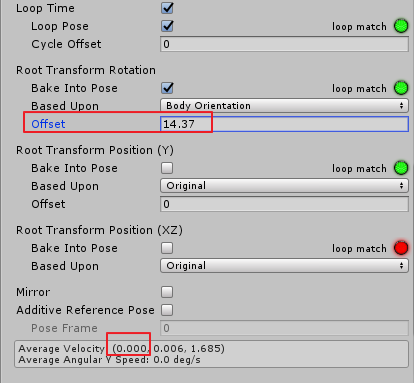

然后勾选Root Transform Position(Y)的Bake Into Pose，然后设置Based Upon (at Start)为Feet。

设置Root Transform Position(XZ)的Based Upon为Center of Mass

然后点击Apply，一个行走动画就基本调成完成。

接着我们用同样的步骤调整anm_dwarfHero_run

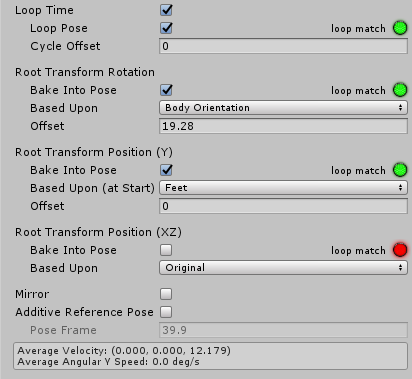

# 六、调整非人型rig的骨骼

角色可能带有多余的骨骼，比如英雄肩膀上的一个护甲也绑定上了骨骼，但人型rig并不会检测到这种骨骼的存在。

让我们选中项目窗口Animation文件夹下的anm_DwarfHero_Attack03动画，在这个动画中，角色的胡子和肩膀护甲并没有按预期活动。我们可以在Inspector里调整如下参数。

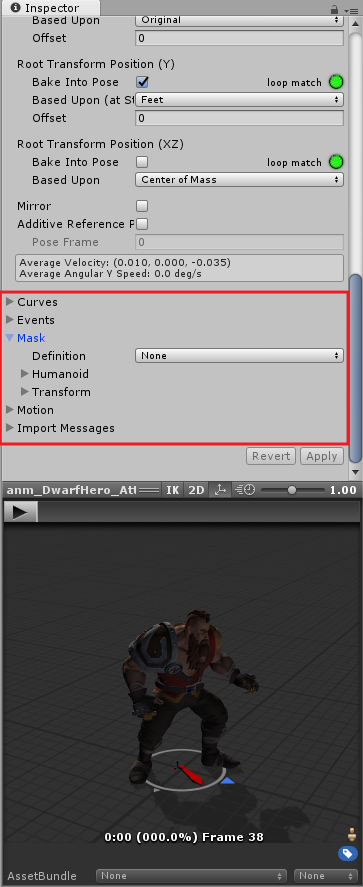

将Mask下的Definition设置为Create From This Model。

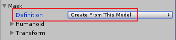

然后点开Transform，找到L_Pauldron_Jnt、R_Pauldron_Jnt、Beard_1_Jnt、grp_Beard_1_Con并将它们勾选上，点击Apply。

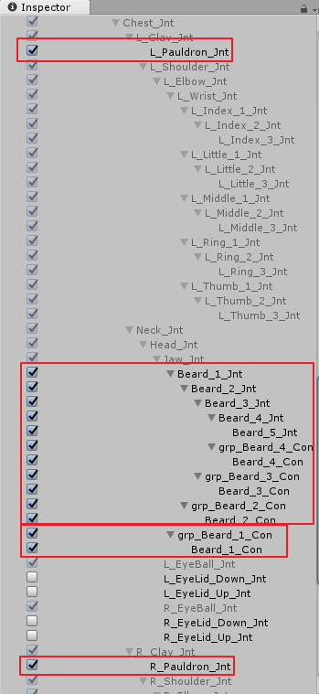

这时我们再播放动画，胡子和肩膀护甲都按预期进行了活动，而且其他anm_DwarfHero动画也同时得到了相同的调整。

# 七、角色动画准备工作

首先从项目窗口中将Meshes文件夹下的dwarf_hero拖拽到场景中。然后给场景中的**dwarf_hero添加Rigidbody组件、Capsule Collider组件**。

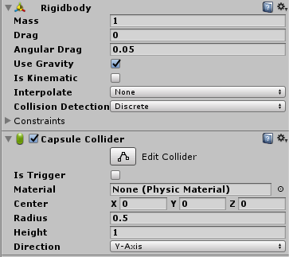

然后**设置胶囊碰撞体参数**如下，以适配角色的身体。

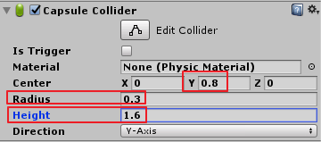

然后给dwarf_hero设置动画控制器，我们在项目窗口Animations文件夹下右键新建Animator Controller，重命名为DwarfHero，然后拖拽到场景中的dwarf_hero的Animator组件|Controller。

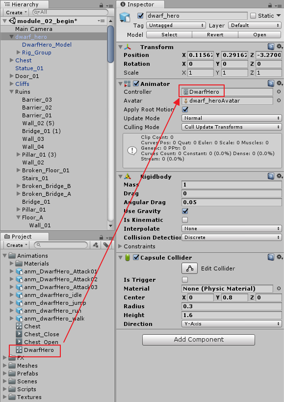

然后勾选Rigidbody组件|Is Kinematic

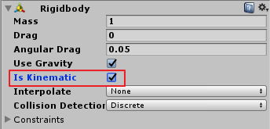

然后进入Animator窗口，将Animations文件夹下的anm_dwarfHero_idle拖拽进来，让它成为角色的起始播放动画。

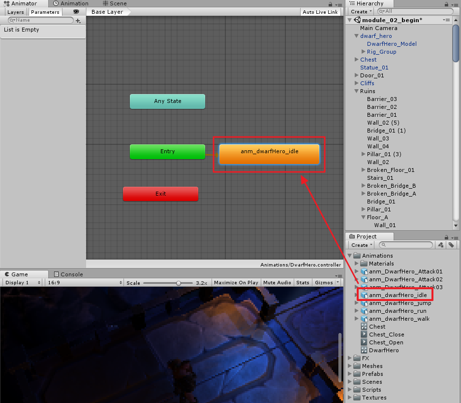

保存场景，此时我们如果点击播放游戏，则场景中的角色在进入游戏时将成功播放闲置动画。

# 八、设计动画逻辑

在Assets/Scripts下有一个CharacterMovement.cs脚本。我们给场景中的dwarf_hero添加组件Character Movement (Script)。接着进入Animator窗口，将Animations文件夹下的anm_dwarfHero_run拖拽进来，然后选中之前添加的anm_dwarfHero_idle，右键选择Make Transition，再点击anm_dwarfHero_run将这两个动画剪辑用箭头连接起来。

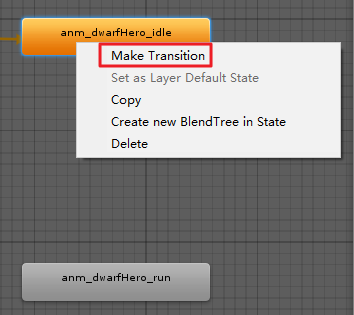

然后选中连接箭头，创建Bool类型条件参数，重名命名为IsRunning

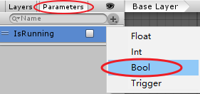

然后在转换关系（箭头）上添加条件IsRunning，并设置条件值为true。

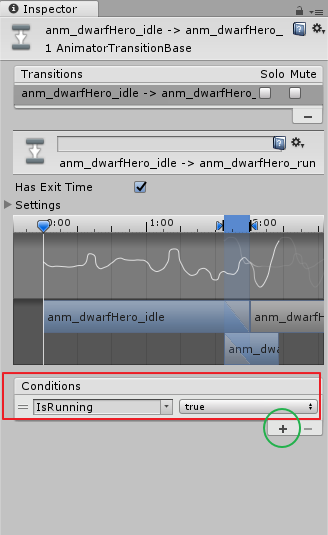

然后我们在创建一个从run到idle的转换关系（箭头），设置条件为IsRunning为false。

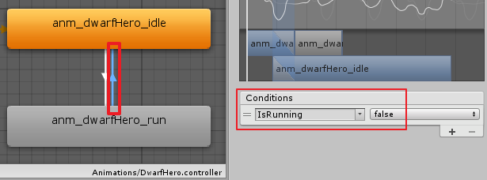

双击用VS2017打开CharacterMovement.cs脚本，其中Animating函数是控制角色跑动的关键。float类型变量lh、lv分别表示手柄/键盘输入的水平方向数据和垂直方向数据，当他们全都为0时，bool类型变量running为true，但它俩其中一个不为0则running为false。

```c#
...
void FixedUpdate()
{
    //Store input axes
    float lh = Input.GetAxisRaw("Horizontal");
    float lv = Input.GetAxisRaw ("Vertical");


    Move (lh, lv);

    Animating(lh, lv);
}
...
void Animating(float lh, float lv)
{
    bool running = lh != 0f || lv != 0f;

    anim.SetBool ("IsRunning", running);
}
```

好，如果我们现在播放游戏，并用WASD控制角色跑动，我们会发现角色先滑行一段距离才开始跑动。

进入Animator窗口，选中idle到run的转变关系箭头，取消勾选Has Exit Time。同样地，run到idle的转变关系箭头也这么修改。


Has Exit Time如果被勾选，则角色将在转变前的动画播放完毕才开始转变到下一个动画，取消勾选可以打断等待，让转变立刻发生。

# 九、混合树（Blend Tree）

首先我们给场景中的dwarf_hero添加Nav Mesh Agent组件，并做如下参数设置。


接着添加World Interaction、Locomotion Agent两个脚本组件。World Interaction脚本让我们可以通过鼠标点击场景控制角色行动Locomotion Agen脚本不仅用于控制角色的动画还会更新Nav Mesh Agent以便适配角色的根动作（Root Motion）


回到Animator窗口，删掉之前添加进来的idle和run动画剪辑，右键选择Create State|From New Blend Tree新建混合树，重命名为Locomotion


双击建好的Locomotion进入内部，将条件Blend重命名为PlayerVelocity


选中Blend Tree，在Inspector点击Motion下的加号添加要混合的动作。


依次添加动画剪辑idle、walk、run。


播放混合动画，当我们拖拽改变PlayerVelocity时，角色动作将发生变化。


我们可以通过脚本控制参数PlayerVelocity来控制这一动作变化。

用VS2017打开Locomotion.cs，在Update函数下的关键代码如下。

```c# Locomotion.cs
void Update()
{
...
    // Update animation parameters
    anim.SetFloat("PlayerVelocity", agent.velocity.magnitude);
...
}
```

回到Unity，注意到PlayerVelocity的可变范围是0到1，我们可以改变这个范围。

选中Blend Tree，取消勾选Automate Thresholds，并依次改变run、walk的阈值为8、2。


播放游戏，我们在控制角色的时候可以发现角色从闲置到奔跑有过渡，我们可以改变run、walk的阈值（比如分别为6、1）使这个过渡更加自然。

# 十、动画层

在这个小节我们将使用动画层配置角色攻击动画。首先我们先将场景中的dwarf_hero的World Interaction、Locomotion Agent两个组件删掉，然后添加脚本组件Player Attack。

进入Animator窗口，点击Parameters左边的Layers，我们看到一个Base Layer。每一个Animator都有一个Base Layer，我们可以添加动画层，在另一个动画层上做攻击动画。


点击加号，新建一个动画层，重命名为Attack Layer。在Attack Layer里我们拖拽进Attack01动画剪辑，但我们不希望默认起始动画是攻击动画，于是我们右键Create State|Empty创建一个空状态（重命名为Empty），然后选中Empty状态右键|Set as Layer Default State设置为默认状态。


然后从空状态到Attack01建立一个转变关系，取消勾选Has Exit Time，设置Trigger类型条件IsAttacking。Trigger类型条件的原理是把条件变量IsAttacking赋值为true然后在赋值为false。


然后从Attack01到Empty之间在建立一个转变关系，勾选Has Exit Time，这样一来，Attack01动画播放完毕就可以回到Empty状态等待下次触发。

在Base Layer和Attack Layer右边有小齿轮按钮，点击可以看到更多设置。


其中Weight（权重）决定动画层的优先级。Base Layer一直在播放，因此它的Weight不可改变。当我们把Attack Layer的Weight改为1时，Attack Layer将根据Blending设置的Override，完全覆盖Base Layer，即只播放Attack Layer。如果把Blending设置为Additive，Attack Layer将在Base Layer的基础上做变化。


保持Blending为Override，打开PlayerAttack.cs脚本

```c# PlayerAttack.cs
...
void Update ()
{
    if(Input.GetKeyDown(KeyCode.Mouse0))
    {
        anim.SetLayerWeight(1, 1f);
        anim.SetTrigger("IsAttacking");
        print("Attacking!");
    }
}
...
```

其中Update方法下的语句“anim.SetLayerWeight(1, 1f);''SetLayerWeight传递Attack Layer的动画层索引1（Base Layer的索引是0）以及权重范围1f（表示范围是0~1）。然后”anim.SetTrigger("IsAttacking");“设置触发器"IsAttacking"。

播放游戏，一边控制角色跑动，一边按鼠标左键攻击，角色会在攻击的时候脚停止不动。

# 十一、动画遮罩（Avatar Mask）

动画遮罩（Avatar Mask）用于混合动画层，让上一小节中角色的边跑边攻击动画没那么奇怪。

在Assets/Animations下右键新建|Avatar Mask，重命名为DwarfHero_LowerBody。选中DwarfHero_LowerBody，在Inspector里点开Humanoid，将需要遮挡住的部分点击变红，这里我们将双腿和根动作全部点红。因为我们要将攻击动画层中角色的下半身全部被Base Layer遮住。


接下来将这个遮罩应用到Attack Layer中。点击Attack Layer右边的小齿轮，点击Mask右边的小圆，在弹出的对话框中选择DwarfHero_LowerBody。


播放游戏，角色可以一边跑动一边攻击，脚步不停了。