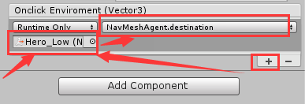
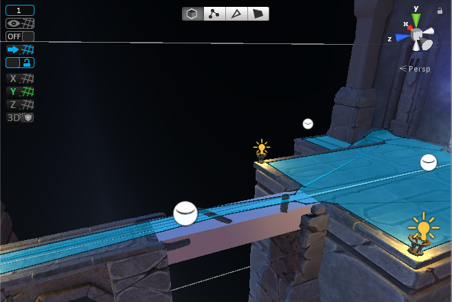
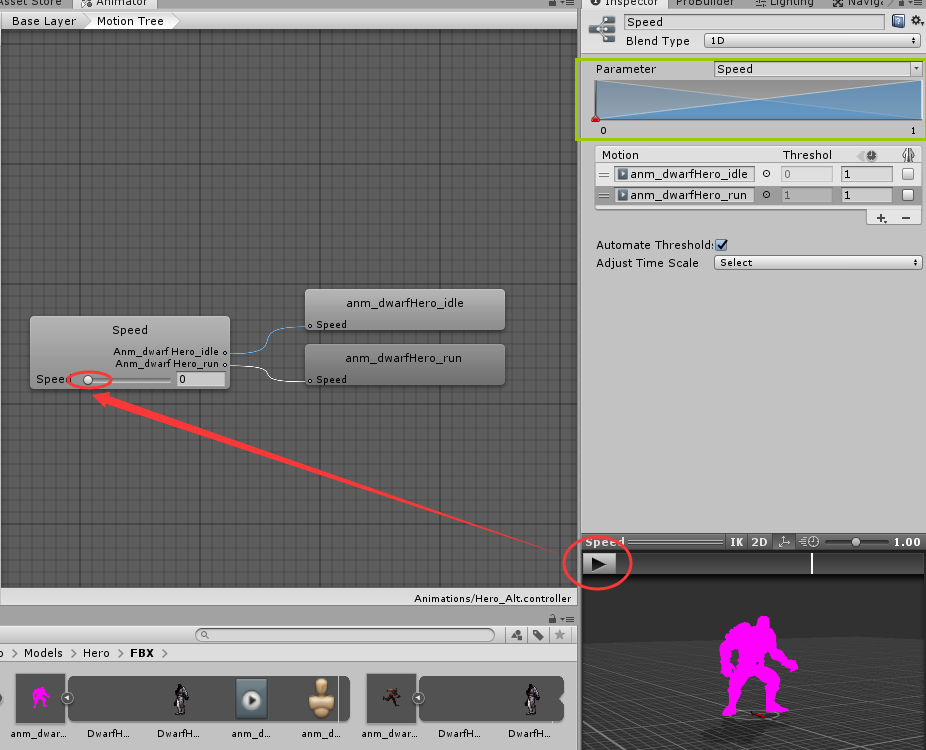
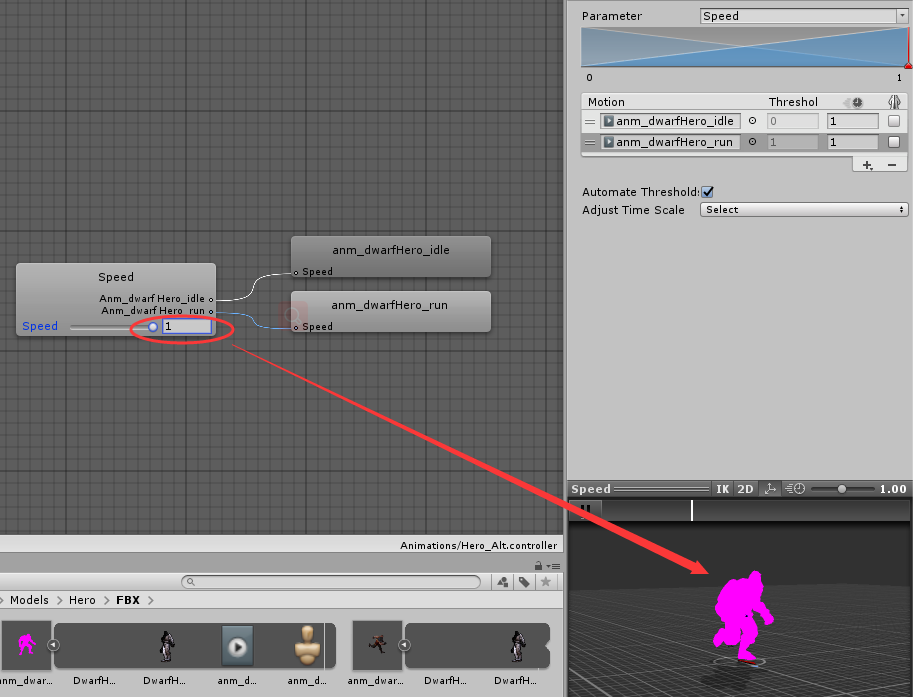
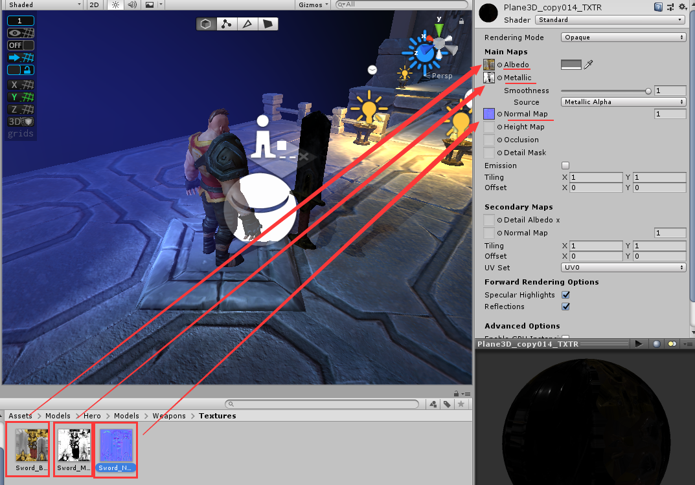
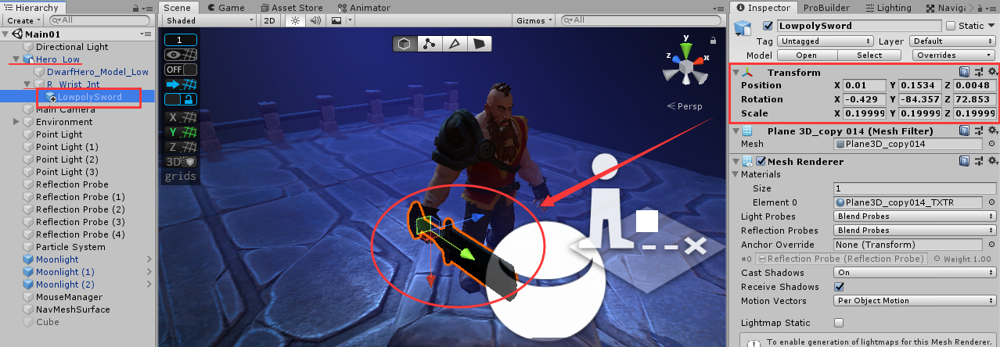
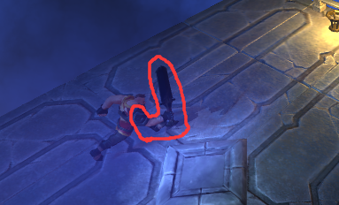
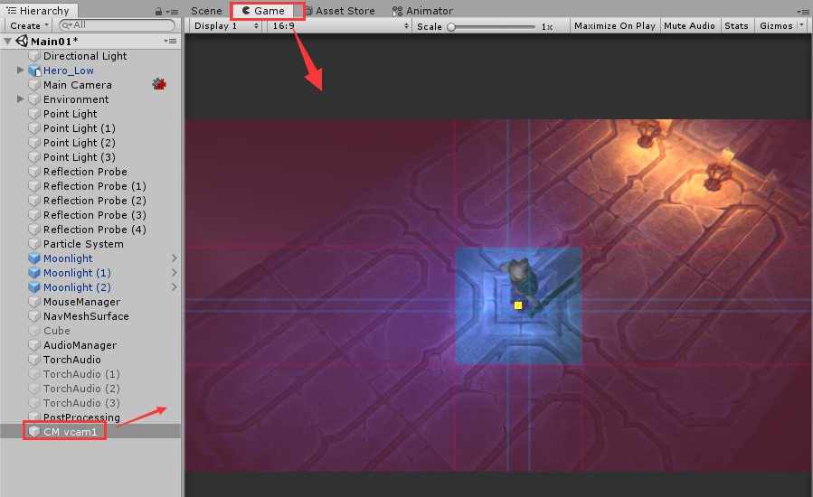

# Unity简易角色开发
date: 2020-02-16 11:45:20

Unity版本：Unity 2018.4.13c1 Personal

# 一、建立角色

从Unity Assets\Unity Fundamentals Source Assets\Character导入Characters.unitypackage

再Assets/Models/Hero/Models/Hero/FBX下将Hero_Low拖拽到场景中，给Hero_Low添加Player Controller(Script)组件，Nav Mesh Agent组件并修改Radius为0.4，Height为1.6。设置Hero_Low的Tag为Player，Layer为Player。

再Hierarchy窗口添加空Game Object，命名为MouseManager，为其添加Mouse Manager(Script)组件，Clickable Layer设置为Clickable，并添加鼠标材质：


添加鼠标点击事件，添加上时间Object拖入Hero_Low，函数选择NavMeshAgent > destination



创建一个空物体，命名为NavMeshSurface，并为其添加NavMeshSurface（Script）组件

Agent Type: Open Agent Settings > Radius: 0.4, Height: 1.6。回到Inspector点击Bake。注意到中间木桥处有断开，我们可以在木桥处放一个Cube,并将其Layer设置为Clickable，角色可以走动的地面均选中并将Layer设置为Clickable，然后重新烘焙NavMeshSurface。



NavMeshSurface连成一块后，把Cube Disable掉即可。


这时我们可以播放游戏看看角色是否可以走过去了。

# 二、动画控制器

在Assets下新建一个Animations文件夹，在Assets/Animations下新建一个Animation Controller，取名为Hero_Alt，即Hero_Alt.controller文件，双击进入其Animator窗口，界面可以通过按住鼠标中键拖拽，滚动鼠标中键缩放。

Animator窗口 > Base Layer下有三个状态：Any State, Entry, Exit。

Entry：初识状态，如角色闲置动画。

Any State：任何时候都可以转换到的状态，如角色死亡动画。

Exit：结束状态。

常用的是Entry和Any State状态。

在空白处右键Create State > From New Blend Tree，将建好的Blend Tree重命名为Motion Tree，双击进入Motion Tree，将里边的Blend Tree重命名为Speed，Inspector > Parameter重命名为Speed。点击下方的加号 > Add Motion Field，然后给我们的Motion Field选择Motion：anm_dwarfHero_idle。同样的方法，我们再添加一个Motion Field，选择anm_dwarfHero_run


添加完两个要混合的动画，点击下方动画播放小窗口的播放按钮，此时播放的是闲置动画，当我们把Speed由0播放到1时，角色动画过渡到奔跑动画。





打开Assets/Scripts下的PlayerController.cs。保存代码如下：

```c# PlayerController.cs
using System.Collections;
using System.Collections.Generic;
using UnityEngine;
using UnityEngine.AI;

public class PlayerController : MonoBehaviour
{

    private Animator anim;
    private NavMeshAgent agent;
    // Use this for initializtion
    void Awake()
    {
        anim = GetComponent<Animator>();
        agent = GetComponent<NavMeshAgent>();
    }
    void Update()
    {
        anim.SetFloat("Speed", agent.velocity.magnitude);
    }
}
```

给角色的Animator组件 > Controller添加RuntimeAnimatorController：Hero_Alt。


回到Animator窗口，给Parameter添加Speed参数


回到Scene窗口，点击Play，播放游戏。鼠标点击控制角色，我们的角色行动不在像尸体一样平移，而是有闲置动画，奔跑动画的移动。

# 三、给角色添加附件

将Assets/Models/Hero/Models/Weapons/FBX下的LowpolySword添加到场景中，调整到合适的大小。

LowpolySword的全身是灰色的，我们需要更新材质。再Assets/Models/Hero/Models/Weapons/Materials下选中Sword.mat，锁定Inspector窗口，找到Assets/Models/Hero/Models/Weapons/Textures，将Sword Base Color.png、Sword Metalic.png、Sword Normal.png分别拖拽到Inspector > Main Maps > Albedo、Metalic、Mormal Map。将Main > Smoothness调整到0.4。



我们将LowpolySword拖拽到Hero_Low/R_Wrist_Jnt下，然后将LowpolySword的位置旋转角度都归零，调整LowpolySword的角度，使LowpolySword看上去被正确地握在Hero_Low手中。



播放游戏，可以看到LowpolySword跟随Hero_Low的右手动画运动。



# 四、使用Cinemachine制作跟随镜头

打开Unity菜单栏 > Window > Package Manager，安装Cinemachine插件。

完成安装后通过Unity菜单栏 > Cinemachine > Create Virtual Camera新建一个虚拟摄像机CM vcam1。

虚拟摄像机可以覆盖主摄像机的设置。

在Scene窗口下选择合适的观察角色的视角，选中CM vcam1，按快捷键Ctrl+Shift+F。

将Hero_Low拖拽到CM vcam1的Inspector > Cinemachine Virtual Camera(Script) > Follow和Look At


Aim设置为Do nothing，Body选择Framing Transposer。

转到Game视窗，选中CM vcam1，可以看到画面分为三种区域：

中间区域（原本的颜色）：叫做死亡区域，LookAt的这个目标在这个区域内，摄像机是不会跟随的。
蓝色区域：代表缓冲区域，此时摄像机会开始跟随，使目标在中间的透明区域。
红色区域：不可到达区域，跟随过程中目标是不可能到达这些区域的。

我们可以拖动画面上的直线改变这三种区域的大小。



播放游戏，控制角色行走，摄像机跟随角色移动。


我们还可以给虚拟摄像机添加其他设置，例如Noice设置为Basic Muti Channel Perlin，Noice Profile设置为Handheld_normal_mild，Amplitude Gain和Frequency Gain均设置为0.5，这样一来游戏中摄像机就有了轻微的晃动。

# 五、打包生成游戏

将场景保存好后，Unity菜单栏File > Build Settings，确认所有场景都在Scene In Build，选择平台，按需要勾选是否创建VS解决方案或开发build。

点击Player Settings，在其Inspector面板我们可以修改游戏名称，公司名称，版本号，游戏图标，游戏中的鼠标材质等信息。这里我们添加了一个游戏鼠标材质，其他设置均默认，然后点击Build按钮选好路径生成游戏。

