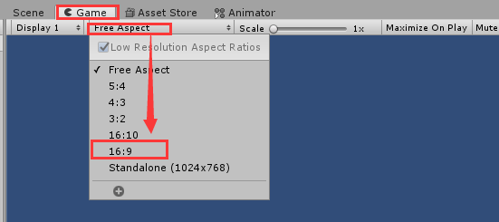
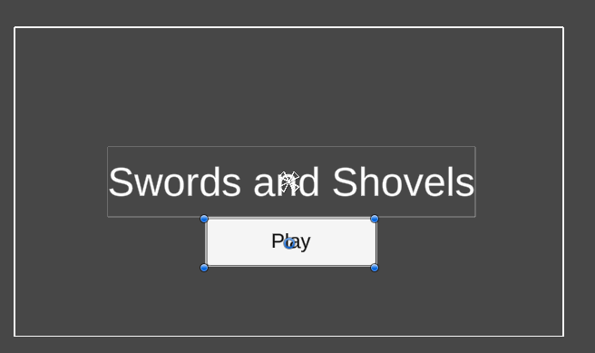
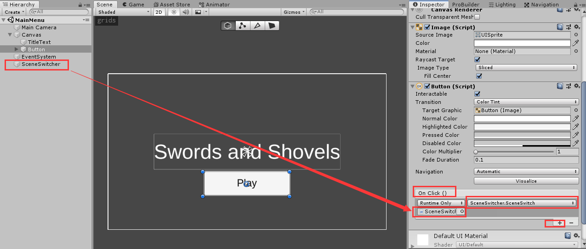
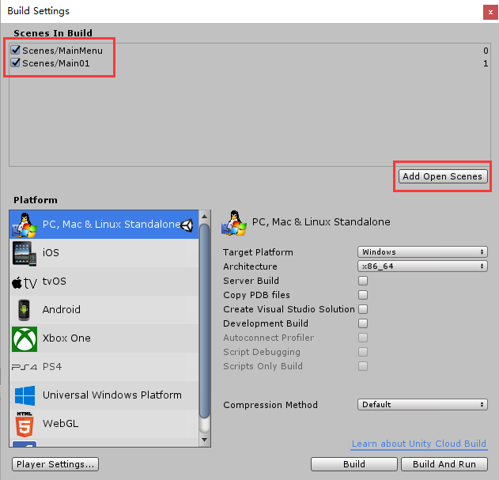
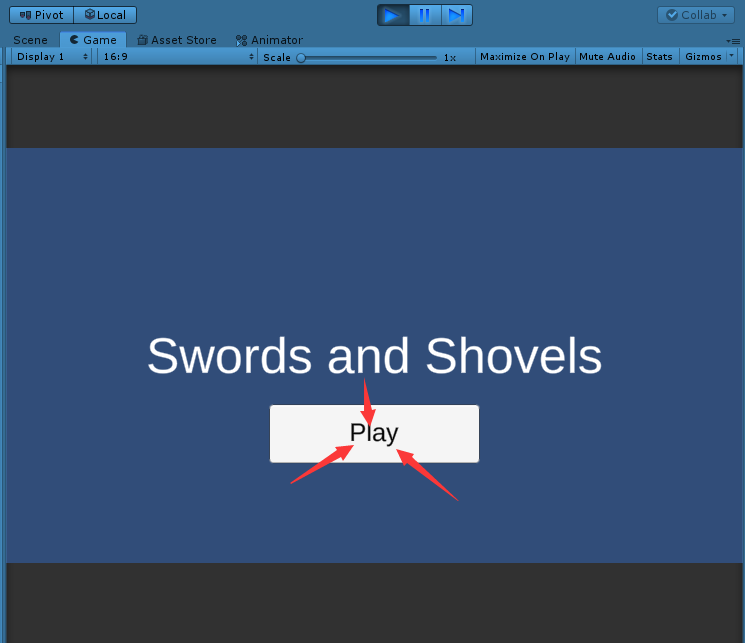
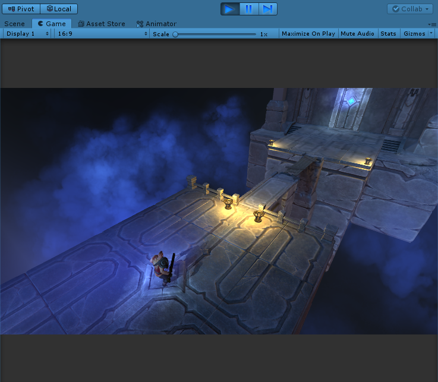

# Unity载入界面基础
date: 2020-02-17 22:49:42

Unity 版本：Unity 2018.4.13c1 Personal

# 一、创建用户界面元素

新建一个场景，命名为MainMenu。删掉Directioinal light，切换为2D视角。

再Lighting窗口，设置Scene > Environment > Environment Lighting > Source为Color，Amibient Color为黑色，Skybox material设置为None(Material)。

再Hierarchy窗口创建 > UI > Canvas

再Game窗口下把分辨率由Free Aspect改为16：9



再Canvas下新建 > UI > Text - TextMeshPro，首次新建会弹出导入TMP必备窗口，点击Import TMP Essentials，导入完成后关闭窗口即可。

然后重命名TextMeshPro为TitleText，再其Text Mesh Pro UGUI(Script)组件 > Text自定义文本写上游戏名“Sword and Shovels”，在该组件 > Main Settings可以修改字体。我们勾选Font Size > Auto Size，这时字体大小将随文本框大小改变而自动调节。通过Aligment右边的按钮可以调节文本对齐居中等。

再Canves下新建 > UI > Button，将Button下的Text删掉，再Button下新建Text - TextMeshPro，调整好之后如下图：



播放游戏，画面中Play按钮可以点击。


# 二、编写场景切换脚本

再Hirarchy窗口新建空Game Object，重命名为SceneSwitcher。再Assest/Scripts下新建SceneSwitcher.cs，用VS2017打开，编写代码如下：

```c# SceneSwitcher.cs
using System.Collections;
using System.Collections.Generic;
using UnityEngine;
using UnityEngine.SceneManagement;

public class SceneSwitcher : MonoBehaviour
{
    public void SceneSwitch()
    {
        SceneManager.LoadScene(1);      
    }
}
```

回到Unity，给SceneSwitcher添加Scene Switcher(Script)组件。

选中Canvas/Button，在On Click()下添加点击事件，将SceneSwitcher拖拽进来，函数选择SceneSwitcher > SceneSwitch()。



保存MainMenu场景，然后点击菜单栏File > Build Settings，在Build Settings弹窗点击Add Open Scenes把MainMenu添加进去，然后将Assets/Scenes下建好的Main01场景拖拽添加进来。



播放游戏，开始进入MainMenu场景，当我们点击Play后，进入Main01场景。



