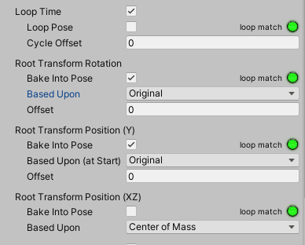
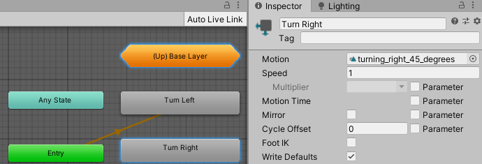
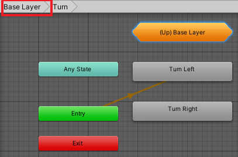
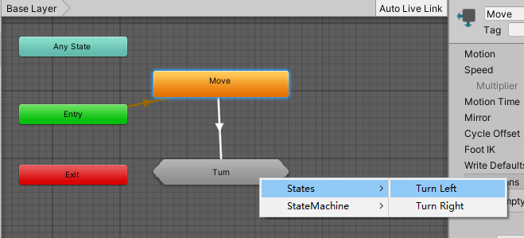
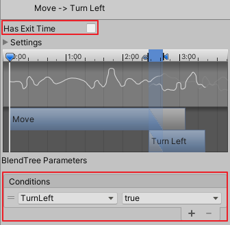
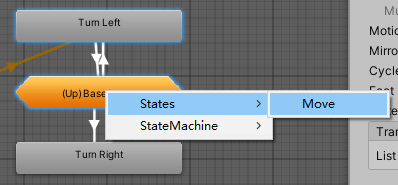
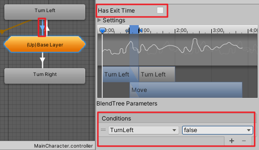
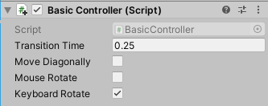

# 将多个状态组成子状态机
date: 2020-06-14 22:23:58


**Unity 2018 Cookbook** | **Charpter 10 3D Animation** | **Organizing States into Sub-State Machines**

当Animator窗口中的内容太过凌乱时，我们可以考虑将多个动画状态组成子状态机。

在本篇，我们将使用这个技术来驱动角色。因为要用到的动画剪辑不包含根动作（Root Motion），借此说明如何在无需根动作（Root Motion）的条件下通过一个脚本控制角色从左/右转向45°。

# 一、导入资源

用到的资源链接：

https://github.com/PacktPublishing/Unity-2018-Cookbook-Third-Edition/tree/master/Chapter10_3DAnimation/10_04_substate_machines

完成后的项目资源链接：

https://github.com/dr-matt-smith/unity-cookbook-2018-ch10-04-substate-machines

导入资源Turning.unitypackage、Swat@turn_right_45_degrees.fbx、Swat@turn_left.fbx、BasicController.cs。

# 二、设置动画剪辑

在项目窗口找到并双击打开关卡场景mecanimPlayground，接下来设置动画剪辑。

在项目窗口选中Swat@turn_left，在Inspector选中Rig标签，修改Animation Type为Humanoid，设置Avatar Definition为Create From this Model，点击Apply确认应用。

点击Animation标签，点击Clamp Range按钮，调节动画时间线（Start：0，End：40），勾选Loop Time。

勾选Root Transform Rotation下方的Bake Into Pose，设置Based Upon为Original。勾选Root Transform Position ( Y )下方的Bake Into Pose，设置Based Upon (atStart)为Original。保持Root TransformPosition (XZ)下方的Bake Into Pose未选中，点击Apply应用修改。



对Swat@turning_right_45_degrees做同样的设置。

# 三、添加子状态机

双击动画控制器MainCharacter并进入Animator窗口，选则Parameters标签，点击加号新建两个布尔类型参数，分别重命名为TurnLeft，TurnRight。

选中Base Layer层，在网格区域右键，选择 select Create Sub-StateMachine，在Inspector重命名为Turn。双击进入子状态机Turn。在网格区域右键，选择 Create State | Empty 新建一个空状态，重命名为Turn Left。同样地，再新建一个状态Turn Right。给状态Turn Left分配动画剪辑turn_left motion clip，给状态Turn Right分配动画剪辑turning_right_45_degrees。



点击顶部信息栏的Base Layer回到Base Layer层。



从Move状态起始，新建一个转换关系,  点击Turn，选择State | Turn Left。选中刚刚建立的箭头，在Inspector里取消勾选Has Exit Time，在条件列表里点击加号，添加条件TurnLeft值为true。同样地，再建一个从Move到Turn Right子状态的转换关系。





进入子状态机Turn,选中Turn Left状态右键建立转变关系，点击(Up)Base Layer，选则States|Move。选中刚建立的箭头，再Inspector里取消勾选Has Exit Time，在条件列表里点击加号添加条件TurnLeft值为false。同样再建立从Turn Right到Move的转变关系。






# 四、脚本功能

打开脚本**BasicController.cs**，在**Update方法**的**“ if(controller.isGrounded){ “**下一行添加如下代码：

```c# BasicController.cs
...
void Update () {
		
    // IF Character Controller is grounded...
    if(controller.isGrounded){
        if (Input.GetKey(KeyCode.Q))
        {
            anim.SetBool("TurnLeft", true);
            transform.Rotate(Vector3.up * (Time.deltaTime * -45.0f), Space.World);
        }
        else
        {
            anim.SetBool("TurnLeft", false);
        }
        if (Input.GetKey(KeyCode.E))
        {
            anim.SetBool("TurnRight", true);
            transform.Rotate(Vector3.up * (Time.deltaTime * 45.0f), Space.World);
        }
        else
        {
            anim.SetBool("TurnRight", false);
        }
        ...
    } 
    ...
}
```

保存脚本，选中Hirarchy中的MsLaser，在Inspector里的Basic Controller组件下取消勾选Move Diagonally、Mouse Rotate，勾选KeyBoard Rotate。



播放游戏，我们可以按住Q键/E键来控制角色的左右转向。

# 五、工作原理

子状态机可以将多个状态封装成一个简便易调用的实体。子状态机内部的状态可以转变到外部的状态，甚至可以转变到其他子状态机里的状态。

关于角色转向，我们使用“ transform.Rotate(Vector3.up *(Time.deltaTime * -45.0f) , Space.World) ”语句让角色在我们按下Q/E键时转向，语句” animator.SetBool("TurnLeft", true) “用于触发正确的动画剪辑，从而不需要根动作（Root Motion）。