# UGUI图形交互系统
date: 2020-04-04 13:47:00

Unity版本：Unity 2019.3.4f1

# 画布与事件系统

## 画布用于承载所有UI元素

在Hierarchy(层级窗口)空白处右键|UI|Canvas(画布)，创建一个画布，此时事件系统（EventSystem）也会自动被创建。

我们可以选中画布，创建子项——UI元素比如图片（UI | Image）、按钮(UI | Button)。

## 画布有三种模式

选中画布，在检查器（Inspector窗口）|画布（Canvas）组件|渲染模式（Render Mode）进行设置。

1. 屏幕空间 - 覆盖（Scream Space - Overlay）
2. 屏幕空间 - 摄像机（Scream Space - Camera）
3. 世界空间（World Space）

在**Scream Space - Overlay**模式下，**所有UI元素都显示在画面最前端**。

如果我们在画布上放一个Image，颜色设置为黄颜色，主摄像机前放一个白色的Cube。我们无论在场景窗口里怎么放置Cube，都无法挡住画布上的黄颜色Image。


当我们将渲染模式设置为**Scream Space - Camera**时，把Main Camera拖拽到Render Mode下方的Render Camera，设置Plane Distance为2。这时我们将Cube移动靠近摄像机，画布上的Image可以被Cube挡住。


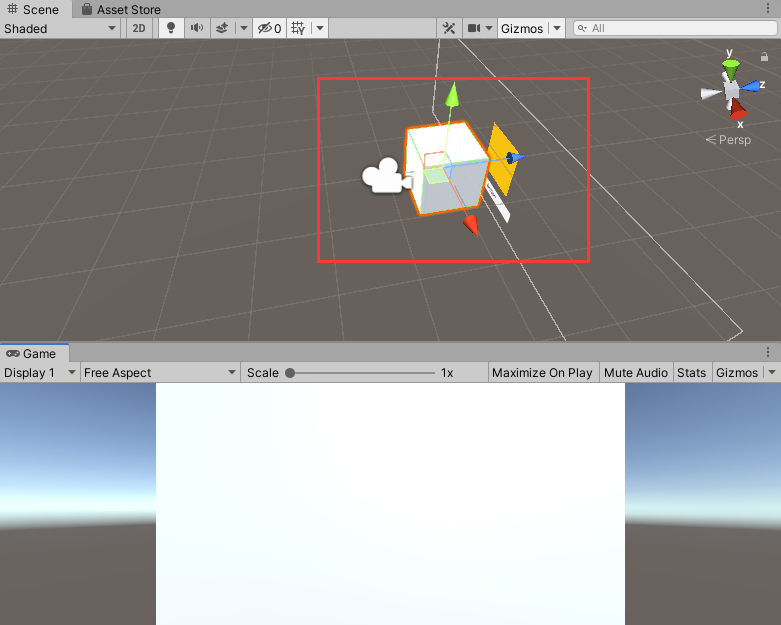

屏幕空间 - 摄像机模式使用较少，适用于比如说在UI前边播放3D粒子效果。

当我们把渲染模式设置为World Space，画布可以随意移动和改变大小（前两个模式不可以），但只有出现在摄像机视野内才会被渲染到。适用于制作游戏中的敌人血条、立体互动广告牌等。

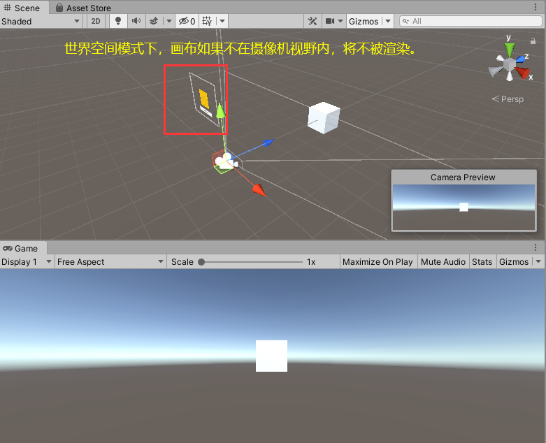


## 画布的缩放

画布可以在Canvas Scaler（画布缩放器）组件下设定缩放模式以适配市面上的不同大小的手机屏幕。

设置UI Sale Mode（画布缩放模式）为Scale with Screen Size（屏幕大小调整）可以设置Reference Resolution（参考分辨率）。


## 事件系统

事件系统（EventSystem）是用于处理各个UI控件交互，如果删除事件系统，或者把画布的Graphic Raycaster组件取消勾选，播放游戏，点击画面中的按钮将毫无反应。


# 图像、文本框、按钮、输入框的基本使用

**图像**与**文本框**的主要作用是**展示**，**按钮**与**输入框**的主要作用是**交互**。


## 例子（山寨英雄联盟登录界面）

接下来我们来制作一个英雄联盟登录界面。

将素材文件夹里UI文件夹拖拽导入到Unity编辑器的Assets文件夹下。

设置Scene视窗为2D模式，删除Canvas下的所有物体。

在Canvas下新建一个UI|Image，在其Rect Transform组件下设置Anchor Presets为strech-strech（按住Shift+Alt）。

选中UI/公用下的所有素材，在Inspector里设置Texture Type为Sprite(2D and UI)，点击Apply。


将BG01的Sprite拖拽到Image的Image组件|Source Image。


然后用给画布新添一个Image，重命名为BG，Source Image拖入“公用”文件夹下的Logo，点击Set Native Size(设置原生大小)

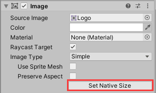

重命名为Logo，然后移动到背景左上角

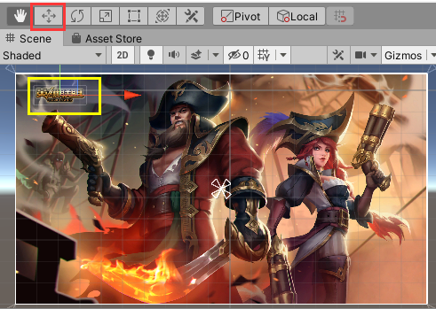

在画布下新建一个UI|Panel（面板），默认和画布大小一致，重命名为UserPanel，将BG和Logo拖拽到UserPanel子项。

将“UI/用户模块”路径下所有素材设置Texture Type为Sprite(2D and UI)。

在UserPanel下新建一个Image，重命名为LoginBG，Source Image拖入“UI/用户模块“文件夹下的UserBack，并设置为原生大小。

在UserPanel下新建一个Image，重命名为Account，Source Image拖入“UI/用户模块“文件夹下的Account，并设置为原生大小。

通过快捷键Ctrl+D复制一个Account，重命名为PWD，Source Image拖入“UI/用户模块“文件夹下的PWD，并设置为原生大小。

在UserPanel下新建一个Image，重命名为Line，Source Image拖入“UI/用户模块“文件夹下的Line，并设置为原生大小。

通过快捷键Ctrl+D复制一个Line，然后将两个Line分别拖入Account、PWD的子项。

通过上述类似方法，给UserPanel添加按钮：WebsiteBtn、ContactsBtn、RetrievePWDBtn、LoginBtn、RegisterBtn


给UserPanel添加UI|Text，设置文本组件如下：


给UserPanel添加UI|InputField（文本输入框），摆放到合适位置，调整大小合适，选中其子项Placeholder和Text，在Inspector里修改字体大小（Font Size）为20。

复制一个InputField，将两个InputField的Image组件|Color设为透明。修改两个文本输入框的Placeholder、Text的Text组件设置。选中密码输入的InputField，可以修改其Input Field组件的Content Type（内容类型）为Password。完成设置后，将账号输入框重命名为UserInputField，将密码输入框重命名为PWDInputField。


为了让UI元素的摆放和美术人员给的效果图一致，我们可以采用如下方法改进：

给UserPanel的Image组件|Source Image拖入“用户模块”图片，点击Color，设置alpha值为最大（设置不透明度为最大），然后将BG取消勾选。此时我们发现原来的UI元素摆放位置和效果图有明显差距，将UI元素对应摆放到对应的位置将其覆盖即可。

完成后将UserPanel的图片设置为透明，勾选BG。


# 图像、文本框、按钮、输入框的脚本交互

在Assets文件夹下创建文件夹Scripts用于存放脚本文件。

创建C#脚本UserPanel.cs，将UserPanel.cs作为组件添加到UserPanel。

```c#
using System;
using System.Collections;
using System.Collections.Generic;
using UnityEngine;
using UnityEngine.UI;

public class UserPanel : MonoBehaviour
{
    public Sprite bg;
    InputField userInput;
    InputField pwdInput;
    Button logonBtn;

    // Start is called before the first frame update
    void Start()
    {
        //修改图片的精灵
        transform.Find("BG").GetComponent<Image>().sprite = bg;
        //初始化
        userInput = transform.Find("UserInputField").GetComponent<InputField>();
        pwdInput = transform.Find("PWDInputField").GetComponent<InputField>();
        logonBtn = transform.Find("LogonBtn").GetComponent<Button>();
        //没有参数的方法
        //绑定事件
        logonBtn.onClick.AddListener(loginBtnOnClick);
        transform.Find("WebsiteBtn").GetComponent<Button>()
            .onClick.AddListener(WebsiteBtnOnClick);
    }

    private void WebsiteBtnOnClick()
    {
        Application.OpenURL("https://lol.qq.com/main.shtml");
    }

    private void loginBtnOnClick()
    {
        string account = userInput.text;
        string pwd = pwdInput.text;
        Debug.Log("账号是：" + account);
        Debug.Log("密码是：" + pwd);
    }
}
```

将“UI/公共”路径下的BG02放入UserPanel的UserPanel脚本组件|bg中，播放游戏，可以看到游戏一启动我们的背景图换成了BG02，在账号输入框和密码输入框输入文本，点击登录按钮，Unity控制台窗口打印账号和密码内容，点击官网按钮，打开英雄联盟官网。


# 勾选框

## 单选

给UserPanel添加UI|Toggle，编辑Toggle下的Label的Text组件|Text。


选中Toggle下的Background，调整勾选框致合适大小，选中Background下的Checkmark，将其锚点设置为stretch-stretch。

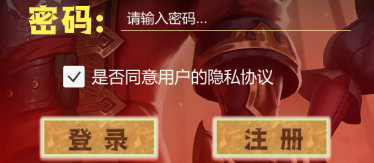

播放游戏，当Toggle被勾选上时，Toggle的Toggle组件下的Is On会被勾选


修改我们的UserPanel.cs，添加一个Toggle类型变量toggle，Start方法添加获取Toggle语句。

```c#
    Toggle toggle;

    // Start is called before the first frame update
    void Start()
    {
        toggle = transform.Find("Toggle").GetComponent<Toggle>();
```

修改loginBtnOnClick方法如下。

```c#
private void loginBtnOnClick()
{
    if(toggle.isOn == true)
    {
        string account = userInput.text;
        string pwd = pwdInput.text;
        Debug.Log("账号是：" + account);
        Debug.Log("密码是：" + pwd);
    }
    else
    {
        Debug.Log("请先同意用户隐私协议");
    }

}
```

播放游戏，当勾选框没有被勾选时，点击登录按钮，控制台不会打印我们输入的账号和密码。


## 多选一

我们复制三个Toggle，再新建一个空的GameObject，给空GameObject添加Toggle Group组件，同时选中前边的三个Toggle，将GameObject拽到Inspector的Toggle组件|Group下。

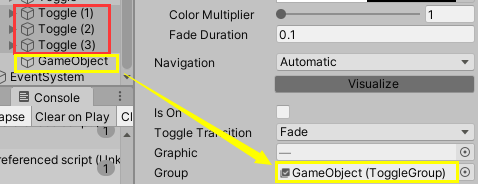

播放游戏，这三个勾选框只允许勾选其中一个。


# 滑动条

我们在Canvas下新建一个Panel，重命名为SettingPanel，设置其Image组件|Color为黑色，不透明度适当提高，使SettingPanel显示很暗。

在SettingPanel下新建一个UI|Slider，我们可以对它的三个子项进行个性化设置，我在此只修改了大小和颜色。


当我们播放游戏时，滑动Slider可以改变其Slider组件|Value的值


要在脚本中获取滑动条的值，我们先创建一个SettingPanel.cs，编写代码如下：

```c#
using System.Collections;
using System.Collections.Generic;
using UnityEngine;
using UnityEngine.UI;

public class SettingPanel : MonoBehaviour
{
    Slider slider;
    // Start is called before the first frame update
    void Start()
    {
        slider = transform.Find("Slider").GetComponent<Slider>();
        slider.onValueChanged.AddListener(OnValueChanged);     
    }
    void OnValueChanged(float value)
    {
        Debug.Log("当前滑动条的进度：" + slider.value);
    }
}
```

然后将SettingPanel.cs作为组件添加到SettingPanel。播放游戏，当我们滑动Slider，控制台将实时打印Value的值。


# 滚动视图、遮罩、布局组件、内容尺寸适配器

## 滚动视图

给Canvas新建一个UI|Scrow View（滚动视图）,我们可以在Scrow View|Viewport|Content下放入要装的UI元素比如图片。


Content是我们要填装UI元素的容器，单独选中Content改变其大小可以展示总面积。如上图，在其中放入Image后还需要适当调整Image的位置。

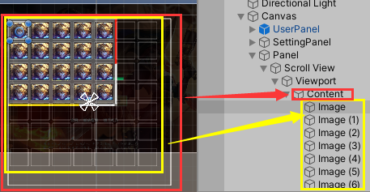

Handle是滑条，要改变滑条背景需要在Scrollbar Horizontal/Vertical里设置。


## 遮罩

在滚动视图的Viewport里有一个Mask组件，当我们取消勾选后，将显示被遮住的内容。

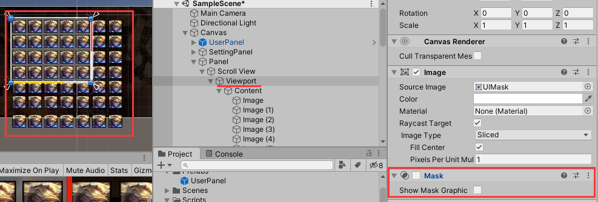

我们给Panel新建一个Image，展示颜色为红色，选中Image再新建一个Image，设置颜色为黄色。调整黄色Image的大小使之盖过红色Image，当我们给父物体红色Image添加Mask组件后，子物体黄色Image超出部分会被父物体的遮罩覆盖。


## 水平/垂直/网格布局组件

给Content添加组件Horizontal/Vertical/Grid Layout Group，将使content内的UI元素全部呈水平/垂直排列，并做针对设置。下图给了一个垂直布局组件效果，同时我也在Padding处设置了边距

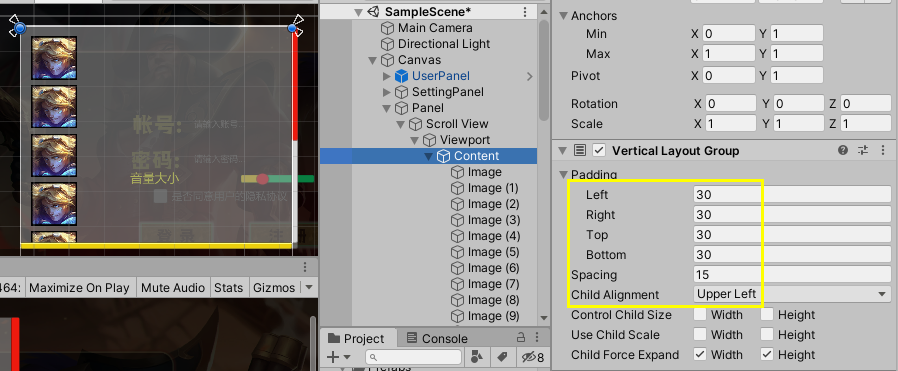


## 布局元素

给Content下的UI元素比如Image添加Layout Element组件后，勾选Ignore Layout，该Image将不受其他三种布局组件影响，可以随意放置。


## 内容尺寸适配器

给Content添加组件Content Size Fitter，在Content Size Fitter|Vertical Fit选择Preferrd Size，Content的尺寸大小将根据内容布局自动调整。

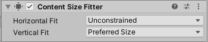

将Panel重命名为HeroPanel，将Content下第一个Image重命名做成预制体Hero，创建脚本HeroPanel.cs，编写代码如下：

```c#
using System.Collections;
using System.Collections.Generic;
using UnityEngine;

public class HeroPanel : MonoBehaviour
{
    public GameObject hero;
    public Transform content;
    // Start is called before the first frame update
    void Start()
    {
        
    }

    // Update is called once per frame
    void Update()
    {
        if (Input.GetKeyDown(KeyCode.A))
        {
            GameObject _hero = GameObject.Instantiate(hero);
            _hero.transform.parent = content;
        }
    }
}
```

将HeroPanel.cs添加到HeroPanel，将Hero预制体拖入HeroPanel组件|hero，将Content拖入HeroPanel组件|content。播放游戏，当我们删掉Content下大部分Image，然后鼠标在Game窗口里点击一下，按A键克隆Hero，选中Content我们可看到Content随着Hero的增加动态调节尺寸适应内容。


内容尺寸适配器的另一种常见用法：

给HeroPanel添加一个Text，给Text添加组件Content Size Fitter，Content Size Fitter下边两个属性全部设置为Preferrd Size。


我们输入成段的文本，Content对根据包括换行回车在内的文本内容进行自适应。

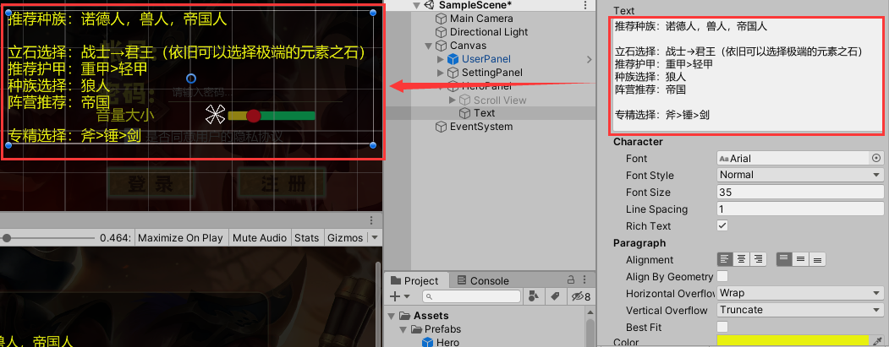


# 矩形变换、UI特效、图片填充

