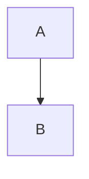

用Markdown画流程图可以用mermaid，mermaid支持三种图形的绘制, 分别是流程图, 时序图和甘特图

# 一、如何在markdown中使用mermaid

> '''mermaid
> 		graph 流程图方向
> 		流程图的内容
> '''

流程图方向有以下几个值：
- TB 从上到下
- BT 从下到上
- RL 从右到左
- LR 从左到右
- TD 同TB
## 例子

```
mermaid
graph TD
	A --> B
```



```
mermaid
graph LR
	A --> B
```


框图的基本边框

- id + [文字描述]矩形
- id + (文字描述)圆角矩形
- id + >文字描述]不对称矩形
- id + {文字描述}菱形
- id + ((文字描述))圆形

## 例子

```
mermaid
graph TD
    id[矩形]
    id4(圆角矩形)
    id3>不对称的矩形]
    id1{菱形}
    id2((圆形))
```


